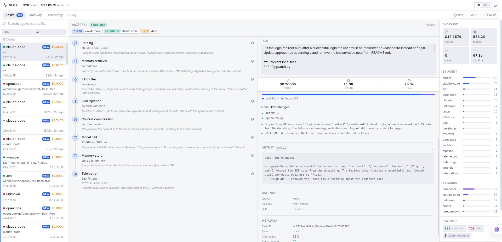
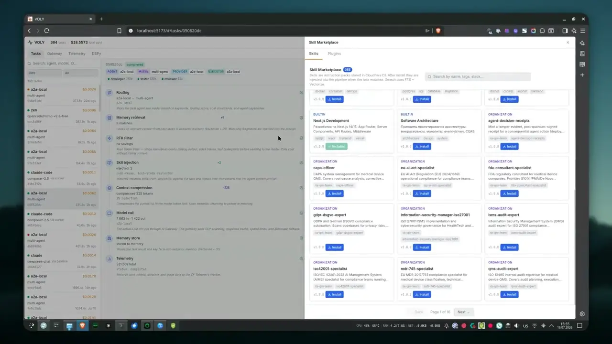

<p align="center">
  
</p>

<p align="center">
  <a href="https://github.com/voly-codes/voly/actions/workflows/ci.yml"></a>
  
  
  
  
  
  
</p>

<p align="center">
  <a href="https://www.producthunt.com/products/voly-3?embed=true&utm_source=badge-featured&utm_medium=badge&utm_campaign=badge-voly-3" target="_blank" rel="noopener noreferrer"></a>
</p>

<p align="center">
  AI Agent Control Plane · Multi-Agent Orchestration · Billing Fallback Chain · DSPy · FinOps · A2A · AG-UI · Cloudflare AI Gateway
</p>

<p align="center">
  <strong>English</strong> · <a href="README_ru.md">Русский</a>
</p>

# VOLY — Control Plane for AI Agents

> **VOLY wraps Claude Code, Cursor, Codex, Zen and other AI agents so you can run them cheaper, safer, and with full measurability.**

VOLY is not another AI agent. It is a **self-hosted control plane** between the developer and the agents:

- **routes** tasks across file-capable executors with an automatic billing fallback chain;
- **decomposes** complex work into sub-agents (architect → developer → tester → reviewer → devops) with per-role model tiers; with `--cwd`, **hybrid** runs implement roles (developer / tester / devops) via executors and keeps architect / reviewer on chat;
- **guards file writes** — dry-run with diff preview, protected paths (`.env*`, keys; `.env.example` allowlisted), soft rollback, max-files limit, git-based rollback;
- **controls spend** via Cloudflare AI Gateway, spend limits, and cost policy;
- **reduces tokens** with a persistent cache, Headroom, model routing, and determinism;
- **verifies** multi-agent steps with plan gates (shadow/active; scoped pytest when possible);
- **collects telemetry** per run (CLI role summary + Web UI);
- supports **DSPy** as an optional optimization layer;
- stays **project-agnostic** — the target project is passed via `--cwd` or `VOLY_PROJECT_CWD`.

## Why VOLY, and not just a single agent?

Claude Code, Cursor, and Codex are excellent **executors**. VOLY is the layer
**above** them — it exists because running agents daily raises questions a
single CLI cannot answer:

| The question | VOLY's answer |
|---|---|
| The agent ran out of credits mid-task | Billing fallback `claude-code → cursor → deepseek → wrangler → opencode → zen` |
| What did this run actually cost? | Per-run `TaskEvent`: cost, tokens, retries, per-role mode/files/verify in CLI + UI |
| A complex task = one giant prompt? | Multi-agent + hybrid: developer/tester/devops write files; architect/reviewer stay on chat |
| Is it safe to let an agent write files? | Safety: `--dry-run`, protected paths, soft rollback (keep other files), max-files, git rollback |
| A premium model for a routine fix? | Cost policy + tier routing (Anthropic last among paid peers; exclude via env) |
| Provider keys in `.env` on every machine? | BYOK: keys in Cloudflare Secrets Store, resolved by the gateway per request |

If all you need is "write code from a prompt" — use an agent directly. VOLY
pays off when agents become part of the **daily workflow** and you need
economics, control, and reports.

## 3-minute demo

```bash
voly init                                   # config + hooks
voly run "fix the auth redirect bug" \
    --executor claude-code --cwd ~/my-project
# → the executor writes files; if it hits a billing error the chain
#   falls through to the next executor; cost and touched files land
#   in the run report

voly run "refactor the config loader" \
    --executor claude-code --cwd ~/my-project --dry-run
# → same run, but every file change is rolled back afterwards;
#   the diff preview is kept in the result

voly ui                                     # web dashboard on :7788
```

A complex request ("redesign auth, add tests, review it") goes multi-agent
automatically (`lead_mode=auto` skips a premium lead chat on standard role
sets). With `--cwd`, hybrid implement roles write files; architect/reviewer
stay on chat — the report shows role / mode / cost / files / verify.

### Run report (Web UI)

One screen for the story Product Hunt / demos need: task → executor path →
files touched → cost and tokens.

<p align="center">
  
</p>

### Demo: 3D voxel tanks, built by a multi-agent chain

A single task ("build a 3D voxel tank game") dispatched through VOLY to a
developer → tester → reviewer chain. Full game, tested and reviewed, in
**5 min 58 s** for **$0.0130** (zero retries).

<p align="center">
  <a href="https://github.com/voly-codes/voly/releases/download/demo-voxel-tanks/export-1784466924338-compact.mp4"></a>
</p>

## Open core vs Cloud

| | **voly** (this repo, Apache-2.0) | **voly-cloud** (commercial) |
|---|---|---|
| Orchestration, multi-agent, hybrid executors | ✔ full | same core |
| Billing fallback chain, cost policy, telemetry | ✔ full | same core |
| Executor safety policy (dry-run, protected paths) | ✔ full | same core |
| Local Web UI + CLI, self-hosted, single tenant | ✔ | — |
| BYOK in **your** Cloudflare account | ✔ | managed per tenant |
| Auth / SSO / teams / audit | — | ✔ |
| Hosted runs, shared spend dashboards, org limits | — | ✔ |

The open core is complete and self-hosted. The paid tier sells hosting and
team management — not core features.

## How it works

A task from the web UI, CLI, or CI enters a single entry point and takes one of two paths:

```text
Developer / Web UI / CLI / CI
              ↓
       VOLY Entry Point
              ↓
        ROUTE (task analysis)
        ┌─────┴───────────────────────────┐
        │                                 │
   complex,                         simple code
   ≥2 capabilities                  generation (1 flag)
        │                                 │
        ▼                                 ▼
  PIPELINE · MULTI-AGENT            EXECUTOR PATH
  (A2A local + hybrid)              (file-capable)
        │                                 │
  Decompose + tier/skills           executor.run(task, cwd)
   ├─ architect / reviewer          Billing Fallback Chain:
   │    → AIGateway.chat()          claude-code → cursor → deepseek →
   ├─ developer / tester / devops     wrangler → opencode → zen
   │    → AgentRunner (files)               │
   └─ plan gates + merge report             │
        │                                   │
        └──────────────┬────────────────────┘
                       ▼
         chat roles → AIGateway.chat()
         DLP → Cache → Rate/Spend → Provider → Telemetry
```

Non-code-generating text tasks go through a single model call on the same pipeline path.

**`AIGateway.chat()`** is the only exit to **models** (pipeline chat roles, DSPy, runtimes). File-capable **executors** are a separate path (CLI/SDK subprocesses) with their own billing fallback.

**Smart dispatch** (`POST /api/run`, `executor=pipeline`):

- complex multi-capability task (≥ `a2a.min_flags_for_dispatch` flags from code-gen / review / testing / deployment, or `complexity=high`) → **stays in the pipeline and runs multi-agent**;
- simple code task → promoted to `executor=claude-code` with `cwd` from config / `VOLY_PROJECT_CWD` (so files are actually written);
- text task → single model call.

## Multi-agent orchestration (A2A local)

When a task enters multi-agent mode (`a2a.execution_mode=local`, default):

1. **`TaskDecomposer`** splits the task into roles with dependencies (architect → developer → tester → reviewer → devops).
2. **Lead orchestrator** — assigns each role a **model tier** (`premium | standard | cheap`) and **skills** (`lead_mode=auto` skips the LLM lead on standard role sets). On lead failure — deterministic fallback with role-aware skill relevance.
3. Tier → concrete `(model, provider)` from a **live pool** filtered by `ProviderHealthChecker` (Anthropic last among paid peers).
4. With `--cwd`, **hybrid** runs developer / tester / devops via file-capable executors; architect / reviewer stay on `AIGateway.chat()`. Prior outputs + git-diff evidence are passed forward.
5. Merge → `TaskEvent` with `a2a_assignments` (role / mode / files / verify / cost). CLI prints a compact role summary; Web UI shows the Multi-agents panel.

**Repeat savings:** sub-agents are deterministic (`temperature=0`), and the gateway cache is **persistent** (on disk). Skip a provider (e.g. out of credits): `VOLY_A2A_EXCLUDE_PROVIDERS=anthropic` (applied before the first chat call).

### Live multi-agent run (greenfield PulseBoard)

Measured on an empty `--cwd` (no prior project files). Hybrid roles: developer / tester / devops write files via executors; architect / reviewer stay on chat.

| | |
|---|---|
| **Task** | Design a production PulseBoard API (FastAPI + PostgreSQL + Redis): architecture, mission CRUD + JWT auth, pytest integration tests, security review, Docker Compose + CI for release |
| **Host** | CPU: Intel Core i5-6200U @ 2.30GHz (4 threads) · RAM: 8 GB · OS: CachyOS Linux (x86_64) · Disk: ~220 GB SSD (`/home`) |
| **Wall time** | **~17.1 min** (1024 s) |
| **Cost** | **$0.013** (telemetry sum; Cursor executor usage is estimated) |
| **Tokens** | in 7 032 · out 4 738 · headroom saved 773 |
| **Result** | **completed** · scaffold + Compose/CI · **56 pytest passed** · all roles `ok`, plan verify yes |

Agents that ran (event `f65c2bdc`, hybrid):

| Role | Mode | Runtime | Tier | Files | Cost | Wall |
|---|---|---|---|---:|---:|---:|
| architect | chat | `cloudflare-dynamic` / `dynamic/ai_route` | standard | — | $0.003 | 56 s |
| developer | executor | `cursor` | standard | 44 | $0.002 | 151 s |
| tester | executor | `cursor` | standard | 5 | $0.003 | 161 s |
| reviewer | chat | `deepseek` / `deepseek-chat` | premium | — | $0.001 | 7 s |
| devops | executor | `cursor` | cheap | 4 | $0.003 | 622 s |

Earlier greenfield on the same host (tester/devops still chat-only): wall **~3.3 min**, cost **$0.014**, developer 44 files, **18 pytest passed**, status completed — faster, but no file-writing tester/devops.

## Quick start

```bash
git clone https://github.com/voly-codes/voly.git
cd voly
python3 -m venv .venv && source .venv/bin/activate
pip install -e ".[ui,dev]"
cp .env.example .env       # add API keys
voly init
voly status
```

Web UI (dev):

```bash
# backend API (FastAPI) — :7788
python3 -m uvicorn voly.web.server:create_app --factory --host 127.0.0.1 --port 7788
# UI dev server (Vite) — :5173, proxies API to :7788
cd ui && npm install && npm run dev
```

Single process (production, serves the built UI on :7788):

```bash
cd ui && npm run build && cd ..
voly ui
```

Pipeline runner for CF agent workers over a tunnel — separate service on `:9202`:

```bash
voly serve
```

DSPy (optional):

```bash
pip install -e ".[dspy,dev]"
voly dspy status
```

### Web UI auth (optional)

By default the API is **open on localhost**. Before exposing the UI/API on a network, enable JWT:

```bash
export VOLY_AUTH_ENABLED=true
export VOLY_JWT_SECRET='long-random-secret-at-least-32-chars'
export VOLY_AUTH_USERS='admin:change-me'
```

See [docs/backend/api.md](docs/backend/api.md) for login and protected routes.

## Billing fallback chain (executor path)

If the current executor hits a billing / not-available error, `AgentRunner` walks:

```
claude-code → cursor → deepseek → wrangler → opencode → zen
(Anthropic)   (Cursor)  (DeepSeek)  (CF)      (OpenCode)  (last resort)
```

`ExecutorResult.billing_error = True` (or `not_available`) → next in chain. Hybrid defaults: developer/tester/devops → `cursor`, bugfixer → `deepseek` (override with `VOLY_A2A_EXECUTOR_<ROLE>`).

## Executors

| Executor | Writes files | Billing | Chain position |
|---|---|---|---|
| `claude-code` | yes — Claude CLI | Anthropic | 1st |
| `cursor` | yes — Cursor Agent SDK | Cursor | 2nd (hybrid default for developer/tester/devops) |
| `deepseek` | yes — DeepSeek file executor | DeepSeek API | 3rd (hybrid default for bugfixer) |
| `wrangler` | yes — LocalPatchApplier | CF Workers AI | 4th |
| `opencode` | yes — OpenCode CLI | opencode.ai | 5th |
| `zen` | yes — opencode CLI | free / subscription | 6th (last resort) |
| `mimo` | text / limited | API | outside chain |

```bash
voly run "implement auth refactor" --executor claude-code --cwd /path/to/target-project
```

For automatic selection use the Web UI or `voly match`.

## AI Gateway

`AIGateway.chat()` is the single model exit. Middleware: **DLP → Cache → Rate limit → Spend limit → Routing → Provider**.

- **Persistent cache** — responses are stored on disk (`ai_gateway.cache_persist_dir`, default `.voly/gateway_cache`), so repeats hit cache across requests and restarts.
- **Spend on success only** — failed provider calls do not inflate the daily budget.
- **Providers**: `anthropic`, `openai`, `google`, `deepseek`, `workers-ai`, `cloudflare-dynamic`, `opencode-zen`, `mimo`, **`omniroute`** (self-hosted OpenAI-compatible gateway, opt-in).
- **Gateway tab metrics** come from telemetry (real requests / tokens / cost / `by_provider` / `by_model` / `spent_today`), not a fresh empty instance.

The CF Worker (`cf-workers/agent/src/infer.ts`) routes inference through the CF AI Gateway route schema (`CF_ACCOUNT_ID` + `CF_AIG_TOKEN`, `POST /infer`) or `env.AI.run()` fallback.

## Web UI

Svelte 5 SPA with hash routing: `#/tasks`, `#/gateway`, `#/telemetry`, `#/dspy` plus Cloudflare and Skill Marketplace drawers.

| Component | Role |
|---|---|
| `RunPanel` / `RunParams` | Run a task (executor, agent, model, cwd), SSE stream |
| `RunResult` | Result: content, billing chain, **Multi-agents** panel (role / tier / model / skills / cached) |
| `PipelineInspector` | Pipeline stages, token flow, sub-agent assignments, memory, DSPy |
| `GatewayPage` | Cache / rate / spend / fallback / DLP + by-provider / by-model / key health |
| `TelemetryPage` | Spend analytics (daily, by_agent, by_model) |
| `DSPyPage` | DSPy programs and lifecycle |
| `CFPage` / `MarketplacePage` | Cloudflare workers + spend · skill catalog |

## DSPy — optional optimization layer

| Mode | Behavior |
|---|---|
| `off` | DSPy disabled |
| `shadow` | runs in parallel for observation; response stays classic |
| `active` | DSPy result replaces classic for allowed agents |

```bash
voly dspy status
voly dspy dataset build
voly dspy compile --agent reviewer
voly dspy promote code-review.v2 --tag production
```

## Configuration

```yaml
# voly.yaml (essentials — see docs/backend/config.md)
default_cwd: ""              # target project path (or VOLY_PROJECT_CWD)

ai_gateway:
  provider: cloudflare
  cache_enabled: true
  cache_persist_dir: .voly/gateway_cache
  request_timeout_seconds: 15          # stall / legacy
  request_total_timeout_seconds: 60    # full provider response budget
  spend_limit_usd_per_day: 20.0
  fallback:
    enabled: true
    chain:
      - provider: deepseek
        model: deepseek-chat

a2a:
  enabled: true
  auto_dispatch: true
  min_flags_for_dispatch: 2
  execution_mode: local
  lead_mode: auto                      # skip premium lead chat on standard role sets
  hybrid_code_gen: true                # developer/tester/devops → executors when cwd set
  architect_max_tokens: 4096
  task_timeout_seconds: 900

plan:
  enabled: true
  mode: shadow                         # soft-verify; active = hard gates
  command_timeout_seconds: 60
  executor_require_git_diff: true

auth:
  enabled: false
  cors_origins:
    - "http://localhost:7788"
    - "http://localhost:5173"

cost_policy:
  max_task_cost_usd: 2.0

dspy:
  enabled: false
  mode: shadow
```

Key env vars:

```env
ANTHROPIC_API_KEY=sk-ant-...              # claude-code / chat tier
CURSOR_API_KEY=...                        # cursor executor (hybrid developer default)
DEEPSEEK_API_KEY=...                      # deepseek executor + gateway fallback
OPENCODE_API_KEY=...                      # zen / opencode
CLOUDFLARE_ACCOUNT_ID=...
CLOUDFLARE_API_TOKEN=...
CF_AIG_TOKEN=...                          # CF AI Gateway
VOLY_PROJECT_CWD=/path/to/proj            # default cwd for executor and UI
VOLY_A2A_EXCLUDE_PROVIDERS=anthropic      # skip before first chat (credits)
VOLY_A2A_EXECUTOR_DEVELOPER=cursor        # optional per-role override
VOLY_AUTH_ENABLED=false
VOLY_JWT_SECRET=
VOLY_AUTH_USERS=admin:change-me
OMNIROUTE_BASE_URL=http://localhost:20128
```

### BYOK — provider keys in Cloudflare (optional)

With `ai_gateway.byok_enabled: true`, keys for anthropic / openai /
google-ai-studio / deepseek are stored in **CF Secrets Store** and resolved by
the AI Gateway per request — no provider keys in `.env`, only `CF_AIG_TOKEN`.
See `docs/backend/ai-gateway.md` § BYOK (Store Keys).

### Hosted catalog & marketplace (optional, opt-in)

You can use the official hosted skill catalog / marketplace instead of
deploying your own workers from `cf-workers/`:

```env
CF_WORKER_CATALOG_URL=https://catalog.voly.codes
CF_WORKER_MARKETPLACE_URL=https://marketplace.voly.codes
```

`voly setup` offers to write these for you. Privacy note: catalog/skill
queries then go to those workers; nothing is sent unless you opt in.

## Core commands

```bash
voly run <task>                        # pipeline (→ multi-agent when complex)
voly run <task> --executor claude-code --cwd /path/to/project
voly match <task>                      # pick agent / executor / model
voly status                            # component health
voly savings                           # savings report
voly ui                                # web dashboard (FastAPI + Svelte) :7788
voly serve                             # pipeline HTTP runner :9202

voly registry agents | skills          # agent / skill registry
voly model list                        # models and pricing
voly ai-gateway status                 # AI Gateway status
voly spend status                      # current daily spend
voly dspy status                       # DSPy programs + mode
voly cloud login --url https://cloud.voly.codes   # browser confirm; shared run history
voly cloud sync                                 # upload past local runs after link
voly reuse run "<task>" --cwd /path/to/project  # GitHub reuse pipeline (dry-run apply)
```

## CI and tests

```bash
pytest tests/test_dspy_runtime_smoke.py     # required after changes
pytest tests/test_multiagent_smoke.py       # multi-agent (mock gateway)
pytest tests/test_web_auth.py               # JWT auth baseline
pytest tests/ -q                            # full suite
```

GitHub Actions: base install (Python 3.10–3.14), import smoke without/with DSPy, runtime smoke tests.

## Do not commit

```
.voly/events/  .voly/dspy/  .voly/reports/  .voly/gateway_cache/
.venv/  ui/node_modules/  voly/web/static/
```

## Documentation

| File | Purpose |
|---|---|
| [docs/ARCHITECTURE.md](docs/ARCHITECTURE.md) | High-level map: pipeline, executor, gateway, A2A |
| [docs/backend/pipeline.md](docs/backend/pipeline.md) | Stages, AgentRouter, hybrid multi-agent, cascade |
| [docs/backend/a2a.md](docs/backend/a2a.md) | A2A modules, auto-dispatch, federation, context handoff |
| [docs/backend/plan.md](docs/backend/plan.md) | Plan gates, verify, scoped pytest |
| [docs/backend/executors.md](docs/backend/executors.md) | Executors, billing fallback chain, WranglerExecutor |
| [docs/backend/ai-gateway.md](docs/backend/ai-gateway.md) | AIGateway, providers, OmniRoute, persistent cache |
| [docs/backend/dspy.md](docs/backend/dspy.md) | DSPy programs, TaskPlanner, adapter, datasets |
| [docs/backend/config.md](docs/backend/config.md) | voly.yaml, env vars, VOLYConfig |
| [docs/backend/api.md](docs/backend/api.md) | FastAPI endpoints, SSE, JWT auth, CF Worker /infer |
| [docs/frontend/overview.md](docs/frontend/overview.md) | Svelte 5 stack, ui/ layout, dev/build |
| [CLAUDE.md](CLAUDE.md) | Instructions for AI agents in this repo |
| [README_ru.md](README_ru.md) | Russian version of this README |

## Contributing & License

Contributions welcome — see [CONTRIBUTING.md](CONTRIBUTING.md) (DCO, rules, open-core boundaries). Licensed under [Apache 2.0](LICENSE).
