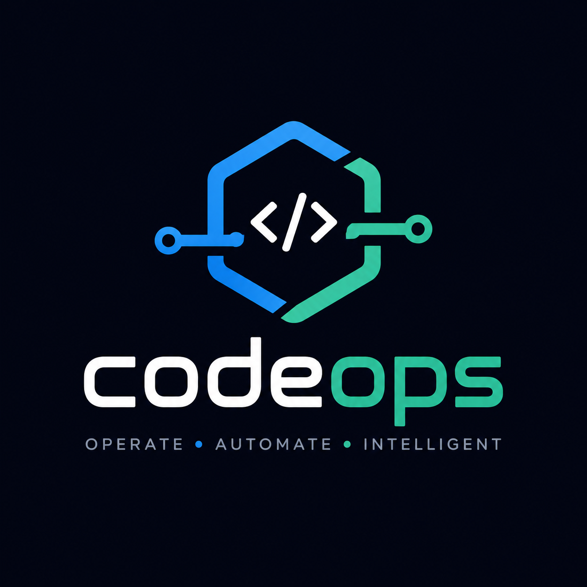

<p align="center">
  
</p>

<p align="center">
  <a href="https://github.com/codeops-org/codeops/actions/workflows/ci.yml"></a>
  
  
  
  
  
  
</p>

<p align="center">
  AI Agent Control Plane · DSPy Optimization · FinOps · Context Compression · A2A · AG-UI · Cloudflare AI Gateway
</p>

> **🌐 [English version](README.en.md)**

# CodeOps — FinOps + Automation Control Plane for AI Agents

> **CodeOps оборачивает Claude Code, Cursor, Codex, OpenCode и другие AI-агенты, чтобы запускать их дешевле, безопаснее и с полной измеримостью.**

CodeOps — это не ещё один AI-агент. Это **control plane** между разработчиком, CLI/CI и агентами:

- маршрутизирует задачи по агентам, моделям и executor-ам;
- контролирует расходы через Cloudflare AI Gateway, spend limits и cost policy;
- снижает расход токенов через RTK, Headroom, cache и model routing;
- собирает telemetry по каждому запуску;
- поддерживает DSPy как optional optimization layer для prompt/program optimization;
- остаётся project-agnostic: целевой проект передаётся через `--cwd`, а не зашивается в CodeOps.

## Метрики ценности

| Цель | Как CodeOps помогает |
|---|---|
| Сократить расходы | RTK, Headroom, cache, cheaper model routing, spend limits |
| Автоматизировать рутину | workflows, predefined agents, executor orchestration |
| Контролировать AI-затраты | telemetry, cost per task, cost per agent, daily budget |
| Управлять рисками | DLP, rate limits, fallback, budget stops, approval gates |
| Масштабировать на команду | shared gateway, shared policies, shared metrics |
| Улучшать качество ответов | optional DSPy programs with shadow/active rollout |

## Быстрый старт

```bash
git clone https://github.com/codeops-org/codeops.git
cd codeops
python3 -m venv .venv
source .venv/bin/activate
pip install -e ".[dev]"
cp .env.example .env  # добавь API ключи при необходимости
codeops init
codeops status
```

Для DSPy:

```bash
pip install -e ".[dspy,dev]"
codeops dspy status
```

Для executor-ов с доступом к файлам:

```bash
pip install -e ".[cursor]"   # если используешь Cursor executor
codeops run "review this repository" --agent reviewer --executor cursor --cwd /path/to/project
```

## Как это работает

```text
Developer / CLI / CI / Scheduler
        ↓
CodeOps CLI
        ↓
Pipeline
        ↓
Agent Router + Cost Policy
        ↓
Memory → RTK → Headroom
        ↓
Inference Runtime
        ├─ Classic Prompt Runtime
        └─ DSPy Runtime (optional: off | shadow | active)
        ↓
AI Gateway
        ├─ DLP
        ├─ Cache
        ├─ Rate limits
        ├─ Spend limits
        └─ Provider fallback
        ↓
Claude / GPT / Gemini / DeepSeek / MiMo / OpenCode
        ↓
Telemetry → .codeops/events/ + optional CF Pipelines / R2
```

`AIGateway.chat()` остаётся единственной точкой выхода к моделям. Даже DSPy идёт через gateway adapter, поэтому сохраняются cache, DLP, spend limits, fallback и telemetry.

## Основные команды

```bash
codeops run <task>              # запустить задачу через pipeline
codeops match <task>            # подобрать агента, модель, provider, tools
codeops compare <task>          # прямой API vs CodeOps pipeline
codeops savings                 # отчёт об экономии
codeops scan                    # сканировать проект
codeops status                  # статус компонентов
```

## Агенты, модели и скиллы

```bash
codeops registry agents         # список агентов
codeops registry skills         # список скиллов
codeops model list              # модели и цены
codeops model route <task>      # модель для задачи
codeops catalog sync            # sync OpenCode Zen models
codeops catalog match <task>    # подобрать model/executor по catalog rules
```

## Бюджет, gateway и telemetry

```bash
codeops ai-gateway status
codeops ai-gateway metrics
codeops ai-gateway flush-cache
codeops spend summary
codeops telemetry status
codeops telemetry test --dry-run
```

## DSPy optimizer layer

DSPy подключается как optional слой между `HEADROOM_COMPRESS` и `AI Gateway` через `Inference Runtime`.

Режимы:

| Mode | Поведение |
|---|---|
| `off` | DSPy полностью выключен |
| `shadow` | DSPy запускается для наблюдения, но ответ пользователю остаётся classic runtime |
| `active` | DSPy-результат может заменить classic response для разрешённых агентов |

Команды:

```bash
codeops dspy status
codeops dspy dataset build
codeops dspy compile --agent reviewer
codeops dspy eval --agent reviewer
codeops dspy programs
codeops dspy promote code-review.v2 --tag production
```

Важно: `shadow` может выполнять и DSPy-вызов, и classic-вызов для одной задачи. Используй его как staged rollout перед `active`.

## Executors

Executor — это runtime, который может реально работать с файлами в `--cwd`.

| Executor | Назначение | Требования |
|---|---|---|
| `cursor` | Реализация кода, multi-file edits | `CURSOR_API_KEY`, `cursor-sdk` |
| `opencode` | OpenCode CLI/API fallback | opencode / `OPENCODE_API_KEY` |
| `claude-code` | Claude CLI | `ANTHROPIC_API_KEY`, `claude` CLI |
| `deepseek` | дешёвые текстовые задачи | `DEEPSEEK_API_KEY` |
| `zen` | анализ/review/planning через OpenCode Zen | `OPENCODE_API_KEY` |
| `mimo` | batch/text tasks | `MIMO_API_KEY` |

Пример:

```bash
codeops run "implement auth refactor" \
  --agent developer \
  --executor cursor \
  --cwd /path/to/target-project
```

## Конфигурация

Минимальный `codeops.yaml`:

```yaml
default_model: claude-sonnet
default_agent: claude

ai_gateway:
  enabled: true
  provider: cloudflare
  account_id: "${CLOUDFLARE_ACCOUNT_ID}"
  gateway_id: "${CLOUDFLARE_AI_GATEWAY_ID}"
  api_token: "${CLOUDFLARE_API_TOKEN}"
  caching:
    enabled: true
  spend_limits:
    enabled: true
    daily_budget_usd: 20

dspy:
  enabled: false
  mode: shadow
  agents:
    - reviewer
    - documenter
    - architect
```

Runtime state не должен попадать в git:

```text
.codeops/events/
.codeops/dspy/datasets/
.codeops/dspy/programs/
```

## CI

В репозитории есть GitHub Actions smoke gate:

- base install на Python 3.*;
- import без DSPy extra;
- DSPy extra smoke test;
- runtime smoke tests.

Полный historical test suite можно включать отдельно после стабилизации старых тестов.

## Документация

| Файл | Назначение |
|---|---|
| [ARCHITECTURE.md](docs/ARCHITECTURE.md) | текущая архитектура CodeOps |
| [CLAUDE.md](CLAUDE.md) | инструкции для AI-агентов в этом репозитории |
| [docs/executors.md](docs/executors.md) | executor runtime guide |
| [docs/catalog-supervisor.md](docs/catalog-supervisor.md) | catalog routing и model planning |
| [docs/dspy.md](docs/dspy.md) | DSPy integration guide |
