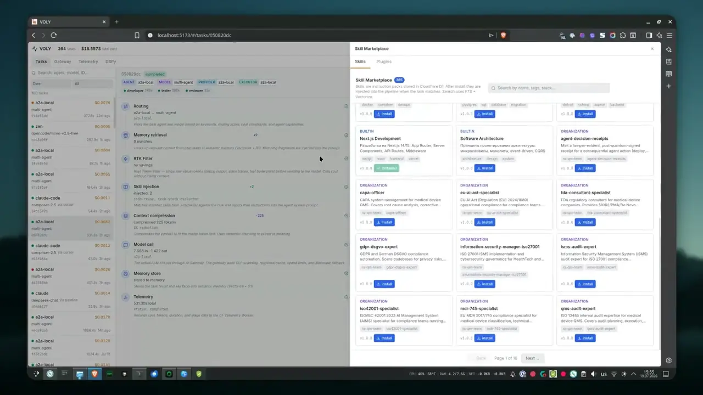

<p align="center">
  <a href="https://github.com/voly-codes/voly/actions/workflows/ci.yml"></a>
  <a href="https://pypi.org/project/voly/"></a>
  
  
  
  
  
  
</p>

<p align="center">
  AI Agent Control Plane · Evidence-Governed Capabilities · Multi-Agent Orchestration · FinOps · A2A · AG-UI · Cloudflare
</p>

<p align="center">
  <strong>English</strong> · <a href="README_ru.md">Русский</a>
</p>

# VOLY — Control Plane for AI Agents

> **VOLY wraps Claude Code, Cursor, DeepSeek, OpenCode/Zen and other AI agents so you can run them cheaper, safer, and with full measurability.**

VOLY is not another AI agent. It is a **self-hosted control plane** between the developer and the agents:

- **routes** tasks across file-capable executors with an automatic billing fallback chain;
- **decomposes** complex work into sub-agents (architect → developer → tester → reviewer → devops) with per-role model tiers; with `--cwd`, **hybrid** runs implement roles (developer / tester / devops) via executors and keeps architect / reviewer on chat;
- **guards file writes** — dry-run with diff preview, protected paths (`.env*`, keys; `.env.example` allowlisted), soft rollback, max-files limit, git-based rollback;
- **controls spend** via Cloudflare AI Gateway, spend limits, and cost policy;
- **reduces tokens** with a persistent cache, Headroom, model routing, and determinism;
- **reuses proven code** — `voly reuse`: GitHub search → pack → pick → apply, with optional auto-search before every executor run ([docs/backend/reuse.md](docs/backend/reuse.md));
- **pins the tech stack** — pre-run version selection (framework registry + runtime preflight), category picker and greenfield scaffolding for empty projects;
- **verifies** multi-agent steps with plan gates (shadow/active; scoped pytest when possible);
- **evaluates outcomes** with deterministic policies, golden regression replay,
  optional rubric-based LLM judges, human review, and privacy-safe evidence;
- **adopts external capabilities safely** — discover → scan → quarantine →
  stage with provenance → paired/held-out evaluation → activate or retire;
- **learns conservatively** through research-first shadow decisions, compact
  strategic memory, evidence-gated instincts, and constrained lifecycle hooks;
- **collects telemetry** per run (CLI role summary + Web UI);
- supports **DSPy** as an optional optimization layer;
- stays **project-agnostic** — the target project is passed via `--cwd` or `VOLY_PROJECT_CWD`.

## Why VOLY, and not just a single agent?

Claude Code, Cursor, DeepSeek, and OpenCode are excellent **executors**. VOLY is the layer
**above** them — it exists because running agents daily raises questions a
single CLI cannot answer:

| The question | VOLY's answer |
|---|---|
| The agent ran out of credits mid-task | Billing fallback `claude-code → cursor → deepseek → wrangler → opencode → zen` |
| What did this run actually cost? | Per-run `TaskEvent`: cost, tokens, retries, per-role mode/files/verify in CLI + UI |
| A complex task = one giant prompt? | Multi-agent + hybrid: developer/tester/devops write files; architect/reviewer stay on chat |
| Is it safe to let an agent write files? | Safety: `--dry-run`, protected paths, soft rollback (keep other files), max-files, git rollback |
| A premium model for a routine fix? | Cost policy + tier routing (Anthropic last among paid peers; exclude via env) |
| Provider keys in `.env` on every machine? | BYOK: keys in Cloudflare Secrets Store, resolved by the gateway per request |
| Should an imported skill become active? | Paired baseline/variant evidence, held-out checks, token/latency bounds, explicit activation or retirement |
| Can the system learn without silently rewriting prompts? | Shadow research, scoped strategic memory, manually approved instincts, allowlisted hooks |

If all you need is "write code from a prompt" — use an agent directly. VOLY
pays off when agents become part of the **daily workflow** and you need
economics, control, and reports.

## Quick demo

```bash
uvx --from voly==0.1.0 voly quickstart --check --cwd ~/my-project
# → offline, read-only preflight: repository, config, local executors, safe next command

voly init                                   # config + hooks
voly run "fix the auth redirect bug" \
    --executor claude-code --cwd ~/my-project
# → the executor writes files; if it hits a billing error the chain
#   falls through to the next executor; cost and touched files land
#   in the run report

voly run "refactor the config loader" \
    --executor claude-code --cwd ~/my-project --dry-run
# → same run, but every file change is rolled back afterwards;
#   the diff preview is kept in the result

voly ui                                     # web dashboard on :7788
```

Or from Python — a governed chat call in under ten lines, no provider client
involved (DLP/spend/cache/fallback apply exactly as they do for `voly run`):

```python
from voly import Agent, Workflow

researcher = Agent("researcher", instructions="Find verifiable facts")
reviewer = Agent("reviewer", instructions="Check claims and sources")

workflow = Workflow("research-review")
workflow.add("research", agent=researcher)
workflow.add("review", agent=reviewer, depends_on=["research"])

result = workflow.run("Compare two markets")
print(result.success, result.cost_usd, result.node("review").output)
```

`Workflow.add(..., approval=True)` gates a node behind human sign-off — the
run pauses (never "fails") until `voly.plan.approval.decide()` approves it.
Independent nodes run in bounded concurrent waves
(`workflow_sdk.max_parallel_nodes`); a run survives a process restart via
`workflow.resume(plan_id)`, and `workflow.cancel(plan_id)` stops one in
flight from elsewhere.

Six reusable graph factories build a `Workflow` for you — no manual
`.add()` wiring:

```python
from voly import Agent, council

result = council(
    [Agent("bull"), Agent("bear")], Agent("judge"),
).run("Should we invest in this market?")
```

`sequential`, `concurrent`, `supervisor_workers`, `reviewer_loop`, `council`
and `planner_generator_evaluator` are also available — see
[docs/backend/sdk.md](docs/backend/sdk.md) for the full contract, node-id
shapes and bounds. CLI/API/UI surfaces are the next phase
(`docs/proposals/agent-workflow-sdk.md`).

For an installed package, use `voly quickstart --cwd ~/my-project`. Add `--yes`
to create a missing `voly.yaml` without prompting. Quickstart never installs or
launches a third-party agent; its suggested first run uses `--dry-run`.

A complex request ("redesign auth, add tests, review it") goes multi-agent
automatically (`lead_mode=auto` skips a premium lead chat on standard role
sets). With `--cwd`, hybrid implement roles write files; architect/reviewer
stay on chat — the report shows role / mode / cost / files / verify.

### Recorded demo: 3D voxel tanks built by a multi-agent chain

A single task ("build a 3D voxel tank game") dispatched through VOLY to a
developer → tester → reviewer chain. The recording captures the result from
that run; it is a product demonstration, not a current performance or cost
benchmark.

<p align="center">
  <a href="https://github.com/voly-codes/voly/releases/download/demo-voxel-tanks/export-1784466924338-compact.mp4"></a>
</p>

## Open core vs Cloud

| | **voly** (this repo, Apache-2.0) | **voly-cloud** (commercial) |
|---|---|---|
| Orchestration, multi-agent, hybrid executors | ✔ full | same core |
| Billing fallback chain, cost policy, telemetry | ✔ full | same core |
| Executor safety policy (dry-run, protected paths) | ✔ full | same core |
| Local Web UI + CLI, self-hosted, single tenant | ✔ | — |
| BYOK in **your** Cloudflare account | ✔ | managed per tenant |
| Auth / SSO / teams / audit | — | ✔ |
| Hosted runs, shared spend dashboards, org limits | — | ✔ |

The open core is complete and self-hosted. The paid tier sells hosting and
team management — not core features.

## How it works

A task from the web UI, CLI, or CI enters a single entry point and takes one of two paths:

```text
Developer / Web UI / CLI / CI
              ↓
       VOLY Entry Point
              ↓
        ROUTE (task analysis)
        ┌─────┴───────────────────────────┐
        │                                 │
   complex,                         simple code
   ≥2 capabilities                  generation (1 flag)
        │                                 │
        ▼                                 ▼
  PIPELINE · MULTI-AGENT            EXECUTOR PATH
  (A2A local + hybrid)              (file-capable)
        │                                 │
  Decompose + tier/skills           executor.run(task, cwd)
   ├─ architect / reviewer          Billing Fallback Chain:
   │    → AIGateway.chat()          claude-code → cursor → deepseek →
   ├─ developer / tester / devops     wrangler → opencode → zen
   │    → AgentRunner (files)               │
   └─ plan gates + merge report             │
        │                                   │
        └──────────────┬────────────────────┘
                       ▼
         chat roles → AIGateway.chat()
         DLP → Cache → Rate/Spend → Provider → Telemetry
                       │
                       ▼
       Evidence → Evaluation → Capability learning
```

Non-code-generating text tasks go through a single model call on the same pipeline path.

**`AIGateway.chat()`** is the only exit to **models** (pipeline chat roles, DSPy, runtimes). File-capable **executors** are a separate path (CLI/SDK subprocesses) with their own billing fallback.

**Smart dispatch** (`POST /api/run`, `executor=pipeline`):

- complex multi-capability task (≥ `a2a.min_flags_for_dispatch` flags from code-gen / review / testing / deployment, or `complexity=high`) → **stays in the pipeline and runs multi-agent**;
- simple code task → promoted to `executor=claude-code` with `cwd` from config / `VOLY_PROJECT_CWD` (so files are actually written);
- text task → single model call.

## Multi-agent orchestration (A2A local)

When a task enters multi-agent mode (`a2a.execution_mode=local`, default):

1. **`TaskDecomposer`** splits the task into roles with dependencies (architect → developer → tester → reviewer → devops).
2. **Lead orchestrator** — assigns each role a **model tier** (`premium | standard | cheap`) and **skills** (`lead_mode=auto` skips the LLM lead on standard role sets). On lead failure — deterministic fallback with role-aware skill relevance.
3. Tier → concrete `(model, provider)` from a **live pool** filtered by `ProviderHealthChecker` (Anthropic last among paid peers).
4. With `--cwd`, **hybrid** runs developer / tester / devops via file-capable executors; architect / reviewer stay on `AIGateway.chat()`. Prior outputs + git-diff evidence are passed forward.
5. Merge → `TaskEvent` with `a2a_assignments` (role / mode / files / verify / cost). CLI prints a compact role summary; Web UI shows the Multi-agents panel.

**Repeat savings:** sub-agents are deterministic (`temperature=0`), and the gateway cache is **persistent** (on disk). Skip a provider (e.g. out of credits): `VOLY_A2A_EXCLUDE_PROVIDERS=anthropic` (applied before the first chat call).

## Quick start

Install the published package (Python 3.10+):

```bash
python -m pip install voly
voly --version
voly quickstart --check --cwd ~/my-project
```

For a one-off run without a persistent installation:

```bash
uvx --from voly voly quickstart --check --cwd ~/my-project
```

The universal Python wheel works on Windows, macOS, and Linux. Verified release
artifacts and checksums are available on [GitHub Releases](https://github.com/voly-codes/voly/releases/latest); the package of record is on [PyPI](https://pypi.org/project/voly/).

### Development installation

```bash
git clone https://github.com/voly-codes/voly.git
cd voly
python3 -m venv .venv && source .venv/bin/activate
pip install -e ".[ui,dev]"
cp .env.example .env       # add API keys
voly init
voly status
```

Web UI (dev):

```bash
# backend API (FastAPI) — :7788
python3 -m uvicorn voly.web.server:create_app --factory --host 127.0.0.1 --port 7788
# UI dev server (Vite) — :5173, proxies API to :7788
cd ui && npm install && npm run dev
```

Single process (production, serves the built UI on :7788):

```bash
cd ui && npm run build && cd ..
voly ui
```

Pipeline runner for CF agent workers over a tunnel — separate service on `:9202`:

```bash
voly serve
```

DSPy (optional):

```bash
python -m pip install "voly[dspy]"
# Source checkout: pip install -e ".[dspy,dev]"
voly dspy status
```

### Web UI auth (optional)

By default the API is **open on localhost**. Before exposing the UI/API on a network, enable JWT:

```bash
export VOLY_AUTH_ENABLED=true
export VOLY_JWT_SECRET='long-random-secret-at-least-32-chars'
export VOLY_AUTH_USERS='admin:change-me'
```

See [docs/backend/api.md](docs/backend/api.md) for login and protected routes.

## Billing fallback chain (executor path)

If the current executor hits a billing / not-available error, `AgentRunner` walks:

```
claude-code → cursor → deepseek → wrangler → opencode → zen
(Anthropic)   (Cursor)  (DeepSeek)  (CF)      (OpenCode)  (last resort)
```

`ExecutorResult.billing_error = True` (or `not_available`) → next in chain. Hybrid defaults: developer/tester/devops → `cursor`, bugfixer → `deepseek` (override with `VOLY_A2A_EXECUTOR_<ROLE>`).

## Executors

| Executor | Writes files | Billing | Chain position |
|---|---|---|---|
| `claude-code` | yes — Claude CLI | Anthropic | 1st |
| `cursor` | yes — Cursor Agent SDK | Cursor | 2nd (hybrid default for developer/tester/devops) |
| `deepseek` | yes — DeepSeek file executor | DeepSeek API | 3rd (hybrid default for bugfixer) |
| `wrangler` | yes — LocalPatchApplier | CF Workers AI | 4th |
| `opencode` | yes — OpenCode CLI | opencode.ai | 5th |
| `zen` | yes — opencode CLI | free / subscription | 6th (last resort) |
| `mimo` | text / limited | API | outside chain |

```bash
voly run "implement auth refactor" --executor claude-code --cwd /path/to/target-project
```

For automatic selection use the Web UI or `voly match`.

## AI Gateway

`AIGateway.chat()` is the single model exit. Middleware: **DLP → Cache → Rate limit → Spend limit → Routing → Provider**.

- **Persistent cache** — responses are stored on disk (`ai_gateway.cache_persist_dir`, default `.voly/gateway_cache`), so repeats hit cache across requests and restarts.
- **Spend on success only** — failed provider calls do not inflate the daily budget.
- **Providers**: `anthropic`, `openai`, `google`, `deepseek`, `workers-ai`, `cloudflare-dynamic`, `opencode-zen`, `mimo`, **`omniroute`** (self-hosted OpenAI-compatible gateway, opt-in).
- **Gateway tab metrics** come from telemetry (real requests / tokens / cost / `by_provider` / `by_model` / `spent_today`), not a fresh empty instance.

The CF Worker (`cf-workers/agent/src/infer.ts`) routes inference through the CF AI Gateway route schema (`CF_ACCOUNT_ID` + `CF_AIG_TOKEN`, `POST /infer`) or `env.AI.run()` fallback.

## Evidence-governed capability lifecycle

VOLY treats agents, skills, rules, hooks, MCP configurations, and legacy
command shims as **untrusted capability candidates**, not plugins that become
active when copied:

```text
discover → static admission → quarantine/stage → verify provenance
        → paired production pilot → held-out validation
        → activate within quality/token/latency bounds, or retire
```

- **Eval Engine** selects a versioned policy before execution and records
  deterministic checks, bounded trajectory evidence, optional rubric-based LLM
  judging, and explicit human review. Golden datasets replay typical, edge, and
  adversarial cases offline.
- **External packs** are discovered without importing code. Staged components
  retain source revision, license, checksums, compatibility aliases, and
  quarantine decisions; installation never activates them.
- **Evaluated packs** route only after measured evidence. The bundled pilot
  covers `security-reviewer`, `tdd-workflow`, and `python-reviewer`; native VOLY
  routing remains the fallback.
- **Research, memory, and learning** are opt-in. Research produces shadow
  `reuse | adapt | build` recommendations, strategic memory injects bounded
  typed records without deleting raw history, and instincts require positive
  evidence plus manual approval.
- **Lifecycle hooks** are harness-neutral, disabled by default, and limited to
  built-in allowlisted handlers—never arbitrary imported Python or shell
  callbacks.
- **Cloudflare sync** publishes an authenticated, immutable capability-state
  snapshot to D1 and verifies an exact read-back. It does not remotely activate
  prompts or change routing.

All experimental state stays under ignored `.voly/` paths. See
[evaluation.md](docs/backend/evaluation.md),
[capability.md](docs/backend/capability.md), and
[production-validation.md](docs/backend/production-validation.md).

## Web UI

Svelte 5 SPA with hash routing: `#/tasks`, `#/gateway`, `#/telemetry`, `#/dspy` plus Cloudflare and Skill Marketplace drawers.

| Component | Role |
|---|---|
| `RunPanel` / `RunParams` | Run a task (executor, agent, model, cwd), SSE stream, pre-run gates: skill suggestions + tech-stack confirmation |
| `TechSelectionModal` / `CategoryPickerModal` | Pin framework versions before the run (runtime preflight badges); pick a project category when nothing is detected — greenfield cwd is scaffolded automatically |
| `RunResult` | Result: content, billing chain, **Multi-agents** panel (role / tier / model / skills / cached) |
| `PipelineInspector` | Pipeline stages, token flow, sub-agent assignments, memory, DSPy |
| `GatewayPage` | Cache / rate / spend / fallback / DLP + by-provider / by-model / key health |
| `TelemetryPage` | Spend analytics (daily, by_agent, by_model) |
| `DSPyPage` | DSPy programs and lifecycle |
| `CFPage` / `MarketplacePage` | Cloudflare workers + spend · skill catalog |

## MCP server — VOLY inside any MCP host

`voly mcp serve` exposes the orchestrator as nine MCP tools, so Cloudflare OS,
Claude Desktop, or an IDE can start and follow runs without VOLY's own UI.

```bash
pip install -e ".[mcp]"
voly mcp serve --port 7799                  # → http://127.0.0.1:7799/mcp
```

| Tools | How a host treats them |
|---|---|
| `voly_list_runs` · `voly_get_run` · `voly_list_tasks` · `voly_get_task` · `voly_get_stats` · `voly_health` | Read-only — run immediately, recorded as observations |
| `voly_start_run` · `voly_cancel_run` · `voly_submit_feedback` | Writes — queued for human approval |

`voly_start_run` is annotated destructive and non-idempotent, so a host asks a
human before it spends money and writes files — no deployment can auto-approve
it. It returns a `task_id` immediately and the run continues in the background:
callers poll `voly_get_run`, then read the outcome with `voly_get_task`.

Provider keys are not part of the deal. The host has its own model credentials,
VOLY has its own, and neither side hands the other raw tokens — only tasks and
results cross the boundary. See [docs/backend/mcp.md](docs/backend/mcp.md).

## DSPy — optional optimization layer

| Mode | Behavior |
|---|---|
| `off` | DSPy disabled |
| `shadow` | runs in parallel for observation; response stays classic |
| `active` | DSPy result replaces classic for allowed agents |

```bash
voly dspy status
voly dspy dataset build
voly dspy compile --agent reviewer
voly dspy promote code-review.v2 --tag production
```

## Configuration

```yaml
# voly.yaml (essentials — see docs/backend/config.md)
default_cwd: ""              # target project path (or VOLY_PROJECT_CWD)

ai_gateway:
  provider: cloudflare
  cache_enabled: true
  cache_persist_dir: .voly/gateway_cache
  request_timeout_seconds: 15          # stall / legacy
  request_total_timeout_seconds: 60    # full provider response budget
  spend_limit_usd_per_day: 20.0
  fallback:
    enabled: true
    chain:
      - provider: deepseek
        model: deepseek-chat

a2a:
  enabled: true
  auto_dispatch: true
  min_flags_for_dispatch: 2
  execution_mode: local
  lead_mode: auto                      # skip premium lead chat on standard role sets
  hybrid_code_gen: true                # developer/tester/devops → executors when cwd set
  architect_max_tokens: 4096
  task_timeout_seconds: 600

plan:
  enabled: true
  mode: shadow                         # soft-verify; active = hard gates
  command_timeout_seconds: 60
  executor_require_git_diff: true

auth:
  enabled: false
  cors_origins:
    - "http://localhost:7788"
    - "http://localhost:5173"

cost_policy:
  max_task_cost_usd: 1.0

dspy:
  enabled: false
  mode: shadow
```

Key env vars:

```env
ANTHROPIC_API_KEY=sk-ant-...              # claude-code / chat tier
CURSOR_API_KEY=...                        # cursor executor (hybrid developer default)
DEEPSEEK_API_KEY=...                      # deepseek executor + gateway fallback
OPENCODE_API_KEY=...                      # zen / opencode
CLOUDFLARE_ACCOUNT_ID=...
CLOUDFLARE_API_TOKEN=...
CF_AIG_TOKEN=...                          # CF AI Gateway
VOLY_PROJECT_CWD=/path/to/proj            # default cwd for executor and UI
VOLY_A2A_EXCLUDE_PROVIDERS=anthropic      # skip before first chat (credits)
VOLY_A2A_EXECUTOR_DEVELOPER=cursor        # optional per-role override
VOLY_AUTH_ENABLED=false
VOLY_JWT_SECRET=
VOLY_AUTH_USERS=admin:change-me
OMNIROUTE_BASE_URL=http://localhost:20128
```

### BYOK — provider keys in Cloudflare (optional)

With `ai_gateway.byok_enabled: true`, keys for anthropic / openai /
google-ai-studio / deepseek are stored in **CF Secrets Store** and resolved by
the AI Gateway per request — no provider keys in `.env`, only `CF_AIG_TOKEN`.
See `docs/backend/ai-gateway.md` § BYOK (Store Keys).

### Hosted catalog & marketplace (optional, opt-in)

You can use the official hosted skill catalog / marketplace instead of
deploying your own workers from `cf-workers/`:

```env
CF_WORKER_CATALOG_URL=https://catalog.voly.codes
CF_WORKER_MARKETPLACE_URL=https://marketplace.voly.codes
```

`voly setup` offers to write these for you. Privacy note: catalog/skill
queries then go to those workers; nothing is sent unless you opt in.

## Core commands

```bash
voly run <task>                        # pipeline (→ multi-agent when complex)
voly run <task> --executor claude-code --cwd /path/to/project
voly match <task>                      # pick agent / executor / model
voly status                            # component health
voly savings                           # savings report
voly ui                                # web dashboard (FastAPI + Svelte) :7788
voly serve                             # pipeline HTTP runner :9202
voly mcp serve                         # VOLY as an MCP server for MCP hosts :7799

voly registry agents | skills          # agent / skill registry
voly model list                        # models and pricing
voly ai-gateway status                 # AI Gateway status
voly spend status                      # current daily spend
voly dspy status                       # DSPy programs + mode
voly plan list | show <id>             # multi-agent plans + verify status
voly eval validate <dataset.json>       # validate an offline golden dataset
voly eval run <dataset.json>            # deterministic regression replay
voly eval calibrate                     # compare LLM-judge decisions with human feedback
voly research shadow "<task>" --cwd .   # evidence-first reuse/adapt/build recommendation
voly memory compact handoff.json        # import typed strategic memory
voly memory context "<query>" --cwd .   # preview bounded memory retrieval
voly learning shadow "<task>"           # preview relevant approved instincts
voly hooks dispatch <event> <run-id>    # run approved constrained lifecycle hooks
voly capability import ecc --source /path/to/ECC --dry-run
voly capability pack list               # inspect staged, checksummed capability packs
voly capability evaluated benchmark     # offline routing probe; never activates a pack
voly cloud login --url https://cloud.voly.codes   # browser confirm; shared run history
voly cloud sync                                 # upload past local runs after link
voly reuse search "<task>"             # GitHub code reuse (also: pack | pick | apply)
voly reuse run "<task>" --cwd /path/to/project  # full reuse pipeline (dry-run apply)
```

More groups (`voly --help`): `a2a`, `agui`, `capability`, `eval`, `evidence`,
`research`, `memory`, `learning`, `hooks`, `workflow`, `rtk`, `headroom`,
`pxpipe`, `mcp`, `runner`, `telemetry`, `runs`, `catalog`, `skill`, `scan`,
`compare`, `balance`, `tunnel`, `init`, `setup`, `config`.

## CI and tests

```bash
pytest tests/test_dspy_runtime_smoke.py     # required after changes
pytest tests/test_multiagent_smoke.py       # multi-agent (mock gateway)
pytest tests/test_web_auth.py               # JWT auth baseline
pytest tests/ -q                            # full suite
```

The package requires Python 3.10+. CI runs the base suite on the current Python
runner, the DSPy suite on Python 3.11, and clean-wheel installation checks on
Windows, macOS, and Linux with Python 3.13.

## Do not commit

```
.voly/events/  .voly/dspy/  .voly/reports/  .voly/eval-runs/  .voly/gateway_cache/
.voly/capability/  .voly/research/  .voly/learning/  .voly/hooks/
.venv/  ui/node_modules/  voly/web/static/
```

## Documentation

| File | Purpose |
|---|---|
| [docs/ARCHITECTURE.md](docs/ARCHITECTURE.md) | High-level map: pipeline, executor, gateway, A2A |
| [docs/backend/pipeline.md](docs/backend/pipeline.md) | Stages, AgentRouter, hybrid multi-agent, cascade |
| [docs/backend/a2a.md](docs/backend/a2a.md) | A2A modules, auto-dispatch, federation, context handoff |
| [docs/backend/plan.md](docs/backend/plan.md) | Plan gates, verify, scoped pytest |
| [docs/backend/executors.md](docs/backend/executors.md) | Executors, billing fallback chain, WranglerExecutor |
| [docs/backend/ai-gateway.md](docs/backend/ai-gateway.md) | AIGateway, providers, OmniRoute, persistent cache |
| [docs/backend/reuse.md](docs/backend/reuse.md) | Code reuse: GitHub search → pack → pick → apply, auto mode |
| [docs/backend/evaluation.md](docs/backend/evaluation.md) | Eval policies, golden replay, LLM judge calibration, human review |
| [docs/backend/capability.md](docs/backend/capability.md) | Capability registry, discovery, quarantine, staged packs, Cloudflare sync |
| [docs/backend/evaluated-capability-packs.md](docs/backend/evaluated-capability-packs.md) | Evidence-gated agent/skill routing and retirement |
| [docs/backend/production-validation.md](docs/backend/production-validation.md) | Paired pilots, held-out validation, quality/token/latency gates |
| [docs/backend/research.md](docs/backend/research.md) | Research-first shadow recommendations |
| [docs/backend/strategic-memory.md](docs/backend/strategic-memory.md) | Typed, scoped, budgeted memory compaction |
| [docs/backend/continuous-learning.md](docs/backend/continuous-learning.md) | Evidence-gated instincts and skill candidates |
| [docs/backend/lifecycle-hooks.md](docs/backend/lifecycle-hooks.md) | Allowlisted lifecycle events, permissions, and audit logs |
| [docs/backend/dspy.md](docs/backend/dspy.md) | DSPy programs, TaskPlanner, adapter, datasets |
| [docs/backend/config.md](docs/backend/config.md) | voly.yaml, env vars, VOLYConfig |
| [docs/backend/api.md](docs/backend/api.md) | FastAPI endpoints, SSE, JWT auth, CF Worker /infer |
| [docs/backend/mcp.md](docs/backend/mcp.md) | MCP facade: the nine tools, annotations, connecting a host |
| [docs/backend/sdk.md](docs/backend/sdk.md) | Public `Agent`/`Workflow` SDK facade over AIGateway/AgentRunner/Plan |
| [docs/frontend/overview.md](docs/frontend/overview.md) | Svelte 5 stack, ui/ layout, dev/build |
| [docs/frontend/components.md](docs/frontend/components.md) | UI components, props, pre-run gates |
| [docs/frontend/api-client.md](docs/frontend/api-client.md) | UI API calls, SSE events, fallback handling |
| [CLAUDE.md](CLAUDE.md) | Instructions for AI agents in this repo |
| [README_ru.md](README_ru.md) | Russian version of this README |

## Contributing & License

Contributions welcome — see [CONTRIBUTING.md](CONTRIBUTING.md) (DCO, rules, open-core boundaries). Licensed under [Apache 2.0](LICENSE).
