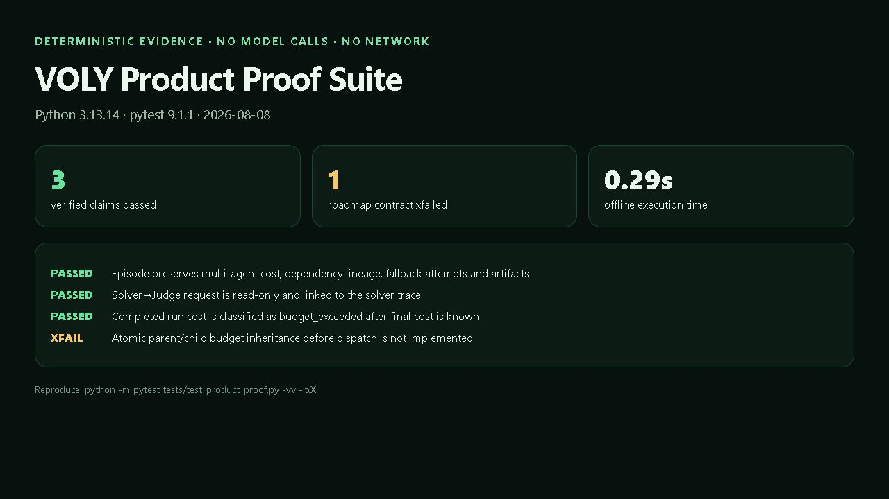
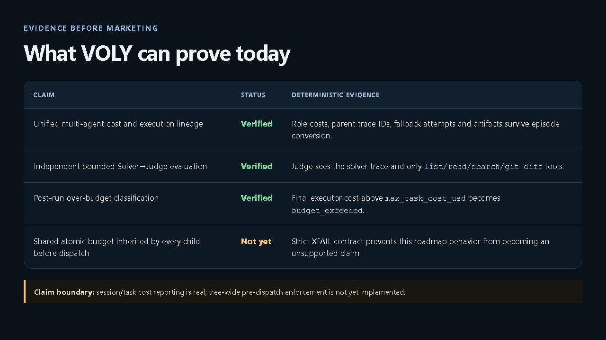

# Production validation and staged activation

Phase 9 is a RAT probe for the assumption that imported capability mechanics
improve real VOLY outcomes rather than merely adding latency and orchestration.
The probe separates routing correctness from value evidence.

## Deterministic product-proof suite

`tests/test_product_proof.py` is a small, offline proof surface for claims that
appear in product communication. It is intentionally narrower than the full
regression suite and separates verified behavior from roadmap contracts.

```bash
python -m pytest tests/test_product_proof.py -vv -rxX
```

The suite currently proves that:

- one `MultiAgentEpisode` preserves role costs, dependency lineage, fallback
  attempts and file artifacts;
- `SolverJudgeEnv` links the judge to the solver trace and grants only the
  bounded read-only repository tools;
- a completed executor cost can be classified as `budget_exceeded` once its
  final cost is known.

The suite also contains one strict expected-failure contract for atomic
parent/child budget inheritance before child dispatch. That behavior is not
implemented: `max_task_cost_usd` is currently evaluated after executor cost is
known. The expected failure is a claim boundary, not a passing capability. Do
not describe VOLY as enforcing a shared tree-wide pre-dispatch budget until the
contract passes without `xfail`.

Screenshots under `docs/assets/product-proof/` are presentation artifacts. The
test source and command above remain the reproducible evidence.





## Versioned suite

`voly/capability/benchmark_suite_v1.json` contains exactly 20 representative
tasks:

- six security-reviewer tasks;
- six TDD tasks;
- six Python-review tasks;
- two tasks that must use native VOLY;
- seven held-out tasks across the suite.

`voly capability evaluated benchmark` runs an offline routing probe. It uses
temporary synthetic activation only to exercise matching, never writes that
state to the evaluated store, performs no model calls, and always reports:

```json
{"synthetic_outcomes": true, "activation_allowed": false}
```

Routing success is infrastructure evidence, not value evidence.

## Real paired outcomes

Real baseline and variant runs are imported with
`voly capability evaluated record`. Each record names exactly one changed
capability, executor, experiment ID, quality scores, outcome metrics and
held-out status. Baseline/variant latency and token deltas are retained. Cost
has an explicit `cost_measured` marker, so unavailable billing cannot become
false zero-cost evidence. Token counts use the equivalent `tokens_measured`
marker; an unavailable count is excluded from the token delta rather than
treated as zero. A record declaring multiple changed capabilities is rejected.

For each pilot, the production gate currently requires six measured outcomes,
including at least two held-out outcomes:

- `activate`: the complete sample passes every success criterion and has
  positive paired added value;
- `retire`: the complete sample fails value or outcome criteria;
- `keep-pilot`: evidence or held-out coverage is incomplete.

Activation also applies explicit efficiency bounds to the paired evidence. The
variant's average latency overhead must not exceed 30 seconds, and its average
measured token overhead must not exceed 100,000 tokens. Token overhead is
evaluated only when equivalent usage is available; unknown usage is never
converted to zero. A capability that improves the quality score but exceeds
either bound is retired rather than activated.

A falsified value hypothesis can retire early after at least three measured
pairs when the two held-out outcomes are already present and aggregate paired
value remains below the pack threshold. Early retirement can only stop a
failed pilot; it can never activate one before the full six-sample gate.

The decision is reproducible from the local append-only evidence records:

```bash
voly capability evaluated activation-plan --executor claude-code
```

## Staged activation and Cloudflare

`activate-ready --yes` recomputes decisions and locally activates only packs
whose decision is `activate`. It never edits `voly.yaml` and never deploys a
Cloudflare Worker.

Cloudflare deployment becomes ready only when:

1. at least one capability passes local measured validation;
2. no capability remains in `keep-pilot`;
3. the target Worker implements the evaluated-pack sync contract;
4. the current local state has an exact verified remote-sync receipt;
5. activation is still explicitly enabled in configuration/deployment review.

Before a verified sync, the local activation plan reports
`blockers=["cloudflare_sync_unverified"]` and
`cloudflare_deploy_ready=false`. `voly capability evaluated sync` publishes a
bounded v1 snapshot, verifies it through authenticated read-back, and writes an
ignored receipt. The receipt becomes stale as soon as packs or evidence change.
Only a current receipt satisfies the sync part of deployment readiness.

The target service is `cf-workers/capability` (`voly-capability`,
`capability.voly.codes`). Its deployment preflight uses the project-pinned
Wrangler 4 toolchain:

```bash
cd cf-workers/capability
npm ci
npm run typecheck
npm run deploy:dry-run
npm run check:startup
```

The checked-in configuration is the source of truth for the D1
`CAPABILITY_DB` binding, required `EVALUATED_SYNC_TOKEN` secret and custom
domain. A successful dry-run validates the bundle and binding shape; it does
not replace remote migration, authenticated sync, or read-back verification.
