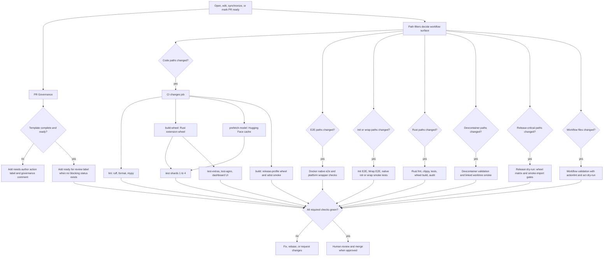
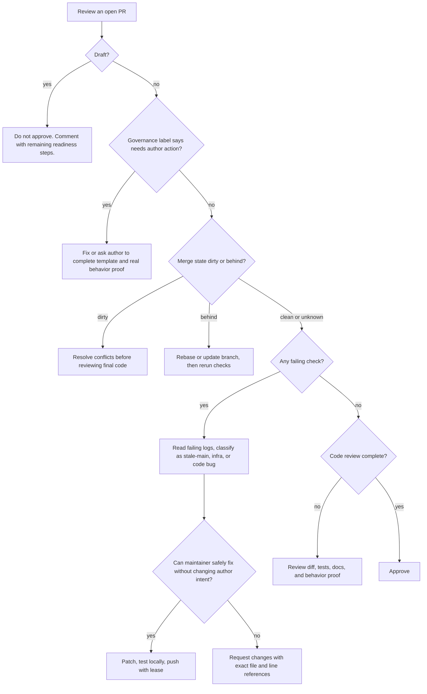
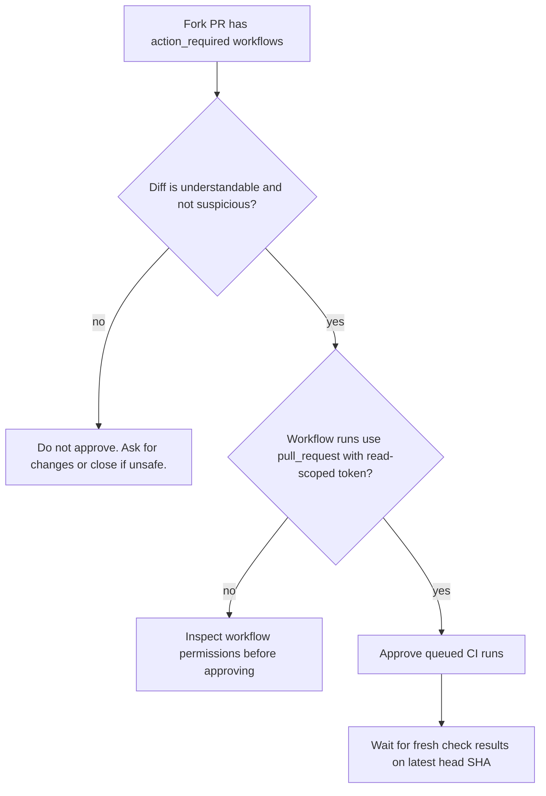
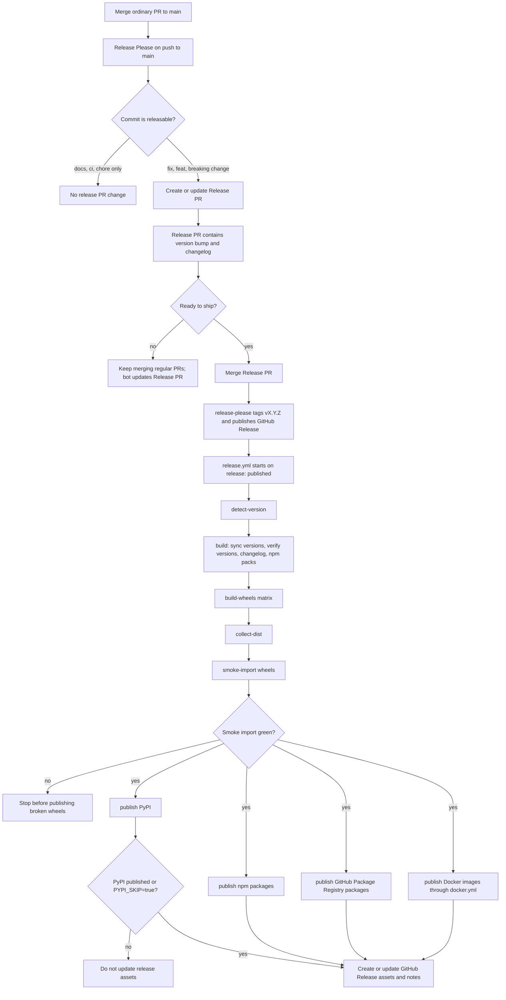
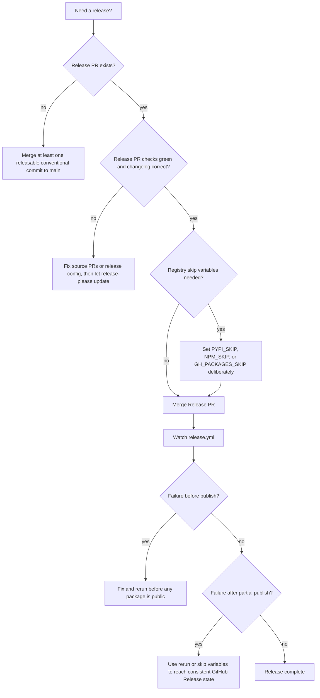
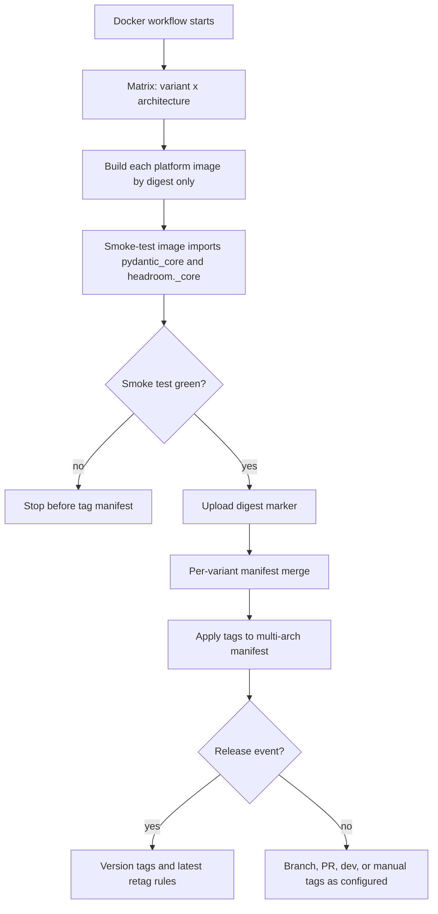
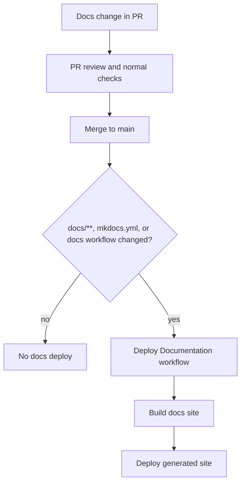
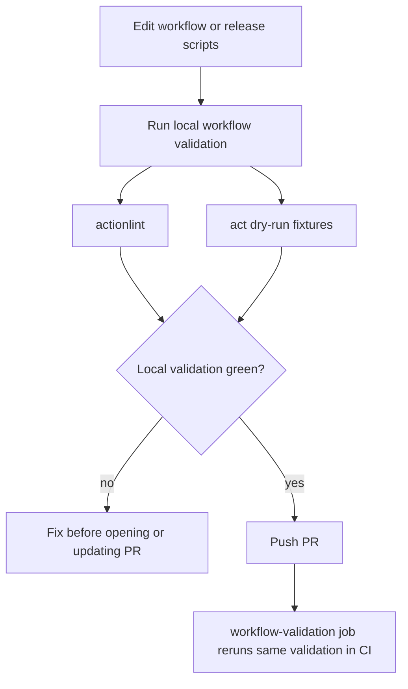

## Purpose

This page is the quick visual map for Headroom automation. Use it when opening a PR, reviewing a PR, cutting a release, or deciding which workflow owns a failure.

The short version:

- Pull requests are gated by PR governance, path-filtered CI, targeted e2e workflows, and human review.
- Release publishing is not triggered by every merge to `main`. `release-please` maintains a release PR; merging that release PR creates the tag and GitHub Release that trigger publishing.
- Docker images are built as multi-architecture digests first, then merged into tagged manifests.
- Docs deploy only after docs changes land on `main`.

## PR Flow



## PR Decision Tree



## Fork Workflow Approval

GitHub may leave product workflows in `action_required` for first-time or fork contributors. Approve only after the diff is safe enough to execute in CI.



## Release Flow



## Release Decision Tree



## Docker Publish Flow

`docker.yml` can run directly on `push`, `workflow_dispatch`, or `release: published`, and it is also called by `release.yml`.



## Docs Deploy Flow



## Manual Validation Flow

Use this when editing workflows or release automation.



Recommended local command:

```bash
bash scripts/validate-workflows.sh
```

For release dry-runs:

```bash
act workflow_dispatch -W .github/workflows/release.yml -e .github/act/dry-run.json
```

## Gate Summary

| Flow | Trigger | Main gates | Success condition |
|------|---------|------------|-------------------|
| PR governance | `pull_request_target`, schedule, manual | Template, readiness labels, merge state, check labels | PR has no governance blockers |
| CI | PR, push to `main`, manual | Path filter, lint, mypy, wheel build, model prefetch, test shards, package smoke | Required jobs green or path-skipped |
| Rust | Rust paths, schedule | fmt, clippy, cargo test, wheel build, audit | Rust checks green; nightly parity is allowed to fail in Phase 0 |
| E2E | CLI, install, wrap, Docker, package paths | Docker init/wrap, native init/wrap/install, platform smoke | Relevant lifecycle checks green |
| Release dry-run | PRs touching release-critical paths | Version detection, wheel matrix, smoke imports | Publish path can build before merge |
| Release publish | GitHub Release published by release-please | Version sync, changelog, wheels, smoke import, PyPI gate, npm, GPR, Docker | Public packages and GitHub Release assets are consistent |
| Docs deploy | Push to `main` with docs paths | Docs build | Site deploy completes |

## Workflow Ownership

| Workflow | Owns |
|----------|------|
| `.github/workflows/pr-health.yml` | PR body governance, readiness labels, rebase/conflict/failing-check labels |
| `.github/workflows/ci.yml` | Python lint, type checks, wheel build, test shards, package smoke, workflow validation |
| `.github/workflows/rust.yml` | Rust workspace quality gates and native wheel smoke artifacts |
| `.github/workflows/init-e2e.yml` | Dockerized `headroom init` behavior |
| `.github/workflows/wrap-e2e.yml` | Dockerized `headroom wrap` behavior |
| `.github/workflows/init-native-e2e.yml` | Host-specific `headroom init -g` smoke tests |
| `.github/workflows/install-native-e2e.yml` | Host-specific install CLI smoke tests |
| `.github/workflows/wrap-native-e2e.yml` | Host-specific wrap prepare-only smoke tests |
| `.github/workflows/devcontainers.yml` | Devcontainer startup and linked worktree compatibility |
| `.github/workflows/release-please.yml` | Release PR aggregation from conventional commits |
| `.github/workflows/release.yml` | Release build, wheel smoke-import gates, registry publishing, GitHub Release assets |
| `.github/workflows/docker.yml` | GHCR multi-architecture image builds and manifests |
| `.github/workflows/docs.yml` | Documentation deploy after docs changes merge |

