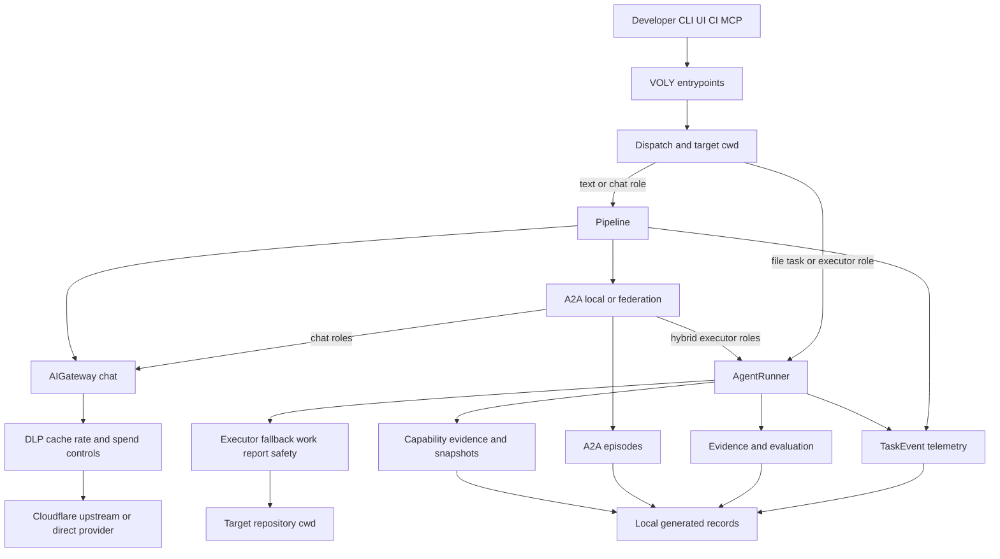

# VOLY control-plane architecture

VOLY is a project-agnostic control plane between callers and AI agents. A target repository is supplied at runtime—normally as `cwd`/`--cwd`—rather than encoded in the core. The control plane owns routing, cost and safety policy, orchestration, and records; file-capable executors act on the selected target repository.

Two execution mechanisms deliberately coexist:

- **Pipeline/chat path:** `Pipeline.run()` enriches and routes text work, can auto-dispatch complex work to A2A, and sends chat inference through the shared gateway.
- **Executor/file path:** `AgentRunner.run()` invokes a file-capable executor in `cwd`, applies executor fallback and safety policy, then reports the outcome.

They may meet in a hybrid A2A run, but they are not interchangeable. In particular, an executor is not a chat provider merely because it can be selected for an implementation role.

This diagram separates control flow from record ownership: chat calls cross the gateway boundary, while file mutations cross the executor-to-target-repository boundary.

## Caller and runtime topology

The packaged `voly` command is a Click entry point. The optional `ui` extra supplies FastAPI and Uvicorn; the web route accepts `POST /api/run`, creates an in-flight run record, and executes blocking pipeline or executor work in a bounded thread pool while streaming SSE heartbeats. A separately built Svelte UI can be served with the FastAPI application. The MCP extra intentionally reuses this web dispatch path rather than defining a second task-routing runtime.

`POST /api/run` implements the main smart-dispatch decision when its requested executor is `pipeline`:

1. A complex task—enough code/review/test/deploy capability flags or high complexity—remains in the pipeline for multi-agent execution.
2. A simpler code-generation task is promoted to `claude-code`; its target is request `cwd`, `default_cwd`, or `VOLY_PROJECT_CWD`.
3. A text-only task stays on the pipeline path.

With a usable `cwd` and hybrid A2A enabled, implementer roles can use `AgentRunner` while planning/review roles use chat. Independent chat roles may be concurrent; executor roles sharing the repository stay serial to avoid competing writes. See [pipeline and A2A orchestration](../orchestration/a2a-and-pipeline.md) for role-level behavior and [entrypoints and safety](../operations/entrypoints-and-safety.md) for command and server operations.

## The governed chat boundary

`AIGateway.chat()` is the sole model egress for normal pipeline inference, DSPy, and chat-based subagents. When enabled, it scans messages with DLP, computes a cache key that can include a project-state scope, checks rate and spend limits, then chooses a Cloudflare AI Gateway call or delegated/direct provider call. It records spend and caches only successful responses; provider failures are marked for health-aware avoidance.

Layer A is intentionally a narrow gateway/routing layer. For non-Cloudflare calls, an optional upstream such as `omniroute` receives the request first; if it fails and `upstream_fallback_direct` is enabled, VOLY retries the originally requested direct adapter. This preserves VOLY's surrounding DLP, cache, spend, and telemetry behavior while allowing provider breadth to be delegated.

**Invariant — do not bypass the gateway for model calls.** Adding a pipeline feature, DSPy program, SDK chat mode, or A2A chat role must retain this boundary, or it loses uniform DLP, caching, rate/spend enforcement, health handling, and telemetry. File executors are the intentional exception because they are a separate CLI/SDK execution mechanism.

## File-capable execution and safety

`AgentRunner` captures a pre-run repository snapshot and invokes the selected executor against `cwd`. It records a git/directory-based `WorkReport`, applies the executor safety policy after the attempt, and emits a `TaskEvent`. `--dry-run` rolls changes back while retaining a diff preview. Protected-path violations can roll back only the prohibited files and keep unrelated useful changes, whereas exceeding the maximum touched-file rule or leaving no permitted changes makes the run fail.

On `billing_error` or `not_available`, the runner walks the file-executor fallback chain. It skips known unavailable executors, retains a chain time log, and includes abandoned-attempt tokens and costs in the task total. Materialized, enabled capability profiles may reorder or exclude executors based on scored task dimensions; absent, weak, or disabled profiles fall back to the static chain. This is a routing refinement, not permission to treat unmeasured capability data as authoritative.

**Invariant — `cwd` and generated state are operational boundaries.** Core code remains project-agnostic; source and tests define intended behavior, while `.voly/` artifacts are generated runtime state and must not become a source of truth. Keep file safety and target isolation intact when adding executors, workflows, or web entrypoints.

## Durable records are separate contracts

The records below can reference one another but must not be collapsed into a generic run document.

| Record category | Owner and durable location | Meaning and boundary |
|---|---|---|
| Telemetry | `TaskEvent`; local `.voly/events/<task_id>.json` | Operational task visibility: status, correlation, usage, cost, fallback, and summarized report data. `TaskEvent` is schema version 4. Remote Cloud Analytics receives only a schema-versioned allowlist and only with explicit consent. |
| In-flight run state | `RunTracker`; configured `.voly/runs` directory | Liveness/heartbeat state used by UI and API while blocking work is active. It is not evidence or a durable task-quality conclusion. |
| Evidence and evaluation | `EvidenceRecord`; `.voly/evidence/<task_id>.json` when enabled | Executor-run baseline, result attribution, evaluation policy/report, and optional human feedback. Repository baseline precedes executor changes so existing failures are distinguishable from agent outcomes. |
| A2A episode | `MultiAgentEpisode`; `.voly/episodes/<task_id>.json` | Orchestration lineage: role traces, dependencies, messages, tool calls, artifacts, decisions, metrics, and evidence references. It links evidence rather than duplicating or replacing it. |
| Capability evidence and profiles | executor evidence plus `.voly/capability/profiles` | Governed measurements used to score possible executor ordering. They remain distinct from ordinary task telemetry and from EvidenceRecord evaluation. |

The protocol test freezes the `TaskEvent` v4 field set and Cloud Analytics v1 allowlist; changing either is a versioned contract change, not a local serialization tweak. Sensitive local-only fields such as prompts, results, free-form errors, paths, reports, artifacts, and A2A assignments are excluded from the remote analytics record.

## Optional dependencies and deployment edges

Configuration is exposed through `VOLYConfig` and loaded from `voly.yaml`; package extras keep integrations optional. `dspy`, `cursor`, `ui`, `mcp`, semantic retrieval, and proxy support are separate extras. Runtime configuration enables or disables A2A federation, memory backends, RTK/Headroom, evidence/evaluation, gateway persistence and delegation, safety policy, and telemetry destinations.

Cloudflare is an optional deployment edge, not local source-of-truth replacement: it may provide AI Gateway transport/BYOK resolution, A2A federation, memory, spend, telemetry ingestion, or R2 delivery. Local telemetry is always persisted first. Remote telemetry/R2 upload requires explicit cloud-analytics consent; delivery failures are handled best-effort and do not erase the local event.

The defaults matter for operation: evidence and evaluation are disabled until enabled, whereas executor safety is enabled. Before exposing a local UI/API beyond localhost, follow the deployment guidance in [gateway and Cloudflare integrations](../integrations/gateway-and-cloudflare.md) and [entrypoints and safety](../operations/entrypoints-and-safety.md).

## Change invariants and focused verification

When changing a cross-cutting feature, preserve these constraints:

- Route every chat-model call through `AIGateway.chat()`; keep executor invocation separate.
- Count failed executor attempts in total run cost, but charge gateway spend only for successful model responses.
- Preserve `cwd` isolation, dry-run rollback, protected-path handling, and serialized shared-repository executor work.
- Keep telemetry, evidence/evaluation, A2A episodes, and capability snapshots semantically and version-wise distinct.
- Treat local source and tests as authoritative over `.voly/` records, datasets, caches, episodes, and compiled/derived artifacts.
- If a public record or remote payload changes, update its schema/documentation and its contract snapshot together.

`tests/test_protocol_contracts.py` is the focused guard for frozen telemetry and spend HTTP shapes. Changes to gateway ordering should additionally exercise DLP/cache/limit/success-accounting behavior; changes to runner behavior should cover fallback, safety rollback, evidence attribution, and `TaskEvent` totals. For end-to-end task behavior and safe invocation patterns, see [verified execution](../workflows/verified-execution.md) and [quickstart](../quickstart.md).
