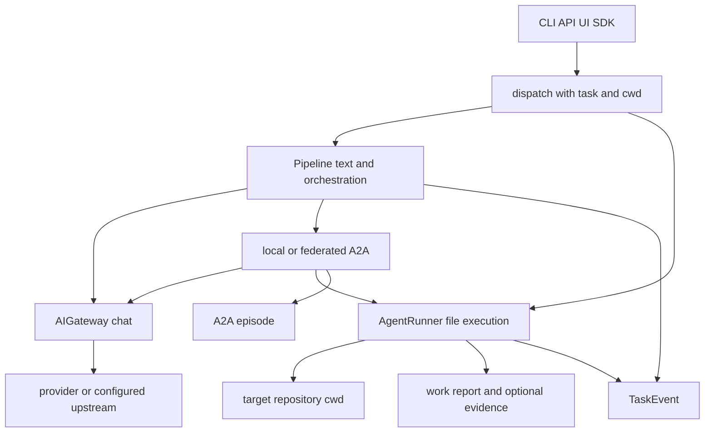

# VOLY control-plane architecture

VOLY is a self-hosted control plane that sits between an operator and AI agents acting on a target repository. It is project-agnostic: the target is supplied as `cwd` (including `--cwd` or `VOLY_PROJECT_CWD`), while VOLY owns routing, safety, cost accounting, orchestration, and records. It is not itself a replacement coding agent or a hosted system of record.

## The architectural split: inference is not execution

The control plane has two deliberately separate execution mechanisms:

| Concern | Inference / pipeline path | File-capable executor path |
|---|---|---|
| Primary owner | `Pipeline.run()` and `AIGateway.chat()` | `AgentRunner.run()` and an `Executor` |
| Work performed | Routes and prepares text/model work; may run DSPy and A2A chat roles | Lets an agent operate in the supplied `cwd` |
| Model boundary | Gateway applies DLP, cache, rate/spend controls, provider fallback, and metrics | Executor subprocesses or SDK-backed executors; not an implicit gateway model call |
| Result records | `PipelineResult` and a terminal `TaskEvent` | Work report, optional baseline/evaluation/EvidenceRecord, terminal `TaskEvent` |

This shows the control-plane paths and their distinct outputs. A hybrid A2A run may combine them, but it does not merge their safety or persistence semantics.

### Pipeline and model inference

`Pipeline.run()` is staged rather than a direct provider wrapper. It initializes context; can perform research/repository intelligence and AG-UI setup; routes the task; optionally auto-dispatches sufficiently complex work to A2A; retrieves memory; applies RTK, skill suggestions/injection, and Headroom compression; invokes the inference manager; optionally stores memory; and emits a terminal event. Its stage hooks and `PipelineResult` expose this lifecycle to integrations without requiring them to duplicate it.

The pipeline creates its gateway lazily from `VOLYConfig`. Optional DSPy is wired through the same gateway, so its model calls inherit the gateway configuration rather than constructing a provider client. Auto A2A dispatch is suppressed for nested A2A subtasks, preventing recursive redispatch.

### Gateway: the governed model boundary

For enabled gateway calls, `AIGateway.chat()` first scans serialized messages with DLP, derives a cache key that includes model, provider, system/extra inputs, and project cache scope, then checks rate and spend limits before calling a provider. Cache hits return before those provider-side controls. Successful responses are cached and charged; provider errors are not charged and may mark a provider unhealthy. An empty response that is not a legitimate tool/length terminal response is treated as failure, so it can enter model fallback rather than appearing as a blank answer.

Cloudflare routing is optional: with an account configured, Cloudflare-supported providers use the Cloudflare AI Gateway route; otherwise the gateway uses delegated/direct adapters. A configured `ai_gateway.upstream` sends non-Cloudflare calls to that external gateway first. If it fails and `upstream_fallback_direct` is enabled, VOLY retries the originally requested provider directly. Thus upstream services own their own provider selection, while VOLY retains the controls surrounding the call.

**Do not conflate fallback domains.** Gateway fallback is model/provider fallback for chat inference. The executor chain is a file-execution fallback triggered only by `billing_error` or `not_available`; an empty model answer must not advance that executor chain.

### File-capable execution

`AgentRunner` resolves an agent/role to an executor, snapshots the target repository, invokes `executor.run(..., cwd=cwd)`, and builds a `WorkReport` from before/after state. The normal fallback order is `claude-code → cursor → deepseek → wrangler → opencode → zen`; capability profiles may reorder the fallback selection when enabled. Failed or unavailable attempts contribute retry tokens and cost to the final task total, preserving the cost of abandoned attempts rather than reporting only the final executor.

The runner applies executor safety after it has observed the work: dry runs retain a diff preview while rolling changes back; protected-path violations can roll back only the protected changes and leave useful remaining writes, but a max-files violation or a run with no remaining writes becomes a hard failure. This is why file execution must receive an explicit target `cwd`, and why a text provider must not be substituted for a file executor.

## Durable records have separate meanings

These are complementary records, not alternative names for one run log:

- **`TaskEvent`** is terminal task telemetry for pipeline, executor, and A2A outcomes. Local events are complete JSON files under `.voly/events/`; schema version 4 is frozen by protocol tests. A correlation ID connects API, runner, and worker-facing activity.
- **`RunRecord`** is in-flight operational visibility, written under `.voly/runs/`. It holds heartbeat, role progress, parent lineage, plan/workflow fields, and cancellation state because a terminal `TaskEvent` cannot show a hung run. Writes are atomic and best-effort; the watchdog marks a still-running record `stale` after `stale_factor × task_timeout` without a heartbeat.
- **EvidenceRecord** is a local, versioned executor-evaluation bundle under `.voly/evidence/`, currently schema version 3. It separates pre-run repository health, exact execution identity, root-cause attribution, evaluation, action report, and human feedback. A pre-existing repository or provider failure is not evidence that the agent performed poorly.
- **A2A episodes** preserve orchestration lineage—traces, artifacts, decisions, metrics, costs, and acceptance criteria—under `<cwd>/.voly/episodes/`. A local multi-agent run creates an episode after role execution and emits an aggregate `TaskEvent`; it does not replace per-executor evidence or telemetry.
- **Plans** are durable workflow state, stored atomically under `.voly/plans/`. Plan steps explicitly select `chat` or `executor` mode, so the plan runner uses the gateway or `AgentRunner` respectively. In active mode, a failed acceptance check blocks dependents; shadow mode records the failed verification but can open the gate for observation.

Remote analytics is an intentionally narrower boundary. When `cloud_analytics.enabled` is explicitly true, telemetry exports a separate schema-v1 allowlisted record with a one-way event ID; it excludes prompts, results, free-form errors, repository paths, reports, artifacts, stage logs, and A2A assignments. Evidence has its own schema-v2 sanitized cloud record. Local records remain the detailed source for local/UI use.

## Local surfaces and optional remote services

The Apache-2.0 Python package provides the `voly` Click command, and FastAPI is an optional `voly[ui]` dependency. `create_app()` wires HTTP routes, correlation middleware, the local event/run/evidence stores, and a background watchdog reaper. The open-core API has no authentication and is intended for localhost only; do not expose it as an authenticated multi-user service.

The Svelte application in `ui/` is a separate Vite frontend. A development setup runs its dev server separately from FastAPI; a built frontend can be served by the FastAPI app. HTTP and MCP are transport adapters over shared service-layer run/task logic, rather than separate control planes: MCP background starts return a task ID, then callers poll `RunRecord` progress and the eventual `TaskEvent`.

Cloudflare Workers, AI Gateway, Pipelines/R2 analytics, external spend services, and A2A federation are optional integration edges. They can provide inference transport, federation, or sanitized/consented remote data, but do not own local repository changes, detailed records, or the Python control flow. Configuration controls whether those edges are contacted; their failures are generally handled best-effort for telemetry rather than invalidating a completed local run.

## Operational invariants and safe changes

1. Route all governed model inference through `AIGateway.chat()` or a wrapper that builds the same configured gateway. Preserve DLP/cache/rate/spend ordering and charge only successful calls.
2. Keep file-capable execution in `AgentRunner`/executor implementations with explicit `cwd`, repository snapshots, work reporting, and safety policy. Do not turn gateway model fallback into executor fallback.
3. Treat `TaskEvent`, EvidenceRecord, cloud analytics records, A2A episodes, `RunRecord`, and plans as different schemas with different lifecycles and privacy properties.
4. A public-contract change requires a schema/version decision and matching contract-test/documentation update—not a silent snapshot edit. The focused protocol suite freezes TaskEvent v4, Cloud Analytics v1, and spend endpoint/body shapes.
5. Exercise failure semantics in focused tests: gateway tests cover DLP without Cloudflare, cache scoping, empty-content fallback, upstream fallback, and spend-on-success; evidence tests cover root-cause attribution, atomic feedback handling, and sanitized cloud export; plan tests cover active versus shadow gates.

For detail beyond this overview, see [A2A and pipeline orchestration](../orchestration/a2a-and-pipeline.md), [durable workflows](../orchestration/durable-workflows.md), [entrypoints and safety](../operations/entrypoints-and-safety.md), [Cloudflare services](../integrations/cloudflare-services.md), and [capability governance](../governance/capabilities.md).
