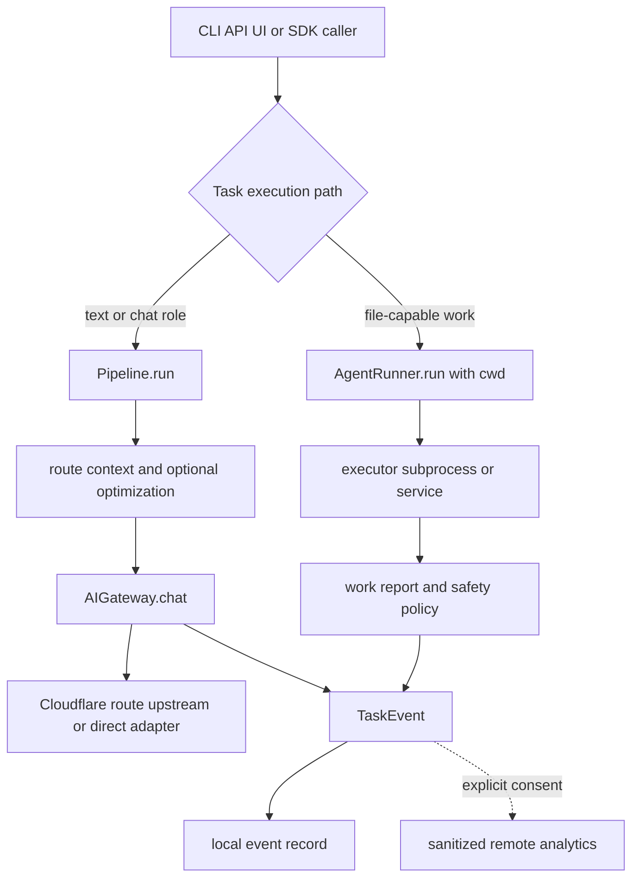

# Control-plane architecture and contracts

VOLY is a project-agnostic control plane rather than a product-specific agent: callers provide the target repository as `cwd` (or configure `default_cwd`), and the core supplies routing, cost controls, orchestration, safety, and observability. The package's small public Python surface exports `VOLYConfig`, `Pipeline`, `AgentRouter`, and the `Agent`/`Workflow` SDK; the installed CLI entry point is `voly`.

## The architectural split

There are two deliberately different execution paths. They meet at shared configuration and telemetry, but a file-writing executor is **not** a disguised model-provider call.



This diagram shows the governed inference path and the intentionally separate file-executor path.

### Governed inference

`Pipeline.run()` is the text/inference orchestrator. It initializes per-run state, may perform repository-intelligence and optional reuse/research stages, starts requested AG-UI work, delegates or auto-dispatches A2A when appropriate, routes the task and checks spend, then builds context from memory, RTK, skills, and Headroom before asking its `InferenceManager` for a response. Pipeline exceptions produce a failed `PipelineResult` and a telemetry event rather than escaping without a run record. Its lazily built gateway receives the gateway section of `VOLYConfig`, including cache, rate/spend limits, DLP, model fallback, upstream delegation, BYOK, and timeout settings.

`AIGateway.chat()` is the model-call boundary. When enabled, it scans messages with DLP, derives a cache key that includes provider/model/system and optional project scope, returns cache hits early, enforces rate and estimated-spend limits, and then uses a Cloudflare Gateway-compatible provider route or delegated/direct path. It marks qualifying provider failures unhealthy, records spend and request metrics only after a successful response, and caches only successful responses. Empty responses with no legitimate terminal reason become failures that can enter model fallback. An upstream gateway can be attempted first for non-Cloudflare calls; if enabled, its direct adapter fallback prevents an unavailable upstream from blocking the pipeline.

**Invariant — no bypass:** Pipeline, DSPy, SDK chat agents, and other chat roles must retain `AIGateway.chat()` as their model boundary so DLP, cache, spend, rate-limit, provider-health, fallback, and accounting behavior stays consistent. File-capable executors are the explicit exception: they invoke their own agent runtime with `cwd` and have a distinct billing/availability fallback mechanism.

### File-capable execution

`AgentRunner.run()` resolves an executor and role, optionally starts a best-effort live `RunRecord`, optionally captures an evidence baseline, optionally refines the task through DSPy, snapshots repository state, and calls `executor.run(..., cwd=cwd)`. It builds a `WorkReport` from before/after Git state (with additional support for untracked changes), then applies the executor safety policy before final accounting and event emission.

The runner retries a file executor only when its result reports `billing_error` or `not_available`, walking the configured capability-aware chain or the static `BILLING_FALLBACK_CHAIN`. It records each attempt in `chain_timelog`; abandoned-attempt tokens and cost are folded into the final task total while `retry_count` and `retry_cost_usd` retain the wasted portion. Ordinary execution failure does not imply a switch to another executor.

Safety is applied after the agent attempts its changes, using a pre-run snapshot: dry-run restores all changes while retaining a diff preview; protected paths are restored/removed; and exceeding `max_files_touched` rolls back the whole run. A protected-path violation can remain a successful *soft* result when non-protected changes remain, but becomes a hard failure when nothing useful remains or the maximum-file policy was exceeded. This behavior protects a caller's pre-existing dirty content rather than resetting it to `HEAD`.

## Hybrid orchestration and shared working directories

A2A local orchestration can use both paths in one dependency graph. With hybrid execution enabled and a supplied `cwd`, implementer roles such as developer, bugfixer, tester (for code-generation work), and devops may use `AgentRunner`; architect and reviewer remain chat roles. Without the required `cwd`, hybrid mode is inactive and roles stay on chat. Executor roles are serialized because they share one working directory and Git state, whereas independent chat roles may run concurrently within the configured bound. A failed implementation role can cause dependent post-implementation roles to be skipped rather than reviewing code that was never produced.

The key isolation rule is therefore operational as well as conceptual: do not add target-product behavior under `voly/`, and do not infer a target repository from product-specific assumptions. Pass the target through runtime `cwd`/`default_cwd` and keep its generated `.voly/` state scoped to that project.

## Durable records: different questions, different schemas

| Record | Owner and location | Purpose and boundary |
|---|---|---|
| `TaskEvent` | `voly.telemetry`; local JSON in `telemetry.events_dir` (default `.voly/events`) | Versioned per-task operational telemetry for pipeline and executor outcomes, including correlation, tokens, cost, fallback, error class, work summary, and A2A fields. |
| Cloud analytics record | `event_to_pipeline_record()` | A separate flattened, allowlisted schema. It deliberately excludes prompts, results, free-form errors, paths, reports, artifacts, stage logs, and A2A assignment data. Upload is opt-in through `cloud_analytics.enabled`; local persistence happens regardless of remote delivery success. |
| `RunRecord` | `voly.runtime.runs`; `telemetry.runs_dir` (default `.voly/runs`) | Best-effort live state for blocking executor/workflow runs: status, heartbeat, current role, plan and graph progress. Atomic replacement makes reader-visible JSON resilient to interrupted writes; a watchdog can mark silent running records stale. |
| Evidence and evaluation records | executor evidence/evaluation configuration, normally beneath `.voly/evidence` | Optional local execution evidence: a pre-run baseline, evaluation outcome, root-cause classification, and policy lineage. It is not a replacement for telemetry and is created only when its feature gates permit. |

`TaskEvent` is currently schema version 4; the remote analytics projection is version 1. Contract tests freeze the `TaskEvent` field set, serialization version, analytics field set, privacy exclusions, and the v1 spend HTTP endpoints. Changing either public record shape is a compatibility change: bump the appropriate schema version and update its documentation and snapshot tests rather than silently changing consumers.

## Configuration ownership and operations

`VOLYConfig` is the composition root. Its sections make ownership explicit: `ai_gateway` owns chat routing guards and transport preferences; `a2a` owns dispatch, federation, hybrid-role and concurrency policy; `executor_safety` owns write rollback/protection limits; `telemetry` owns local event/run locations and remote endpoint settings; `cloud_analytics` is the separate remote-consent switch; and `evidence`/`evaluation` independently enable baseline collection and post-run evaluation. Most optional behavior is disabled or gated by configuration, while gateway, telemetry, A2A, and executor safety have usable defaults.

Use the CLI for local operations and the optional FastAPI/UI extras for web/API use; both should enter the same pipeline/runner control paths rather than construct provider clients directly. For a safe file-writing invocation, make the target explicit:

```bash
voly run "fix the auth redirect bug" --executor claude-code --cwd ~/my-project
```

Generated `.voly/` state is runtime data, not source. Operators should preserve it when they need local run history/evidence, but should not treat it as an application configuration substitute or commit it with the target repository.

## Focused change checks

- Run `tests/test_protocol_contracts.py` when changing `TaskEvent`, analytics projection, or spend-client paths; it guards versioned external contracts.
- Run `tests/test_telemetry.py` when changing delivery or consent: it verifies local-first persistence and that private task content is absent from remote payloads.
- Run `tests/test_executor_safety.py` for snapshots, protected paths, dry-run, and hard-versus-soft rollback behavior.
- Run `tests/test_hybrid_a2a.py` when changing role modes, `cwd` requirements, or implementation-role failure semantics.
- Run gateway tests when changing call guards or fallback. In particular, preserve the success-only spend rule and cache scope in `AIGateway.chat()`.

For more detail on execution lifecycle and gateway economics, see [executor runs](../runtime/executor-runs.md) and [gateway and FinOps](../runtime/gateway-and-finops.md). [A2A and pipeline orchestration](../orchestration/a2a-and-pipeline.md) describes role decomposition and federation; [evidence and evaluation](../governance/evidence-and-evaluation.md) covers the optional evidence lifecycle.
