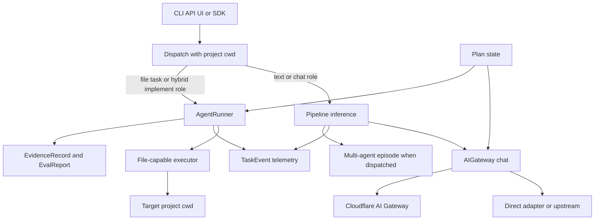

# VOLY control-plane architecture

VOLY is a control plane around agents, not the target application they operate on. Its most important boundary is the target project directory (`cwd`): a CLI/API request can supply it, configuration can provide `default_cwd`, and `VOLY_PROJECT_CWD` is the environment fallback. The directory is passed to file-capable executors and is also the context used by project-aware features such as repository evidence and hybrid orchestration. Treat it as an explicit operational input—not an incidental current directory.

The web route has a compatibility fallback to the server process working directory for an executor request with no `cwd`; that is why production callers that can write files should always set `cwd` (or a deliberate `default_cwd`) rather than rely on process placement.

This diagram shows the two execution paths and their distinct durable outputs. A plan can invoke either path, but it remains its own state record.

## Project boundary and entrypoints

The main entrypoints are the Click CLI, the FastAPI `POST /api/run` route, and Python components such as `Pipeline`, `AgentRunner`, and `PlanRunner`. Smart dispatch analyzes a request submitted as `executor=pipeline`:

- A complex, multi-capability task stays on the pipeline/A2A route. If a project directory is available and hybrid code generation is enabled, implementation roles may use the executor path while reasoning roles remain chat-based.
- A simpler code-generation task is promoted to `claude-code` with the resolved project directory so it can modify files.
- A non-file task remains inference work.

The distinction is intentional: task routing may compose the paths, but it does not make a model provider a file executor or make an executor call a normal gateway chat request. See [A2A and pipeline orchestration](../orchestration/a2a-and-pipeline.md) and [SDK and plan execution](../workflows/sdk-and-plan-execution.md) for their surface contracts.

## Inference path: governed model calls

`Pipeline.run()` builds task context, can perform repository intelligence and A2A dispatch, then routes, retrieves memory, applies token/skill stages, and delegates the actual inference through its inference manager. The configured gateway is the model-call boundary: `AIGateway.chat()` first applies DLP scanning, a project-scoped cache lookup, rate limiting, and a spend check. A successful response is charged and may be cached; an error is not charged. Provider health can reroute an unhealthy provider, and the configured model fallback handles provider errors or unusable empty content.

Cloudflare is one integration edge, not the local runtime itself. When Cloudflare credentials are configured and the selected provider is supported, the gateway calls Cloudflare AI Gateway. Other calls can use a configured upstream gateway or direct adapters; an upstream failure can fall back to the originally requested direct adapter. BYOK configuration is also gateway configuration: provider keys may be resolved through Cloudflare Secrets Store rather than being handed to individual callers.

This path is used for ordinary pipeline inference and chat-mode orchestration. It is also the safe extension point for a new chat provider: preserve gateway policy ordering and response accounting instead of calling a provider directly.

## File-execution path: executors operate on `cwd`

`AgentRunner.run()` constructs a selected file-capable executor and invokes `executor.run(..., cwd=cwd)`. It captures repository state before and after execution to build a work report, then applies the executor safety policy. The policy can roll back a dry run, protected-path changes, or excessive changes; a protected-path-only rollback can be a soft outcome if other useful changes remain, whereas a maximum-file violation or no remaining changes is a hard failure.

The runner's billing/availability fallback is separate from model fallback. Only an executor result marked `billing_error` or `not_available` advances through the executor chain, and each attempt is retained in the chain log. Retry token and cost totals are folded into the final task telemetry so a run reports both its total cost and the abandoned-attempt share. Do not use gateway `empty_content` or general inference failure as a reason to advance this chain.

Before a file-capable run, evidence-enabled operation captures a repository baseline. After safety processing it evaluates the result, then builds and persists an evidence record. This order protects attribution: a pre-existing failing test, unavailable tool, or repository condition is evidence about the baseline rather than automatically evidence that the agent failed.

## Durable records have different owners

The control plane deliberately does not collapse all run data into one document.

| Record | Owner and purpose | Persistence and boundary |
|---|---|---|
| `TaskEvent` | Operational telemetry for pipeline and runner outcomes: status, cost, tokens, routing/executor metadata, retry information, and selected artifacts. | Local event JSON is complete. The Cloudflare analytics projection is a separately versioned allowlist that excludes prompts, results, paths, reports, artifacts, stage logs, and detailed A2A assignments. |
| `EvidenceRecord` | File-execution evidence: the pre-run repository baseline, exact execution bundle, attributable outcome, optional evaluation, and explicit human feedback. | Stored as atomic local JSON under the configured evidence directory. Its optional cloud record is metadata-only and separately schema-versioned. |
| `EvalReport` | Post-run evaluation against an evaluation policy. | Deterministic checks can inspect executor success, safety, file changes, baseline replay, security, and artifacts; human review remains pending until explicit feedback resolves it. The report belongs inside evidence rather than replacing telemetry. |
| `Plan` | Durable workflow/gate state and dependency verification. | `PlanStore` atomically writes plan JSON. Plan I/O errors are raised because a gate's source of truth must not vanish silently; a timed-out plan is left resumable. |
| `MultiAgentEpisode` | Orchestration lineage: per-role traces, messages, tool calls, artifacts, decisions, metrics, costs, and references to evidence. | The episode store writes atomic JSON, normally under `.voly/episodes`; it links to evidence/evaluation rather than duplicating their authority. |
| Capability-governance evidence | Measurements and snapshots used to decide whether an optional capability variant may be activated. | Separate from ordinary task telemetry and executor evidence; see [capability governance](../governance/capabilities.md). |

`TaskEvent` schema v4 and its Cloud Analytics v1 projection are protected by protocol contract tests. A material field-shape change requires a schema version and test/documentation update rather than silently changing remote consumers.

## Local runtime versus Cloudflare edges

The self-hosted package owns local execution, project files, executor safety, plans, evidence, and local telemetry. Cloudflare-facing components are optional integration edges:

- **AI Gateway** can proxy supported model providers and support BYOK-backed credential resolution.
- **Cloud analytics** receives an explicit sanitized `TaskEvent` projection, not the full local event.
- **Evidence cloud analytics** similarly receives an allowlisted evidence projection, not raw commands, outputs, task text, repository observations, or feedback comments.
- **Remote services** may be configured for A2A, AG-UI, spend, memory, registry/marketplace, and other worker-backed facilities, but local components remain usable without treating a worker as the source of truth for project state.

This boundary is both a privacy rule and a change-management rule: evolve the local records for local operation; evolve only their explicitly versioned projections when changing cloud consumers.

## Operational invariants and focused verification

When changing this area, preserve these invariants:

1. **Make project scope explicit.** Resolve `cwd` from the request, configured default, or environment; reject or warn on missing scope for file-writing production paths rather than accidentally targeting a server checkout.
2. **Keep chat and file calls separate.** Add model integrations through `AIGateway.chat()`; add file writers through the executor interface with an explicit `cwd`, safety behavior, and failure classification.
3. **Account after success.** Gateway spend is recorded only for a successful model response. Executor telemetry aggregates failed billing/availability attempts without hiding retry cost.
4. **Preserve record semantics.** A `TaskEvent` is observability, evidence/evaluation establish outcome context, a plan is gate state, an episode is orchestration lineage, and capability evidence is a governance decision input.
5. **Test public projections, not just internal objects.** `tests/test_protocol_contracts.py` freezes the `TaskEvent` and Cloud Analytics schemas and spend HTTP paths. Changes to evidence cloud payloads, plan persistence, or executor safety should also exercise their focused tests.

For commands, environment checks, and write-safety controls, see [entrypoints and safety](../operations/entrypoints-and-safety.md).
