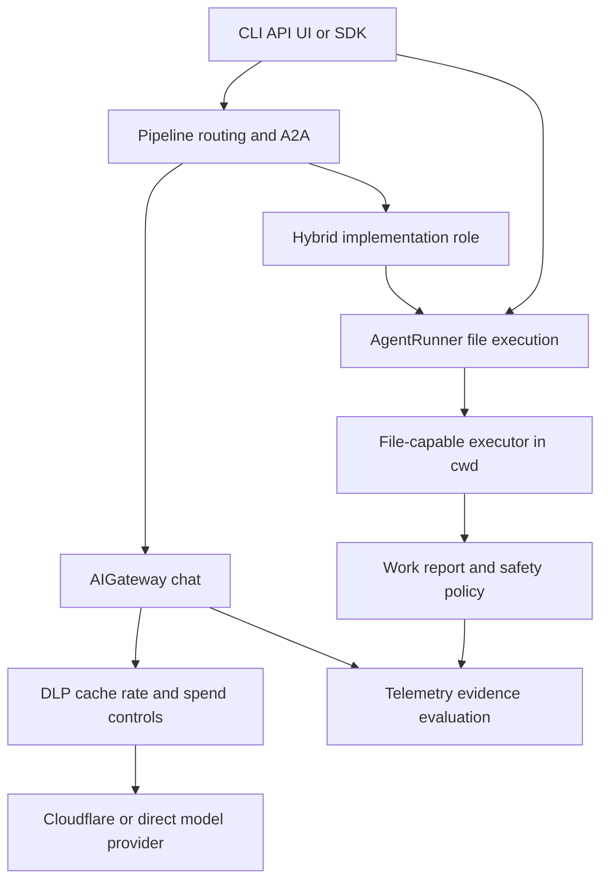

# VOLY control-plane architecture

VOLY is a self-hosted, project-agnostic control plane around AI coding agents rather than a replacement coding agent. The target repository is selected with `cwd` (or configured as the default), while VOLY owns routing, cost controls, safety policy, orchestration, and records. That separation is the central design constraint: changes in `voly/` should remain reusable across target projects.

## Execution and trust domains

There are two intentional execution paths. They may cooperate in a hybrid multi-agent run, but they must not be collapsed into one abstraction.

| Domain | Primary boundary | What it may do | Key control |
|---|---|---|---|
| **Governed inference** | `AIGateway.chat()` | Send chat messages to a model provider and return a response. | DLP, cache, rate and spend checks, provider health/fallback, and successful-call accounting. |
| **File execution** | `AgentRunner.run()` → `executor.run(..., cwd=...)` | Invoke a file-capable executor in the target project. | `cwd`, billing/availability fallback, pre/post-run work reporting, safety rollback, and optional evidence/evaluation. |
| **Orchestration** | `Pipeline.run()` and local A2A | Route a text task or decompose a complex task into dependency-linked roles. | Chat roles use the gateway; implementation roles may intentionally use the file-executor domain when hybrid execution has a `cwd`. |

```mermaid
flowchart TD
    Caller["CLI API UI or SDK"] --> Pipeline["Pipeline routing and A2A"]
    Caller --> Runner["AgentRunner file execution"]
    Pipeline --> Chat["AIGateway chat"]
    Pipeline --> Hybrid["Hybrid implementation role"]
    Hybrid --> Runner
    Chat --> Guard["DLP cache rate and spend controls"]
    Guard --> Provider["Cloudflare or direct model provider"]
    Runner --> Executor["File-capable executor in cwd"]
    Executor --> Safety["Work report and safety policy"]
    Safety --> Records["Telemetry evidence evaluation"]
    Chat --> Records
```

This diagram shows the distinct chat and file-writing paths; hybrid orchestration joins them only by explicitly dispatching an implementation role to `AgentRunner`.

### The model-call boundary

`AIGateway.chat()` is the canonical model-call boundary. When enabled, it scans serialized messages with DLP, folds an optional project-state scope into the cache key, returns a cache hit before rate/spend work, applies rate and estimated-spend admission checks, and then chooses Cloudflare AI Gateway for its supported providers or delegated/direct adapters. Provider errors mark health state; only an error-free result is charged and cached. A fake-success empty completion is converted into an error except for recognized terminal tool or length stop reasons, so fallback does not surface a blank answer.

The gateway can delegate non-Cloudflare calls to one configured upstream (for example, OmniRoute). VOLY's surrounding controls still run first. If that upstream returns an error or empty result, the default behavior is to fall back to the originally requested direct adapter; disabling `upstream_fallback_direct` makes the upstream error terminal. This is a provider-routing extension point, not an executor mechanism.

**Invariant:** preserve `AIGateway.chat()` for chat-model calls made by pipeline roles, SDK chat mode, DSPy, and inference integrations. A file-capable executor is the deliberate separate exception; do not make a text provider silently acquire file-write authority merely because it is used in a hybrid flow.

### File-capable execution is separate by design

`AgentRunner` resolves an executor, invokes it with the caller-supplied `cwd`, and takes before/after repository snapshots to construct a `WorkReport`. Its billing fallback is executor-specific: it advances only when the current result is a billing error or executor unavailability, records abandoned-attempt cost/tokens, and tries the next available executor. A successful or ordinary failed executor result does not imply a model-gateway retry.

Before a safety-enabled run, the runner captures a Git snapshot. Afterwards it applies the executor safety policy: dry-run rolls changes back while retaining a diff preview; protected paths are rolled back; exceeding `max_files_touched` rolls the entire run back. A protected-path violation can remain a soft outcome only when non-protected changes survive; a run containing only rolled-back protected changes, or a max-file violation, fails. The policy restores pre-run content even when a file was already dirty, protecting target-project work in progress.

For details about commands, configuration, and the operational safety procedure, see [Entrypoints, configuration, and safety](../operations/entrypoints-and-safety.md).

## Control flow and lifecycle

`Pipeline.run()` initializes per-run context, performs repository intelligence, optionally starts AG-UI, routes the task, and can auto-dispatch complex work into A2A. A non-A2A text path retrieves memory, applies RTK and skill stages, compresses context through Headroom when available, calls its inference manager, stores memory, then emits a `TaskEvent`. A2A prevents recursive auto-dispatch for nested tasks.

With local A2A enabled, roles form dependency waves. Chat roles use the gateway; executor roles serialize because they share one `cwd` and Git working tree, while independent chat roles may run concurrently within the configured limit. The A2A episode is saved under `<cwd>/.voly/episodes/<task_id>.json` after assignments complete (or partially complete). See [Pipeline and A2A orchestration](../orchestration/a2a-and-pipeline.md) for the role and federation model.

## Records: keep the semantics separate

Several JSON-shaped records describe the same run from different viewpoints. They are related by task/correlation identifiers and references, not interchangeable schemas.

| Record | Owner and location | Meaning |
|---|---|---|
| **`TaskEvent` telemetry** | `voly/telemetry.py`; local `.voly/events/` | Operational task visibility: status, cost/tokens, gateway facts, work report summary, retry data, and selected orchestration fields. It is schema version 4. |
| **Remote telemetry projection** | `event_to_pipeline_record()` | A separate allowlisted Cloud Analytics v1 projection. It intentionally excludes prompts, results, free-form errors, repository paths, reports, artifacts, stage logs, and A2A assignment payloads; delivery is gated by explicit remote-analytics consent. |
| **Evidence and evaluation** | `voly/evidence/`; normally `.voly/evidence/` | A versioned executor-run bundle: repository baseline, exact execution identity, root-cause attribution, outcome, optional evaluation report, and human feedback. It is created only when evidence is enabled and a baseline is available. |
| **A2A episode** | `voly/a2a/episode.py`; `<cwd>/.voly/episodes/` | Orchestration lineage: per-role traces, messages, tool calls, artifacts, decisions, metrics, dependency parent traces, and links to evidence. It does not replace evidence or evaluation truth. |
| **Capability-validation evidence** | `voly/capability/` and capability profiles | Measured inputs to capability routing and lifecycle decisions. It is governance evidence, not normal task telemetry or an A2A episode. See [Capability governance](../governance/capabilities.md). |

Evidence captures baseline health before a file-capable executor runs, so existing repository or environment failures are distinguishable from agent-caused outcomes. `EvidenceRecord` contains a task fingerprint rather than the raw task text; the optional cloud evidence conversion is metadata-only and omits raw repository observations and feedback comments. Evaluation may add deterministic checks and an optional configured LLM judge, but evaluation output remains a component of the evidence record rather than telemetry.

Changing either public telemetry fields or their remote allowlist is a compatibility change: the protocol tests freeze `TaskEvent` v4 and Cloud Analytics v1 field sets. Change the schema version, documentation, and snapshots together rather than silently widening a consumer contract.

## UI/API and local runtime boundary

The package installs the `voly` Click command. FastAPI is optional (`voly[ui]`); `create_app()` wires the API routers and adds correlation middleware, returning the correlation ID in the response header. It also starts a best-effort watchdog that reaps stale run records. The Svelte/Vite dashboard is a separate application under `ui/`; FastAPI serves it only when built static assets exist.

This open-core web application deliberately has no authentication and configures permissive CORS. It is intended for localhost, not a network-facing trust boundary. Use an authenticated deployment layer for a remotely exposed service. The UI and API are callers of the control plane; they do not bypass the gateway or safety policies.

## Optional local Headroom boundary

Headroom is an optional dependency (`headroom-ai[proxy]`) and a local context-compression helper, not a provider adapter or evidence system. During pipeline environment setup, VOLY creates `HeadroomManager` from `headroom` configuration and launches `headroom.cli proxy --port <port>` as a child process. The manager probes localhost for readiness and its `/health` endpoint; `Pipeline.shutdown()` stops the child process.

Before inference, the pipeline sends its assembled messages to the local compression endpoint. If compression cannot be reached or fails, `HeadroomManager.compress()` returns the original messages, so the model call still proceeds through `AIGateway.chat()`. Do not attribute Headroom's token-saved count to provider spend or treat it as a remote execution boundary.

## Cloudflare boundaries

Cloudflare support is a set of optional, separately deployable services; it is not the source of truth for an ordinary local run.

- **AI Gateway:** `AIGateway` uses the Cloudflare AI Gateway URL only when it has an account ID and the requested provider is supported. Otherwise its governed direct/delegated path remains available. The bundled agent Worker has its own `/infer` endpoint: it tries a Cloudflare AI Gateway compatible route and, on network failure or missing gateway configuration, falls back to its Workers AI binding. Its response uses `### FILE:` blocks for the local Python patch applier, which preserves the file-execution boundary.
- **Spend and AG-UI worker:** the spend Worker fronts Durable Objects for spend tracking and AG-UI session state. Its HTTP API is token-checked only when `API_TOKEN` is configured.
- **A2A federation worker:** the A2A Worker stores agent cards and task state in D1, queues asynchronous named-agent tasks, and calls the agent Worker. It is an optional remote federation mode, distinct from local dependency-wave A2A and local episodes.
- **Telemetry and capability workers:** the telemetry Worker stores submitted worker records in R2 and indexes them in D1; the capability Worker exposes profiles, matching, leaderboards, and evaluated routes backed by a dedicated D1 binding. These deployable stores do not change the local telemetry/evidence/capability semantic split.

## Safe change checklist

1. Keep model calls at `AIGateway.chat()`; test DLP, cache scope, rate/spend admission, failure health, and success-only spend accounting when touching it.
2. Keep executor fallback, `cwd`, snapshots, and rollback independent from model fallback. Exercise protected paths, dirty working trees, dry-run, and max-files cases for file-path changes.
3. Preserve the five record types above. In particular, do not use telemetry as evaluator truth, an episode as evidence, or capability validation as ordinary task analytics.
4. Treat Headroom failure as compression fallback, never as permission to bypass the gateway.
5. When changing a versioned event/projection or a Cloudflare request shape, update the relevant contract test and documentation alongside the producer and consumer.

**Focused verification:** `tests/test_ai_gateway.py` covers the gateway's scoped cache, empty-response/fallback, upstream delegation, timeout, and spend behavior. `tests/test_executor_safety.py` covers snapshot restoration, dry-run, protected paths, max-file rollback, and runner integration. `tests/test_protocol_contracts.py` freezes the telemetry and spend wire contracts.
