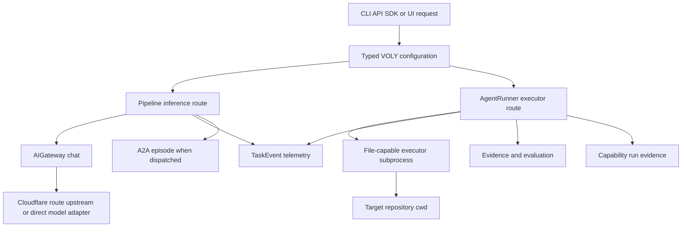

# VOLY control-plane architecture

VOLY is a self-hosted, project-agnostic control plane around AI engineering agents: the target repository is supplied as `cwd` rather than encoded into the package. Its central architectural rule is that **model inference and filesystem execution are different routes with different failure, cost, and state semantics**. They can be composed—for example, by hybrid A2A roles—but neither is a fallback implementation of the other.

```mermaid
flowchart TD
    Input["CLI API SDK or UI request"] --> Config["Typed VOLY configuration"]
    Config --> Inference["Pipeline inference route"]
    Config --> Execution["AgentRunner executor route"]
    Inference --> Gateway["AIGateway chat"]
    Gateway --> Model["Cloudflare route upstream or direct model adapter"]
    Execution --> Executor["File-capable executor subprocess"]
    Executor --> Target["Target repository cwd"]
    Inference --> Event["TaskEvent telemetry"]
    Execution --> Event
    Execution --> Evidence["Evidence and evaluation"]
    Inference --> Episode["A2A episode when dispatched"]
    Execution --> Capability["Capability run evidence"]
```

This diagram shows the two execution boundaries and the record families produced around them.

## The execution boundary

| Route | Owner | What it does | What it must not be confused with |
|---|---|---|---|
| **Inference** | `Pipeline.run()` and its stage mixins | Routes a text task, retrieves memory, applies RTK/skill/headroom context work, optionally dispatches A2A, selects an inference runtime, and emits terminal telemetry. | It does not grant a model call write access to a target project. |
| **File execution** | `AgentRunner.run()` | Invokes a named file-capable executor with `cwd`, captures repository changes, applies safety policy, and emits executor-oriented records. | It is not an `AIGateway.chat()` call and does not use the gateway's model fallback chain. |

`Pipeline.run()` creates a task id, performs route analysis, and may auto-dispatch a complex non-nested task into A2A before ordinary inference. Otherwise it performs spend pre-check, context stages, and calls `InferenceManager`, which is constructed with the shared gateway. A pipeline exception becomes a failed `TaskEvent` and `PipelineResult`, rather than escaping without terminal telemetry.

The runner receives an explicit `cwd` and runs the executor there. It takes before/after repository snapshots to build a `WorkReport`; the executor safety policy can make a dry run roll back changes, roll back protected paths, or hard-fail when no permissible changes remain. This repository mutation boundary is why executor roles sharing a project must remain serialized in orchestration.

Complex work may join the two routes through [pipeline and A2A orchestration](../orchestration/a2a-and-pipeline.md): planning/review roles stay on chat, while configured implementation roles with `cwd` may invoke `AgentRunner`. The resulting hybrid workflow preserves each route's own safety, fallback, cost, and evidence behavior.

## Model calls are gateway-mediated

`AIGateway.chat()` is the control boundary for chat-model traffic. When enabled, it:

1. scans serialized messages with DLP and returns a local `dlp_blocked` result without calling a provider;
2. builds a cache key containing messages, model, provider, system input, extra arguments, and per-call or project cache scope;
3. serves a cache hit or enforces rate and estimated-spend limits before the provider call;
4. uses the Cloudflare AI Gateway path for supported providers when Cloudflare is configured; otherwise it uses an external upstream or direct provider adapter;
5. treats unusable empty content as a model failure except for explicit token/tool termination reasons, marks provider health on relevant failures, and uses the configured **model** fallback behavior; and
6. records spend and gateway metrics only after a successful response, then caches that successful response.

An `ai_gateway.upstream` may delegate non-Cloudflare calls to one external gateway. If that upstream fails and `upstream_fallback_direct` is enabled, VOLY retries through the requested provider's direct adapter. This is model-provider routing; it never changes an inference call into a file executor. Conversely, disabling the gateway calls a direct adapter immediately, so gateway controls are not applied to that direct path.

The pipeline configures its lazy gateway from the `ai_gateway` section, including cache persistence, request budgets, DLP, rate/spend limits, fallback, BYOK, and upstream settings. It fingerprints the configured project state into the gateway cache scope when `default_cwd` is set, preventing a cache hit from being reused across a changed project or a different project.

## Executor fallback and accounting

The executor route has a separate billing/availability chain: `claude-code → cursor → deepseek → wrangler → opencode → zen`. `AgentRunner` enters that chain only when the current executor reports `billing_error` or `not_available`; it skips unavailable candidates and stops after an attempt that is neither condition. Model-level empty-content handling is explicitly not an executor billing signal.

Costs are deliberately retry-aware. The runner accumulates abandoned executor attempts into `retry_cost_usd` and includes both those costs and the final attempt in `TaskEvent.cost_usd`; token totals do the same. A configured evaluation judge's cost and tokens are added to the task total as well. Thus the event represents total task consumption without double counting the retry share.

Focused failure-path tests cover walking the entire executor chain, skipping unavailable executors without charging them, avoiding double-counting with an executor's internal retry loop, stopping an A2A chain at the gateway spend limit, and suppressing nested A2A auto-dispatch.

## Cross-cutting configuration and correlation

`VOLYConfig` is composed from typed sections. Architecture-relevant sections include `a2a`, `ai_gateway`, `executor_safety`, `telemetry`, `evidence`, `evaluation`, `plan`, `workflow_sdk`, `dspy`, and `capability`. Defaults make several higher-risk subsystems opt-in: evidence, evaluation, plans, DSPy, capability routing, and cloud analytics start disabled; executor safety starts enabled. This separation lets an operator enable measurement or policy without implying activation of a different execution route.

A correlation id is context-local. `ensure_correlation_id()` uses an explicit value, the current context value, or generates a UUID; incoming `X-Correlation-ID` and `X-Request-ID` are accepted, and outgoing remote-service headers use `X-Correlation-ID`. The runner establishes it at run start and writes the current value to its `TaskEvent`; the web application installs correlation middleware and a logging filter. Preserve that identifier across new API, worker, runner, and telemetry hops rather than inventing a parallel trace id.

For configuration, public entrypoints, authentication exposure, and safety operation details, see [entrypoints, configuration, and safety](../operations/entrypoints-and-safety.md).

## Public surfaces

The package exports `VOLYConfig`, `Pipeline`, `AgentRouter`, and the `Agent`/`Workflow` SDK facade plus graph factories. The installed `voly` executable is a Click command group. Optional `voly[ui]` dependencies enable the FastAPI app created by `voly.web.server:create_app`; it installs API route modules and can serve built static assets. These are delivery surfaces around the same control plane, not alternate runtime semantics.

## Durable records are distinct contracts

Do not flatten the following records into a single “run log.” They answer different questions, are versioned independently, and have different privacy and durability guarantees.

| Family | Purpose and principal shape | Durable location / exposure |
|---|---|---|
| **Telemetry: `TaskEvent`** | Versioned v4 terminal task summary: identity, status, correlation id, tokens, gateway flags, cost, executor/model information, error class, retry totals, work report, and A2A summary. | Full local JSON is written under `.voly/events/`. Remote Cloud Analytics is a separate v1 allowlist, sent only with explicit consent; it excludes prompts, results, free-form errors, paths, reports, artifacts, stage logs, and A2A assignments. |
| **In-flight: `RunRecord`** | Best-effort progress/heartbeat record, with current role, parent task, plan/workflow details, and stale detection data. It is not final telemetry. | `.voly/runs/`; atomic writes protect readers, and a watchdog may classify an old heartbeat as stale. |
| **Evidence and evaluation: `EvidenceRecord` / `EvalReport`** | Versioned local executor evidence: pre-run repository baseline, exact execution bundle, outcome/root-cause attribution, optional evaluation, and human feedback. | `.voly/evidence/` when evidence is enabled. This record distinguishes pre-existing or environmental failures from agent performance. |
| **Orchestration: `MultiAgentEpisode`** | Versioned A2A lineage: role traces, messages, tool calls, artifacts, decisions, metrics, costs, parent-trace links, and references to evidence. | Atomic JSON under `.voly/episodes/`. It links to evidence rather than replacing evidence or evaluation as their source of truth. |
| **Plans: `Plan` and `PlanStep`** | Durable DAG and acceptance-gate state. A step has a declared execution mode (`chat`, `executor`, or `business`) and only the plan engine's legal transitions are valid. | `.voly/plans/`; unlike best-effort run tracking, `PlanStore` raises I/O errors because gate state is authoritative. |
| **Capability evidence: `RunRecord` in `voly.capability.evidence`** | A compact executor/dimension outcome used to update local capability profiles and optionally post a remote profile-evidence payload. Billing and availability failures do not score the executor. | Capability profiles default to `.voly/capability/profiles/`; this is measured routing evidence, not `TaskEvent` telemetry or an `EvidenceRecord`. |

`tests/test_protocol_contracts.py` freezes the field set for `TaskEvent` v4 and the remote Cloud Analytics v1 allowlist. A schema change therefore requires a version bump, contract-test update, and matching documentation update—not merely a dataclass edit. The evidence, episode, and plan schemas have their own versions and should evolve on their own compatibility paths.

## Change guardrails

- Keep inference behind `AIGateway.chat()` when gateway controls are required; do not describe or implement a model fallback as executor fallback.
- Preserve `cwd` as the target-project boundary and retain executor safety snapshots and rollback semantics.
- Keep retry costs and tokens aggregated exactly once across executor attempts; verify with `tests/test_failure_paths.py` after changing chain behavior.
- Treat `TaskEvent` and Cloud Analytics payload shapes as public contracts. Keep sensitive local-only fields out of remote allowlists.
- Preserve correlation propagation through entrypoints and remote boundaries.
- When adding a durable record, state whether it is best-effort visibility, authoritative workflow state, evaluation evidence, or capability measurement; do not overload an existing record family.
