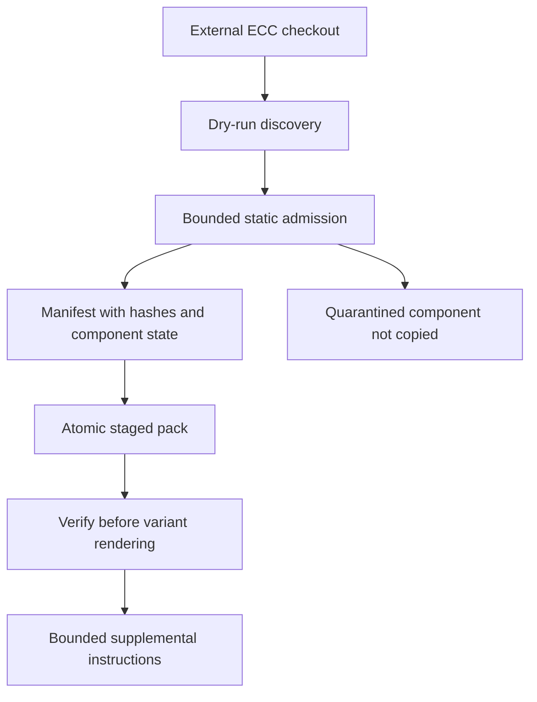
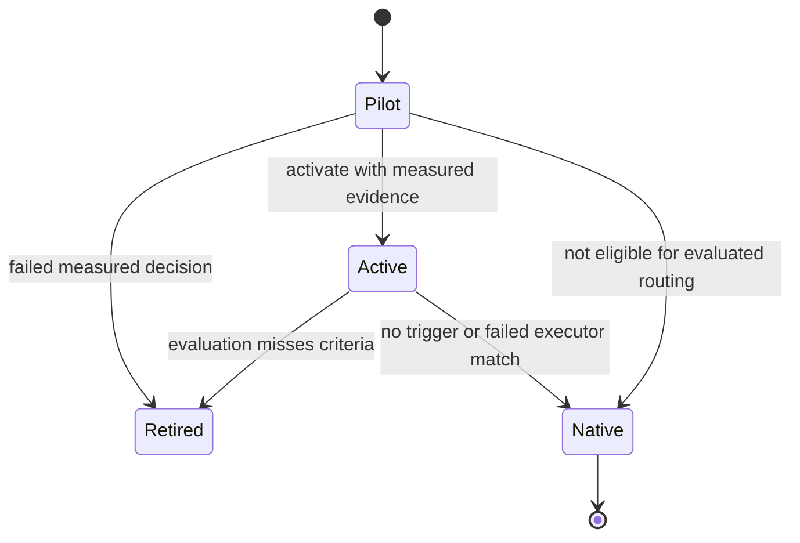

# Capability governance and evaluated packs

VOLY has two deliberately separate capability mechanisms:

- **Executor capability matching** ranks known executor or model-provider profiles for a requested dimension.
- **Evaluated capability packs** are a gated overlay that may select a task-specific variant before delegating executor/model selection back to that matcher.

The overlay is not a replacement routing plane. It remains opt-in at the CLI/config boundary, and every condition that does not qualify a pack produces an explicit native VOLY fallback. That separation lets the A2A and pipeline runtime use normal capability matching without treating every task as an experiment; see [A2A and pipeline orchestration](../orchestration/a2a-and-pipeline.md) and the [architecture overview](../architecture/overview.md).

## Base executor matching

`ExecutorMatcher.find_executors()` accepts a dimension, optional executor allow-list, profile kind, project features, tool requirements, timeout, Worker URL, and routing policy. For the default balanced policy it tries `POST /match` on the configured capability Worker. A successful response is rehydrated through the local registry and filtered by `kind`, preventing, for example, a remote `model_provider` result from being returned when an executor was requested. A timeout, HTTP/parse error, incompatible remote result, or non-balanced (`quality_first` or `budget_first`) policy falls through to local matching.

Local matching restricts the registry to the allow-list and kind, hard-excludes profiles that lack required file or browser tools, scores the remaining profiles for dimension/features/policy, and returns a ranked recommendation and fallbacks. If none remain, the result is marked degraded rather than inventing a recommendation. The Worker itself is a ranking service backed by its capability and operational records; it does not receive the full local request semantics such as project features or tool constraints.

Use `voly capability match TASK --dimension backend --kind executor` to inspect the ordinary route. The profile root defaults to `.voly/capability/profiles`, while the Worker URL and policy are drawn from capability configuration. [Cloudflare services](../integrations/cloudflare-services.md) covers the hosted service boundary.

## Untrusted external packs: discover first, stage second

External content is data, not an extension that becomes runnable merely by being found. `voly capability import ecc --source … --dry-run` is the discovery entrypoint and rejects operation without `--dry-run`. It inventories only the supported ECC layout—agents, skills, rules, hooks, MCP configuration, and legacy command shims—along with best-effort package/Git provenance. Discovery resolves every candidate and rejects an escaping path; it does not import modules, execute hooks, start MCP servers, or copy source files.

Admission then reads each discovered component as bounded text (maximum 512,000 bytes), performs static risk-pattern scanning, records inferred permissions, and validates the JSON shape of MCP configurations. High or critical findings—including unreadable/oversize content or invalid MCP configuration—quarantine the implicated component. The report is a security decision and inventory, not approval to run its commands. In particular, hooks and MCP declarations remain inert.

`voly capability pack install ecc --source …` repeats discovery and admission, builds a versioned manifest, and atomically replaces a temporary installation directory with a new pack directory below `.voly/capability/packs/` (or `pack --store`). A pre-existing pack ID is refused rather than overwritten. Each non-quarantined component has a `content/...` staged path and SHA-256; quarantined components have no staged path. The manifest records provenance, admission summary, component state, and compatibility aliases for recognized legacy/deprecated skill references, and `manifest.sha256` protects the serialized manifest.

This flow shows the inert external-pack trust boundary from discovery through verified instruction rendering.

`voly capability pack verify PACK_ID` recalculates the manifest checksum and every staged component hash, and rejects missing, modified, or unexpected files. It also constrains pack and staged paths to their roots. `render_variant_task()` repeats verification, accepts only manifest entries that are both staged and named in the pack's `instruction_sources`, strips leading frontmatter, caps total injected text at 16,000 characters by default, and labels it supplemental guidance. System, project, safety, and user instructions still take priority, and text that contains a command is not an instruction to execute it. Thus staging alone does not activate a variant, and a tampered pack cannot be rendered.

## Evaluated-pack state and routing

`voly capability evaluated init` initializes three built-in pilot definitions (`security-reviewer`, `tdd-workflow`, and `python-reviewer`) in the configured evaluated directory. Definitions carry role, capability dimension, triggers, typed input/output contract names, success criteria, source-pack identity, and declared instruction sources. Pack state is `pilot`, `active`, or `retired`; definitions live in `packs.json` and run evidence is append-only `evidence.jsonl`.

A recorded `CapabilityRunEvidence` compares a baseline and variant for one capability/executor pair. It records completion, test outcome, rollback, corrections, reviewer acceptance, paired scores, latency, retries, optional cost/tokens, and whether the sample is held out. If `changed_capabilities` is supplied, it must name exactly the one capability under test; this preserves the interpretation of the paired delta. Unmeasured cost and token fields are counted separately, rather than being mistaken for zero-cost or zero-token evidence.

The router considers only active packs with evidence whose role matches the requested role (or an `auto`/empty request) and whose trigger has a word-boundary hit in the lower-cased task. It deterministically chooses the pack with the most hits, then calls the ordinary executor matcher using that pack's dimension. No candidate produces `native_voly_no_capability`; a degraded/no-result executor match produces `native_voly_match_degraded`. Both are explicit native fallback routes, rather than implicit selection of an unmeasured variant.

This state view distinguishes stored pack state from the per-request native-fallback outcome.

## Evidence, held-out samples, and production decisions

`evaluated activate` checks only that measured evidence exists; it is useful for controlled routing but is not the production gate. `evaluated activate-ready --yes` recomputes the production decisions for an executor and activates only packs whose decision is `activate`.

The production decision (`decide_capability`) defaults to **six** measured samples and at least **two held-out** samples. After those minima it requires positive paired value plus the definition's success criteria: completion and test-pass rates, reviewer acceptance, rollback/correction limits, and latency overhead; measured token overhead is also checked when token samples exist. Any failure retires the hypothesis; passing produces `activate`. Before the required sample count, evidence remains `keep-pilot`, except a value hypothesis can retire early at three samples only when it already has the required held-out evidence and its paired delta is below the threshold.

The bundled `benchmark_suite_v1.json` is deliberately not such evidence. Loading requires exactly 20 uniquely identified tasks and a held-out split. `evaluated benchmark` creates a temporary synthetic-active store, makes no model calls, does not persist the probe, and reports `activation_allowed: false` even if every expected route matches. Routing probes, task telemetry, and A2A episodes therefore cannot be promoted into activation evidence by themselves.

`evaluated activation-plan` combines per-pack decisions with remote receipt status. Local readiness needs at least one `activate` decision; Cloudflare deployment readiness additionally needs no incomplete pilots and a current verified remote receipt. This is an operational assessment, not a command that deploys or changes runtime routing.

## Remote snapshot publication is audit, not enforcement

`voly capability evaluated sync` is available only after the CLI's decision check finds at least one activation candidate and no incomplete pilot. It builds a deterministic, bounded snapshot for one executor: at most 32 definitions/states/decisions/metrics, with at most 64 provenance hashes per pack. The payload excludes raw prompts and individual evidence records. Canonical JSON and normalized integral floats are SHA-256 hashed into `snapshot_id`; staged instruction hashes are included when their manifest entries are staged.

The client sends authenticated `POST /evaluated/snapshots` using `VOLY_CAPABILITY_SYNC_TOKEN`, requires the returned ID to match, then performs authenticated `GET /evaluated/snapshots/:id`. It writes `remote-sync-receipt.json` only if the returned payload hash and snapshot content exactly match the locally built content. Receipt currency is invalidated when `packs.json` or `evidence.jsonl` changes.

The Worker independently authenticates the Bearer token, validates schema, limits, states, and SHA-256 fields, recomputes the canonical payload hash, and stores an idempotent snapshot plus per-pack state in D1. Its read endpoint returns the persisted canonical snapshot for client verification. This remote store is a publication/audit surface: a successful upload, verified receipt, or a Worker state row is **not** permission for `/match` or any runtime to enforce evaluated-pack routing. Preserve this boundary when changing either API.

## Operating and changing safely

- Use `import … --dry-run` to assess an external checkout; use `pack install`, `pack verify`, and explicit `pack remove --yes` to manage staged files.
- Treat a quarantine report as a component-level non-staging decision, not a cue to bypass review or execute source content.
- Use `evaluated record` for real paired outcomes and label held-out samples. Do not use the offline benchmark as activation proof.
- Use `activation-plan` before `activate-ready --yes`; direct `activate` has intentionally weaker evidence requirements.
- Set the Worker URL through capability configuration and provide `VOLY_CAPABILITY_SYNC_TOKEN` only to the sync operation. Re-sync after evaluated definitions or evidence changes.
- Keep Python and Worker canonical serialization in lockstep, and retain upload-plus-exact-readback verification.

Focused regression coverage lives in `tests/test_capability_matcher.py`, `tests/test_capability_pack_import.py`, `tests/test_capability_pack_store.py`, `tests/test_evaluated_capability_packs.py`, `tests/test_capability_production_validation.py`, and `tests/test_capability_remote_sync.py`. These tests exercise the boundaries that matter: remote-to-local matcher fallback and kind filtering; inert discovery and quarantine; atomic staging and tamper detection; explicit native fallback; held-out activation/early-retirement distinctions; and receipt refusal on tampered read-back.
