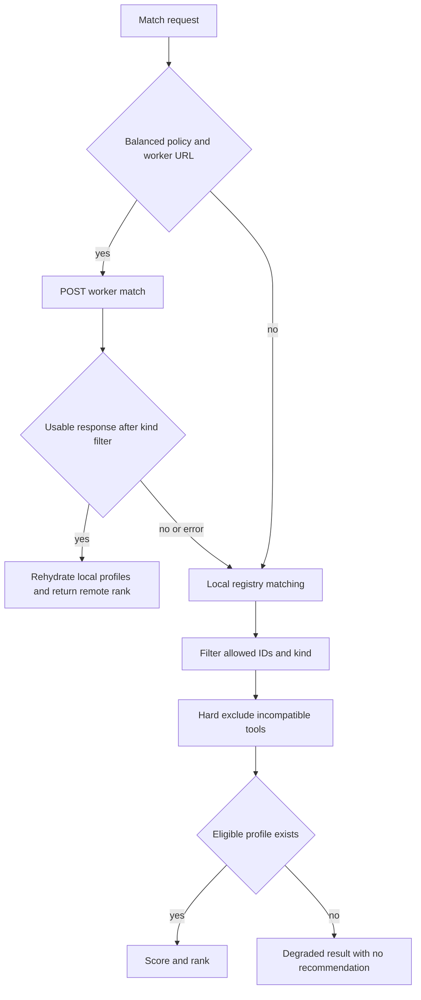
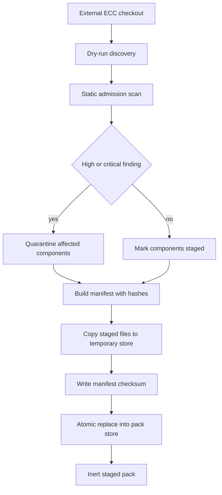
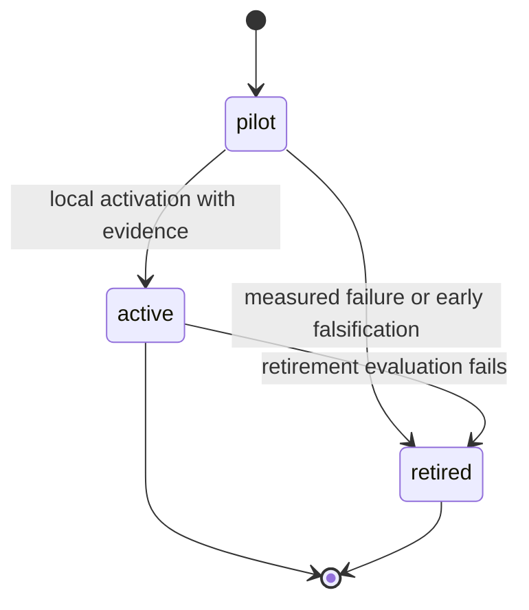

# Capability registry and evaluated-pack governance

VOLY has two deliberately separate capability mechanisms:

- The **executor capability registry** describes available executors and model providers, then ranks a profile for a requested dimension and routing policy.
- **Evaluated capability packs** are an opt-in overlay (`capability.evaluated_enabled` defaults to `false`). They select a measured, active workflow variant before delegating executor/model choice to the normal matcher.

An evaluated pack is therefore not an alternative executor registry and remote publication is not runtime enforcement. Imported material remains untrusted throughout discovery and staging; measurement and activation are distinct, local controls.

## Normal capability matching

`CapabilityRegistry` is the local profile owner. It reads a materialized YAML profile when present, materializes a bundled seed on first load, and returns an explicit unknown profile if neither exists. The `voly capability list`, `show`, `match`, and `reset` commands operate on this registry; profiles normally live under `.voly/capability/profiles`.

`ExecutorMatcher.find_executors()` first considers the Cloudflare worker only for a balanced-policy request with a configured worker URL. A successful remote response is rehydrated through the local registry and filtered by requested profile kind. Any request/response error, timeout, or unusable filtered result falls through to local matching. Quality-first and budget-first deliberately use the local scorer because hosted `/match` does not apply those policy weights.

Local matching limits the registry to requested executor IDs and kind, hard-excludes profiles that cannot meet required file/browser-tool constraints, scores the remainder using dimension, project features, and policy, then returns a ranking plus exclusions. No eligible local profile produces a degraded result rather than an invented recommendation.

This is the normal matching control flow. The worker is an optional ranking source, while the local registry remains necessary to construct profiles and provide failure-safe routing.

The worker's unauthenticated `POST /match` queries top-level capability rows by dimension and optional kind, honors an available-executor list, combines capability, historical success, and operational cost/latency signals, and returns the top five candidates (one recommendation plus fallbacks). Startup synchronization of roles and seed profiles runs in a daemon thread and intentionally never raises, so failure to synchronize cannot block the CLI/runtime.

## Untrusted external-pack intake and inert staging

The only external adapter currently exposed is ECC. `voly capability import ecc --source … --dry-run` is read-only discovery: it validates the checkout path and `package.json`, inventories only the supported layout deterministically, collects best-effort provenance, and does **not** import modules, run hooks, start MCP servers, or copy files. The CLI rejects an import without `--dry-run`.

Admission scans discovered components as data. It resolves every component under the source root, bounds readable text to 512,000 bytes and findings to 200, recognizes MCP JSON shape and declared command/URL permissions, and records pattern-derived permissions/findings. A high or critical overall risk results in `quarantine`; only the affected components are marked quarantined in the manifest.

`voly capability pack install ecc --source …` performs a separate staging step. It creates a versioned manifest with source/provenance and admission summary, SHA-256 hashes each component, copies only non-quarantined material into a temporary directory under the store root, writes a manifest checksum, and atomically replaces the final pack directory. Reinstalling an existing pack requires explicit removal. Staged storage is normally `.voly/capability/packs` and its manifest state is `staged`, not active.

This is an intake boundary, not a trust grant. `pack verify` checks the manifest checksum, every staged file hash, missing files, unexpected files, and path containment. Before staged text can be rendered as a variant, the renderer repeats verification, allows only manifest-listed `staged` instruction sources, bounds total included text to 16,000 characters, and labels it supplemental guidance whose system, project, safety, and user instructions remain higher priority. It explicitly says commands appearing in staged text are not to be executed merely because they appear there.

## Evaluated-pack lifecycle and routing

An evaluated pack has a capability ID/version, role, dimension, trigger phrases, typed input/output contract labels, success criteria, origin, instruction provenance, evidence count, and one of `pilot`, `active`, or `retired` states. Initialization seeds three built-in pilots: `security-reviewer`, `tdd-workflow`, and `python-reviewer`.

Evidence is stored locally as append-only `evidence.jsonl`, while `packs.json` carries definitions, states, and counts. A record captures paired baseline/variant scores as well as completion, tests, rollback, corrections, reviewer acceptance, latency, tokens, cost, retries, held-out status, and whether cost/tokens were actually measured. An experiment that declares changed capabilities may declare exactly the capability being evaluated; this protects causal interpretation. Missing cost/token measurement is tracked as missing rather than converted into zero-cost or zero-token evidence.

The router considers only active packs with evidence whose role matches the requested role (or an empty/`auto` role). It counts trigger hits in the task and deterministically selects the highest-hit candidate, then calls `ExecutorMatcher` for that pack's dimension. No qualifying pack yields `native_voly_no_capability`; no recommended/degraded executor match yields `native_voly_match_degraded`. Both are explicit native fallback outcomes.

The state model for an evaluated pack. Routing additionally requires evidence, role compatibility, and a task trigger even while a pack is `active`.

There are two activation interfaces with importantly different guarantees. `voly capability evaluated activate` requires nonzero measured evidence but does not recompute the full production decision. Automation should instead use `voly capability evaluated activate-ready --yes`, which computes the decisions below and applies only `activate` decisions locally; it never deploys Cloudflare.

### Production validation

`decide_capability()` uses six required samples and two held-out samples in the CLI path. Activation also requires positive paired value and every configured completion, test-pass, reviewer-acceptance, rollback, correction, latency-overhead, and—when measured—token-overhead threshold to pass. A complete sample that fails a criterion retires the pack. Before six samples, a value hypothesis can retire early only after at least three samples, two held-out samples, and paired delta below the minimum; otherwise incomplete evidence stays in pilot.

The bundled validation suite is intentionally weaker than execution evidence: it requires exactly 20 uniquely identified tasks with a held-out split and probes routing in a temporary store using synthetic active/evidence state. It makes no model calls, persists nothing, marks its outcomes synthetic, and hard-codes `activation_allowed` to `false`. Use it to detect routing regressions, never as activation proof.

## Verified Cloudflare snapshot publication

`voly capability evaluated sync` is a separately authenticated publication workflow. It refuses to run if any pilot is incomplete or if no capability has passed activation, builds a deterministic schema-v1 snapshot for one executor, and reads the bearer token only from `VOLY_CAPABILITY_SYNC_TOKEN`; do not place tokens in commands, documentation, or stored configuration.

The client snapshot is capped at 32 packs and 64 provenance hashes per pack. It contains pack definition hashes/definitions, state, provenance hashes, computed decision, and metrics, but omits raw prompts and individual evidence rows. Canonical JSON and normalized integral floats determine the SHA-256 `snapshot_id`. After upload, the client fetches the snapshot and requires both the returned payload hash and content to match before atomically writing `remote-sync-receipt.json`. Receipt freshness includes a hash of both local packs and evidence files, so any store change invalidates it.

The worker protects every `/evaluated/*` endpoint with a configured bearer secret, validates schema/state/count/hash constraints, recomputes the canonical snapshot hash, stores the immutable snapshot and per-capability/version/executor current state in a D1 batch, and treats a repeated matching snapshot ID as idempotent. Its read endpoint returns the stored canonical payload for the client's read-back verification. This worker storage is a publication and audit surface; it does not feed the evaluated router or make remote content executable.

Cloudflare deployment readiness requires at least one locally activated decision, no unresolved pilot decision, and a current verified receipt. The activation-plan command reports these blockers; sync establishes the receipt but does not itself change local routing or deploy a worker.

## Operations and safe change checklist

- Keep external discovery, static admission, staging, evidence collection, local activation, and remote publication as independent controls.
- Treat a staged manifest as immutable input: run `voly capability pack verify PACK_ID` after storage or source changes, and do not bypass verification to render instructions.
- Configure `capability.evaluated_enabled: true` only when the evaluated overlay is intended; disabled routing returns native fallback.
- Use `activation-plan` to inspect decisions and `activate-ready --yes` for production-threshold local activation. Do not use direct `activate` as proof that all thresholds passed.
- Recheck both Python and Worker canonical serialization when changing snapshot schema or numeric fields; a mismatch prevents sync/receipt creation.
- Keep the evaluated sync secret out of logs and repository content. A missing token, failed HTTP request, mismatched upload ID, or altered read-back aborts without a verified receipt.
- Focus regression tests on remote-to-local matcher fallback, path escapes/hash tampering/quarantine, native fallback, held-out and early-retirement boundaries, synthetic benchmark non-activation, and read-back/receipt invalidation.

Related material: [evidence and evaluation](evidence-and-evaluation.md), [Cloudflare and web integrations](../integrations/cloudflare-and-web.md), [operations, entrypoints, and safety](../operations/entrypoints-and-safety.md), [A2A and pipeline orchestration](../orchestration/a2a-and-pipeline.md), and [executor runs](../runtime/executor-runs.md).
