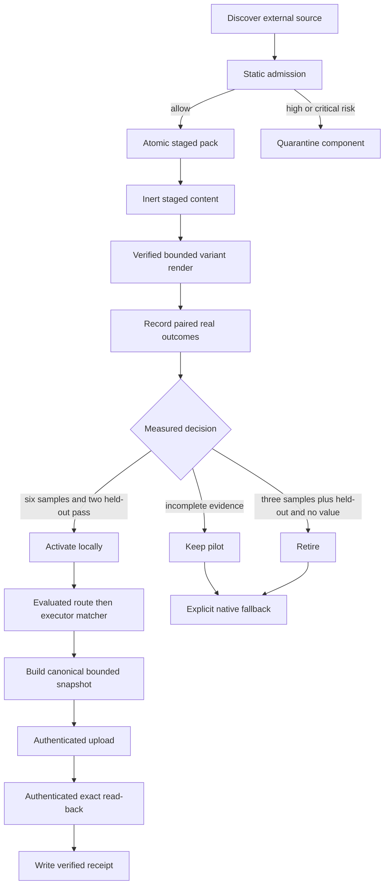

# Capability governance and evaluated packs

VOLY has two deliberately separate layers. The **capability registry** ranks executor and model-provider profiles for ordinary routing. The optional **evaluated-pack overlay** selects a narrowly scoped, evidence-bearing capability before delegating executor choice back to that same matcher. It is not a mechanism for automatically trusting imported instructions or replacing the native workflow. This boundary matters to [the architecture overview](../architecture/overview.md) and to A2A role assignment described in [pipeline and A2A orchestration](../orchestration/a2a-and-pipeline.md).

## Ordinary capability matching

A profile is either an `executor` (for developer, tester, and devops work) or a `model_provider` (for architect, reviewer, and security work). `ExecutorMatcher.find_executors()` can ask the capability Worker for a balanced-policy match, then loads the corresponding local profiles. A requested `kind` filters the Worker result, avoiding a model-provider recommendation for an executor role. Errors, timeouts, unreachable service, an unusable remote result, and non-balanced policies fall through to local matching—not an execution failure.

Local matching limits candidates to `available_executors` when supplied, applies file/browser-tool hard exclusions, scores eligible profiles, and returns the best recommendation plus ordered fallbacks. The score combines capability (40%), historical success (20%), tool compatibility (15%), project-stack match (10%), and availability, cost efficiency, and latency (5% each) under the balanced policy. A local match with no eligible profile is marked degraded.

This is opt-in and best effort at its SDK/Plan integration boundary: `capability.enabled` defaults to false, explicit model, tier, or executor choices are not overridden, and an error or no match leaves the caller's normal static resolution in place. Consequently, capability routing must not become the reason a chat request or executor run fails. Configuration can set `worker_url`, routing policy, profile directory, and timeout; see [operations, entrypoints, and safety](../operations/entrypoints-and-safety.md) for the surrounding controls.

## Lifecycle and trust boundaries



This lifecycle keeps imported content inert until governance has admitted, staged, measured, and explicitly activated it; remote synchronization publishes control-plane state rather than enabling runtime instructions.

## External-pack intake and staging

`voly capability import ecc --source … --dry-run` is read-only discovery. The ECC adapter inventories supported agents, skills, rules, hook manifests, MCP configurations, and legacy command shims while treating every source file as untrusted data. It does not import source modules, execute hooks or commands, start MCP servers, or copy content. Resolved component paths must remain inside the selected source root; source provenance is best-effort metadata rather than a trust assertion.

Admission scans the discovered files without execution. It bounds each component to 512 KB, records normalized findings and inferred permissions, validates MCP JSON/mapping shape, and rejects source-root escapes. High or critical findings—including unreadable or oversized content and invalid MCP configuration—make the admission decision `quarantine`; lower-risk content may be allowed. Findings are review evidence, not proof that the content is malicious.

`voly capability pack install ecc --source …` creates an immutable staged store at `.voly/capability/packs/<pack-id>/`. Installation builds in a temporary sibling directory and atomically replaces it at the destination; it refuses to overwrite an existing pack. Allowed components are copied under `content/`, while quarantined ones remain represented by provenance and hashes in the manifest without being copied. Installation itself injects or executes no agent, skill, rule, hook, command, or MCP server.

Before a staged pack can supply variant text, `PackStore.verify()` checks the manifest checksum, every staged component hash, missing files, unexpected files, and path containment. `render_variant_task()` then accepts only declared instruction sources whose manifest status is `staged`, strips optional frontmatter, bounds the combined instruction text to 16,000 characters by default, and records SHA-256 provenance. The rendered text explicitly remains supplemental guidance: system, project, safety, and user instructions take precedence, and commands in the text are not instructions to execute.

## Evaluated packs: evidence before routing

The built-in pilots are `security-reviewer`, `tdd-workflow`, and `python-reviewer`. Each defines a role, capability dimension, task triggers, typed `CapabilityInput.v1`/`CapabilityOutput.v1` contracts, success criteria, state, source pack, and declared instruction sources. Their state lives locally under the configured `evaluated_dir` (default `.voly/capability/evaluated`) as `packs.json` plus append-only `evidence.jsonl`.

An evaluated route considers only an `active` pack with `evidence_count > 0`, a compatible role (or `auto`/empty role), and at least one task-trigger hit. It chooses the greatest trigger-hit count, breaking ties by capability ID, then asks the ordinary matcher for an executor in that pack's dimension. No eligible capability, a missing recommendation, or a degraded match produces an explicit `native_fallback`; disabling `capability.evaluated_enabled` produces the same safe result at the CLI entrypoint. Thus the operational chain is:

```text
task → role → active measured capability → ExecutorMatcher → executor → model
```

`voly capability evaluated record outcome.json` records paired baseline/variant evidence for one capability and executor. A record contains completion, tests, rollback, corrections, reviewer acceptance, baseline and variant quality scores, latency, retries, cost and measurement availability, token counts and measurement availability, and whether the outcome is held out. Records that declare changes to more than one capability are rejected, preserving attribution. Unavailable cost or token data is tracked as unmeasured rather than silently turned into zero evidence.

### Production decision, activation, and retirement

The production decision requires six measured pairs and at least two held-out pairs. To activate, the aggregate must have positive paired quality value and pass completion, test-pass, rollback, correction, reviewer-acceptance, latency, and—when token usage is measured—token-overhead criteria. The default efficiency ceilings are 30 seconds average latency overhead and 100,000 average tokens overhead. If samples or held-out coverage are incomplete, the decision remains `keep-pilot`.

A falsified value hypothesis may retire early, but cannot activate early: it needs at least three samples, two held-out outcomes, and paired value below the pack threshold. With a complete sample, failure of value, outcome, or efficiency criteria retires the pack. `activate-ready --yes` recomputes these decisions and only activates packs whose result is `activate`; the lower-level `evaluated activate` command only verifies that some measured evidence exists, so it is not equivalent to the production gate.

The bundled `voly capability evaluated benchmark` is intentionally not value validation. It runs exactly 20 routing probes using a temporary synthetic activation, makes no model calls, persists no evaluated state, and reports `synthetic_outcomes: true` and `activation_allowed: false`. It can establish routing behavior but cannot activate a pack.

An alternative evaluated variant can render one compact learned instinct rather than staged-pack text. This path requires a manually approved instinct with positive evidence, no unresolved contradictions, a nonempty action of at most 1,200 characters, and records the instinct ID plus an action hash. It does not generalize into unrestricted learning injection, and it still needs the same paired production gate for activation.

## Verified remote snapshot publication

`voly capability evaluated sync` is a guarded publication operation. The command first rejects incomplete pilots and the absence of any locally activatable capability. It builds a deterministic v1 snapshot of up to 32 pack definitions and states, computed decisions and metrics, plus up to 64 SHA-256 provenance hashes per pack. The snapshot deliberately excludes raw instruction bodies, prompts, individual evidence records, run IDs, and timestamps; canonical content hashing yields its `snapshot_id`.

The client requires `VOLY_CAPABILITY_SYNC_TOKEN`, uploads the canonical snapshot to `POST /evaluated/snapshots` with bearer authentication, then fetches `GET /evaluated/snapshots/:id` using the same authentication. It writes the local receipt only if the returned payload hash and complete snapshot content exactly match. Receipt freshness is tied to hashes of local pack and evidence files, so a subsequent local change invalidates it.

The Worker independently authenticates the bearer secret, validates schema/version/state/hash limits, recomputes the canonical SHA-256 ID, and stores the immutable snapshot and current pack-state upserts in one D1 batch. Repeating the same content ID is idempotent. This API is a publication/audit surface: the Worker does not inject instructions or alter `/match` behavior as part of this phase.

A Cloudflare deployment plan is ready only when at least one capability passes local measured validation, no pack remains `keep-pilot`, and a current verified receipt exists. Configuration and deployment review are still explicit human/operational gates. A successful sync or Worker dry run must therefore not be interpreted as authorization to change runtime routing.

## Operator sequence and focused verification

```bash
# Discover without importing or executing external content.
voly capability import ecc --source /path/to/ECC --dry-run

# Stage admitted material, inspect integrity, then initialize pilots.
voly capability pack install ecc --source /path/to/ECC
voly capability pack verify ecc-universal
voly capability evaluated init

# Record real paired outcomes and make reproducible decisions.
voly capability evaluated record outcome.json
voly capability evaluated activation-plan --executor claude-code
voly capability evaluated activate-ready --executor claude-code --yes

# Publish only resolved, locally valid state and verify it remotely.
VOLY_CAPABILITY_SYNC_TOKEN=... voly capability evaluated sync --executor claude-code
```

The focused tests in `tests/test_capability_matcher.py`, `tests/test_capability_pack_import.py`, `tests/test_capability_pack_store.py`, `tests/test_evaluated_capability_packs.py`, `tests/test_capability_production_validation.py`, and `tests/test_capability_remote_sync.py` cover the important boundaries: remote-to-local matching fallback, inert import/admission, atomic integrity verification, native evaluated fallback, held-out activation/early retirement, synthetic benchmark limits, and receipt creation only after exact read-back. Run the relevant subset with `python -m pytest tests/test_capability_*.py tests/test_evaluated_capability_packs.py -q`.
