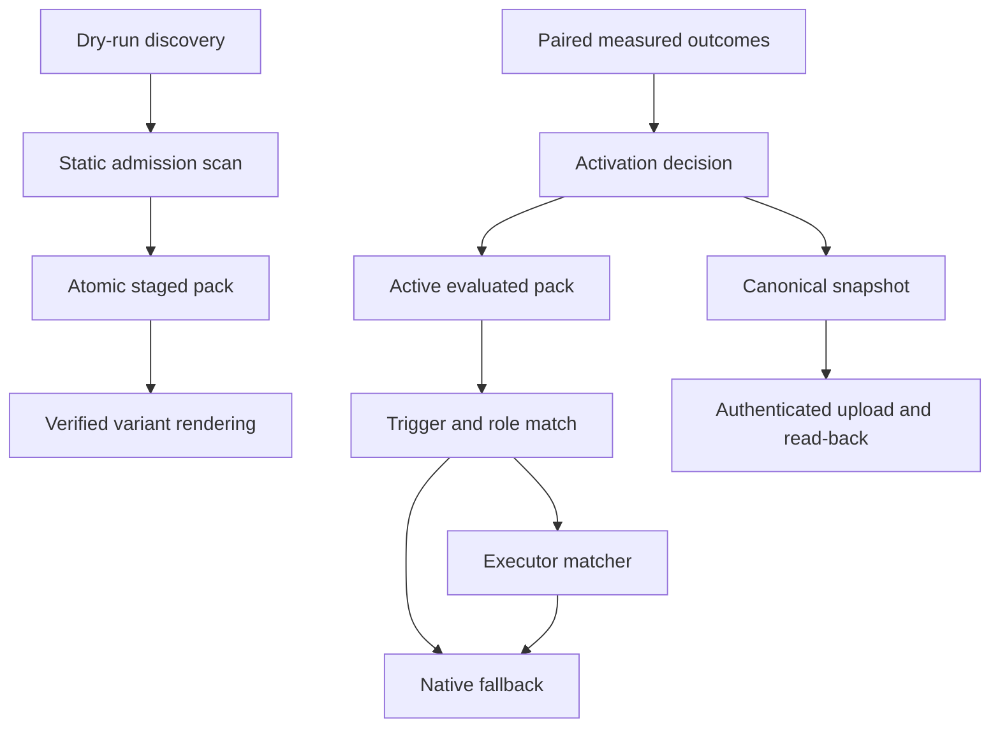
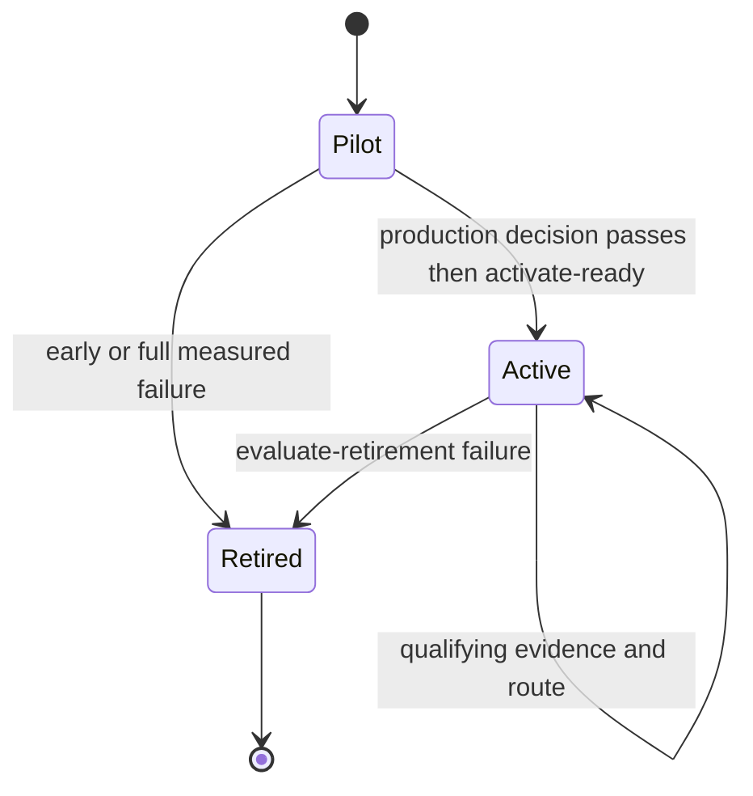

# Capability governance and evaluated packs

VOLY has two deliberately separate capability mechanisms:

- **Executor capability matching** ranks executor or model-provider profiles for a requested dimension. It is an availability and routing aid, including the billing/availability fallback chain.
- **Evaluated capability packs** are optional task-workflow variants. They may select an active, measured capability first, then use the existing executor matcher; they do not replace native routing.

This page keeps five trust boundaries distinct: discovery, admission and staging, measured activation, runtime matching, and remote publication. In particular, importing or publishing a pack is not authority to execute its hooks, instructions, or remote state. The broader runtime is described in [architecture overview](../architecture/overview.md); role and pipeline consumers are described in [A2A and pipeline orchestration](../orchestration/a2a-and-pipeline.md).

## Boundaries and control flow



This flow shows the independent gates from untrusted source content to a route and to the publication audit surface. Publication does not feed back into runtime route enforcement.

| Boundary | Owner and entrypoint | What crosses it | What it does **not** establish |
|---|---|---|---|
| Discovery | `voly capability import ecc --source … --dry-run` | A deterministic inventory and best-effort provenance | Installation, loading, command execution, or MCP-server startup |
| Admission and staging | `voly capability pack install ecc --source …` | Scanned, manifest-described files below `.voly/capability/packs/` | Activation or permission to render arbitrary source files |
| Measurement and activation | `voly capability evaluated record`, `activation-plan`, and `activate-ready --yes` | Local evidence and an activation decision | That a routing benchmark or a single record proves production value |
| Runtime matching | `voly capability match` and `voly capability evaluated route` | A ranked profile or an explicit native fallback | A remote Worker result for non-balanced policy, or activation of an unqualified pack |
| Publication | `voly capability evaluated sync` | An authenticated, bounded snapshot plus verified receipt | Remote instruction activation or `/match` enforcement of evaluated-pack state |

## 1. Executor/profile matching and operational fallback

`ExecutorMatcher.find_executors()` accepts a dimension, optional available-executor set, project features, profile kind, tool requirements, Worker URL, timeout, and routing policy. For the default `balanced` policy it can POST to the capability Worker’s `/match`; transport, status, decoding, profile-loading, or kind-filter failures fall through to local matching. `quality_first` and `budget_first` use the local scorer because the hosted endpoint does not apply those policy weights. Remote candidates are reloaded from the local registry and filtered by requested `kind`, preventing, for example, a model-provider recommendation from being used where an executor was requested.

The local matcher limits candidates to the allowed IDs and kind, hard-excludes profiles that lack required file or browser tools, scores the rest for the requested dimension/features/policy, and returns a recommended profile, ranked fallbacks, exclusions, and a `degraded` result when no eligible profile remains.

The normal task runner uses a related but narrower protection for billing or availability failures. With `capability.enabled` off, or before materialized profiles exist, it keeps the static billing fallback chain. When enabled, it scores materialized profiles only; a missing scoreable profile or top score below `0.30` logs a degraded warning and returns the static chain unchanged. Otherwise, scored executors lead the chain and any omitted static executors remain appended as a safety net.

### Configuration

The `capability` configuration block defaults to disabled and separates base capability routing from evaluated routing:

```yaml
capability:
  enabled: false
  worker_url: "${VOLY_CAPABILITY_WORKER_URL}"
  evaluated_enabled: false
  evaluated_dir: .voly/capability/evaluated
  profiles_dir: ".voly/capability/profiles"
  worker_timeout_s: 5.0
  routing_policy: balanced   # balanced | quality_first | budget_first
```

`VOLY_CAPABILITY_WORKER_URL` overrides the configured Worker URL; `VOLY_CAPABILITY_ENABLED` can enable or disable base capability fallback. `evaluated_enabled` separately controls the evaluated-route CLI: when false, it returns `native_fallback: true` with `evaluated_capabilities_disabled` rather than attempting evaluated routing.

## 2. Untrusted external packs: discovery, admission, and staging

### Discovery is intentionally inert

The ECC adapter recognizes a constrained layout—agents, skills, rules, JSON hooks, MCP configurations, and legacy command shims—and produces a sorted report with source path, optional Git/package provenance, component kinds, and warnings. It resolves the source and every discovered file beneath the source root, bounds `package.json` at 1 MB, and treats the checkout as data. The CLI requires `--dry-run`, so discovery never imports Python, copies files, executes hooks or commands, or starts MCP servers.

### Admission is static risk analysis

`admit_external_pack()` resolves each discovered component beneath the source root and reads at most 512,000 bytes per component. It scans applicable security patterns, collects inferred permissions, bounds findings at 200, and validates MCP JSON and its server mapping shape. An MCP `command` or `url` is recorded as subprocess or network permission information; it is not run. High or critical findings—including unreadable/oversized content, invalid MCP content, prompt-control/secret-exfiltration patterns, or destructive hooks—produce `quarantine`; low and medium findings produce `allow`.

### Staging is immutable-by-verification, not activation

`PackStore.install_ecc()` performs discovery and admission, builds a manifest, copies only manifest-selected staged components to a temporary directory, writes `manifest.json` and its SHA-256 checksum, then atomically replaces the final pack directory. Existing pack IDs require explicit removal rather than replacement. `verify` checks the manifest checksum, every staged component hash, and rejects missing, modified, unexpected, or root-escaping files.

An evaluated variant can only read instruction sources listed as `staged` in a verified manifest. `render_variant_task()` bounds supplemental text to 16,000 characters by default, removes frontmatter from staged text, returns hashes for the actual sources, and labels the material as supplemental guidance: system, project, safety, and user instructions retain priority, and commands in the text are not to be executed merely because they appear there. A failed verification or an unadmitted instruction path raises an error rather than rendering it.

## 3. Evidence-gated evaluated-pack lifecycle

An evaluated pack has `pilot`, `active`, or `retired` state, typed input/output contracts, a role, dimension, trigger phrases, and success criteria. Initialisation creates three built-in pilots: `security-reviewer`, `tdd-workflow`, and `python-reviewer`. Their definitions and state are kept locally in `packs.json`; run evidence is append-only `evidence.jsonl` in `capability.evaluated_dir`.

A record is a paired baseline/variant outcome for one capability and executor. It contains completion, test result, rollback, corrections, reviewer acceptance, baseline and variant scores, latency, retries, optional cost/tokens, and whether it is held out. Recording rejects an experiment that declares changes to more than one capability. Metrics remain scoped to the capability/executor pair; unmeasured cost or token fields are excluded from their respective sample counts, rather than treated as zero-cost or zero-token observations.



This is the local evaluated-pack lifecycle; an `active` state still has to pass runtime role, trigger, and executor matching.

### Activation and retirement rules

`decide_capability()` uses six required measured samples and two held-out samples for the production decision. It requires a positive paired-value delta and the configured completion, test-pass, reviewer-acceptance, rollback, correction, latency-overhead, and (when measured) token-overhead conditions. A qualifying decision is `activate`; complete evidence that fails any criterion is `retire`; insufficient samples or held-out evidence stays `keep-pilot`.

There is a narrow early-falsification path: after three samples, while still below the production sample count, a pack retires only when it already has two held-out outcomes and its paired delta misses the threshold. This is not an activation shortcut. `evaluate-retirement` applies analogous measured failure checks and only changes state to retired after the required sample and held-out evidence thresholds are met.

`evaluated activate` only checks that recorded evidence exists (and explicitly rejects zero-evidence imported packs); use `evaluated activate-ready --yes` for automation because it recomputes the full production decisions before changing qualifying packs to active. It activates locally only and never deploys Cloudflare.

### The benchmark is a routing probe, not evidence

`evaluated benchmark` loads exactly 20 bundled tasks, including a held-out split, but creates a temporary store with synthetic active/evidence state. It makes no model calls, writes no persistent evidence, reports `synthetic_outcomes: true`, and hard-codes `activation_allowed: false`. A perfect routing-match count therefore cannot activate a pack or substitute for paired production outcomes.

## 4. Runtime evaluated routing and explicit native fallback

When `evaluated_enabled` is true, `EvaluatedPackRouter` considers only packs that are active, have recorded evidence, are role-compatible (or the request role is empty/`auto`), and match at least one trigger in the task. It selects the greatest trigger-hit count, breaking ties by capability ID, then delegates executor/model selection to `ExecutorMatcher` using the pack dimension and the request’s available executors/features.

No qualifying candidate returns `native_voly_no_capability`. A missing recommendation or degraded executor match returns `native_voly_match_degraded`. Both are explicit `native_fallback: true` routes; the evaluated overlay must never silently become the default for unmatched, inactive, retired, unmeasured, incompatible, or degraded work.

The optional compact-instinct variant is a distinct extension point. It accepts only a manually approved instinct with positive evidence, no unresolved contradictions, a non-empty action within its bound, and hashes that action into provenance. It too is supplemental task guidance, not a way to bypass the evaluated lifecycle.

## 5. Verified remote snapshot publication

Remote sync is an audit/publication protocol between the local evaluated store and the Worker, authenticated with `VOLY_CAPABILITY_SYNC_TOKEN`. The CLI refuses to sync while any pilot is incomplete or if no capability has a full `activate` decision. The snapshot is canonically serialized and SHA-256-addressed; it includes bounded definitions, state, decision, metrics, executor ID, and provenance hashes for admitted staged instruction sources. It excludes raw prompts and individual evidence records such as run IDs and timestamps. Limits are 32 packs and 64 provenance hashes per pack.

The client POSTs to `/evaluated/snapshots` with a bearer token, requires the returned ID to match, then GETs that ID and compares both the payload hash and complete canonical content before atomically writing `remote-sync-receipt.json`. Receipt currency includes a hash of both local `packs.json` and `evidence.jsonl`, so a later evidence change invalidates it.

The Worker independently authenticates evaluated routes, validates schema/state/hash shapes and bounds, recomputes the canonical payload hash, and stores the immutable snapshot plus current per-capability state in D1. Repeated submission of the same snapshot is idempotent. These endpoints are separate from `/match`: Worker snapshot storage is publication and audit state, not evaluated route enforcement.

Cloud deployment readiness requires at least one measured activation decision, no `keep-pilot` decision, and a current verified receipt. Treat any change that causes Worker publication state to activate instructions or override local runtime routing as a new trust-boundary design.

## Operational checklist and focused tests

- Keep discovery read-only and require `--dry-run`; inspect admission output before staging external content.
- Use `voly capability pack verify PACK_ID` before relying on a staged pack, and preserve manifest/hash verification before rendering text.
- Record paired outcomes with held-out coverage; use `activation-plan` and `activate-ready --yes`, not the benchmark, to decide activation.
- Preserve `native_fallback` behavior for every unqualified evaluated route and static-chain fallback for unavailable or weak profile scoring.
- Set `VOLY_CAPABILITY_SYNC_TOKEN` only for authenticated publication; consider a receipt stale after any local packs/evidence change and sync again before Cloud readiness is asserted.
- Before changing canonical serialization or number normalization, test Python and Worker hash compatibility, upload/read-back verification, tampered read-back rejection, and Worker schema limits.

Focused coverage lives in `tests/test_capability_pack_import.py`, `tests/test_capability_pack_store.py`, `tests/test_evaluated_capability_packs.py`, `tests/test_capability_production_validation.py`, and `tests/test_capability_remote_sync.py`. Operational command context is also covered by [Operations, entrypoints, and safety](../operations/entrypoints-and-safety.md).
