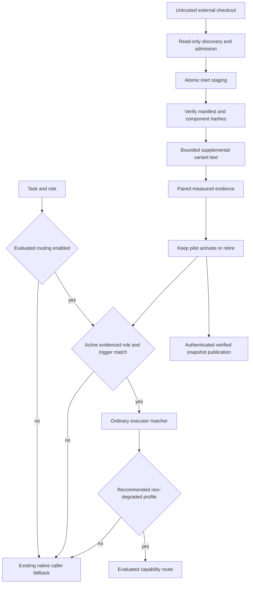

# Capability governance and evaluated packs

VOLY has two deliberately separate ways to use capability information:

- **Ordinary capability matching** ranks executor or model-provider profiles for a role or dimension. It is an optional, best-effort routing hint and preserves the caller's normal static resolution when it is disabled, fails, or finds no profile.
- **Evaluated capability packs** are an experimental overlay. They first select a qualifying capability, then delegate executor/model choice to the ordinary matcher. A pack is not selected merely because it was discovered, admitted, staged, or installed.

That separation matters: external content, experiment evidence, normal runtime routing, and remote publication have different owners and trust levels. Capability matching can support role routing in [A2A and pipeline orchestration](../orchestration/a2a-and-pipeline.md), but it does not turn every routed task into an evaluated experiment. For the surrounding runtime, see the [architecture overview](../architecture/overview.md).

## Boundaries at a glance

| Boundary | Responsible component | What it can do | What it cannot imply |
|---|---|---|---|
| Ordinary routing | `ExecutorMatcher` and `capability_route` | Rank compatible profiles locally or, for balanced policy, use the Worker `/match` service. | A remote match is not evaluated-pack selection or remote pack activation. |
| External intake | ECC discovery and admission | Inventory known files, statically scan them, infer permissions, and quarantine risky components. | Discovery and admission never execute content, hooks, commands, or MCP servers. |
| Staging and rendering | `PackStore` and `render_variant_task` | Atomically preserve admitted files with manifest/component hashes; render verified staged text as bounded supplemental guidance. | Installation or a staged manifest does not activate a capability. |
| Evaluation | `EvaluatedPackStore`, router, and validation | Persist paired outcomes, decide pilot/activate/retire, and select a matching active pack. | Synthetic routing probes and unrelated task telemetry are not activation evidence. |
| Publication | evaluated sync client and Worker | Publish a bounded, authenticated, hash-verified audit snapshot. | A Cloudflare snapshot does not enforce runtime routing or activate instructions. |


```mermaid
flowchart TD
    Task["Task and role"] --> Gate{"Evaluated routing enabled"}
    Gate -- no --> Native["Existing native caller fallback"]
    Gate -- yes --> Select{"Active evidenced role and trigger match"}
    Select -- no --> Native
    Select -- yes --> Match["Ordinary executor matcher"]
    Match --> MatchOK{"Recommended non-degraded profile"}
    MatchOK -- no --> Native
    MatchOK -- yes --> Route["Evaluated capability route"]
    Intake["Untrusted external checkout"] --> Discover["Read-only discovery and admission"]
    Discover --> Stage["Atomic inert staging"]
    Stage --> Verify["Verify manifest and component hashes"]
    Verify --> Render["Bounded supplemental variant text"]
    Render --> Evidence["Paired measured evidence"]
    Evidence --> Decision["Keep pilot activate or retire"]
    Decision --> Select
    Decision --> Snapshot["Authenticated verified snapshot publication"]
```

This flow shows that imported material reaches a routed experiment only through staging, verification, measured evidence, and activation; every failed or inapplicable route returns to native behavior.

## Ordinary matcher: optional ranking with local fallback

`ExecutorMatcher.find_executors()` accepts a dimension, optional executor allow-list and profile kind, project features, tool requirements, Worker URL/timeout, and a routing policy. For `balanced` policy it may `POST /match` to the configured capability Worker. The response is reloaded through the local registry and filtered by requested kind, preventing a model-provider hit from being returned where an executor was requested. A malformed response, HTTP failure, timeout, registry issue, or an unsupported `quality_first`/`budget_first` policy falls through to local scoring.

Local matching loads profiles, applies hard exclusions for required file/browser tools, scores the remaining profiles for the requested dimension, features, and policy, and returns the ranked recommendation plus fallbacks and exclusions. No eligible local profile produces a degraded result rather than an exception. The SDK/plan helper `capability_route()` is disabled unless `config.capability.enabled` is true and catches matcher/registry errors; callers receive `None` and retain their own static resolution.

Use the direct operator interface when diagnosing profile data or policy behavior:

```text
voly capability match TASK --dimension backend --kind executor --policy balanced
```

`--kind` is `executor` or `model_provider`; `--features` and `--executors` constrain the candidate set. This mechanism is intentionally independent of evaluated packs.

## Inert external-pack intake and staging

External ECC content is untrusted data. `voly capability import ecc --source … --dry-run` is the discovery entrypoint and requires `--dry-run`; it inventories only supported ECC layouts (agents, skills, rules, hook JSON, MCP config, and legacy command shims). Discovery resolves source paths safely and records best-effort package/Git provenance, but does not import modules, copy content, run hooks/commands, or start MCP servers.

Admission scans discovered components without executing them. It bounds each component at 512,000 bytes and total findings at 200, rejects source-root escapes, examines MCP JSON shape, and applies static risk patterns. It records findings and inferred permissions; any high or critical finding makes the overall decision `quarantine`. A quarantine is component-level in the manifest: safe components can be staged while quarantined files receive no staged path.

`voly capability pack install ecc --source …` runs discovery and admission, generates a versioned manifest, copies only staged components to the pack store (normally `.voly/capability/packs/`), writes the manifest and its SHA-256 checksum into a temporary directory, then atomically replaces the destination. Existing pack IDs must be removed explicitly before a reinstall. The installed manifest state is `staged`, not active.

Operators can inspect and integrity-check that boundary:

```text
voly capability pack list
voly capability pack show PACK_ID
voly capability pack verify PACK_ID
```

Verification checks the manifest checksum, every declared staged component hash, expected file set, and staged-path containment; missing, modified, unexpected, or escaping files fail verification. Only `render_variant_task()` may use staged text for a variant. It verifies the source pack first, permits only manifest entries marked `staged`, strips frontmatter, bounds total instruction text, records hashes, and labels it as supplemental guidance that cannot override system, project, safety, or user instructions. It also explicitly says not to execute commands merely because the text contains them.

## Evaluated packs and evidence lifecycle

The evaluated store initializes three builtin pilots—`security-reviewer`, `tdd-workflow`, and `python-reviewer`—with typed `CapabilityInput.v1` and `CapabilityOutput.v1` contracts. Each pack is in one of `pilot`, `active`, or `retired`, and has role, dimension, triggers, success criteria, provenance source, and evidence count. Definitions are persisted in `packs.json`; evidence is append-only JSONL in `evidence.jsonl`.

A recorded run contains completion and test outcomes, rollback/corrections, cost and latency, retries, reviewer acceptance, baseline/variant scores, held-out designation, and optional token baselines. A paired experiment may name at most one changed capability; otherwise it is rejected. Cost and token measurements track sample availability so unknown measurements are not presented as zero-cost or zero-token evidence.

The router considers only an `active` pack with evidence whose role matches (or the request role is `auto`/empty) and whose trigger appears in the task. It picks the most trigger hits, with capability ID as the deterministic tie-breaker, then passes the pack's dimension to the ordinary matcher. No candidate returns `native_voly_no_capability`; a missing or degraded ordinary match returns `native_voly_match_degraded`. Thus evaluated selection never replaces native VOLY fallback.

Activation is deliberately two-tiered:

- `voly capability evaluated activate CAPABILITY_ID` requires at least one measured record, including for imported capabilities, but does not recompute the production threshold.
- `voly capability evaluated activate-ready --executor EXECUTOR --yes` recomputes decisions and activates only packs that pass the full local gate; it never deploys Cloudflare.

Production decisioning normally requires six measured samples and at least two held-out samples. It activates only if the paired score delta, completion, tests, rollback, correction, reviewer acceptance, latency overhead, and—when measured—token overhead satisfy the pack criteria. A negative value hypothesis can retire early only with at least three samples, two held-out samples, and paired delta below the minimum. Insufficient samples or held-out evidence keeps a pack in pilot; other failed complete evaluations retire it.

The bundled `benchmark_suite_v1.json` has exactly 20 unique tasks and a held-out split, but `voly capability evaluated benchmark` creates a temporary synthetic store, makes no model calls, writes no evidence, and always reports `activation_allowed: false`. It is a routing probe, not production validation; task telemetry or self-reported completion likewise cannot substitute for paired activation evidence.

## Cloudflare snapshot publication is an audit boundary

`voly capability evaluated sync --executor EXECUTOR` first refuses incomplete pilots and refuses a set with no locally activatable capability. It builds a deterministic schema-v1 snapshot containing definitions, state, locally recomputed decisions, aggregated metrics, and staged-instruction provenance hashes. It excludes raw prompts and individual evidence records, limits the snapshot to 32 packs and each pack to 64 provenance hashes, normalizes integral floats, and uses canonical JSON SHA-256 as `snapshot_id`.

The client obtains `VOLY_CAPABILITY_SYNC_TOKEN`, uploads to `POST /evaluated/snapshots` with Bearer authentication, then performs an authenticated `GET /evaluated/snapshots/:id`. It writes `remote-sync-receipt.json` only if the Worker returns the same content and payload hash. The receipt is current only while its executor ID, schema/verified flag, and hash of the local packs/evidence files still match.

The Worker independently validates the token, schema, pack count, state, positive version, and SHA-256 fields; it recomputes the canonical content hash, stores snapshots and per-pack state in D1, and treats a repeat identical snapshot as idempotent. It does not participate in `/match` enforcement and does not execute published content. Cloudflare deploy readiness requires at least one activation decision, no incomplete pilot decisions, and a current verified receipt; a successful publication alone grants no runtime authority.

## Operating and change checklist

1. Keep discovery, admission, and staging inert. Never treat `allow`, `staged`, or installed as activation.
2. Preserve safe-path and checksum validation before reading any staged variant text.
3. Keep ordinary matcher routing, evaluated selection, evidence collection, and remote sync separately callable and separately authorized.
4. Maintain explicit native fallback for disabled, unmatched, unmeasured, retired, and degraded cases.
5. Change production thresholds together with focused tests for held-out evidence, early retirement, and full activation.
6. Keep Python canonical JSON/number normalization compatible with the Worker before changing snapshot schema or hash semantics.
7. Require upload **and exact authenticated read-back** before treating a remote receipt as verified.

Focused regression coverage lives in `tests/test_capability_pack_import.py`, `tests/test_evaluated_capability_packs.py`, `tests/test_capability_production_validation.py`, and `tests/test_capability_remote_sync.py`; together they exercise inert/quarantined intake, hash-verified rendering, native fallback, evidence gates, synthetic benchmark limits, sync tamper rejection, and receipt invalidation after local state changes.
