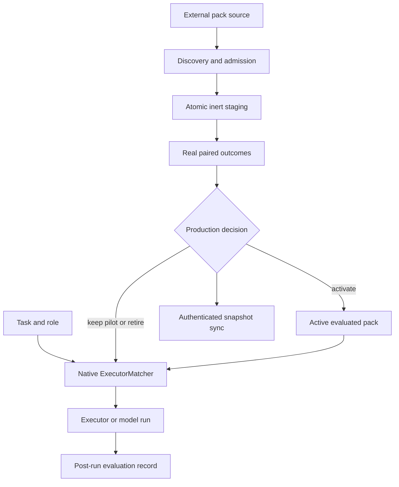

# Capability, evidence, and evaluation governance

VOLY deliberately keeps five concerns separate: selecting an executor or model profile, discovering and staging external content, routing through an evaluated capability pack, evaluating an individual run, and publishing a remote control-plane snapshot. In particular, imported content, telemetry, a synthetic routing benchmark, and remote publication are **not** activation proof. This preserves the native routing path described in the [architecture overview](../architecture/overview.md) when an optional capability control is absent or fails.

## Control planes and trust boundaries

| Control | Responsibility | What it does **not** establish |
|---|---|---|
| Capability registry and matcher | Rank executor or model-provider profiles for a requested dimension, with hard tool constraints. | That an imported pack is safe or valuable. |
| Pack discovery, admission, and staging | Inspect external ECC content without executing it; retain only admitted material as an immutable staged pack. | Runtime activation or permission to execute hooks, commands, or MCP servers. |
| Evaluated packs | Choose an active, evidence-bearing, role- and trigger-matched capability, then call the normal matcher. | That a one-record manual activation has passed the production gate. |
| Eval Engine | Attach deterministic checks and optionally an LLM-judge result to an individual completed run. | Primary routing or evaluated-pack activation. |
| Evaluated snapshot sync | Publish a bounded, authenticated, read-back-verified view of local evaluated state. | Remote instruction injection, `/match` enforcement, or runtime activation. |

```mermaid
flowchart TD
    Task["Task and role"] --> Native["Native ExecutorMatcher"]
    External["External pack source"] --> Discovery["Discovery and admission"]
    Discovery --> Stage["Atomic inert staging"]
    Stage --> Evidence["Real paired outcomes"]
    Evidence --> Gate{"Production decision"}
    Gate -->|activate| Pack["Active evaluated pack"]
    Gate -->|keep pilot or retire| Native
    Pack --> Native
    Native --> Run["Executor or model run"]
    Run --> Eval["Post-run evaluation record"]
    Gate --> Snapshot["Authenticated snapshot sync"]
```

This flow shows that evaluated routing is an overlay: only the activated-pack branch reaches the same native matcher, and every other evaluated outcome retains an explicit native path.

## Normal capability matching remains best effort

`ExecutorMatcher.find_executors()` optionally calls the configured Worker’s `/match` endpoint for the `balanced` policy. It filters the returned local profiles by requested `kind`; an HTTP failure, timeout, malformed result, unavailable Worker, or non-balanced policy falls through to local scoring. Local matching restricts any supplied executor allowlist, applies file- and browser-tool hard exclusions, ranks the remaining registry profiles, and marks the result degraded if none passes. The matcher therefore provides a recommendation and fallbacks rather than becoming a dependency that can fail a run.

The shared `capability_route()` integration is disabled unless `capability.enabled` is true. It only supplies an executor hint when executor mode has no explicit executor, or a model/provider hint when chat mode has no explicit model or tier. Exceptions or no recommendation return `None`, deliberately leaving the caller’s ordinary static resolution in control. A2A role assignment and Agent, Workflow, and PlanRunner paths can use this hint without turning all work into an evaluated experiment; see [A2A and pipeline orchestration](../orchestration/a2a-and-pipeline.md).

## External packs: discover, admit, then stage — never execute by implication

External capability content is untrusted. `voly capability import ecc --source … --dry-run` is mandatory dry-run discovery: it inventories supported components and provenance but does not copy content, import Python or JavaScript, execute hooks or commands, or start MCP servers. Admission resolves every component under the selected source root, bounds readable component size and findings, scans risk patterns and inferred permissions, validates MCP JSON shape, and quarantines high- or critical-risk material. Findings are review evidence, not proof that a source is malicious.

`voly capability pack install ecc --source …` repeats discovery and admission, builds a manifest, copies only staged components into a temporary sibling directory, writes a manifest checksum, and atomically renames it below `.voly/capability/packs/<pack-id>/`. An existing ID cannot be overwritten. `voly capability pack verify <pack-id>` checks the manifest checksum, each staged component hash, missing files, unexpected files, and path containment. Installation is still inert: it injects no agent, skill, rule, hook, command, or MCP server.

A variant renderer is the narrow bridge from staging to an experiment. Before reading text, it verifies the entire pack; each declared instruction source must be a manifest component with `status == "staged"` and must resolve under the pack root. Rendered text is bounded supplemental guidance carrying source hashes, and expressly cannot override system, project, safety, or user instructions or cause commands in the text to be executed automatically. A learned-instinct variant is similarly constrained to one manually approved, positively evidenced, contradiction-free action of at most 1,200 characters.

## Evidence-gated evaluated packs and explicit fallback

An evaluated pack has `pilot`, `active`, or `retired` state, typed input/output contracts, a role, a capability dimension, triggers, and success criteria. The router considers only active packs with `evidence_count > 0` whose role matches the request (or whose request uses an empty/`auto` role). It selects the pack with the most trigger hits, breaking ties by capability ID, then delegates executor/model selection to `ExecutorMatcher`. No qualified pack returns `native_voly_no_capability`; no recommendation or degraded match returns `native_voly_match_degraded`. Native fallback is an observable route result, not an implicit error path.

Paired baseline/variant outcomes are append-only JSONL in the evaluated-pack store. A record is limited to exactly one changed capability and retains completion, test, rollback, correction, reviewer, quality, latency, token, cost, and held-out information. Unknown cost or token usage is marked rather than silently treated as zero. Those records, rather than normal run telemetry or Eval Engine reports, provide the activation evidence.

There are two intentionally different activation interfaces:

- `voly capability evaluated activate <capability>` only requires that some measured evidence exists and sets local state to `active`; it is useful for a measured pilot route, not proof of production readiness.
- `voly capability evaluated activate-ready --yes` recomputes the production decision for each pack and locally activates only `activate` decisions. It requires explicit confirmation and neither edits `voly.yaml` nor deploys Cloudflare.

The production decision uses six measured outcomes and at least two held-out outcomes. It activates only when paired added value, completion, test-pass, rollback, correction, reviewer-acceptance, and efficiency criteria all pass; the default limits include 30 seconds mean latency overhead and 100,000 measured-token overhead. Incomplete samples or held-out coverage remain `keep-pilot`. A falsified value hypothesis can retire at three samples only when the two held-out outcomes already exist and paired value is below threshold; early retirement never activates a pack.

The bundled `voly capability evaluated benchmark` is deliberately different: it creates temporary synthetic activation in a temporary store to probe a fixed 20-task routing suite, makes no model calls, writes no evaluated state, and returns `synthetic_outcomes: true` with `activation_allowed: false`. Routing correctness is useful infrastructure evidence, but cannot substitute for real paired outcomes.

## Post-run evaluation is evidence for a run, not pack admission

The Eval Engine is a separate, record-only post-run subsystem. When enabled with evidence for a file-capable run, it selects a versioned policy before execution, captures the deterministic baseline, and evaluates after any safety rollback so it sees the retained repository state. Required checks can cover executor success, hard safety violations, trajectory metadata, retained file changes, exact replay of previously passing baseline `argv` values with `shell=False`, and task-specific documentation links, test artifacts, changed-file security scan, or human review. A failed/error required check produces `soft_failure`; a pending or skipped required check produces `partial_success`; all required checks passing produces `verified_success`.

The optional rubric LLM judge is off by default and has `shadow` and `required` modes. It receives only bounded task text and executor output—not repository source or paths—and treats both as untrusted quoted data. Its strict JSON parser requires every rubric dimension exactly once; VOLY independently calculates the weighted score and critical-dimension floor. Invalid, uncertain, or unavailable judge output is `skipped`, not a false pass. In shadow mode it cannot change the report state; in required mode a valid failure is a soft failure while missing/invalid evidence is partial success. Human feedback can resolve human-review checks and append judge-calibration events without rewriting the original judge result. These reports support per-run verification and later calibration, not automatic activation or routing.

## Verified remote snapshot publication

`voly capability evaluated sync` is gated before upload: it rejects incomplete pilots and requires at least one `activate` decision. It builds a canonical v1 snapshot containing pack definitions/state, recomputed decisions, aggregate metrics, and staged-instruction provenance hashes—excluding raw prompts and individual evidence records. Canonical serialized content is SHA-256 hashed into the snapshot ID; the client authenticates with `VOLY_CAPABILITY_SYNC_TOKEN`, uploads to `/evaluated/snapshots`, then reads the immutable snapshot back and compares its payload and hash before atomically writing a local receipt.

Receipt validity is tied to a hash of the local `packs.json` and `evidence.jsonl`, so any relevant local change makes it stale. A verified receipt is one Cloud deployment-readiness condition alongside an activated capability and no incomplete pilot. The Worker’s evaluated endpoints are a D1-backed publication/audit surface; they do not inject instructions or alter `/match`. Treat a change that makes publication enforce runtime routing as a new trust-boundary design.

## Operating checklist

1. Use `voly capability match …` for ordinary profile selection; configure capability routing only as an opt-in, best-effort hint.
2. Treat `import ecc --dry-run`, pack installation, and `pack verify` as separate controls. Review admission findings before using staged material in an experiment.
3. Record real single-capability paired outcomes, preserve held-out coverage, inspect `activation-plan`, and use `activate-ready --yes` for production-gated local activation.
4. Do not use telemetry, an offline benchmark, a direct one-record activation, or a sync receipt as activation proof.
5. Keep deterministic evaluation and judged evaluation enabled/configured according to their privacy and human-review requirements; interpret their record state as run evidence.
6. Sync only completed decisions; require authenticated upload plus exact read-back and a current receipt before considering Cloud deployment readiness.

Focused regression coverage includes capability fallback and kind filtering, discovery/admission/staging integrity, evaluated routing and production decisions, remote snapshot read-back, deterministic evaluation states, LLM-judge parsing, and EvidenceStore human-feedback updates.
