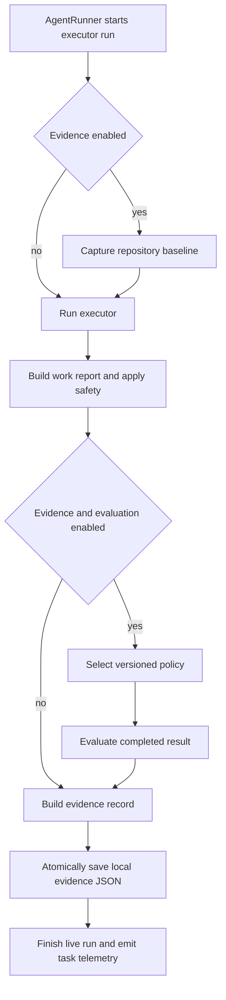

# Evidence, evaluation, and durable run records

VOLY uses several records that can share a `task_id` but answer different questions. They must not be merged semantically:

- **Evidence** is the optional, local audit bundle for one file-capable executor run: what was true before it edited, which execution/policy lineage was used, the attributed outcome, and optional evaluation and human feedback.
- **Evaluation** is the versioned assessment attached to that evidence bundle. It evaluates a completed result; it does not change the executor's visible result.
- **Run tracking** is best-effort, mutable in-flight state for seeing a blocking run and detecting a missing heartbeat.
- **Telemetry** is a versioned operational `TaskEvent`, written at completion and optionally projected into remote analytics.
- **Capability-experiment evidence** is a separate evaluated-pack measurement system. It must not be treated as an `EvidenceRecord`, evaluation result, telemetry event, or a substitute for their controls.

This separation preserves attribution: a post-run check cannot tell whether a failure existed before the agent, and a finished telemetry event cannot act as a heartbeat for a hung process.

## Record boundaries at a glance

| Record | Local owner and default location | Lifecycle and intended use | Remote treatment |
|---|---|---|---|
| `EvidenceRecord` | `EvidenceStore`, `.voly/evidence/<task_id>.json` | Optional durable bundle for an executor run; includes baseline, execution identity, attributed outcome, optional `EvalReport`, and explicit feedback. | `evidence_to_cloud_record()` produces a separate metadata-only projection; this module does not deliver it. |
| `EvalReport` | Nested in `EvidenceRecord` | Post-run policy check results and derived state. | Only a reduced check status/timing projection is included in cloud evidence. |
| `RunRecord` | `RunTracker`, `.voly/runs/<task_id>.json` | Mutable in-flight progress, heartbeat, workflow/graph state and cooperative cancellation. | No telemetry/evidence projection is implied. |
| `TaskEvent` | `voly.telemetry`, `.voly/events/<task_id>.json` | Completed task operational metrics and local details. | Explicit-consent Pipeline/R2 delivery uses `event_to_pipeline_record()`, not the full event. |
| Golden report | CLI default `.voly/eval-runs/<dataset>-<version>.json` | Local result of deterministic fixture replay, keyed to a validated versioned dataset and fingerprint. | No delivery path is implemented here. |

The local `EvidenceRecord` schema is version 3 and contains `task_id`, a SHA-256 task fingerprint rather than the raw task, task type, baseline, execution bundle, outcome, optional evaluation, feedback, and an optional action report. `ExecutionBundle` records agent/executor/model/provider/runtime/skills plus evaluation policy ID and version; `EvidenceOutcome` keeps success, state, root-cause and penalization decision, aggregate cost/time/retries, and changed-file count. The embedded evaluation schema is independently versioned (currently 1). Consumers should use those schema versions and policy lineage rather than assuming all records or policy versions are comparable.

## Executor evidence lifecycle

`AgentRunner.run()` is the production entrypoint that connects the components. With `evidence.enabled`, it captures a baseline **before** task refinement, Git snapshots, safety snapshot, and `executor.run()`. This ordering makes the baseline a statement about repository health before a file-capable executor can change it; it is intentionally distinct from Git before/after state because build/test/lint can create ignored artifacts.



This is the executor evidence path: baseline precedes editing, evaluation is optional, and evidence persistence remains separate from live tracking and telemetry.

### Baseline capture and attribution

`capture_repository_baseline()` scans the target project to record stack, test frameworks, and package managers, then runs configured commands and, when enabled, auto-discovered build/test/lint commands. Commands are parsed to argv and launched with `shell=False`; output is bounded. Auto-discovery recognizes package build scripts and common Go, Rust, Maven, test, and linter conventions. Configured command names take precedence over auto-discovered commands of the same name.

A baseline is `healthy` only when selected checks pass. It is `metadata_only` when no checks are selected, `preexisting_failure` when a check fails, and `environment_failure` for missing/invalid working directory, scan failure, unavailable command, timeout, or operating-system error. A failed pre-run check is therefore evidence about the repository/environment, not a regression caused by the executor.

The later root-cause classifier preserves that distinction for unsuccessful executor results: billing is `provider_failure`; unavailable/timeout tools are non-agent failures; a safety error is a policy violation; unhealthy baseline states become environment/repository failures; only the remaining failures become `agent_failure` with `penalize_agent=True`. Do not use raw success alone for performance or capability scoring.

`EvidenceConfig` is disabled by default. It owns the store directory, baseline enablement/auto-discovery, named baseline commands, baseline timeout/output bound, and fallback policy lineage. `EvaluationConfig` is separately disabled by default and owns automatic/explicit policy selection, evaluator command timeout, and LLM-judge configuration. Enabling evidence without evaluation still writes the baseline and attributed outcome; the runner selects and runs an evaluation only when **both** feature gates are enabled.

### Atomic local persistence and feedback

`EvidenceStore.save()` serializes one record to a temporary file in the evidence directory, flushes and `fsync`s it, then replaces `<task_id>.json` atomically. Record file IDs accept only a 1–128 character ASCII letter/digit-starting identifier containing letters, digits, `_`, and `-`; invalid/path-like IDs are rejected. Load returns `None` for unreadable or invalid JSON rather than propagating it.

`add_human_feedback()` accepts only `accepted`, `edited`, `major_rewrite`, `reverted`, `pr_rejected`, or `manual_fix`; it bounds source and comment lengths, and protects its in-process read-modify-replace cycle with a lock. Each item is appended as a `HumanFeedback` record. If evaluation has pending human-review checks, accepted feedback marks them passed and other allowed feedback marks them failed, recalculating the evaluation/outcome state. For completed LLM judge checks, the same feedback appends a pass/fail agreement calibration event; it does not retroactively overwrite the judge decision.

## Deterministic post-run evaluation

Policies are selected deterministically by task type unless `evaluation.policy_id` explicitly requests a registered policy. The base requirements are executor success, safety-policy result, trajectory policy, nonempty file changes, and replay of passing baseline commands. Documentation adds local Markdown-link validation and human review; testing requires a recognized changed test artifact; security adds a changed-source scan and human review.

The engine evaluates requirements in policy order. Executor failure records its failed check and stops further work, avoiding needless commands or model calls. Baseline replay runs only baseline checks that passed and have an exact saved argv; missing baselines, failed original checks, and legacy entries without argv are recorded as skipped rather than reinterpreted. Replays use the configured command timeout. The final state is:

- `soft_failure` if a required check is `failed` or `error`;
- `partial_success` if no required checks exist or any required check is `pending` or `skipped`;
- `verified_success` only when all required checks pass.

This is deliberately a verification state, not a replacement executor state. The runner writes it to result metadata and, for a successful executor result, makes it the evidence outcome state. It also adds any LLM judge cost to total task cost alongside executor and retry cost.

The trajectory evaluator inspects bounded executor metadata without exposing raw sensitive paths: it summarizes chain attempt statuses, retry/fallback use, and tool-trace availability, but fails for a safety-policy event or rollback. The security evaluator scans only supported **changed** source files and records labels/descriptions rather than secret values; it rejects paths outside the repository. Markdown checking ignores fenced code and validates local targets without allowing escapes outside the root. Testing policy recognizes common test naming/configuration conventions, so code-only changes fail that policy even if a general baseline replay passes.

## Optional LLM judge

The LLM judge is off by default. `shadow` appends an optional requirement, so a judge failure does not fail the report; `required` makes that same requirement mandatory. Either mode creates a policy version suffixed with `-judge-shadow.1` or `-judge-required.1`, ensuring the evaluated lineage identifies the mode.

The judge selects a rubric for general code, documentation, testing, or security. It sends only a character-bounded concatenation of task and executor output, labels both as untrusted quoted data, uses temperature `0.0`, disables provider rerouting, and demands one strict JSON object. The response must contain precisely the verdict, rubric dimensions, and summary; dimensions must match the rubric exactly, score 0–4, and respect length bounds. A pass needs verdict `pass`, weighted score at least the configured threshold, and every critical dimension at least 2. Uncertain, malformed, or unavailable judge results are `skipped`, not invented passes; gateway diagnostics are not copied into evaluation detail. The result records rubric, scores, actual provider/model, token accounting, cache status, and estimated cost when the gateway omits usage.

## Golden datasets: independent offline regression replay

Golden replay is not a baseline replay and does not mutate an executor evidence record. It validates a versioned JSON dataset with a nonempty set of stable case IDs in `typical`, `edge`, or `adversarial` categories. Dataset/case/expectation keys are closed, paths must remain below the dataset root, fixtures must be directories with no symlinks, cases and expected files cannot duplicate IDs/paths, and cases have bounded count, timeout, output, and expected-file limits. The dataset fingerprint hashes canonical dataset JSON **and fixture file paths/content**, so fixture edits change the replay identity.

Each selected case copies its fixture to a temporary workspace, executes argv directly with `shell=False`, disabled stdin, a bounded timeout, and an environment allowlist that removes credentials and supplies isolated home/temp directories. It then checks exit code, expected/forbidden stdout/stderr fragments, and expected file presence, digest, or content. Output tails are bounded in the report. Importantly, the report declares `network_policy: "not_enforced"`: credential removal and fixture isolation do not claim network sandboxing.

Use the CLI to validate before replaying and retain the resulting report as local run evidence:

```bash
voly eval validate path/to/dataset.json
voly eval run path/to/dataset.json --case stable-case --output .voly/eval-runs/result.json
```

`voly eval run` returns exit code 1 if any selected case fails. Report saving also uses temporary-file replacement, so readers do not see a partial JSON report.

## Live run tracking versus completed telemetry

`RunTracker` creates a `RunRecord` with `running` status, timestamps, roles, and optional plan/graph information, then updates its heartbeat as work advances. `AgentRunner` starts this record when telemetry is enabled and sends a background heartbeat every ten seconds while its executor blocks; it finishes the record as `completed` or `failed`. Tracking is best effort: write/load errors are swallowed so observability cannot break task execution. Writes are atomic replacements.

A `Watchdog` considers only a `running` record stale when `age_seconds > task_timeout * stale_factor`; `reap()` marks such records `stale` with a watchdog error. Workflow tracking can additionally persist bounded workflow progress, transitions, metrics, graph updates, and cooperative cancellation requests. These mutable records are useful for a hung run but are not evidence that the task result was correct.

By contrast, `TaskEvent` is a completed-task telemetry contract (currently local schema version 4). It can retain task prompt/result/free-form details locally, while reporting tokens, cost, model/provider/executor, fallback, retries, error class, workflow and A2A data. It is written locally first. Pipeline delivery failures are caught after that write, so remote availability does not erase local telemetry; local event writing itself is best effort. Per-tenant deployments must use separate event directories—reading one directory only loads that tenant's JSON files.

### Remote privacy projections and consent

Never put live secrets in configuration, commands, reports, documentation, or record comments. Remote data uses allowlisted projections, not redaction-by-hope:

- `event_to_pipeline_record()` derives a SHA-256 `event_id` from the task ID and emits flattened operational fields. It deliberately excludes raw task ID, prompt, result, free-form error, paths, reports, artifacts, stage logs, and A2A assignment payloads.
- `evidence_to_cloud_record()` derives a distinct hashed `evidence_id`; it excludes the task fingerprint, baseline notes/commands/output, skill source paths, feedback comments/timestamps, and evaluation messages/detail. It preserves only metadata such as health, status, timing, policy lineage, and feedback kind/source.

`cloud_analytics.enabled` is the explicit consent gate. When it is false, configured endpoints do not receive pipeline or R2 telemetry; local event persistence still occurs. With consent and a resolved endpoint, the pipeline receives a JSON array of sanitized telemetry records and may use a bearer token resolved at runtime. Legacy R2 upload likewise requires consent and runtime credentials, and writes the same sanitized telemetry projection under its hashed event ID. Delivery errors are logged only as debug failures and do not fail the run.

## Change guidance and focused tests

- Change baseline discovery, health classification, root cause, record schema, store atomicity, or cloud evidence projection with `tests/test_evidence_foundation.py`.
- Change registry selection, evaluation ordering/states, validator semantics, feedback, or LLM judge mode with `tests/test_evaluation.py`. Preserve the distinction between skipped required checks (`partial_success`) and failed required checks (`soft_failure`).
- Change golden parsing, fixture isolation, fingerprinting, process timeout, or CLI exit behavior with `tests/test_golden_evaluation.py`.
- Change telemetry serialization, consent, Pipeline/R2 delivery, or privacy fields with `tests/test_telemetry.py`; run tenant-isolation coverage when altering event directory scope or cache isolation.
- Change tracking/heartbeat/watchdog behavior with the run API tests. Do not make record persistence or a watchdog failure a new execution failure path.

See [control-plane architecture](../architecture/overview.md) for the broader executor/telemetry split and [capability registry and evaluated-pack governance](capabilities.md) for the distinct experiment-evidence lifecycle.
