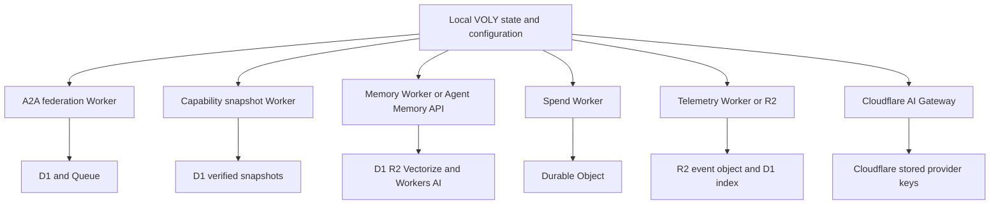

# Cloudflare and remote-service integrations

VOLY uses Cloudflare services as **optional remote boundaries**, not as a replacement for its local runtime authority. Local configuration, SQLite/JSON records, capability evidence, routing, gateway controls, and executor safety retain their own semantics. Workers provide durable publication, sharing, semantic retrieval, accounting, or analytics; an unavailable remote service must not silently become a new policy authority.

The [architecture overview](../architecture/overview.md) describes the inference/executor split and durable local records; [A2A orchestration](../orchestration/a2a-and-pipeline.md) describes when federation is selected; and [capability governance](../governance/capabilities.md) explains why publication does not activate a capability.

This diagram separates local source-of-truth decisions from the distinct remote storage, federation, analytics, and provider-routing boundaries.

## Common transport and configuration conventions

The Python HTTP clients normalize a configured base URL by removing a trailing slash and, if configuration is blank or contains an unresolved `${...}` expression, consult service-specific environment variables. No URL produces `None` rather than a client that can accidentally call an invalid endpoint. Their JSON requests identify `VOLY/0.1 (+https://github.com/voly)` and attach `Authorization: Bearer ...` only when a token is present; HTTP and URL failures become client-specific exceptions.

Worker-facing service secrets are not interchangeable with account tokens. In particular, spend accepts only `CF_WORKER_SPEND_TOKEN`; it deliberately does not use `CLOUDFLARE_API_TOKEN`. Memory resolves its Worker token from `CF_WORKER_MEMORY_TOKEN`, then `CLOUDFLARE_API_TOKEN`; federation resolves `VOLY_A2A_TOKEN`, then `CF_WORKER_A2A_TOKEN`. A Worker with `API_TOKEN` configured compares the supplied Bearer value, while its health endpoint remains unauthenticated in the A2A, memory, spend, and telemetry workers.

Correlation is a local context value. `ensure_correlation_id()` preserves an explicit/current ID or creates a UUID, and `correlation_headers()` forwards it as `X-Correlation-ID` only when one is set. The standard Memory Worker client uses that helper. Other clients shown here do not add it themselves, so new remote calls should use the shared helper rather than create a parallel trace convention. Workers shown here do not consume that header; forwarding helps correlate client-side logs and task events, not enforce request identity.

## A2A federation: remote task registry and dispatch

Set `a2a.execution_mode: federation` with `a2a.federation_url` (or `CF_WORKER_A2A_URL` / `A2A_FEDERATION_URL`) to use `FederationClient`. The local `FederationBackend` converts remote task JSON to an `A2ATask`, carries `agent_name` into `metadata.routed_to`, and tolerates unknown task states by mapping them to `submitted`. If the federation URL is absent, no client is created; if a remote lookup fails, `load_task()` returns `None`.

The Worker persists agent cards and task state in D1. `/agents` lazily seeds builtin cards, supports registration/upsert, and exposes card discovery including the well-known redirect. `POST /tasks` validates a named agent, creates a UUID task in `submitted`, and queues it only when asynchronous dispatch is enabled and an agent was named. The queue consumer processes only still-submitted tasks, marks them `working`, and calls the configured agent Worker binding or URL with `{task, task_id}`. It forwards an agent-worker token (prefer `AGENT_WORKER_TOKEN`, else `API_TOKEN`) as Bearer authentication. A non-success dispatch records `failed` plus a dispatch-error excerpt capped at 500 characters; thrown queue-processing failures retry the message.

`PUT /tasks/:id` merges metadata and overwrites supplied state/result/error. `/complete` is idempotent for an already completed task, while `/fail` marks the task failed. These are remote protocol records, not a replacement for local pipeline completion requirements: federation orchestration still polls to its deadline and treats any incomplete dispatched work as partial or failed.

## Capability snapshots: authenticated audit publication, not runtime policy

The ordinary capability matcher and evaluated evidence are local concerns. The evaluated sync command first refuses a set with an incomplete pilot or without an activation decision, then builds a deterministic schema-v1 snapshot from local pack definitions, decisions, metrics, and staged-instruction provenance hashes. It deliberately omits raw prompts and individual evidence. The payload is bounded to 32 packs and 64 provenance hashes per pack, normalizes integral floats, and uses canonical JSON SHA-256 as its `snapshot_id`.

`sync_remote_snapshot()` requires both a Worker URL and `VOLY_CAPABILITY_SYNC_TOKEN`. It posts the canonical snapshot to `/evaluated/snapshots`, reads the same ID back with the same Bearer token, and compares both the returned payload hash and exact canonical content before atomically writing its local receipt. The receipt remains current only if its executor, schema, verified flag, and a hash of local packs/evidence files still agree. A network, HTTP, or read-back discrepancy raises an error and leaves no new verified receipt.

The capability Worker protects only `/evaluated` routes with `EVALUATED_SYNC_TOKEN`; it hashes the submitted token before equality comparison. It independently validates schema, required executor, pack/state/version fields, bounded provenance hashes, and the canonical snapshot hash. It stores a snapshot plus per-pack state in D1, returns an identical re-upload as idempotent, and returns the stored snapshot on authenticated read-back. Its separate profile, role, match, and leaderboard routes exist as Worker APIs, but snapshot publication neither runs instructions nor authorizes local routing or capability activation.

## Memory: local-first persistence with optional semantic remote retrieval

`MemoryStore` is always a local SQLite store with an FTS5 index and triggers. `add()` validates its category, writes and commits locally first, then best-effort mirrors the same entry ID to the configured remote client. A mirror failure logs a warning but does not undo the local entry. For search and semantic search, a non-empty remote result is preferred; remote errors or empty results fall back to local FTS5, and semantic local retrieval further falls back to FTS when `sentence_transformers` is unavailable. Profile-scoped stores add `memory_profile` to local metadata and use that scope on local queries.

`memory.backend` selects `local` (no remote client), `hybrid`/`worker` (the Memory Worker), or `agent_memory` (the separate Cloudflare Agent Memory HTTP client). Relevant configuration includes the local database path, Worker URL, Agent Memory account/namespace/profile, and a checkpoint ingestion byte bound. This is a choice of retrieval/mirroring backend, not a migration of the local source of truth.

The Memory Worker requires Bearer authorization only when `API_TOKEN` is configured. `/memory/add` requires title/content, embeds title plus content using Workers AI, stores full content and metadata in D1 and R2, but retains only the first 512 characters of content as Vectorize metadata. `/memory/search` caps `limit` at 50, queries Vectorize, and can category-filter the returned matches; it therefore returns the metadata excerpt rather than a full D1 record. Reads/listing are D1-backed and cap list limits at 100. Operators should treat remote memory content and metadata as data sent across the boundary, even though vector search responses are bounded.

## Spend: a remote accounting signal, not the gateway budget authority

The spend client uses `spend.remote_url` or `CF_WORKER_SPEND_URL`/`SPEND_URL`. `emit_event_from_config()` first writes terminal telemetry locally and then invokes `record_task_spend()`; that helper sends only positive-cost events when remote spend is enabled and configured, and suppresses any client error. `check_agent_spend_limit()` similarly returns `None` on missing configuration or remote error. Consequently, the Durable Object is persistent remote accounting and an optional pre-check, not the authoritative local `AIGateway` spend-limit decision.

The Spend Worker fronts one global `SpendTracker` Durable Object. `/spend/record` persists agent, cost, task ID, model, provider, and timestamp. `/spend/check` sums the last rolling 24 hours for an agent and reports whether it is below the caller-provided limit; summaries are capped at 30 days and recent entries at 100. All spend endpoints require `API_TOKEN` when configured. The same Worker also proxies AG-UI session WebSocket/event/state calls to per-session Durable Objects; the WebSocket proxy route itself has no authorization check in this router, so deployments must not mistake the Bearer checks on the HTTP endpoints for a blanket session-access policy.

## Telemetry: local full event, consent-gated remote allowlist

A `TaskEvent` is written locally to `.voly/events/<task_id>.json` before any remote action. The full record can contain prompt, result, error, paths, report, artifacts, stage log, and A2A assignment data. `event_to_pipeline_record()` constructs a separate Cloud Analytics v1 allowlist with status, actor/executor/model/provider, costs, durations, token counts, selected gateway/evaluation flags, and A2A counts; it deliberately excludes those free-form/sensitive fields. Its stable remote `event_id` is a SHA-256 derived from the task ID.

Remote analytics is disabled unless `cloud_analytics.enabled` is true. When enabled and an endpoint resolves from configuration or `CF_PIPELINE_TELEMETRY_ENDPOINT`/`PIPELINE_TELEMETRY_ENDPOINT`, the client posts a one-record JSON array with optional Bearer token and a five-second default timeout. Delivery errors are debug-logged after local persistence. The optional legacy R2 path has the same consent gate, uploads the sanitized record with SigV4 credentials, and also suppresses remote failures.

The telemetry Worker accepts one record or an array at `/events` (and `/ingest` alias), ignores records without `task_id`, stores each accepted raw remote record as `events/<task_id>.json` in R2, and maintains a D1 index keyed by task ID for list/filter queries. It caps listing at 200. That Worker stores what it receives; privacy depends on using the local allowlist producer rather than sending full `TaskEvent` objects directly. Its `API_TOKEN` check guards ingestion and reads when configured.

## Catalog and marketplace boundaries

The catalog Worker is a D1-backed remote model catalog: `/models` returns enabled rows (optionally verified-only), while `/models/sync` upserts model metadata. Its legacy `/match` is explicitly deprecated and can proxy a request to the capability service when `CAPABILITY_PROXY_URL` is bound; otherwise it applies hard-coded matching. It has CORS but no authorization logic in this Worker source, so it must not be treated as a trusted policy or credential boundary.

The marketplace Worker is likewise a publication/discovery service, backed by D1, R2, KV, Vectorize, and Workers AI. Browse/search responses use slim records that omit skill content; search tries Vectorize then falls back to FTS. Full download can use D1 content or an R2 fallback. Skill writes upsert D1 then asynchronously mirror to R2, create embeddings, and invalidate the KV cache; bulk sync intentionally skips per-item mirror/index work. Its exposed write routes have no authorization check in the inspected router, so any production authorization must be supplied outside this source or added explicitly. Marketplace discovery/install must remain separate from local capability admission and execution policy.

## AI Gateway and BYOK

`AIGateway.chat()` applies local DLP, cache, rate, and estimated spend checks before choosing a transport. With a Cloudflare account configured, supported providers (`anthropic`, `openai`, `google-ai-studio`, and `deepseek`) can use the AI Gateway route; other providers use an external upstream or direct adapter. Provider and model fallback happens in the local gateway and never converts a chat call into a file executor.

BYOK is opt-in (`ai_gateway.byok_enabled` or `VOLY_BYOK`) and active only with a Cloudflare account plus gateway token: `CF_AIG_TOKEN` is preferred, followed by configured `api_token` or `CLOUDFLARE_API_TOKEN`. Only Anthropic, OpenAI, Google AI Studio, and DeepSeek are eligible, optionally narrowed by `byok_providers`. On the BYOK path, the direct adapter calls Cloudflare with a provider/model route and Cloudflare authorization; the provider API key remains in Cloudflare Secrets Store and is not read from or sent by VOLY. Anthropic minor model IDs are translated from the API hyphen form to the Cloudflare catalog dot form.

Unsupported providers—including Mimo, OpenCode, OmniRoute, and Workers AI—remain on their environment-key/native routes even when BYOK is enabled. Turning BYOK off also preserves the direct environment-key path. Gateway configuration/authentication errors are handled as gateway configuration errors, not proof that the provider has exhausted billing; normal local fallback behavior still decides what to try next.

## Operations and focused regression coverage

1. Configure URLs and Worker-specific Bearer secrets separately; verify a service health endpoint and an authorized operation before enabling it in a pipeline.
2. Preserve local durable records and fallback behavior when adding a remote integration. Do not claim a Worker enforces local DLP, executor safety, evaluated capability activation, or consent unless its code does so.
3. For capability sync, require upload **and** authenticated exact read-back before accepting a receipt. For telemetry, require explicit Cloud Analytics consent and send only the allowlisted record.
4. Treat remote memory, federation metadata, marketplace content, and telemetry as exported data. Maintain request bounds and scope information at the caller boundary.
5. Test protocol construction and absence-of-configuration behavior alongside failure behavior. `tests/test_a2a_federation.py`, `tests/test_memory_client.py`, and `tests/test_spend_client.py` cover client resolution/payload/error semantics; `tests/test_byok_credentials.py` verifies provider eligibility, key non-leakage, legacy compatibility behavior, and local env fallback.
