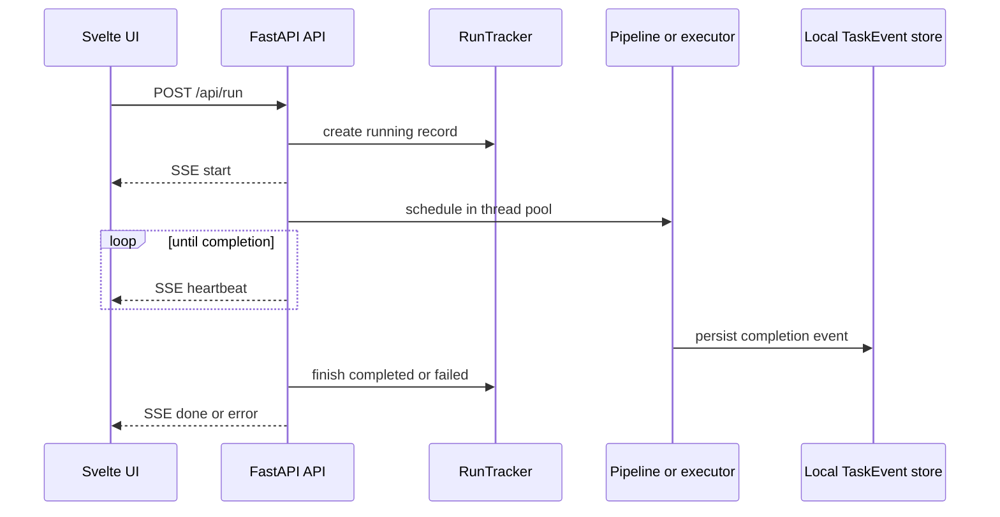

## Boundary model

The open-core web application is an **operator surface for a single local installation**, not a multi-tenant control plane. `create_app()` creates a FastAPI application, supplies its event directory and configuration as application state, wires the API routers, and serves a built static UI when it exists. The separately built `ui/` application is a Svelte 5/Vite client; it consumes relative `/api/...` endpoints and opens drawers for runs, telemetry, gateway, Cloudflare, marketplace, and workflow operations.

> **Security posture — localhost only.** The open-core web API deliberately has no authentication and uses permissive CORS (`*` origins, methods, and headers), including the endpoint that starts file-writing, credit-consuming work. Do not bind or reverse-proxy it to an untrusted network. Authenticated team deployment is explicitly outside this distribution.

The server adds or propagates a correlation identifier on each HTTP response. It also starts a best-effort watchdog thread: every two minutes it reaps stale run records using the configured A2A task timeout and telemetry stale factor. A reaper error is intentionally swallowed so it cannot affect request processing.

## Local lifecycle: runs, results, and streams

A run has two distinct local persistence surfaces:

* **In-flight state:** `RunTracker` records in `.voly/runs/`, including heartbeats, roles, graph state, parent/child relationships, and cancellation intent. `/api/runs` hides child runs by default, can filter to active records, and `/api/runs/{task_id}` retrieves an individual record.
* **Completed result:** task-event JSON in `.voly/events/`. The web service reads these files newest first, tolerates a missing directory or malformed/half-written file, and caps list sizes. The task list, task detail, and summary endpoints are derived from this local store.

`POST /api/run` is an SSE endpoint rather than a conventional JSON request. It first creates a `RunRecord`, emits a `start` event, schedules blocking pipeline/executor work in a configurable shared thread pool, emits a heartbeat every 15 seconds while waiting, and concludes with `done` or `error`. The response has `text/event-stream`, disables caching, and requests that proxy buffering be disabled. If the browser disconnects, the generator stops but the blocking executor cannot be forcibly cancelled and continues in the background; therefore an operator can still inspect its run record and eventual task event.

This shows the local SSE dispatch path and its durable observation points.

Dispatch is shared by the SSE route and the non-streaming service helper. With `executor: "pipeline"`, the server analyzes the task: a complex multi-capability task can remain on local A2A orchestration, a code-generation task can be promoted to `claude-code`, and text-only work remains in the pipeline. An explicit `review-until-clean` workflow is a bounded developer/reviewer loop; it rejects `dry_run` because rolling back each development lap would leave nothing for review. `dry_run` for an ordinary executor run still performs the work but rolls back file changes and returns preview metadata.

Cancellation is deliberately cooperative. `POST /api/runs/{task_id}/cancel` only records `cancel_requested`; it returns a conflict for an absent or completed record and does **not** interrupt an active subprocess. This contract is exposed identically by the MCP facade.

The tasks stream is separate from run dispatch. `GET /api/tasks/stream` polls local event files every five seconds, sends an `init` snapshot on first connection (including reconnect), sends later additions as `new`, and emits heartbeats when there is no change. The UI uses this stream alongside explicit run tracking so CLI-started work is observable too.

## Workflow SDK API

`/api/workflows` is a second SSE surface for SDK workflow documents, not a duplicate execution engine. It compiles via the existing SDK and delegates execution/resumption to `PlanRunner`. Workflow plans are persisted in `PlanStore`; list and detail endpoints select plans whose metadata identifies them as SDK workflows. While a plan runs, the route polls that same store once per second and emits node events only when a step status changes, followed by a final `done` event. Thus the UI, CLI, and Python resume path observe the same persisted plan instead of maintaining divergent UI state.

The API can validate a workflow document without running it, resume an existing SDK plan, and submit approve/reject feedback for an approval node. Approval failures are fail-closed at the HTTP boundary: missing plans are 404, conflicting decisions are 409, and invalid approval operations are 400.

## Svelte operator behavior

The run drawer performs two advisory preflight gates before dispatching: it asks for uninstalled marketplace-skill suggestions and detects a technology stack, requiring the operator to confirm detected stack entries or select a fallback category. Either service failure is non-blocking. Browser attachments are not uploaded as multipart data: up to five accepted text files, each limited to 200,000 bytes, are read locally and concatenated into the submitted task prompt. This means their content follows the same exposure and execution implications as text typed into the task field.

The client parses the SSE `data:` JSON frames from `/api/run`, immediately inserts the `start` payload into its live-run store, and refreshes completed tasks after `done`. It uses `EventSource` for the task-event stream. The UI build is independent (`vite` development, build, and preview scripts), while the Python server serves its generated static output when present.

## MCP: a second local transport, not a remote controller

The MCP server is a transport facade over `voly.web.service`, which centralizes the local event and run-store operations used by HTTP as well. It defaults to `127.0.0.1:7799` and supports streamable HTTP, SSE, or stdio; exposing another bind address is an intentional deployment decision.

Read tools list/get runs and tasks, return local aggregate statistics, and report provider/executor health. The write tools start a run asynchronously, request cooperative cancellation, or record human feedback. Starting returns a task identifier promptly because MCP tool calls cannot hold an SSE connection open; callers poll the run and then retrieve the finished task. Tool annotations distinguish read-only operations from destructive, non-idempotent run starts and safe/idempotent state changes, so an approval-capable host can apply policy correctly. The bundled MCP manager is separate: it registers built-in or custom subprocess MCP server definitions and can render a Claude `mcpServers` configuration.

## Cloudflare services are optional integrations

Cloudflare Workers are deployable service boundaries with their own persistence and optional bearer-token check: when a Worker `API_TOKEN` binding is unset, its code accepts requests; when it is set, callers must present a matching `Authorization: Bearer` token. The workers also use permissive CORS, so deploy them with appropriate token and network/domain controls. They are not implicitly enabled by the local UI.

| Service | Responsibility and protocol | Persistence and failure boundary |
| --- | --- | --- |
| Capability | `POST /match` ranks filtered executor profiles by capability and operational scores, returning one recommendation, fallbacks, and exclusions. The local client uses it only for balanced routing. | The Worker reads D1. On timeout, HTTP error, malformed response, unavailable Worker, or a non-balanced policy, Python falls back to local capability profiles and scoring. The returned remote executor id is resolved against the local registry. |
| Memory | Adds an embedding through Workers AI, stores searchable vector metadata in Vectorize, full memory in D1, and a JSON copy in R2; search embeds the query and returns semantic matches. | Local `MemoryStore.add()` writes SQLite **before** attempting remote replication. Search prefers nonempty remote results but logs errors and falls back to local FTS; semantic search can fall back to local embeddings or FTS. Remote memory is an enhancement, not the only retained copy. |
| Telemetry | Accepts a single event or batch at `/events` (and `/ingest` alias), indexes selected fields in D1, and writes event JSON to R2; list queries can filter by executor and status. | VOLY always first writes the complete local TaskEvent. Remote analytics is sent only with explicit cloud-analytics enablement and a configured endpoint; it is an allowlisted, sanitized record that excludes prompts, results, errors, paths, reports, artifacts, logs, and A2A assignments. Upload errors are logged without failing the local run. |
| Spend and AG-UI | Proxies spend record/check/summary/recent requests to a global `SpendTracker` Durable Object. It also allocates per-session AG-UI Durable Objects with WebSocket and event URLs. | Spend entries are durable-object SQLite rows. An AG-UI session retains at most 200 events, broadcasts posted or peer WebSocket messages, and can replay retained events in chronological order. |
| A2A | Publishes built-in or registered agent cards and persists submitted tasks in D1. A queued task moves from `submitted` to `working`, then the queue consumer invokes an agent Worker/service; it can be completed or failed through task endpoints. | Queue messages are acknowledged after processing and retried on thrown processing errors. A non-success agent response marks the task failed and records a truncated dispatch error. If no agent binding or URL is configured, the task has already been marked working but cannot be dispatched, so deployment configuration must be validated. |

The capability Worker and local API make the fallback explicit: `/api/capability/match` proxies to the configured Worker when possible, otherwise runs the local matcher. This preserves local operation and makes hosted ranking advisory rather than authoritative.

## Headroom and remote-memory operations

Headroom is an optional local context-compression proxy, not a Cloudflare Worker. `HeadroomManager` targets `http://127.0.0.1:<port>` (default 8787), starts `headroom proxy`, checks socket/`/health` readiness, and can send messages to `/api/compress`. When compression fails it returns the original messages, preserving task execution. Pipeline setup starts it only when configured and shuts down the manager during pipeline shutdown. The Headroom agent-hooks plugin invokes `headroom init hook ensure` at Claude Code/GitHub Copilot CLI startup/resume and before Bash or PowerShell tool use; the command ensures a matching durable Headroom deployment is running.

Memory configuration can be `local`, hybrid Worker-backed, or Cloudflare Agent Memory-backed. The local SQLite store is created at the configured `db_path`; remote client construction is skipped for `local` and only occurs when the optional configuration resolves. For Agent Memory, profile scoping can be project-derived or explicit and an immutable scoped view controls checkpoint ingestion. Do not treat a remote service outage as permission to lose or rewrite local memory: it is handled as a best-effort replication/retrieval failure.

## Operating and changing these boundaries safely

1. Keep the FastAPI UI and MCP listener loopback-only unless an authenticated, separately secured deployment boundary is added. Permissive CORS is not an access-control mechanism.
2. Treat `cwd` and task text as privileged operator input. A run can create a greenfield directory/repository or invoke file-writing executors; `dry_run` mitigates filesystem persistence, not execution cost or prompt disclosure.
3. Configure remote URLs and tokens through configuration/environment mechanisms; never put live secrets in source, wiki pages, or client-side code. Confirm Worker authentication is enabled before exposing a Worker endpoint.
4. Preserve local-first ordering: TaskEvent files and local memory must remain usable if Cloudflare endpoints fail. If changing telemetry fields, maintain the remote allowlist rather than serializing the full local event.
5. For worker changes, preserve bounded request limits and Durable Object retention semantics; they prevent unbounded list/event responses and define what AG-UI history can be replayed.

## Focused verification

`tests/test_web_api.py` establishes the local operator baseline: status, task listing/filtering/summary, safe PNG artifact serving, gateway status, telemetry endpoint tolerance, and API docs. In particular, the artifact test verifies that traversal-like artifact names do not escape the per-task directory.

`tests/test_runs_api.py` checks empty and active run views, root/child grouping, heartbeats and elapsed fields, cooperative cancellation behavior, and the lifecycle bridge from an executor run to a completed or failed `RunRecord`. It also verifies that the web route selects the explicit review workflow.

`tests/test_mcp.py` covers registration/config generation behavior for the MCP manager, including a built-in definition without an `env` key and rejection of an unknown built-in. These tests complement, rather than replace, deployment tests for actual MCP hosting and Cloudflare credentials.
