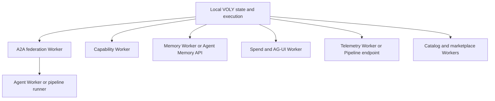

Cloudflare services are **optional remote integration boundaries**, not the authority for a normal local VOLY run. URLs are generally configured with environment-expanded `voly.yaml` fields and/or their documented environment fallbacks; an unresolved `${...}` value does not enable a Python worker client. Keep credentials in the environment or Worker secrets, never in `voly.yaml` or documentation.

## Boundary map

This shows the optional remote boundaries around local VOLY behavior; A2A can dispatch onward to the agent service.

| Boundary | Remote responsibility | Local authority and fallback |
| --- | --- | --- |
| A2A federation | Agent cards and persisted task coordination, with asynchronous dispatch | The Python client is not created without a federation URL; the normal orchestration path is not replaced by it. |
| Capability | Shared executor profiles, match rankings, and verified evaluated-pack snapshots | Capability packs, evidence, activation decisions, and the sync receipt originate locally. |
| Memory | Semantic retrieval from the custom Memory Worker, or the managed Cloudflare Agent Memory API | `MemoryStore` first writes the local SQLite/FTS5 record; failed/empty remote search falls back to local FTS and optionally local sentence-transformer ranking. |
| Spend and AG-UI | Globally serialized spend ledger and per-session event/WebSocket state | Failure to record/check remote spend is intentionally non-fatal; the local app may use its own AG-UI endpoint. |
| Telemetry | Queryable remote copy of sanitized analytics | Full `TaskEvent` JSON is written locally first. Remote delivery requires explicit `cloud_analytics.enabled` consent and delivery failures are logged, not raised to the run. |
| Catalog and marketplace | Remote model catalog and shareable skills/plugins | Catalog sync saves `.voly/catalog/models.json` first. Marketplace discovery is best-effort and installed local skills/registry remain the execution input. |

## A2A federation and agent execution

The A2A Worker uses D1 for agent cards and task records and a Queue for asynchronous task dispatch. On first agent listing, card lookup, or task creation it seeds built-in cards if the D1 table is empty. `POST /tasks` persists a `submitted` task; it queues only when `async` is not `false` **and** an agent was selected. Its queue consumer accepts a task only while it is `submitted`, sets it to `working`, and invokes `/agents/:name/run` through a service binding or configured agent URL. Exceptions retry the Queue message; a non-successful agent response marks the task failed with bounded dispatch-error metadata. A missing agent target leaves the stored task in `working`, so deployment must ensure an agent binding or URL exists before enabling asynchronous dispatch.

The Agent Worker is the complementary execution boundary. `/agents/:name/run` can first inspect the federation task and skip a terminal task, then calls a configured pipeline runner; if none is configured, it runs its Worker AI inference path directly. For a federated task it posts either completion or failure back to the A2A Worker. It exposes agent-card discovery, `/infer`, a static tech registry, and an MCP endpoint as separate capabilities.

The Python `FederationClient` supplies the card and task HTTP operations and turns HTTP/URL failures into `FederationClientError`. It is disabled when neither `a2a.federation_url` nor `CF_WORKER_A2A_URL`/`A2A_FEDERATION_URL` resolves. Configure the client bearer separately as `VOLY_A2A_TOKEN` or `CF_WORKER_A2A_TOKEN`; the Worker enforces its `API_TOKEN` only when that Worker secret is set.

## Capability profiles and evaluated snapshots

The Capability Worker persists role definitions, executor capability dimensions/constraints, operational metrics, and evaluated snapshots in its D1 binding. Profile seeding deliberately skips an executor that already has learned runs, preventing static seed data from overwriting learned capability measurements. Evidence updates use an EMA and only update a dimension if its last update is older than five minutes; matching ranks available executors by capability and operational routing score, returning one recommendation, up to four fallbacks, and the remaining candidates as excluded.

Evaluated-pack replication has a stricter boundary than ordinary profiles. The local CLI refuses to sync while any pilot is incomplete or when nothing has been activated. It creates a deterministic schema-v1 snapshot of at most 32 packs, containing definitions, decisions, metrics, and SHA-256 provenance hashes—not raw evidence or prompts. The Worker requires `EVALUATED_SYNC_TOKEN`, validates bounds and the canonical snapshot hash, and makes duplicate snapshot IDs idempotent. The client uploads, reads the snapshot back, and writes its local verified receipt atomically only if the returned hash and canonical content match. Any later local pack/evidence state change invalidates that receipt.

Set `capability.worker_url` (or `VOLY_CAPABILITY_WORKER_URL`) and put the evaluated-sync bearer in `VOLY_CAPABILITY_SYNC_TOKEN`; it is intentionally required rather than falling back to a general account token.

## Memory: custom Worker, managed API, and local-first behavior

`memory.backend` selects `local`, `worker`/`hybrid`, or `agent_memory`. For the custom Memory Worker, adding a memory embeds title plus content with Workers AI, upserts the vector in Vectorize, stores the complete row in D1, and writes a JSON archival object in R2. Search embeds the query and returns Vectorize matches (with an optional category filter applied after matching); D1 serves complete records and listings. Thus Vectorize is the semantic index, D1 is the structured complete-record store, and R2 is an object copy rather than a retrieval source.

With `agent_memory`, `AgentMemoryClient` maps the MemoryClient-like operations to Cloudflare Agent Memory profile endpoints and additionally exposes conversation ingest, summaries, and deletion lifecycle operations. The adapter preserves VOLY category/title/tags by placing them in free text; Agent Memory recall has no category filter and no importance field.

Regardless of remote backend, `MemoryStore.add()` commits to local SQLite before attempting remote replication and catches remote errors. Searches prefer non-empty remote results but fall back to local FTS5 when the client is missing, errors, or returns no rows; `search_semantic()` further falls back to local sentence-transformers when available, then FTS. Configure the custom Worker with `memory.remote_url` or `CF_WORKER_MEMORY_URL`/`MEMORY_URL`, and use `CF_WORKER_MEMORY_TOKEN` (with `CLOUDFLARE_API_TOKEN` as its current client fallback). Managed Agent Memory instead needs an account ID plus namespace/profile and resolves only `CLOUDFLARE_API_TOKEN` or `CF_API_TOKEN`.

## Spend ledger and AG-UI sessions

The Spend Worker routes all spend calls to the single Durable Object named `global`; that Durable Object owns a SQLite ledger. It records agent, cost, task, model, provider, and time, checks an agent's trailing 24-hour total with a strict `spent < limit` result, produces summaries capped at 30 days, and caps recent entries at 100. `record_task_spend()` only attempts this after a positive-cost event and silently ignores remote failures; `check_agent_spend_limit()` similarly returns `None` when unavailable. Set `spend.remote_url` or `CF_WORKER_SPEND_URL`/`SPEND_URL` and use **only** `CF_WORKER_SPEND_TOKEN` for this Worker bearer—an account API token is deliberately not used as a fallback.

The same Worker routes an AG-UI session ID to its own Durable Object. It returns `ws_url` and `events_url`, persists each posted or WebSocket event, broadcasts it to connected peers, and retains only the latest 200 events per session. The WebSocket route itself is not protected by the outer bearer check, whereas session creation and HTTP event/state reads are; protect its public exposure accordingly. The Python configuration can independently supply `agui.remote_url` or `CF_WORKER_AGUI_URL`/`AGUI_URL`.

## Telemetry ingestion and consent

`emit_event()` writes the complete local event to `.voly/events/<task_id>.json` before it considers a remote target. It sends only an allowlisted Cloud Analytics record—excluding prompts, results, free-form errors, repository paths, reports, artifacts, stage logs, and A2A assignment payloads—and only if `cloud_analytics.enabled` is true as well as telemetry pipeline settings and an endpoint being present. The remote endpoint accepts `/events` and `/ingest` batches, ignores records without `task_id`, writes each payload to R2 at `events/<task_id>.json`, and upserts its query index in D1. Reusing a task ID overwrites the R2 object and D1 index rather than creating an event history.

Configure the endpoint with `telemetry.pipeline_url` or `CF_PIPELINE_TELEMETRY_ENDPOINT`/`PIPELINE_TELEMETRY_ENDPOINT`, and bearer with `CF_PIPELINE_TELEMETRY_TOKEN` (currently falling back to `CLOUDFLARE_API_TOKEN`). The legacy direct R2 path is also consent-gated and needs its own endpoint plus access-key credentials. The Worker’s `API_TOKEN`, if set, protects ingestion and retrieval endpoints.

## Catalog and marketplace services

The Catalog Worker holds enabled model metadata in D1 and can filter verified model rows. `voly catalog sync` obtains models and saves the local JSON cache; its optional `--push` then upserts them remotely, swallowing remote errors. Its `/match` is explicitly deprecated: it proxies to a configured Capability endpoint when available or returns a legacy heuristic recommendation with a migration target.

The Marketplace Worker offers remote skill/plugin browsing, publish/sync, archive, and skill reindexing. D1 is the primary catalog; KV caches individual skill reads; R2 backs up skill payloads and supplies downloads when the D1 content column is empty; Vectorize powers semantic search, with D1 FTS as its fallback. Publishing a skill writes D1 synchronously and schedules R2 mirroring, Vectorize indexing, and KV invalidation asynchronously, so callers must tolerate temporarily stale search/cache results. The checked-in Worker routes and `MarketplaceClient` do not add bearer authentication; if publication must be restricted, enforce it at the deployment edge or extend the Worker before exposing write routes.

The marketplace URL is opt-in through `registry.marketplace_url` or `CF_WORKER_MARKETPLACE_URL`/`MARKETPLACE_URL`. Pipeline scouting catches marketplace errors, and web routes explicitly fall back to the local registry/catalog when the remote service is unreachable.

## Operations checklist

1. Deploy and bind the state service appropriate to each Worker: D1 for relational records and indexes, R2 for object copies/payload fallback, Vectorize for semantic nearest-neighbor search, Durable Objects for serialized spend or session state, and Queue only for A2A asynchronous delivery.
2. Set a distinct Worker `API_TOKEN` secret where that Worker supports it and configure the matching Python bearer variable. A Worker with an unset optional `API_TOKEN` accepts requests, so do not assume bearer protection exists by default.
3. Set only the remote URLs you intend to use. Confirm `/health` first, then exercise the focused operations: A2A create/list task, memory add/search, spend record/check, and telemetry ingest/list.
4. Keep local state enabled: `.voly/memory.db`, `.voly/events`, local catalog cache, and evaluated capability stores/receipts are resilience mechanisms, not disposable caches.
5. Before sending telemetry off-host, explicitly enable `cloud_analytics.enabled` and review the allowlisted record contract. Before capability sync, activate the local packs and provide `VOLY_CAPABILITY_SYNC_TOKEN`.

## Focused regression coverage

The Python tests verify that federation and memory clients are absent without a URL and serialize their expected request shape; federation HTTP errors surface as a domain error. Spend tests specifically guard against accidentally using `CLOUDFLARE_API_TOKEN` as the Worker bearer. Capability-sync tests cover deterministic, bounded snapshots without run IDs/timestamps, exact authenticated read-back before receipt creation, invalidation after local evidence changes, and rejection of tampered read-back content.

## Related pages

- [Architecture overview](/openwiki/architecture/overview.md)
- [Capabilities](/openwiki/governance/capabilities.md)
- [Entrypoints and safety](/openwiki/operations/entrypoints-and-safety.md)
- [A2A and pipeline](/openwiki/orchestration/a2a-and-pipeline.md)
- [Quickstart](/openwiki/quickstart.md)
