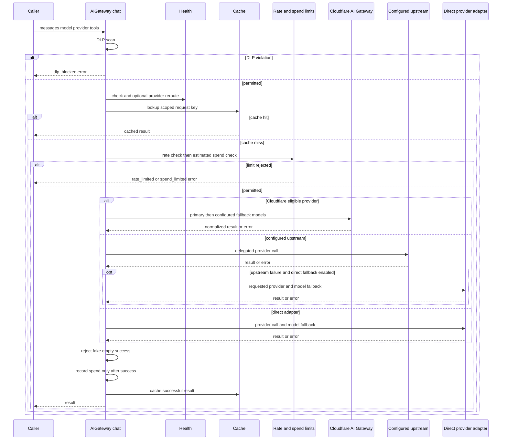

## Boundary map

`AIGateway.chat()` is the Python model-call boundary for pipeline and reasoning callers. It owns request safeguards, local accounting, response normalization, cache behavior, and *model/provider* retry behavior. It is not the boundary for executor subprocesses: in particular, the Wrangler executor uses the Agent Worker's `/infer` protocol and the worker's independently configured Cloudflare route.

Cloudflare Workers are remote services, not an implementation detail of the Python gateway. Their request and response fields, authentication headers, and JSON serialization must be treated as cross-runtime contracts. A worker can be deployed or evolved separately from the Python process; make compatible additions, preserve field meanings, and test both sides when changing a payload.

| Boundary | Owner and purpose | State and authorization |
|---|---|---|
| Python `AIGateway.chat()` | Model request policy, routing, local cache/metrics/spend limit | Process-local gateway state; provider or Cloudflare credentials |
| Cloudflare AI Gateway / Workers AI | Provider proxy/routing or Workers AI inference | Cloudflare account, gateway ID, and gateway or account token |
| Agent Worker `/infer` | Wrangler-oriented code generation response | Optional `API_TOKEN`; route-schema call or `env.AI` binding |
| A2A federation Worker | Agent cards and queued task lifecycle | D1 task/card records, Queue dispatch, optional bearer token |
| Spend Worker | Persistent per-agent spend records | One global Durable Object; `API_TOKEN` matches `CF_WORKER_SPEND_TOKEN` |
| Telemetry Worker | Remote event persistence and query index | R2 full JSON object plus D1 projection; optional bearer token |

## The `chat()` contract and middleware order

Callers supply messages, model, provider identity and optional system prompt, tools, agent identity, cache scope, and `allow_provider_reroute`. Providers normalize their native APIs into a common result shape: `content`, `model`, `stop_reason`, normalized `tool_calls`, and token counts in `usage`. Canonical OpenAI-style function-tool specifications are adapted at the edge for Anthropic and Google rather than leaking provider-specific tool shapes to callers.

*The sequence shows the middleware and provider/upstream branches inside the `AIGateway.chat()` model-call boundary.*

The ordering is significant:

1. When enabled, DLP scans serialized messages first and returns `dlp_blocked` without a provider call. Disabling the gateway bypasses all middleware and calls the direct adapter.
2. Health is consulted before the cache key is built. By default an unhealthy requested provider can be replaced from the global priority list; callers that already own tier-aware selection, such as the A2A provider fallback, must pass `allow_provider_reroute=False` to prevent an invisible cross-tier replacement.
3. The cache lookup precedes rate and spend checks. Its SHA-256 input includes messages, model, provider, system text, extra keyword arguments, and the effective project-state scope. A cache hit is marked `cache_hit` and neither performs a model call nor spends quota. Instances can persist cache entries, but scope is what prevents same-prompt collisions between projects or revisions.
4. A cache miss is rate-limited and preflighted against an estimated global/per-agent daily spend budget. Rejections return structured `rate_limited` or `spend_limited` errors.
5. After a successful result only, the gateway records calculated token cost when usage has tokens, otherwise the pre-call estimate, records metrics, and caches the result. Failed calls must not consume the local spend limit.

### Routing, retries, and unhealthy providers

With an account ID, the Cloudflare path is selected only for the built-in CF-proxied providers (`anthropic`, `openai`, `google-ai-studio`, and `deepseek`). The primary model plus configured fallback chain is attempted sequentially up to the configured retry count; unhealthy entries are skipped. Successful fallback results expose `fallback_used`, `fallback_provider`, and `fallback_model`.

For non-CF traffic, a configured upstream such as `omniroute` receives the request first unless it was explicitly selected as the provider. `upstream_model` can override the forwarded model. If the upstream errors or produces a fake empty success and `upstream_fallback_direct` is enabled, the gateway records a fallback and uses the originally requested direct adapter and its model fallback chain; the successful response is annotated `upstream_fallback`. Turning that switch off returns the upstream error instead.

A transport response with empty content is converted to an `empty_content` error and enters ordinary *model* fallback, except when its terminal reason indicates a legitimate truncated/tool completion (`max_tokens`, `tool_use`, `length`, or `tool_calls`). This signal is deliberately not an executor billing-fallback signal. This distinction matters: gateway fallback changes model/provider attempts within one `chat()` call; AgentRunner billing fallback changes the executor and is controlled elsewhere.

Billing/auth-like provider errors can mark the provider unhealthy in the process so subsequent calls skip it. Runtime exclusions expire after `VOLY_PROVIDER_EXCLUDE_TTL` (900 seconds by default; `0` means no expiry), after which normal health evaluation resumes. Gateway configuration errors such as invalid CF gateway authentication or a missing stored provider key are classified as authorization/configuration failures rather than billing failures.

## Cloudflare credentials and BYOK

Normal Cloudflare gateway calls use the gateway base URL `https://gateway.ai.cloudflare.com/v1/{account_id}/{gateway_id}` and `cf-aig-authorization` when configured. Workers AI direct calls instead use the Cloudflare account REST endpoint and an account token. Provider adapters impose a request timeout of 15 seconds by default; when a total timeout is configured, their HTTP timeout is the larger of the two values so a slow live response can complete before model fallback is considered.

BYOK changes credential routing for supported provider names, not the `chat()` middleware. It activates only when `byok_enabled` plus a Cloudflare account and gateway token are available; `VOLY_BYOK` can enable it from the environment and `byok_providers` can restrict its provider subset. Anthropic, OpenAI, Google AI Studio, and DeepSeek map to CF provider slugs; unsupported providers continue to use their environment-key adapters.

On the default BYOK REST path, Python sends an account bearer token to `https://api.cloudflare.com/client/v4/accounts/{account}/ai/v1/chat/completions`, a `cf-aig-gateway-id`, and a provider-qualified model. The provider API key is not sent. `VOLY_CF_GATEWAY_API=compat` is the compatibility escape hatch that instead uses the gateway `/compat/chat/completions` endpoint and `cf-aig-authorization`. The credential helper also translates eligible Anthropic minor model IDs from the local hyphen form to the CF catalog's dotted form.

Provider keys are stored in Cloudflare Secrets Store as `{gateway_id}_{provider_slug}_{alias}` with scope `ai_gateway`. The secrets client uses an account API token to create, list metadata for, and delete these entries. Values are write-only: it avoids logging request bodies, lists only names/metadata, and cannot read key values back. Health checking recognizes a configured BYOK-supported provider as healthy without its local provider key, but it still requires Cloudflare account/token credentials.

## Python-to-worker protocols

### Agent inference and A2A federation

`POST /infer` on the Agent Worker accepts JSON with required `task` and optional `agent`, `context`, `model`, `system`, and `max_tokens`. Its response is the stable envelope `{success, content, model, provider?, error?, input_tokens?, output_tokens?}`. The endpoint requires `Authorization: Bearer` only when the worker has `API_TOKEN`. It constructs system/user messages, calls the Cloudflare AI Gateway `/compat/chat/completions` route when `CF_ACCOUNT_ID` and `CF_AIG_TOKEN` exist, and otherwise uses `env.AI.run()`; no gateway network failure falls through as an error, but instead triggers the binding fallback. A configured gateway HTTP error is returned as a 502 response rather than retried through the binding.

The worker's code-edit instruction is also a protocol: output file changes as complete `### FILE: relative/path` fenced blocks. Python's patch applier relies on that serialization, so edits to the prompt format and parser must be coordinated.

The federation protocol has a separate Python client and Worker state machine. The Python client posts `{agent_name, title, description, async, metadata}` to `/tasks`; the worker writes `submitted` to D1 and queues a message only for an async request with an assigned agent. Queue processing accepts only a still-`submitted` task, changes it to `working`, and dispatches `{task, task_id}` to the Agent Worker. The Agent Worker avoids rerunning completed/failed task IDs, then calls its pipeline runner or local inference and posts the result to `/complete` or `/fail`. Completing an already completed task is a no-op, which supports callback retries.

### Spend and telemetry

`SpendClient` speaks a small JSON HTTP contract to a configured `CF_WORKER_SPEND_URL` (or `SPEND_URL`). Its bearer is **only** `CF_WORKER_SPEND_TOKEN`; it must match the Spend Worker's `API_TOKEN` and must not be replaced with `CLOUDFLARE_API_TOKEN`. The public record payload always includes `agent`, `cost_usd`, `task_id`, `model`, and `provider`; `/spend/check` returns the agent's rolling-24-hour total and whether it is below the supplied limit. The reference Worker forwards those requests to a single `global` Durable Object, whose SQLite table persists individual records and derives check, summary, and recent responses. Recording has no idempotency contract, so callers must not assume a retried record is deduplicated.

Telemetry delivery is opt-in remote analytics. Python first persists the local event, then posts a JSON **array** containing a sanitized pipeline record with a bearer token when configured; delivery failures are caught and logged at debug level so they do not undo local persistence. The telemetry Worker accepts an object or array, ignores entries with no `task_id`, writes the complete JSON record to R2 at `events/{task_id}.json`, and upserts a selected projection in D1 for list/filter queries. Therefore field names used for the D1 projection (`duration_seconds`, `input_tokens`, and `output_tokens`) are part of the worker contract and must be kept aligned with the Python serialization before relying on indexed values; the R2 object preserves the submitted record.

## Operating and changing safely

- Configure `CF_ACCOUNT_ID`, gateway ID, and an appropriate gateway/account token deliberately. A Python `AIGateway` can run middleware without an account ID, but it will take direct-provider paths.
- Keep the CF dashboard route schema distinct from Python fallback configuration. The Agent Worker's dynamic `dynamic/ai_route` route is a Cloudflare-side primary/fallback decision; `AIGateway.fallback.chain` is Python-side and operates around direct/CF calls.
- Use the separate service tokens: A2A uses `VOLY_A2A_TOKEN` or `CF_WORKER_A2A_TOKEN`; spend uses `CF_WORKER_SPEND_TOKEN`; each worker's `API_TOKEN` gates its protected endpoints. Do not conflate them with Cloudflare account credentials.
- Changes to provider adapters must preserve normalized result and tool-call shapes, stop-reason propagation, and fake-empty semantics. Validate cache scope, successful-only spend accounting, upstream fallback, and health exclusion using `tests/test_ai_gateway.py` and `tests/test_gateway_provider_health.py`.
- Changes to BYOK must preserve the eligibility map, token preconditions, no-provider-key transport invariant, Secrets Store naming/scope, and write-only behavior; use `tests/test_byok_credentials.py` and `tests/test_cf_secrets.py`.
- Treat deployment/version changes of `/infer`, federation, spend, and telemetry as API work: retain the JSON field contract, Bearer authentication behavior, and retry/idempotency assumptions across Python and TypeScript.
