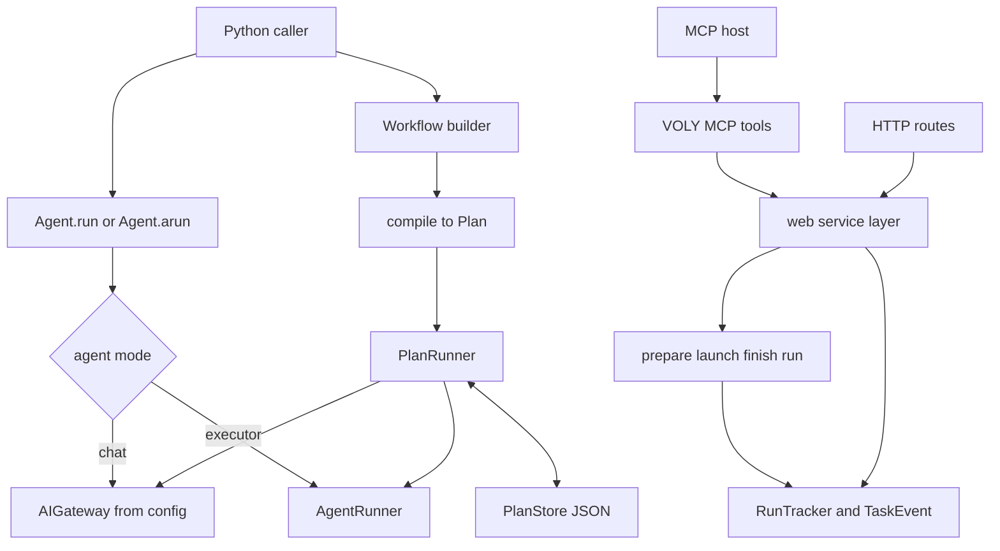

VOLY has two complementary programmable surfaces:

- **Python SDK** — `from voly import Agent, Workflow` provides typed entrypoints for chat, executor work, and declared workflow graphs. It is a facade over the existing gateway, `AgentRunner`, `PlanRunner`, and `PlanStore`, rather than a new provider integration or scheduler.
- **MCP server** — `voly mcp serve` makes a deliberately small set of run and telemetry operations available to an MCP host. It uses the same transport-neutral service functions as the web API, so it observes and starts the same runs rather than maintaining a parallel control plane.

These should not be conflated with VOLY's *outbound* MCP configuration support in `voly.tools.mcp`: the SDK tool registry is not an MCP client, while `voly/mcp/` is VOLY acting as an MCP server.

## Shared execution model



*The SDK compiles workflow declarations into the Plan runtime, while MCP and HTTP use one service and run-dispatch path.*

### `Agent`: a governed facade

`Agent` is exported from the top-level `voly` package alongside `Workflow`, result types, errors, and six topology presets. `Agent.run(task, *, cwd=None, timeout=300, max_turns=30)` returns an `AgentResult`; `arun()` runs that same synchronous implementation in a worker thread.

An agent has two modes:

- **`chat`** (default) constructs the gateway through `gateway_from_config()` and calls `AIGateway.chat()`. Thus configured DLP, spend limits, cache, rate limits, fallback chain, and BYOK wiring remain on the request path. Gateway errors become an unsuccessful `AgentResult`, and a `TaskEvent` is emitted with `workflow="sdk-agent"`.
- **`executor`** requires an explicit `cwd` and delegates to `AgentRunner.run()`. Instructions are folded into the task, and the result exposes executor attribution, touched files, cost, tokens, and duration. When evidence is enabled, `evidence_id` is the executor task ID.

The SDK package is intentionally prohibited from importing provider or raw HTTP client libraries directly. This preserves gateway governance and makes the facade safe to extend without accidentally bypassing policy.

Model and executor selection follows existing routing. An explicit model or executor wins; a tier resolves at compile/selection time. If the relevant value is absent, capability routing can supply one when `config.capability.enabled` is enabled; otherwise standard model or executor defaults apply.

### Agent tools and structured output

`Agent(tools=[...])` takes registered **names**, not arbitrary callables. Names are resolved when the agent is constructed; any unknown name raises `AgentError`. On chat calls the agent sends the allowed tool schemas to the gateway, executes only calls in that agent's own allowlist, sends results back as a user message, and stops after `max_tool_steps` (default 6). A model request for another registered tool is recorded as failed but never executed; exhausting the bound produces a failed result instead of a partial success. Built-in `current_time` and `calculator` are side-effect-free examples.

`output_schema` accepts a Pydantic model class or a JSON-schema dictionary. It is prompt-based structured output: the schema is added to the system instruction and returned text is parsed afterward. Pydantic output is validated into an instance; a raw dictionary checks only that output is an object with declared top-level required keys. It is not a provider-native `response_format` contract or full JSON Schema validation.

> **Workflow limitation:** compilation targets `PlanStep`, which has neither `tools` nor `output_schema` fields. A standalone `Agent` supports both, but a `Workflow` node currently does not carry them into its compiled plan. Likewise, `Workflow.add(..., timeout_seconds=...)` stores a per-node hint but does not enforce a per-node timeout.

## `Workflow` is a builder, not another runtime

A workflow declares nodes and dependencies, then `compile()` creates a normal `Plan` with `metadata["kind"] = "sdk_workflow"` and the workflow name. It combines an agent's instructions with the node or workflow task, maps the agent mode/model/provider/executor and dependencies to a `PlanStep`, and asks the existing `PlanEngine` to validate duplicate IDs, unknown dependencies, and cycles. `run()` then gives the plan to `PlanRunner`, which persists state through `PlanStore`; `WorkflowResult` and `NodeResult` are reconstructed from persisted plan steps rather than retained live agent results.

```python
from voly import Agent, Workflow

workflow = Workflow("research-review")
workflow.add("research", agent=Agent("researcher", instructions="Find verifiable facts"))
workflow.add("review", agent=Agent("reviewer"), depends_on=["research"])
result = workflow.run("Compare two markets")
```

A dependent step receives stored outputs of its verified dependencies as bounded plain-text context at execution time. This handoff belongs to `PlanRunner`, so it works for SDK-compiled and hand-written plans alike. Independent chat steps can execute in bounded waves controlled by `workflow_sdk.max_parallel_nodes`; executor steps remain serialized because they share the plan working directory. `Workflow.run()` defaults to `mode="active"`, so verification failure blocks dependents; `mode="shadow"` is explicit and only softens ordinary verification failures.

### Persistence, pause, and resume

`PlanStore` writes plans atomically under the configured plan store directory, and treats persistence I/O failure as an error because plan state is the source of truth for gates. A workflow-level `timeout_seconds` ends the current call without failing the plan, leaving completed steps persisted and the plan resumable. `Workflow.cancel(plan_id)` aborts a persisted plan; an in-flight runner observes that abort cooperatively between steps or waves, not by interrupting an active gateway or executor call.

Resume is deliberately identity-based:

```python
first = workflow.run("Long task", timeout_seconds=30)
resumed = workflow.resume(first.plan.plan_id)
```

`Workflow.run(resume=True)` raises `NotImplementedError`. Each compile produces a fresh plan ID, so task text cannot identify the intended prior run. `Workflow.resume(plan_id)` reloads the persisted plan and recomputes runnable steps; it can also recover a step left `running` beyond `workflow_sdk.stale_running_seconds` after a process crash. Keep the plan ID from `WorkflowResult` whenever a workflow might pause, time out, or be resumed elsewhere.

### Human approval is a Plan gate

`Workflow.add(..., approval=True)` adds the `human_review` acceptance check. The node still executes and produces output, but is left in `verifying`; downstream steps cannot start until `voly.plan.approval.decide(store, plan_id, step_id, "approve" | "reject")` resolves it. Repeating the same decision is idempotent, while a conflicting or premature decision fails closed. Human and action-resolved checks remain gates even in shadow mode.

This is distinct from business-decision handling: SDK plans are tagged `sdk_workflow`, and generic plan approval operates directly on a plan step rather than through `DecisionService`.

### Reusable graph factories

`sequential`, `concurrent`, `supervisor_workers`, `reviewer_loop`, `council`, and `planner_generator_evaluator` are exported graph factories. They call `Workflow.add()` and return a normal builder; none introduces another runner. Factories enforce their size bounds rather than truncating inputs. Their aggregation or judge output is evidence for the caller, not implicit authorization: add an approval node when a human gate is required.

`reviewer_loop` is a bounded, unrolled DAG rather than a true conditional loop. Every configured generate/review pair executes; optional exit acceptance applies only to the final review because the Plan engine has no conditional skip primitive.

## MCP server: one control plane, wire-level policy

Install the MCP extra and run a server locally:

```bash
pip install -e ".[mcp]"
voly mcp serve --port 7799
```

The default is streamable HTTP at `http://127.0.0.1:7799/mcp`; `--transport stdio` supports hosts that spawn a subprocess. The server resolves its event directory once on first use. `VOLY_EVENTS_DIR` overrides it; otherwise it selects `.voly/events` in the current directory, then the home directory.

The MCP facade registers six read tools — `voly_list_runs`, `voly_get_run`, `voly_list_tasks`, `voly_get_task`, `voly_get_stats`, and `voly_health` — plus three state-changing tools:

| Tool | Backing operation | Approval meaning |
|---|---|---|
| `voly_start_run` | `service.start_run_background()` | Destructive, non-idempotent action; always requires approval |
| `voly_cancel_run` | `service.cancel_run()` | Idempotent, non-destructive action |
| `voly_submit_feedback` | `EvidenceStore.add_human_feedback()` | Idempotent, non-destructive action |

MCP annotations are **wire-level approval policy**, not descriptive metadata. Every read tool explicitly declares `readOnlyHint: true`. Start-run explicitly serializes as `readOnlyHint: false`, `destructiveHint: true`, and `idempotentHint: false`, so it remains an action that cannot be auto-approved even for a vetted endpoint. Cancel and feedback are still actions, but their non-destructive/idempotent annotations allow a host to auto-approve them only where its endpoint trust policy permits. An unannotated tool is conservatively an action that cannot be auto-approved.

`voly_start_run` validates that the task is nonempty and rejects the incompatible `dry_run` plus `review-until-clean` combination before dispatch. It returns a task ID immediately rather than streaming: MCP tool calls have one response while execution may take minutes. Hosts poll `voly_get_run` for the `RunTracker` heartbeat, then use `voly_get_task` when the final `TaskEvent` exists. The service layer invokes the same `prepare_run()`, `launch_run()`, and `finish_run()` dispatch machinery used by the web run route, and holds a strong reference to background tasks until completion.

The shared service layer is also the boundary for safe reads: it validates task IDs before file lookup, bounds list results, skips unreadable event files, and separates persisted run heartbeats from finished task events. MCP intentionally does not expose provider-key CRUD, skill installation, repository analysis, or technical preflight operations.

## Extension and operations guidance

- Add SDK behavior through the gateway, `AgentRunner`, `PlanStep`, or `PlanRunner` contracts rather than creating a second provider path or state machine. Adding workflow node features that need durable resume requires a serializable plan representation.
- Treat a new MCP tool's annotations and description as part of its security contract. Test the serialized `tools/list` payload, not just Python attributes, because hosts classify camel-case wire annotations.
- Use the SDK tool registry only for local named functions. It does not speak MCP JSON-RPC; outbound MCP server configuration for CLI executors is a separate facility.
- Use `plan_id` as the durable workflow handle. A builder can be recreated, but resume, approval, cancellation, and inspection operate on persisted plans.

## Focused verification

The focused tests enforce the architectural boundaries rather than only happy paths:

- `tests/test_sdk_contracts.py` freezes public SDK fields and signatures and scans `voly/sdk/` for forbidden direct provider/HTTP imports.
- `tests/test_sdk_agent.py` covers gateway and executor delegation, explicit `cwd`, tool allowlisting and bounds, structured-output failure, and capability routing.
- `tests/test_sdk_workflow.py`, `tests/test_sdk_presets.py`, and `tests/test_examples_workflows.py` cover compilation validation, dependency handoff, approval/pause/resume, persistence, topology shapes, and offline runnable examples.
- `tests/test_mcp_facade.py` checks the host-visible annotations, stable read/action split, start-run's non-auto-approvability, and input guards; `tests/test_mcp.py` covers outbound MCP manager built-ins separately.
