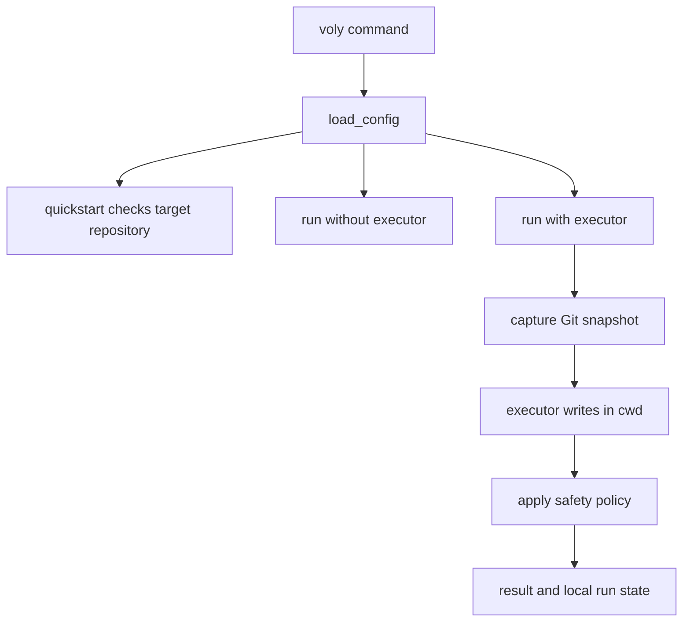

# Entrypoints, configuration, and operational safety

VOLY is operated against a selected target repository, not a repository encoded into `voly/`. Prefer an explicit `--cwd` for file-writing work, run the readiness check before a first task, and treat local `.voly/` data and `.env` files as potentially sensitive project state. For execution details, see [executor runs](../runtime/executor-runs.md); for the product structure, see [architecture overview](../architecture/overview.md).

## Installation and command surface

The distribution installs the `voly` console script, which invokes `voly.cli.main:main`. Base installation supplies the Click CLI and configuration parser. Feature dependencies are deliberately optional: use `voly[ui]` for FastAPI/Uvicorn and the dashboard, `voly[mcp]` for the MCP server (and its UI dependency), and individual extras such as `proxy`, `semantic`, `cursor`, and `dspy` only when those integrations are needed. `voly[dev]` adds the test and static-analysis tools; `voly[all]` aggregates every declared extra.

The top-level command loads configuration once into Click context, configures logging, and registers operational groups including `run`, `quickstart`, `serve`, `ui`, `mcp`, `a2a`, `hooks`, `runs`, `telemetry`, `config`, `capability`, and `workflow`. Capability startup sync is performed for normal commands when a capability worker URL is configured, but intentionally skipped for `quickstart` so readiness inspection does not contact that service.

`voly run` has two materially different paths:

* Without `--executor`, it creates a `Pipeline`; `--agent`, `--model`, `--a2a-delegate`, `--cwd`, and `--repo` influence routing or pipeline context. `--dry-run` is explicitly ignored on this path.
* With `--executor`, it calls `AgentRunner` in `--cwd` (or the process working directory), supports an executor deadline and `--dry-run`, and returns a nonzero exit status when the run fails. Use this path for file-writing safety controls.

`voly quickstart --check --cwd <target>` is the safe first operation: it is read-only, reports whether the path exists and is Git-backed, validates an existing `voly.yaml`, probes for a supported file-capable executor, and proposes a command ending in `--dry-run`. A missing Git directory is a warning rather than a blocker, but means rollback and diff protections are weaker. Without `--check`, `--yes` may create a missing target `voly.yaml`; it does not overwrite an existing one and the generated configuration has no secrets.

This shows the CLI distinction between pipeline work and the executor path where the Git-based safety policy runs.

## Configuration discovery and precedence

`load_config()` uses an explicit global `--config` path when supplied; otherwise it searches upward from the process current directory for `voly.yaml`. The upward search stops at the target repository's `.git` root, or after 20 levels for a non-Git path. This prevents a project from silently inheriting an unrelated ancestor's configuration.

Before YAML placeholders are expanded, the loader reads a package-root `.env`, then project `.env` files while walking toward that same boundary. It only assigns variables absent from `os.environ`, so process environment takes precedence and the first dotenv value loaded wins (package root before the project file). YAML strings such as `${ANTHROPIC_API_KEY}` are expanded during parsing. Do not rely on this loader to discover credentials outside the target project boundary, and never copy actual credentials into `voly.yaml`, docs, test data, or logs.

The YAML file establishes typed section values; selected operational environment variables then override or fill them. Examples include `VOLY_PROJECT_CWD`, `VOLY_A2A_TOKEN`, `VOLY_A2A_HYBRID`, `VOLY_BYOK`, `VOLY_EVIDENCE_ENABLED`, `VOLY_EVALUATION_ENABLED`, `VOLY_LLM_JUDGE_MODE`, `VOLY_PLAN_ENABLED`, `VOLY_PLAN_MODE`, `VOLY_CAPABILITY_*`, and `VOLY_PXPIPE_*`. Remote service URLs use YAML values first and fall back to named environment values when the YAML value is empty; cloud-link values have nonempty `VOLY_CLOUD_*` overrides. Treat `.env.example` as a names-and-placeholders reference, not a source of usable secrets.

The provided `voly.yaml` is an example/default configuration with models, providers, optional integrations, budgets, and paths. Its relative paths are target-project state locations. A code change that adds a configuration key must update the matching backend or frontend reference documentation as required by repository policy, keep secret values out of tracked material, and add focused parsing/behavior coverage.

## Local services and exposure boundaries

### Pipeline HTTP server

`voly serve` starts the standard-library threaded pipeline server on `127.0.0.1:9202` by default; `--host`, `--port`, and a default task `--cwd` are configurable. It exposes only `GET /health` and `POST /run`. The run request requires a nonempty `task`, chooses request `cwd` before the supplied default and process directory, builds a `Pipeline`, runs setup and shutdown around the task, and returns success, response/error, agent, task id, and duration.

If `PIPELINE_RUNNER_TOKEN` is configured (or passed to the server API), `POST /run` requires an exact `Authorization: Bearer` token; an empty token leaves the endpoint open. Bind locally by default. Publishing it through a tunnel is an explicit security boundary: configure a token before exposing it, because the handler can execute pipeline work in a caller-selected directory. Nested A2A request markers are converted into temporary process state so the server disables re-entry into auto-dispatch for that request.

### Dashboard and API

`voly ui` defaults to `127.0.0.1:7788`. Production serving requires built assets in `voly/web/static`; `--build` runs `npm run build` in `ui/`, while `--dev` starts Vite and installs its dependencies if needed. In production it passes the loaded config and optional `--events-dir` to `create_app`; in reload mode Uvicorn imports `voly.web.server:_dev_app` instead. The app supplies API routers and static assets, resolves event storage from `<cwd>/.voly/events` before `~/.voly/events`, and starts a best-effort watchdog thread that reaps stale run records every two minutes.

The open-source FastAPI app deliberately has **no authentication** and permits all CORS origins, methods, and headers. It logs a localhost-only warning and includes an open `POST /api/run`; do not bind it to a network interface or expose it through a proxy as if it were an authenticated service. Authenticated team deployments belong to the separate closed `voly-cloud` distribution. Correlation middleware accepts or creates a correlation ID and returns it in the response header; preserve it through new API, task, and logging layers.

## Runtime state, telemetry, and consent

VOLY stores operational artifacts beneath the target project's `.voly/` by default: events, in-flight run records, evidence, plans, gateway cache, hook manifests/idempotency/evidence/telemetry, memory, skills, capability data, and optional optimizer or research data. `AgentRunner` creates a run record and emits periodic heartbeats when telemetry is enabled; the UI watchdog uses the configured A2A task timeout and telemetry stale factor to reclaim abandoned records. This state can contain task text, diffs, repository context, or execution outcomes, so inspect it rather than committing it wholesale.

Remote analytics is not implied by telemetry, a cloud link, or a configured telemetry destination. `cloud_analytics.enabled` defaults to false and is the explicit consent gate for sanitized remote analytics. Cloud credentials and provider/API tokens belong in environment or a secret store, not in committed configuration. The example environment file also distinguishes Cloudflare BYOK keys held in the Cloudflare Secrets Store from local provider credentials.

## File-writing safety and failure semantics

The executor safety policy is enabled by default. Before a file-capable executor runs, `AgentRunner` captures Git status and a non-mutating `git stash create` snapshot (falling back to `HEAD` for a clean tree). After the run it compares content/status to identify only changes made during that invocation, so pre-existing dirty files are not treated as run changes.

`--dry-run` and `executor_safety.dry_run` still execute the agent and incur time and model cost, then roll back touched files and retain a bounded diff preview in result metadata. The policy also rolls back default protected paths—live `.env` files, key/certificate patterns, SSH identities, and `.git/**`—while allowing `.env.example`, `.env.sample`, and `.env.template`. Custom `protected_paths` replaces the built-in pattern list; `max_files_touched > 0` causes a full rollback when exceeded.

A run that exceeds the file count fails. A protected-path violation rolls back protected files; it fails when no other changed files remain, but may be reported as a soft safety result when useful unprotected changes remain. In a non-Git directory, the policy cannot form a safe snapshot and degrades to a warning/no-op, even if dry-run was requested. Review the returned `dry_run_diff`, `safety_violation`, and `safety_rolled_back` metadata rather than assuming a successful executor result means every change was retained.

The explicit `review-until-clean` workflow cannot be combined with dry-run because rollback would leave subsequent review iterations nothing to inspect. MCP exposes task launch as a destructive, asynchronous operation: it returns a task ID for polling, and cancellation is cooperative—it does not interrupt an executor already inside a subprocess call.

## Hooks and agent startup behavior

VOLY lifecycle hooks are opt-in (`hooks.enabled: false` by default). `voly hooks import` validates and records an imported manifest in disabled state; `voly hooks approve` is the separate explicit enablement action; and `voly hooks dispatch` refuses to operate while hooks are disabled. Dispatch runs only enabled manifests for the event type, derives an idempotency key from hook/event/run identity, records duplicate results instead of rerunning, and appends results to the configured local evidence and telemetry logs.

Handlers are an in-process allowlist, not arbitrary manifest commands: observation, scoped tests, secret scan, documentation check, and budget notification. Required permissions must be present; otherwise the handler is blocked. Scoped tests use `shell=False`, allow only named test/runtime executables, and bound the requested timeout to the manifest timeout. A failed, blocked, or timed-out hook proceeds only when its manifest has fail-open policy; the CLI exits with status 2 if any dispatched result says not to proceed. The documentation handler specifically rejects a changed `voly/*.py` backend without a changed `docs/` or `openwiki/` file.

The bundled `headroom-agent-hooks` plugin is separate from VOLY lifecycle hooks. For Claude Code and GitHub Copilot CLI it runs `headroom init hook ensure` on SessionStart `startup`/`resume` and before Bash or PowerShell tool use, with a 15-second timeout. That helper ensures a matching durable Headroom initialization/runtime is available; it does not replace VOLY's manifest approval, permissions, or idempotency gates.

## Verification and safe change checklist

Focus checks on the changed boundary. `tests/test_config.py` covers defaults, parsing, config discovery, dotenv Git-root isolation, and timeout values. `tests/test_quickstart.py` verifies read-only checks, no-overwrite config creation, executor blockers, and that quickstart skips capability sync. `tests/test_cli_contracts.py` locks parsing and failure classification against representative Claude, OpenCode, and Cursor executor outputs so billing fallback does not silently drift. Build a wheel and run `scripts/verify_wheel_install.py` to install it into a clean virtual environment outside the checkout; it verifies console entrypoint import isolation and a read-only quickstart handoff.

Before changing an entrypoint or operational default:

1. Preserve the target-project `cwd` boundary; never add product-specific path logic under `voly/`.
2. Keep CLI flags, API/MCP request fields, result metadata, and UI expectations synchronized, and update the matching docs/backend or docs/frontend reference with any code behavior change.
3. Keep development services on loopback unless authentication and exposure are intentionally designed; configure a pipeline token before tunneling `voly serve`.
4. Do not read, log, document, or commit live secrets. Use `.env.example` names and secret-management controls only.
5. Start with `quickstart --check` and executor `--dry-run` for unfamiliar work; inspect the Git diff and safety metadata. Run integration and end-to-end jobs only in `/home/lanies/git/codeops/TEST_VOLY_JOB_MA/`, never in this repository.
6. Run the focused tests plus packaging verification when touching installable modules or extras, and inspect `git status` so generated `.voly/` state is not accidentally committed.
