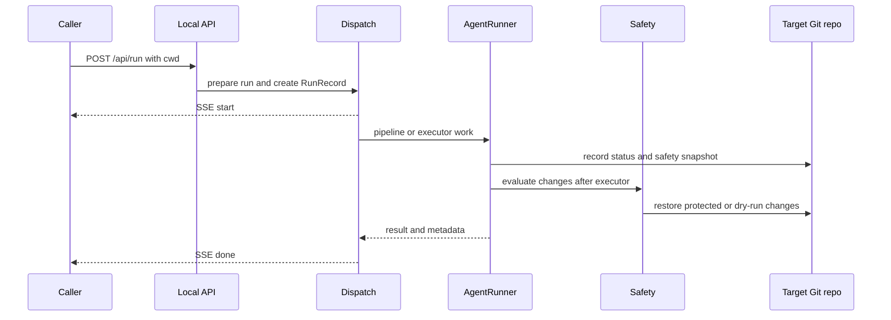

# Entrypoints, configuration, and safety

VOLY can run a task from the Click CLI, the local FastAPI/Svelte dashboard, or the pipeline HTTP server. These are dispatch and observability surfaces, not permission boundaries: a file-writing executor acts in the selected target project. Make the target directory explicit, keep the web application local, and use executor safety plus focused tests before accepting an operational change. For the pipeline and multi-agent internals behind these surfaces, see [A2A and pipeline orchestration](../orchestration/a2a-and-pipeline.md) and [durable workflows](../orchestration/durable-workflows.md).

## Entrypoints and dispatch

`pyproject.toml` installs `voly` as `voly.cli.main:main`. The root Click group accepts `--config` / `-c` and `--verbose`, loads one `VOLYConfig` into `ctx.obj`, and registers the command families. Capability startup synchronization is attempted for ordinary commands when a worker URL is configured; `quickstart` is excluded.

For task execution, use `voly run`:

- Without `--executor`, it constructs a `Pipeline`, runs environment setup, and passes optional `cwd`, repository URL, forced agent/model, and A2A delegation as pipeline context. `--dry-run` has no effect on this path and reports that fact.
- With `--executor`, it invokes `AgentRunner` with the task, executor type, working directory, turn limit, timeout, optional model, and `--dry-run`. Its JSON result includes outcome, executor accounting, task ID, automation metrics, and structured failure details on failure.
- `voly ui` starts the FastAPI application (or Vite development server). Its default bind address is `127.0.0.1`; production serving requires the built Svelte assets and the `voly[ui]` extra. `voly serve` similarly defaults to loopback and exposes a small pipeline HTTP server, optionally given a default `--cwd`.

The web application exposes API documentation at `/api/docs` and accepts `POST /api/run` as an SSE stream. It sends a `start` event, heartbeats while the blocking work runs in a bounded thread pool, then a `done` or `error` event. Disconnecting a browser stops only the SSE generator: the already-started blocking work continues in the background. The request middleware accepts or creates a correlation ID and returns it in the response header; the runner carries it into task telemetry.



This shows the web executor route’s start-to-finish lifecycle; pipeline requests can remain on the pipeline or be promoted by dispatch.

### Smart web dispatch

A web request initially naming `pipeline` is inspected before launch. A complex task that qualifies for A2A stays on the multi-agent pipeline; a code-generation task that does not qualify is promoted to `claude-code`; a text-only task remains on the pipeline. The effective project directory is requested `cwd`, then configured `default_cwd`, then `VOLY_PROJECT_CWD`; a promoted executor with none of those ultimately uses the server process directory. Therefore an operator should send `cwd` for every file-affecting web request rather than rely on server defaults. An explicit `review-until-clean` workflow is a separate bounded route and rejects dry-run requests.

## Configuration, credentials, and the project boundary

`voly/config/` defines the dataclass configuration contract and parses `voly.yaml`. `load_config()` uses an explicit `--config` path when given; otherwise it searches upward from the **process current directory** for `voly.yaml`, stopping at that directory’s Git root or after 20 levels. It loads `.env` before YAML placeholder expansion, without overwriting already-set environment variables. Because that discovery is based on the invoking process rather than an individual run’s `--cwd`, use `--config` (and an intentional launch directory) when operating on another project; do not assume `--cwd` selects its configuration.

`default_cwd` may come from `voly.yaml` or `VOLY_PROJECT_CWD`, and is a fallback—not a substitute for a per-run target. CLI executor runs use `--cwd` or the CLI process directory. API executor runs expand request `cwd` or use the API process directory; pipeline dispatch has the fallback order described above. The pipeline server selects request `cwd`, its `--cwd` default, or its process directory. In each case, that directory is the target-project boundary for subprocess execution, Git inspection, local context gathering, and safety rollback. Do not hard-code the VOLY checkout as a target, and do not accept an unreviewed shared default in a service handling more than one project.

The checked-in `voly.yaml` demonstrates provider, routing, budget, telemetry, evidence, evaluation, and local-artifact settings using environment-variable placeholders. Keep credentials in environment or external secret management and documentation limited to variable names/placeholders—never copy live values into config, logs, test fixtures, or wiki pages. The API’s own module can load the repository-root `.env` at import time, while normal config loading can also merge an applicable project `.env`; environment precedence means deployment state can change behavior without a YAML diff.

Relevant operational controls include `cost_policy` limits, gateway timeouts/fallback/DLP options, and opt-in remote analytics. Local evidence and telemetry are distinct from remote analytics: the configuration defaults the latter to disabled. See [Cloudflare services](../integrations/cloudflare-services.md) for the remote integration boundary.

## Executor safety policy

`ExecutorSafetyConfig` is enabled by default. It has three controls:

```yaml
executor_safety:
  enabled: true
  dry_run: false
  protected_paths: []
  max_files_touched: 0
```

An empty `protected_paths` selects built-in `fnmatch` protections for `.env` and `.env.*`, common private-key/certificate names, and `.git/**`; committed `.env.example`, `.env.sample`, and `.env.template` are deliberately allowed. A nonempty list replaces those built-ins. `max_files_touched: 0` means unlimited; a positive limit rolls back the entire run if exceeded. Configuration-level `dry_run` applies to executor runs, and CLI/API `dry_run` enables it for an individual executor run.

The policy is post-execution and Git-backed. Before the executor runs, `AgentRunner` captures porcelain status and a non-mutating `git stash create` snapshot (falling back to `HEAD` for a clean tree). Afterwards it compares both Git status and content against that snapshot. The content comparison is essential: an executor can modify a file that was already dirty without changing its porcelain status. Rollback restores tracked paths from the snapshot and deletes newly created paths, preserving the exact pre-run dirty content rather than restoring only `HEAD`.

| Situation | Policy effect |
|---|---|
| Protected path changed | Restore only protected changed paths. Other changed files can remain; this is a soft safety result when useful files remain. |
| Only protected paths changed | Restore them and mark the run failed. |
| File-count limit exceeded | Restore every path touched by the run and mark the run failed. |
| Dry run | Capture a bounded diff preview, restore every run-touched path, and retain the work report describing proposed changes. |
| No usable Git snapshot | Warn and leave the worktree unchanged; safe rollback cannot be performed. |

This policy never intentionally rewrites files that were already dirty but untouched by the executor. Dry-run and protected-path restoration must retain that invariant. A successful executor can therefore have metadata recording a soft protected-path rollback; consumers of result metadata should display `dry_run_diff`, `safety_violation`, and `safety_rolled_back` rather than infer safety solely from success.

## Local runtime lifecycle

A runner starts a best-effort `RunRecord` before blocking executor work, updates a heartbeat every ten seconds, and completes it as `completed` or `failed`. The web route also creates a record before dispatch. Records are JSON under the configured runs directory (normally `.voly/runs`) and are atomically replaced to avoid torn reads. The web server’s watchdog runs every two minutes and marks a still-running record `stale` once its heartbeat exceeds `task_timeout_seconds × watchdog_stale_factor`. Tracking failures are deliberately non-fatal to the task.

Task events, run records, evidence records, reports, caches, and other generated state normally live below `.voly/`. Much of this state is ignored by Git and can contain task prompts, results, paths, diffs, or repository health context. Treat it as operational data: inspect it deliberately, avoid committing it as a fixture, and perform a privacy review before exporting it.

## Safe change and verification workflow

1. **Choose the surface and target.** State whether the change affects CLI, `/api/run`, the pipeline server, or an executor. Supply an explicit target `cwd`; use explicit `--config` when its config must belong to that target.
2. **Preserve the contract.** Keep Click flags, `RunRequest` fields, SSE event expectations, result metadata, and frontend behavior synchronized. Preserve correlation IDs across new request/runner layers.
3. **Protect the worktree.** Keep Git snapshot/content-diff semantics, the restoration of pre-existing dirty content, and full dry-run rollback intact. Do not weaken default protected paths without an explicit operational decision.
4. **Verify narrowly, then broaden.** Run the tests closest to the changed boundary before the relevant wider suite. `pytest` discovers `tests/`; Ruff and Mypy settings are defined in `pyproject.toml`.

| Change area | Focused verification |
|---|---|
| CLI parsing, executor-output contracts, failure classification | `pytest tests/test_cli_contracts.py -q` plus the affected CLI tests |
| Safety policy, dirty-worktree restoration, dry-run behavior | `pytest tests/test_executor_safety.py -q` |
| FastAPI routes, task/event artifacts, OpenAPI availability | `pytest tests/test_web_api.py -q` |
| Config discovery, parsing, or defaults | affected `tests/test_config*.py` tests and a minimal CLI invocation with `--config` |
| Packaging or UI server startup | affected packaging/UI tests; verify `voly[ui]` behavior where applicable |

Before committing, inspect `git status` in both the VOLY checkout and the target project. Generated `.voly/` output and local `.env` material are not source changes unless deliberately reviewed and included.
