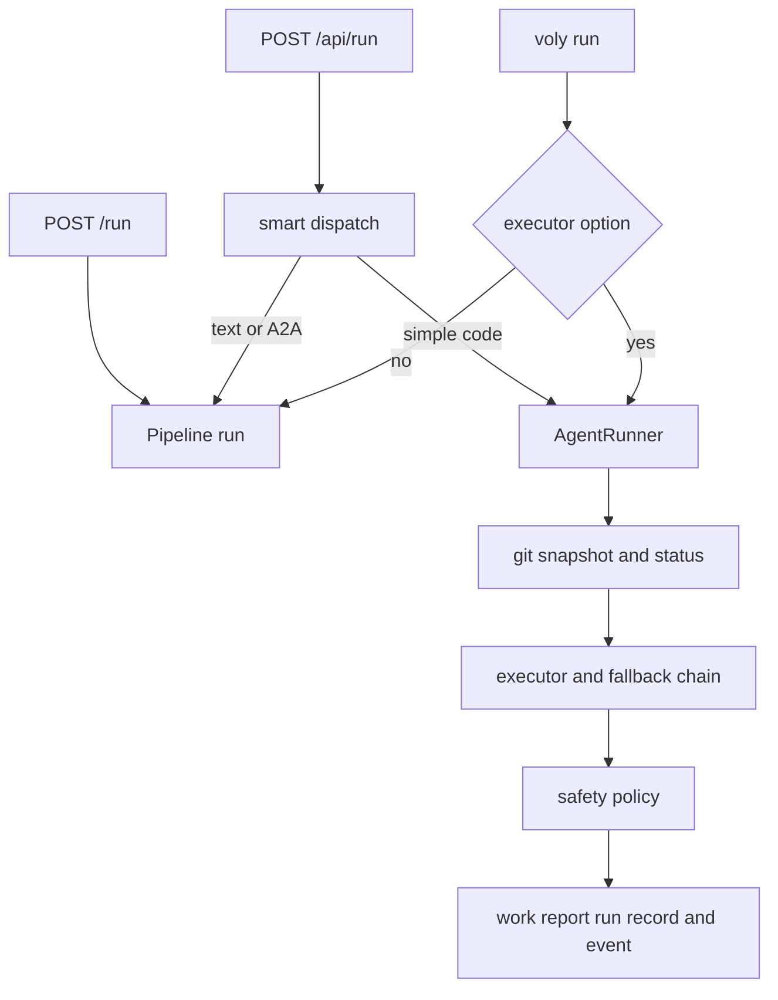
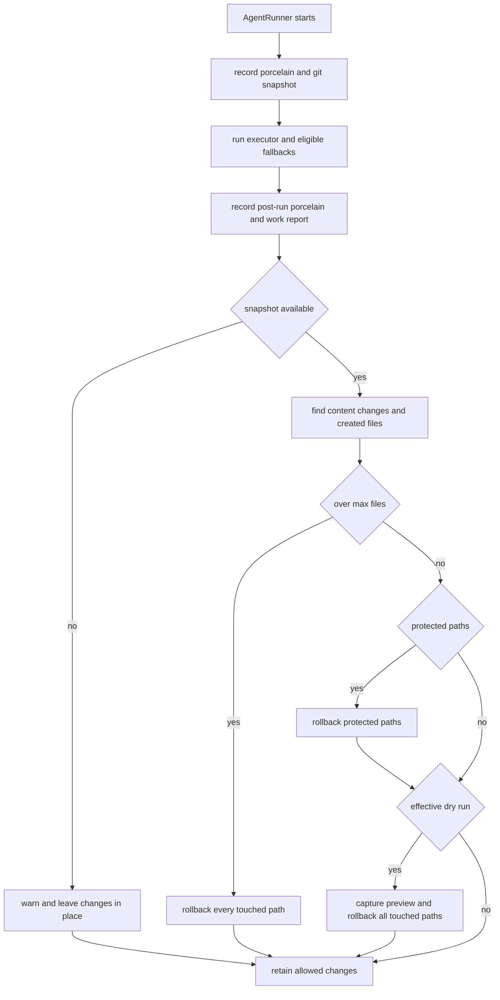

# Entrypoints, configuration, and safe execution

VOLY accepts work through a Click CLI, the optional FastAPI/Svelte dashboard, a small pipeline HTTP server for remote workers, and MCP reuse of the web dispatch path. All of them eventually select either the `Pipeline` or an `AgentRunner` executor. The latter is the file-writing boundary: its safety policy is based on a pre-run Git snapshot, not on an executor's self-report. See the [architecture overview](../architecture/overview.md) for the component model, [A2A and pipeline orchestration](../orchestration/a2a-and-pipeline.md) for multi-agent behavior, and [SDK and plan execution](../workflows/sdk-and-plan-execution.md) for explicit workflows.

## Entry points and target-project boundary

The installed `voly` console script calls `voly.cli.main:main`. The root Click group loads configuration once using `--config`/`-c`, configures logging, and registers operational command families including `run`, `serve`, `ui`, A2A, MCP, telemetry, evidence, capability, plan, and workflow commands. When a capability worker URL is configured, normal command startup also performs a capability sync (but `quickstart` is excluded).

`cwd` is the execution boundary, not VOLY's own checkout. In direct executor mode, `voly run --executor NAME --cwd PATH` defaults `PATH` to the current directory. In pipeline mode, `--cwd` becomes pipeline context and `--repo` is passed for pre-run repository intelligence. A configured `default_cwd` (or `VOLY_PROJECT_CWD`) supplies a target directory to web smart dispatch when the request omits one. Keep this distinction intact when extending entrypoints: a server process can otherwise write in its own working directory.

| Surface | Invocation and behavior | Write/safety implication |
|---|---|---|
| CLI pipeline | `voly run TASK` constructs `Pipeline`, calls setup, runs with optional agent/model/A2A/repository context, then shuts down. `--json` changes only presentation. | `--dry-run` is explicitly ignored on this path. It does not provide rollback for arbitrary pipeline behavior. |
| CLI executor | `voly run TASK --executor NAME [--cwd PATH] [--dry-run]` calls `AgentRunner.run`; known executor names include `claude-code`, `cursor`, `deepseek`, `opencode`, `zen`, `wrangler`, and others. | The runner snapshots and assesses the target repository after executor attempts; `--dry-run` reaches that policy. |
| Dashboard/API | `voly ui` starts Uvicorn with `create_app()` and the built Svelte assets. `POST /api/run` returns an SSE stream with `start`, periodic `heartbeat`, then `done` or `error` events. | The request can select pipeline or executor and includes `cwd`, `dry_run`, limits, model, and A2A options. Smart dispatch can promote a simple code task from `pipeline` to `claude-code`; complex multi-capability tasks remain pipeline/A2A. |
| Pipeline server | `voly serve` starts a `ThreadingHTTPServer`, bound to `127.0.0.1:9202` by default, with `GET /health` and `POST /run`. It runs `Pipeline` with A2A delegation disabled to prevent nested requests re-entering automatic dispatch. | It uses request `cwd`, configured default `cwd`, or the process directory in that order. It is intended for a host that retains the repository and provider credentials. |



This shows how the available request surfaces converge on pipeline orchestration or the Git-protected executor path.

### Web exposure is local-development oriented

`create_app()` installs all API routers, static-file serving when available, correlation middleware, and a watchdog thread that periodically reaps stale run records. The open-core server deliberately has no authentication and configures permissive CORS; its own warning says that `/api/run` is open and intended for localhost. Bind `voly ui` to loopback unless an authenticated, separately secured deployment boundary is in place. Do not mistake executor safety for network authorization: an unauthenticated caller who can reach this API can request a run.

The pipeline server only checks `Authorization: Bearer …` when given a nonempty token. `run_pipeline_server()` obtains that token from its argument or `PIPELINE_RUNNER_TOKEN`; an empty token means requests are accepted. Keep it loopback-only by default. If a tunnel or other exposure is necessary, set the token through the deployment secret manager, send it as a Bearer token, and do not put its value in configuration, documentation, or logs. The health endpoint is not token-protected.

## Run lifecycle, runtime state, and failure visibility

An executor run creates a correlation ID, chooses an executor/agent role, and starts a `RunTracker` record with a background heartbeat when telemetry is enabled. It captures baseline evidence when configured, invokes the executor, may move through billing/availability fallbacks, builds a work report from before/after repository state, applies safety, then finishes the run record and emits a `TaskEvent`. The resulting event carries the correlation ID, outcome, accumulated retry cost/tokens, report, optional artifacts, and classified failure. Thus the result reported to the dashboard or CLI is the post-policy result, not merely the subprocess result.

The API's SSE endpoint creates its own run record before scheduling blocking work on a fixed-size thread pool. It sends heartbeats while waiting. A disconnected browser stops only the SSE generator: Python cannot force-cancel the blocking executor subprocess, so execution continues and can still alter the target repository. Operational clients should wait for `done` and use run/event records rather than treating a dropped stream as cancellation.

Runtime artifacts are intentionally local, mostly under `.voly/`, including event files, run records, evidence, reports, capability material, and caches. The default web events directory is `.voly/events` below the current directory if it exists, then `~/.voly/events`; run records are stored alongside it in `runs`. These artifacts can contain task and repository context. Keep them out of commits and apply the same access/privacy controls as other operational logs.

## Configuration and secret boundary

`load_config()` finds `voly.yaml` from the current directory upward but stops at the target repository's Git root (and has a depth cap), avoiding accidental adoption of an ancestor project's configuration. It loads environment files before YAML so `${VARIABLE}` placeholders can resolve; existing process environment values win. `VOLYConfig` supplies typed defaults when no file is found.

Use checked-in YAML only for nonsecret policy and references to environment variables. For example, a safe executor-safety fragment is:

```yaml
executor_safety:
  enabled: true
  dry_run: false
  max_files_touched: 5
  protected_paths:
    - "infra/**"
```

`ExecutorSafetyConfig` defaults to enabled, non-dry-run, unlimited file count (`0`), and built-in protected patterns when `protected_paths` is empty. The `executor_safety` YAML section can override all four fields. Put provider keys, pipeline tokens, and remote endpoint credentials in a local environment file or deployment secret manager, using `.env.example` solely as a placeholder reference. Do not expose live values in run results, tests, wiki pages, or version control.

Relevant operational environment controls include `VOLY_PROJECT_CWD` for the default target directory, `VOLY_RUN_POOL_WORKERS` for API executor concurrency, `PIPELINE_RUNNER_TOKEN` for pipeline-server authentication, and `VOLY_JSON_LOGS` for web log formatting. They alter process behavior; treat configuration changes as deployment changes and test them without real credentials.

## Git-backed executor safety

Safety is enforced only by `AgentRunner` after the executor and any fallback attempts complete. Before execution, the runner records `git status --porcelain`, fingerprints relevant untracked files for reporting, and calls `git_snapshot()`. The snapshot uses `git stash create`, which records the tracked pre-run worktree without modifying it; on a clean tree it falls back to `HEAD`. A later content diff against that snapshot catches a file that was already dirty before the run and then overwritten again—something a porcelain-status comparison alone cannot detect.



This is the post-execution policy order; all rollback decisions are grounded in the pre-run Git state.

### What is protected and what is rolled back

By default, the policy protects `.env` and `.env.*`, PEM/key/p12 files, SSH private-key naming patterns, and `.git/**`, matching both repository-relative path and basename. `.env.example`, `.env.sample`, and `.env.template` are intentional allowlisted templates. Extra `protected_paths` replaces—not augments—the built-in patterns, so an override must repeat any default protections it still needs.

The policy identifies changed content plus created files. It restores tracked paths from the snapshot and removes newly created files. It only targets paths whose contents changed during this invocation, preserving unrelated pre-existing local edits; critically, a protected file dirty before the run is restored to its pre-run dirty content rather than to `HEAD`.

* A protected-path violation normally rolls back only protected paths. If useful nonprotected changes remain, the runner records `safety_soft`, the violation, rollback list, and remaining files but can keep the executor run successful.
* If every reported file was rolled back, or `max_files_touched` is exceeded, the runner marks the result failed. The file-count limit rolls back **all** touched paths, not only the excess.
* Effective dry-run is the per-call flag OR configured `executor_safety.dry_run`. It captures a bounded diff preview (including created-file markers) and rolls back every touched path, including changes to files dirty before execution. The work report still describes what would have changed.
* With safety disabled, no checks or rollback occur. With no usable Git snapshot—for example, a non-Git `cwd`—the policy warns and degrades to a no-op because it has no safe restoration point. A shallow directory listing may still make a work report useful in such a directory, but it is not a rollback mechanism.

Billing fallback is separate from write safety. `AgentRunner` retries only when an executor reports billing failure or unavailability and the selected executor is in the file-writing fallback chain; it records abandoned-attempt spend and the chain timeline. Safety is applied after that chain, so it assesses the aggregate target-repository changes. Other failures do not silently enter this fallback, and failure classification is retained for telemetry.

## Operational checks and focused tests

For an entrypoint or policy change, begin with the smallest relevant tests, then run the broader suite required by the change:

```bash
pytest tests/test_executor_safety.py -q
pytest tests/test_cli_contracts.py -q
pytest tests/test_web_api.py -q
pytest tests/test_pipeline_server.py -q
```

`test_executor_safety.py` is the principal behavioral contract: it covers default pattern matching, delta/content detection, protected-path restoration, preservation of pre-run dirty content, dry-run rollback and preview, file-count rollback, disabled-policy behavior, non-Git degradation, YAML parsing, and runner soft-versus-hard outcomes. `test_web_api.py` confirms app status, task/event access, artifact path traversal rejection, and OpenAPI availability; `test_pipeline_server.py` covers health and Bearer rejection. CLI contract tests also preserve executor-output parsing and error-class behavior used to decide whether fallback is permissible.

### Change checklist

- Preserve `cwd`/`default_cwd` as an explicit target-repository decision; never infer that the VOLY checkout is the target.
- Treat `--dry-run` as executor-only unless pipeline-wide transactional rollback is actually implemented; do not promise it for the CLI pipeline path.
- Do not weaken Git snapshot/restore ordering or convert non-Git degradation into a claim of safety.
- When customizing `protected_paths`, include the full intended policy because a nonempty list replaces defaults.
- Keep the UI and pipeline server on trusted local/private networks; executor protections do not authenticate callers.
- Use placeholder configuration and secret-management boundaries only; never document or commit live secrets.
