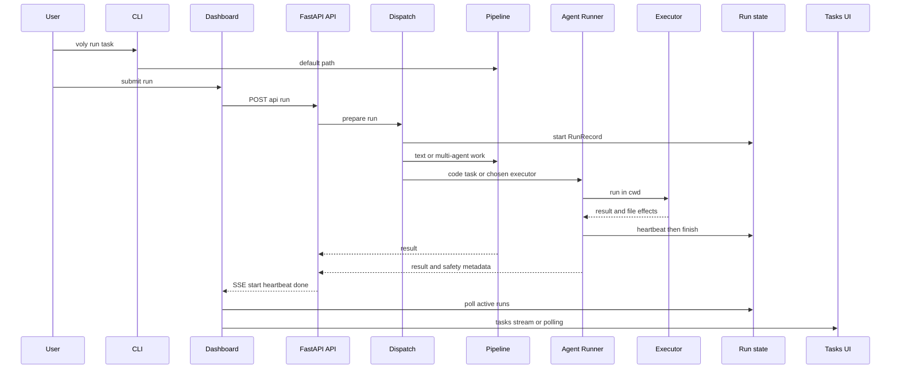

# Entrypoints, configuration, and executor safety

VOLY accepts work through the `voly` console script, the local FastAPI/Svelte dashboard, and integrations that reuse the web run service. These surfaces converge on either `Pipeline` for routed chat/orchestration or `AgentRunner` for an executor that can modify a target project. The caller's `cwd` is the project boundary: preserve it through new dispatch layers rather than substituting the VOLY repository or server process directory.

> **Security boundary:** the open-core API has **no authentication** and CORS allows all origins. It is explicitly localhost-oriented; `voly ui` binds to `127.0.0.1` by default. Do not expose it directly on an untrusted network or represent commented authentication settings in `.env.example` as an implemented open-core control.

## Request and visibility flow

This shows the CLI and dashboard/API run paths and how immediate SSE results and persisted run/task views become visible.

### CLI and UI entrypoints

- Packaging exposes `voly = voly.cli.main:main`. The Click root accepts `--config` and `--verbose`, loads configuration once into `ctx.obj`, and registers the command groups, including `run` and `ui`. If configured, capability startup sync happens before all commands except `quickstart`.
- `voly run` without `--executor` builds and shuts down a `Pipeline`; it passes optional `cwd`, external repository URL, forced agent/model, and A2A delegation as pipeline context. `--dry-run` is intentionally ignored on that pipeline path. With `--executor`, it invokes `AgentRunner` in `--cwd` or the current directory; JSON output includes executor outcome and structured failure details.
- `voly ui` starts Uvicorn with `127.0.0.1:7788` by default. Production serving requires built Svelte static assets; `--dev` instead starts Vite and points it at the requested API port. The `ui` extra supplies FastAPI, Uvicorn, and HTTPX.
- The Svelte app opens its run drawer through `RunPanel`, posts the run request to `/api/run`, consumes its SSE `start`, `heartbeat`, `done`, and `error` messages, and adds the started run to the live task view. At startup it refreshes task/status data, starts the task event stream, and polls active RunRecords every two seconds; task-list SSE falls back to periodic polling after repeated errors.

### API dispatch decisions

`POST /api/run` accepts a task plus executor, `cwd`, model/agent, turn and timeout limits, A2A option, tech stack, workflow options, and `dry_run`. It first creates a RunRecord and streams a `start` payload. Blocking work runs in a bounded thread pool (`VOLY_RUN_POOL_WORKERS`, default 16); the endpoint emits a heartbeat every 15 seconds while waiting. A disconnected client stops only the stream—the blocking work continues—and exceptions mark the RunRecord failed.

The default `pipeline` selection is not always the eventual implementation path:

1. A complex task eligible for A2A stays in the pipeline. Its `cwd` may be filled from `default_cwd` or `VOLY_PROJECT_CWD`; hybrid code generation is reported as skipped when no usable `cwd` exists.
2. A task assessed as requiring code generation is promoted to `claude-code` so it reaches the file-writing executor and its billing fallback chain.
3. A text-only task remains in the pipeline. An explicit `review-until-clean` workflow is a separate bounded path and rejects dry-run mode.

This promotion is a dispatch choice, not permission to lose isolation: executor work uses the resolved target directory, while the pipeline gets `cwd` in its context. New entrypoints should call the shared `prepare_run`, `launch_run`, and `finish_run` helpers when they need the same decision and run registration behavior.

## Configuration and state ownership

`load_config()` selects an explicit `--config` path or searches upward for `voly.yaml`, stopping at the target repository root (and after a bounded number of levels) so an unrelated ancestor configuration is not silently used. Before YAML `${VAR}` expansion it loads package and project `.env` files with first-set-wins behavior. Treat this as runtime behavior, **not documentation input**: never read, quote, or derive documentation from `.env`, and never place live values in it.

`voly.yaml` provides checked-in settings such as model/agent definitions, A2A behavior, budgets, telemetry, evidence, and evaluation. `ExecutorSafetyConfig` defaults to enabled; it controls global dry run, protected path patterns, and an optional file-touch limit. Environment variables provide selected operational overrides, including `VOLY_PROJECT_CWD`, `VOLY_RUN_POOL_WORKERS`, and `VOLY_JSON_LOGS`; `.env.example` is only a placeholder/reference for setting those values.

Generated `.voly/` content is runtime state, not source or documentation input. In particular, it can contain event and run records, evidence, caches, reports, artifacts, profiles, and other project context. Do not make operational claims from it or add it as a fixture without an explicit privacy and lifecycle decision.

### Run lifecycle and observability

`RunTracker` owns a JSON `RunRecord` per task in the configured runs directory (normally `.voly/runs`). It writes atomically using a temporary file and replacement, and all tracking failures are deliberately best-effort so they do not fail work. A record starts `running`, records role/progress heartbeats, and ends `completed` or `failed`; the watchdog marks still-running records `stale` when their heartbeat age exceeds `task_timeout_seconds × watchdog_stale_factor`. The web app starts this reaper every two minutes.

Correlation middleware obtains or creates a correlation ID, places it on the response header, and logging adds it to records. `AgentRunner` carries that ID into the emitted `TaskEvent`; executor results also expose duration, token/cost data, structured failure classification, work report, artifacts, safety metadata, and—when applicable—the billing-chain timelog. Preserve this through API, CLI, and UI contract changes.

## Executor selection, fallback, and safety

`AgentRunner` resolves a requested executor name or agent role through aliases, configured agents, registry metadata, built-in role defaults, and finally the configured default. It takes a pre-run git status, pre-run snapshot, and post-run status around the executor. This supports the work report and safety policy even when a worktree was already dirty before VOLY ran.

### Fallback is only for billing or availability

The file-writing fallback sequence is `claude-code`, `cursor`, `deepseek`, `wrangler`, `opencode`, then `zen`. It is entered only when an executor result indicates a billing error or that the service is unavailable; ordinary execution, parsing, rate-limit, or unknown failures must not silently switch executors. Unavailable fallback executors are skipped. The chain records every attempt and folds abandoned attempt cost and tokens into the final telemetry total, avoiding a misleading final-attempt-only cost.

This constraint is important when adjusting error parsers or executor results: contract tests distinguish quota/billing errors from transient 429s and classify unrecognized CLI output so upstream format drift does not cause an unsafe or surprising fallback.

### File-change policy and rollback

The safety policy applies after a file-capable executor finishes and requires a git repository for rollback. It uses `git stash create` to capture a pre-run snapshot without changing the worktree, compares content against that snapshot as well as porcelain state, and limits rollback to changes made during the run. Therefore a pre-existing dirty file modified again can be restored to its exact pre-run content, while unrelated local edits remain untouched. In a non-git directory the policy logs a warning and cannot roll back changes.

By default it protects `.env` and `.env.*`, private-key/certificate patterns, and `.git/**`; committed templates `.env.example`, `.env.sample`, and `.env.template` are specifically allowed. A protected-only result is a hard failure after rollback. If useful unprotected changes remain, protected writes are rolled back but the run remains successful with soft-safety metadata; exceeding `max_files_touched` rolls back every touched file and fails the run.

`--dry-run`, API `dry_run`, or configured `executor_safety.dry_run` runs the executor but captures a bounded diff preview and rolls back **all** changes, including modifications layered on an already-dirty worktree. The work report still describes what would have changed. Do not implement dry-run as “skip the executor,” and do not replace the snapshot approach with checkout-to-HEAD: either would violate the restoration guarantee.

## Focused operational validation

Run the narrowest tests for the surface changed, then expand when shared contracts move:

| Change | Focused validation | What it guards |
|---|---|---|
| CLI executor options, output, or error parsing | `pytest tests/test_cli_contracts.py -q` | Realistic Claude/OpenCode output parsing, billing detection, and failure classification. |
| Rollback policy or `AgentRunner` file behavior | `pytest tests/test_executor_safety.py -q` | Protected paths, file limits, dry-run diff/rollback, non-git degradation, and restoration of pre-existing dirty content. |
| Fallback, spend, or A2A failure semantics | `pytest tests/test_failure_paths.py -q` | Billing-only chain traversal, retry cost accounting, unavailable skips, spend stop, and recursion guard. |
| FastAPI route or dashboard data contract | `pytest tests/test_web_api.py -q` | API status/tasks/artifact traversal protection, gateway smoke behavior, and OpenAPI availability. |
| Packaging or web dependency changes | `pytest tests/test_web_api.py -q` plus the affected install/build check | The `voly[ui]` boundary and served API/UI behavior. |

Also run the repository's configured lint/type checks when modifying Python interfaces. Inspect `git status` before and after an executor-related change: local `.voly/` artifacts and `.env` values are neither authoritative test input nor documentation sources.

## Safe-change checklist

- Keep `cwd` explicit from the CLI/UI request through dispatch and executor invocation; retain the fallback resolution order only where it is needed to choose a target project.
- Keep `/api/run` SSE event shapes, RunRecord fields, `TaskEvent` correlation/cost data, and Svelte API consumers synchronized.
- Do not add authentication assumptions to the open-core API. Keep local binding as the deployment default and require a separately authenticated boundary before exposure.
- Preserve the strict billing-or-unavailability trigger for fallback; do not treat generic executor failure as authorization to reroute work.
- Preserve snapshot-based rollback, protected templates exception, pre-existing-worktree restoration, and all-change rollback in dry-run mode.
- Never use `.env` or generated `.voly/` state as source or documentation input; use checked-in configuration, source, and tests instead.
