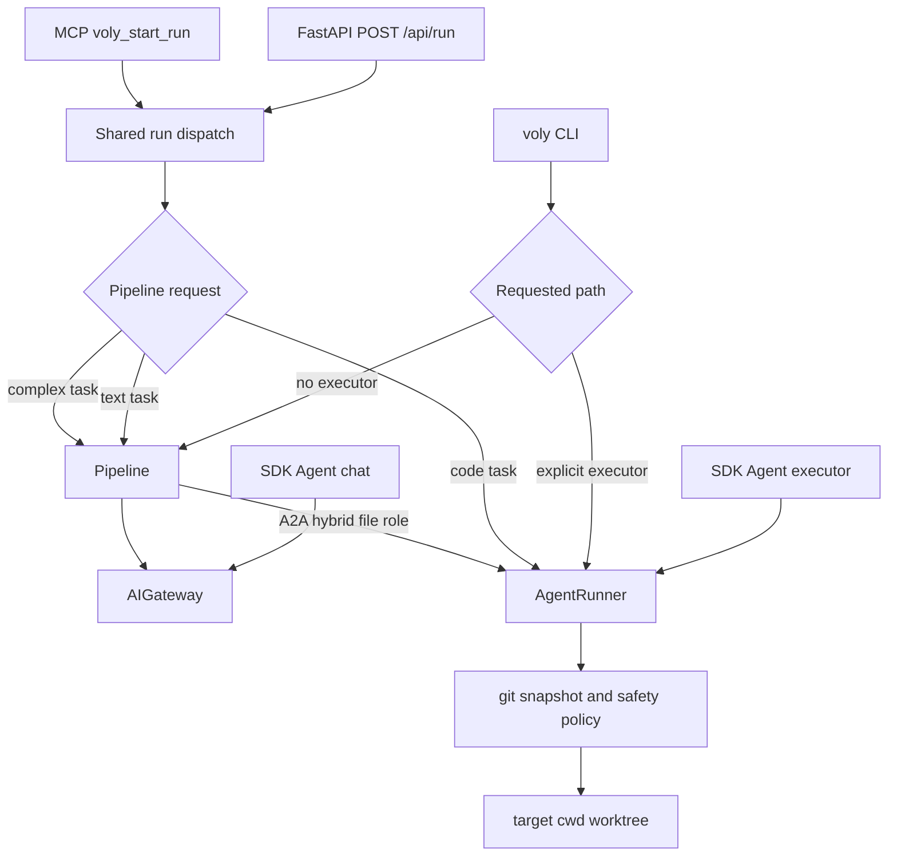

# Entrypoints, configuration, and filesystem safety

VOLY presents several transport-specific interfaces over two execution paths: the inference/orchestration `Pipeline` and the file-capable `AgentRunner`. The target project's `cwd` is the filesystem boundary for file work. VOLY does **not** embed a target-product path; callers must select the intended repository deliberately. For routing and multi-agent behavior, see [Pipeline and A2A orchestration](../orchestration/a2a-and-pipeline.md); start with the [quickstart](../quickstart.md) for local setup.


```mermaid
flowchart TD
    CLI["voly CLI"] --> Choose{"Requested path"}
    Web["FastAPI POST /api/run"] --> Dispatch["Shared run dispatch"]
    MCP["MCP voly_start_run"] --> Dispatch
    SDKChat["SDK Agent chat"] --> Gateway["AIGateway"]
    SDKExec["SDK Agent executor"] --> Runner["AgentRunner"]
    Choose -->|"no executor"| Pipeline["Pipeline"]
    Choose -->|"explicit executor"| Runner
    Dispatch --> Smart{"Pipeline request"}
    Smart -->|"text task"| Pipeline
    Smart -->|"code task"| Runner
    Smart -->|"complex task"| Pipeline
    Pipeline --> Gateway
    Pipeline -->|"A2A hybrid file role"| Runner
    Runner --> Safety["git snapshot and safety policy"]
    Safety --> Target["target cwd worktree"]
```

This shows the shared dispatch boundary: web and MCP reuse it, while SDK modes reuse the governed gateway or runner rather than creating a second runtime.

## Entrypoints and dispatch

### CLI

The installed `voly` console command invokes `voly.cli.main:main`. The Click root accepts `--config`/`-c` and `--verbose`, loads configuration once into the Click context, and registers command families including `run`, `ui`, and `mcp`. `voly run` has two deliberately different paths:

- Without `--executor`, it constructs `Pipeline`, passes `cwd` only as task context, supports forced model/agent and explicit A2A delegation, and shuts the pipeline down after completion. `--dry-run` is explicitly ignored on this pipeline path.
- With `--executor`, it invokes `AgentRunner.run()` with `cwd` (or the process working directory if omitted), turn and timeout limits, model override, and `--dry-run`. The runner is the path that executes an external coding agent and applies filesystem safety.

For automation, `--json` emits the public result shape; failures cause a non-zero exit. Treat executor selection and `cwd` as operationally significant inputs, not cosmetic CLI options.

### Web API and Svelte UI

`voly ui` starts Uvicorn with `create_app()` and defaults to `127.0.0.1:7788`; the optional `voly[ui]` extra supplies FastAPI, Uvicorn, and HTTPX. The production server mounts built static assets when present; `--dev` instead starts Vite and configures its API proxy target. The app stores its config and event-directory state in `AppState`, attaches correlation middleware, wires route modules, and starts a best-effort watchdog that reaps stale run records.

`POST /api/run` is an SSE endpoint. It creates a `RunRecord`, yields a `start` event, runs blocking pipeline/executor work in a bounded thread pool, sends 15-second heartbeats while waiting, and yields `done` after recording a completed or failed status. If the browser disconnects, the SSE generator stops but the already-running blocking call continues in the background. The request's `correlation_id` is propagated into start/result payloads and the response header.

For a default `executor: "pipeline"`, shared `prepare_run()` analyzes the task: complex multi-capability work remains pipeline/A2A; a code-generation task is promoted to `claude-code` so the file-writing path and its fallback chain can run; text-only work stays on the pipeline. In this API path, the effective working directory is resolved in order from request `cwd`, `config.default_cwd`, then `VOLY_PROJECT_CWD`; an empty result ultimately makes the executor use the server process cwd. Supply an explicit target-project `cwd` for writes rather than relying on that fallback.

> **Localhost-only security boundary:** the open-core FastAPI UI/API has **no authentication** and permissive CORS (`allow_origins=["*"]`). It is intended for localhost use only. Do not expose it to a network or treat `POST /api/run` as an authenticated remote-control endpoint; authenticated JWT/SSO deployment belongs to the separate closed Team-tier distribution.

### MCP

Install `voly[mcp]` to obtain MCP plus the web dependencies. `voly mcp serve` and `python -m voly.mcp` serve the MCP facade; its default HTTP bind is `127.0.0.1:7799` and it also supports SSE or stdio. The facade's runtime loads configuration and an events directory once, then uses the transport-neutral web service layer rather than duplicating HTTP behavior.

Read tools list runs/tasks, inspect a run or task, return aggregate statistics, and report health. `voly_start_run` is marked non-read-only, destructive, and non-idempotent: it can spend credits and write in `cwd`. It starts the same shared dispatch in the background and immediately returns a task id; clients poll `voly_get_run` and then `voly_get_task`. The host-facing annotations are a safety contract—action tools require host approval policy—and the tool rejects `dry_run` combined with `review-until-clean`. Cancellation is cooperative: it requests a stop but does not interrupt an executor already inside a subprocess call.

### Python SDK

`voly.sdk.Agent` is a typed facade, not another orchestration stack. In `chat` mode it creates the configured `AIGateway` path, so gateway policy such as spend limits, DLP, caching, rate limits, and provider fallback applies. In `executor` mode it delegates to `AgentRunner`, inheriting billing/availability fallback, evidence collection, work reports, and safety enforcement. Executor-mode SDK calls require an explicit `cwd`; this is stronger than the CLI/API fallback behavior and prevents accidental file work in an implicit directory. `arun()` offloads the synchronous implementation to a worker thread rather than changing those semantics.

## Configuration resolution and credentials

`load_config()` chooses an explicit `--config` path when provided. Otherwise it searches upward from the process cwd for `voly.yaml`, stopping at the first target-project Git root (or after 20 levels); it does not search beyond that boundary for an unrelated ancestor configuration. It loads a package-root `.env` first and then project-level `.env` files from the same bounded search, preserving pre-existing environment variables. YAML is parsed into typed `VOLYConfig` objects; selected values such as model keys and remote URLs expand `${VAR}` after `.env` loading. If no config is found, typed defaults are returned.

The checked-in [`voly.yaml`](../../voly.yaml) uses environment-variable **placeholders** such as `${ANTHROPIC_API_KEY}` and `${CLOUDFLARE_API_TOKEN}`. These are configuration references, not runtime credentials. Keep actual values in the environment or an uncommitted `.env`, never in documentation, test fixtures, logs, or committed YAML. The web server also has a package-root `.env` loader with first-set-wins behavior; account for it when diagnosing why a process sees a value.

Configuration lookup is based on the process/config location, whereas a run's `cwd` identifies the target worktree. Keep those concepts separate: launching VOLY from its own checkout does not authorize writes there. Pass a target `cwd`, use an explicit config path when necessary, and verify both before enabling an executor.

Relevant operational controls include:

- `executor_safety.enabled`, `dry_run`, `protected_paths`, and `max_files_touched` govern post-executor worktree enforcement. Defaults enable the policy, disable always-dry-run, use built-in protected patterns when no custom list is supplied, and impose no file-count limit.
- `telemetry.events_dir` and `telemetry.runs_dir` hold terminal events and in-flight records respectively. The web/MCP service resolves an events directory from `<process cwd>/.voly/events`, then `~/.voly/events`, unless the web app receives an explicit directory or MCP receives `VOLY_EVENTS_DIR`.
- `a2a`, gateway, evidence, evaluation, and cost-policy settings influence dispatch, model calls, and reporting. They do not replace the caller-selected `cwd` boundary.

## Filesystem safety and executor fallback

Before a file-writing executor runs, `AgentRunner` captures git porcelain state and a non-mutating pre-run snapshot using `git stash create` (falling back to `HEAD` on a clean tree). It then executes the chosen executor in the supplied `cwd`. A WorkReport is built from before/after state, then safety compares content against the snapshot as well as porcelain changes. The content comparison matters: a file that was already dirty can remain `M` in porcelain while an executor has overwritten its local edits.

The default protected patterns cover `.env`/`.env.*`, private-key and certificate extensions, `id_rsa*`, `id_ed25519*`, and `.git/**`; committed templates `.env.example`, `.env.sample`, and `.env.template` are expressly allowed. A configured `protected_paths` list replaces those defaults. When protected paths change, the policy restores only those files and keeps other legitimate changes. When `max_files_touched` is exceeded, it rolls back every touched file. A dry run captures a bounded diff preview and rolls back every touched file after the executor has actually run; it still consumes time and model credits.

Rollback preserves pre-run local content where possible and deletes newly created files. In a non-Git `cwd`, there is no reliable snapshot, so the policy logs a warning and is a no-op rather than claiming a rollback occurred. This makes Git initialization a practical precondition for enforceable rollback—not merely an implementation detail.

Safety outcomes are copied to executor metadata (`dry_run`, `dry_run_diff`, `safety_violation`, and `safety_rolled_back`) for CLI/API consumers. A protected-path violation is a soft result when other useful changed files remain; it becomes a hard failure when everything changed was rolled back. Exceeding `max_files_touched` is hard-failed. These semantics prevent sensitive writes while avoiding a needless multi-agent cascade failure after a useful partial change.

`AgentRunner` also handles a distinct availability/billing fallback: if the selected executor reports `billing_error` or `not_available`, it walks its configured/static fallback chain, skipping executors whose availability pre-check fails. It records a chain timeline and includes abandoned attempts in task cost and token totals. Ordinary failures do not automatically trigger this fallback, so parser/error-classification changes are safety- and spend-relevant.

## Focused operational validation

Run the narrow tests first after changing one of these boundaries:

```bash
pytest tests/test_executor_safety.py -q
pytest tests/test_cli_contracts.py -q
pytest tests/test_web_api.py -q
```

- `test_executor_safety.py` creates real temporary Git repositories to verify protected-path restoration, preservation of pre-existing dirty content, full dry-run rollback with a diff preview, max-file rollback, non-Git no-op behavior, typed config parsing, and the runner's soft-versus-hard result rules.
- `test_cli_contracts.py` freezes representative upstream executor output formats and checks extraction of result, usage, cost, billing errors, availability/failure classification, and telemetry error classes. This protects the billing fallback from silently ceasing to recognize upstream failures.
- `test_web_api.py` constructs the FastAPI app with a temporary events directory and smoke-tests status, task/event reads, artifact traversal rejection, gateway/telemetry responses, and OpenAPI docs. It intentionally exercises the open API without authentication.

When modifying cross-transport dispatch, additionally test the shared `prepare_run()`/`launch_run()` contract and MCP background polling behavior. For any write-capable change, test with an explicit disposable Git repository and explicit `cwd`; never use a real product checkout or live credentials as a fixture.

## Change checklist

- Preserve `cwd` as the target-project boundary; do not hardcode or imply an embedded target-product path.
- Keep CLI options, `RunRequest`, SSE payloads, MCP tool arguments, SDK facade behavior, and runner metadata aligned when changing dispatch.
- Preserve the distinction between configuration discovery and executor worktree selection.
- Do not document, log, commit, or substitute live secrets for `${VAR}` placeholders.
- Keep web deployments localhost-only unless using the separately authenticated distribution.
- Treat safety rollback, error classification, and fallback changes as behavior requiring focused Git-backed tests.
