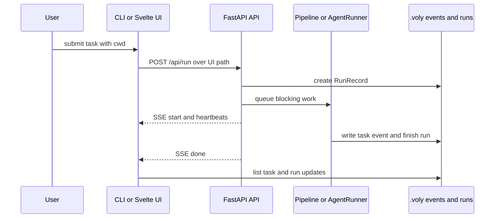

# Entrypoints, configuration, and safe operation

VOLY is designed to operate on a target project rather than assume that the VOLY checkout is the project being changed. Its CLI, HTTP dashboard, and MCP server are alternative control surfaces over pipeline/executor dispatch and local run state. Use this page when changing an entrypoint, configuration lookup, or operational boundary; see the [architecture overview](../architecture/overview.md) for the execution architecture and [capability governance](../governance/capabilities.md) for capability activation rules.

## Operational boundaries

Three rules prevent the most damaging local-operation mistakes:

1. **Make the target explicit.** Pass `--cwd` for file-writing work and treat it as the target-project boundary. An explicit-executor `voly run` otherwise defaults to the invoking process directory; pipeline calls carry `cwd` only when supplied. `voly serve` similarly accepts a default task directory. Never add product-specific paths to `voly/`.
2. **Keep runtime output local and uncommitted.** `.voly/` contains run, event, evidence, evaluation, cache, plan, reuse, capability, and related operational artifacts. Inspect `git status` before committing; generated state is not a source change unless deliberately requested.
3. **Keep secrets out of source and output.** `.env.example` is a placeholder template, while `.env` is ignored. Do not read, log, document, or commit live values. Use environment injection or the platform secret store, and expose only the minimum service needed for a local workflow.

Integration and end-to-end runs belong in the designated external PulseBoard environment, not this repository. Prefer narrow, hermetic checks here.

## Entry points and dispatch

### CLI

The installed `voly` executable resolves to `voly.cli.main:main`. The Click root accepts `--config/-c` and `--verbose`, loads configuration into `ctx.obj`, and registers operational command groups as well as core `init`, `setup`, `quickstart`, `serve`, `ui`, `run`, `status`, and `config` commands. If a configured capability worker URL is present, ordinary CLI invocations perform startup synchronization; `quickstart` is excluded.

`voly run` has two intentionally distinct paths:

- Without `--executor`, it builds a `Pipeline`, calls setup, and passes optional `cwd`, repository URL, routing overrides, and A2A delegation into `Pipeline.run()`.
- With `--executor`, it creates `AgentRunner` and invokes an executor directly with the selected working directory, timeout, turns, model override, and optional `--dry-run`. The latter executes the work but rolls back file changes after retaining a diff preview.

Both paths return a nonzero exit status for an unsuccessful result. Treat `--json` output as a public automation surface: it contains outcome and execution metadata and needs a matching contract test when its shape changes.

`voly serve` starts the pipeline HTTP server on loopback by default and can pass `--cwd` as its default task directory. It prints tunnel guidance, but tunnel exposure is an explicit operational decision: its local-machine credentials and Git repository remain behind that service boundary.

### Web dashboard and REST API

`voly ui` defaults to `127.0.0.1:7788`. Production mode requires a built Svelte bundle in `voly/web/static`; `--build` runs `npm run build` in `ui/`, whose Vite output directory is that static directory. `--dev` instead runs Vite on port 5173 with `/api` proxied to the configured UI API port. The FastAPI factory accepts an injected events directory and configuration, mounts the static bundle when present, and exposes OpenAPI at `/api/docs`.

The Svelte application loads task data, opens an SSE task stream, polls in-flight runs every two seconds, and falls back to ten-second polling after repeated EventSource failures. This makes the UI a view over local event and run records rather than the owner of execution state.

```mermaid
sequenceDiagram
    participant User
    participant CLI as CLI or Svelte UI
    participant API as FastAPI API
    participant Dispatch as Pipeline or AgentRunner
    participant State as .voly events and runs
    User->>CLI: submit task with cwd
    CLI->>API: POST /api/run over UI path
    API->>State: create RunRecord
    API->>Dispatch: queue blocking work
    API-->>CLI: SSE start and heartbeats
    Dispatch->>State: write task event and finish run
    API-->>CLI: SSE done
    CLI->>State: list task and run updates
```

This is the UI run lifecycle: FastAPI records and queues a run, streams `start`, periodic `heartbeat`, and terminal `done` events, while execution writes durable local state. A disconnected SSE client stops receiving events but does **not** cancel the blocking work; the queued operation continues in the background. The server also starts a best-effort watchdog that periodically reaps stale run records so crashed work does not remain displayed as running indefinitely.

Every FastAPI request gets a correlation ID derived from headers or generated locally and returned in the response header. Preserve that identifier through new route, logging, event, and frontend layers; it is the join key for request and operational evidence.

### MCP facade

`voly mcp serve` requires the `mcp` extra and serves streamable HTTP by default on `127.0.0.1:7799` at `/mcp`; SSE and stdio are alternatives. This is VOLY *as* an MCP server, separate from `voly mcp list` and `voly mcp config`, which manage client-side built-in MCP server definitions.

The MCP facade and HTTP routes share `voly.web.service` for task/run reads, safe task-ID handling, cancellation, and background dispatch. It resolves an events directory from `VOLY_EVENTS_DIR` when supplied, otherwise from an existing `cwd/.voly/events`, then `~/.voly/events`. MCP starts return immediately with a task ID; callers poll the run until completion and then retrieve the task result.

MCP tool annotations are a safety boundary, not descriptive metadata. Read tools are marked read-only; `voly_start_run` is non-idempotent and destructive because it can spend credits and write in `cwd`; cancellation and feedback are non-destructive idempotent actions. Preserve annotations and tool descriptions when adding or changing MCP tools, because hosts use the serialized hints to decide approval behavior. A valid `cwd`, explicit executor choice, and `dry_run` preview remain especially important for MCP-triggered work.

## Configuration and state lifecycle

`load_config()` chooses an explicit `--config` path when given; otherwise it searches upward from the current directory for `voly.yaml`. The upward search stops at the target project's Git root and is capped, preventing accidental inheritance of an unrelated ancestor project configuration or `.env`. Before parsing YAML, it loads the VOLY package-root `.env` and then project-level `.env` files on that bounded path, without overriding values already present in the process environment. YAML `${NAME}` values are expanded by the parser.

Use checked-in `voly.yaml` for non-secret defaults and `.env.example` only as a value-free configuration reference. Important operational controls include target-relative locations such as telemetry events and evidence stores, executor and A2A timeouts, plan verification mode, gateway limits/fallbacks/DLP, evaluation mode, and the separate opt-in switch for sanitized cloud analytics. Configuration can therefore affect cost, persistence, and external calls; changing it needs focused tests and matching `docs/backend/config.md` updates.

The web server independently loads a package-root `.env` once during module initialization with first-set-wins behavior. Do not rely on an unchecked local file to define reproducible deployment behavior. More importantly, the open-core FastAPI app deliberately has **no authentication**, enables permissive CORS, and warns that `POST /api/run` is open. Bind it to loopback only; use the authenticated closed deployment for team or externally reachable use.

## Packaging and dependency boundaries

A base install supplies the CLI/configuration dependencies. Optional extras isolate heavier surfaces: `voly[ui]` installs FastAPI, Uvicorn, and HTTP support; `voly[mcp]` includes the UI extra plus the MCP SDK; `voly[dev]` supplies pytest, async test support, Ruff, and Mypy. The UI itself is an independent Svelte 5/Vite package under `ui/`.

Python wheel contents are an explicit `tool.setuptools.packages` list rather than package discovery. Whenever an importable package is added or moved, update that manifest: editable development installs can conceal an omitted wheel package. Keep the packaging test in the change slice.

## Focused verification and safe change plan

Start with the smallest test that exercises the boundary changed, then expand only as evidence requires. Do not use a real provider key or live agent run as a unit-test substitute.

| Change | Focused verification |
|---|---|
| CLI output, executor adapters, or failure classification | `pytest tests/test_cli_contracts.py -q` plus command-specific tests |
| Config discovery, parsing, or environment precedence | `pytest tests/test_config.py -q` |
| FastAPI routes, event-state reads, docs, or artifact traversal | `pytest tests/test_web_api.py -q` and `pytest tests/test_web_registry.py -q` |
| MCP tools, annotations, background lifecycle, or task-ID validation | `pytest tests/test_mcp_facade.py -q` with `voly[mcp]` installed |
| Wheel manifest or optional-install boundary | `pytest tests/test_packaging.py -q` |
| Svelte behavior or API contract | run the relevant UI build/check and the paired API tests; verify Vite proxy assumptions |

`tests/test_cli_contracts.py` guards parsing of external executor output and failure classes so upstream format drift cannot silently trigger incorrect billing fallback behavior. `tests/test_web_api.py` creates an application with a temporary event directory and checks status, task listing/filtering, summaries, API docs, and rejection of an artifact traversal path. `tests/test_mcp_facade.py` checks the serialized wire annotations, refuses empty billable tasks and incompatible `dry_run`/review workflow requests, and rejects path-like task IDs. These tests define the local safety net; they are not authorization to run an end-to-end task in this checkout.

Before merging an entrypoint change:

- Keep CLI options, API request/SSE shapes, `voly.web.service` behavior, and Svelte client expectations synchronized.
- Preserve `cwd` from the caller through dispatch; do not replace it with a repository-specific fallback.
- Keep `.voly/`, build output, local `.env`, caches, and logs out of source changes unless the task explicitly owns them.
- Update the matching backend or frontend documentation with behavior changes, as required by repository guidance.
- Run the relevant focused tests and inspect the resulting diff and `git status`.

The scheduled OpenWiki workflow runs daily at 08:00 UTC or manually, regenerates documentation, and force-updates the `openwiki/update` pull-request branch only when staged generated/wiki guidance files differ. The wiki is optional just-in-time context; repository source and tests remain authoritative.
