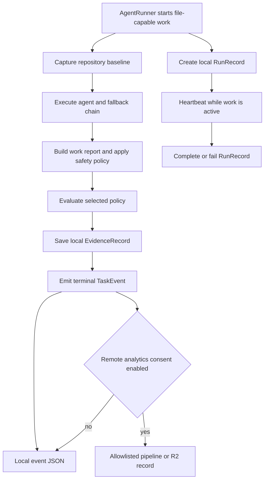

# Run evidence, evaluation, and observability

VOLY records several related but deliberately non-interchangeable views of a file-capable run:

- An **evidence record** is the durable local bundle for one file-capable executor run: pre-run repository health, execution identity, attributed outcome, optional evaluation, and explicit human feedback.
- An **evaluation report** is the policy-versioned assessment attached to that evidence. It answers whether specified checks passed, not whether the executor merely claimed success.
- A terminal **`TaskEvent`** is operational telemetry: cost, tokens, status, retries, routing/fallback details, and optionally richer local task/report/artifact context.
- A live **`RunRecord`** is a separate, best-effort heartbeat record that makes work visible before a terminal event exists.

These records support operations and local diagnosis; they do not by themselves activate an evaluated capability. In particular, an executor's task report, a successful `TaskEvent`, or ordinary telemetry is not the paired, held-out experimental evidence required by [Capability governance and evaluated packs](../governance/capabilities.md). Plans and workflow state are also distinct orchestration lineage; a `RunRecord` may mirror a `plan_id`, step statuses, or workflow timeline for visibility, but it does not become the plan's authoritative state.



This shows the independent live and terminal tracks around one runner invocation; baseline, safety, evaluation, and local evidence enrich the completed work record rather than being replaced by telemetry.

## File-work evidence lifecycle

`AgentRunner.run()` creates a task ID and, when evidence is enabled, captures a repository baseline **before** invoking the file-capable executor. The baseline scans repository metadata and optionally runs configured and auto-discovered deterministic build, test, and lint commands with `shell=False`; their argv, bounded output excerpt, duration, and failure kind are retained. It classifies the starting repository as `healthy`, `metadata_only`, `preexisting_failure`, or `environment_failure`. Consequently, a command that was already failing is evidence about the starting worktree, not automatically a regression caused by the agent.

After execution, the runner takes before/after Git and directory snapshots to build a work report, applies the filesystem safety policy, and then runs evaluation when both evidence and evaluation are enabled. Safety outcomes remain observable: a protected-path rollback can be soft if useful non-protected changes remain, while a full rollback or `max_files_touched` violation makes the executor result fail. Evaluation treats a rollback or safety-policy event as a trajectory-policy issue even when the executor result otherwise reports success. This prevents a textual task report or a partially retained change from being mistaken for clean verification.

The versioned local `EvidenceRecord` stores these categories separately:

| Category | Contents and meaning |
|---|---|
| `baseline` | Pre-execution repository health, detected stack metadata, and deterministic checks. |
| `execution` | Agent, executor, model/provider, runtime, skills, and evaluation-policy identity. |
| `outcome` | Executor success, final state, root-cause attribution, retry-aware total cost, duration, and changed-file count. |
| `evaluation` | Optional `EvalReport` with individual check results and a policy-derived state. |
| `human_feedback` | Explicit developer feedback, separate from automatic checks. |

Records are written atomically to `evidence.store_dir` (default `.voly/evidence`) after validating task IDs, so a crash cannot leave a partially replaced record. The web API exposes `GET /api/evidence/{task_id}` and appends feedback through `POST /api/evidence/{task_id}/feedback`. Accepted, edited, major-rewrite, reverted, PR-rejected, and manual-fix feedback are distinct explicit labels; feedback can resolve pending human-review checks and records agreement/disagreement for an LLM judge rather than silently treating a human decision as model output.

### Attribution, not blame by default

`classify_root_cause()` keeps upstream conditions distinct from agent failure. Billing errors are provider failures; unavailable services and timeouts are tool failures; safety errors are policy violations; and a failed baseline maps to repository/environment attribution. Those categories set `penalize_agent=False`. Only an otherwise unattributed failed result on a healthy baseline becomes `agent_failure` and is eligible to penalize the agent. This attribution is passed into the later capability-evidence hook, which skips billing, availability, and non-penalized failures.

That hook is still a lightweight EMA update/routing signal, not a capability-activation proof: it derives a bounded score from success, changed-file count, and retries, runs best-effort in a background thread, and lacks the paired baseline/variant and held-out decision process required for evaluated packs. Keep the two evidence systems separate when changing either one.

## Evaluation is policy-based verification

An `EvalPolicy` is versioned and selected deterministically by task type unless `evaluation.policy_id` overrides it. Built-in policies share executor-success, safety, trajectory, file-change, and baseline-replay requirements; documentation adds Markdown-link validation and human review, testing requires a recognized changed test artifact, and security scans only changed supported source files before requiring human review.

The engine produces one `EvalCheckResult` per requirement and derives the report state as follows:

- `soft_failure`: a required check failed or errored.
- `partial_success`: a required check is pending or skipped, including when no deterministic baseline command exists to replay.
- `verified_success`: all required checks passed.

Baseline replay is intentionally conservative: it reruns only an exact argv that passed before execution. A failed, unavailable, timed-out, or legacy baseline check is marked skipped rather than rerun and misrepresented as a new regression. Executor failure stops subsequent evaluation to avoid spending on checks that cannot establish a successful result. Evaluation is record-only during staged rollout: it annotates `result.metadata` and the local evidence record; it does not replace the runner's execution result.

An optional LLM judge extends the selected policy. `shadow` makes its result non-required, while `required` makes failure affect the report state. The judge uses bounded task/output input and contributes its own tokens and cost to the task totals. Treat it as an evaluator with a recorded rubric result, not as a source of privileged instructions or a substitute for explicit human review.

## Terminal telemetry, retries, and spend

A `TaskEvent` is emitted at the end of a runner/pipeline task and is persisted locally by default in `telemetry.events_dir` (default `.voly/events`). It includes terminal status, correlation ID, token and cost totals, executor/model/provider, error class, fallback-chain log, and retry fields. Local events can additionally contain bounded prompt/result text, a work report, artifacts, stage logs, and local business context; operational telemetry is therefore not a privacy-safe export format.

Retry accounting is deliberately total-based. Executor-level model retries fold abandoned attempts into the returned `ExecutorResult`. The runner also folds abandoned billing/availability fallback attempts into `TaskEvent.cost_usd` and token totals, while `retry_count` and `retry_cost_usd` identify the abandoned share. Evaluation-judge cost and tokens are added before budget status is calculated. Thus the final successful attempt does not erase what retries spent: a task's terminal total is the total spend consumed to reach its result, not a success-only amount, and summing task totals does not double-count retry cost.

The terminal status is calculated from execution success and then `budget_status(total_cost_usd, config)`, so an otherwise successful result can be reported as `budget_exceeded`. Optional remote spend recording is likewise driven by a terminal event with a positive cost when the spend integration is configured; it is accounting, not evidence that the task was accepted, evaluated as verified, or eligible for capability activation.

Use `summarize_error_classes()` to track final failed-event classifications. It reports an `unrecognized_share` only across failures that supplied an error class, avoiding distortion from pre-field records. A growing unrecognized share is an operational signal that executor output/error parsing may have drifted.

## Live run tracking and correlation

Because terminal telemetry cannot reveal a hung task, `RunTracker` writes one local JSON `RunRecord` per active run to `telemetry.runs_dir` (default `.voly/runs`). Writes use a temp file followed by `os.replace`, and all tracker failures are swallowed so observability cannot break execution. The runner creates the record before the executor call, runs a background heartbeat roughly every ten seconds, and finishes it as `completed` or `failed` afterward.

`RunRecord` includes a bounded task preview, parent task ID, current role and counts, optional plan/workflow fields, cancellation request, timeline, and a shared graph. It is an operational projection of orchestration lineage: use the plans/workflow subsystem for step authority and this record to inspect current progress. `Watchdog` considers only `running` records stale after `task_timeout × watchdog_stale_factor` with no heartbeat, then marks them `stale`; it does not resume or terminate an underlying process.

The UI provides `GET /api/runs`, `GET /api/runs/{task_id}`, and `POST /api/runs/{task_id}/cancel`. Listing can filter active records and hide child records under their root by default. Cancellation is cooperative and only applies to active workflow records; it requests a stop before a later blocking turn and explicitly does not interrupt a currently active subprocess.

Correlation is separate again from persistence: VOLY accepts `X-Correlation-ID` or `X-Request-ID`, otherwise generates a UUID, stores it in a context variable, injects it into logs, and forwards `X-Correlation-ID` to remote services. The same ID on a terminal event lets operators join local task telemetry with logs and remote-service traces without making the event itself an orchestration record.

## Privacy and remote analytics

Local artifacts are the richer diagnostic boundary. A local `TaskEvent` may include prompt, result, free-form errors, reports, repository paths, artifacts, and assignment data; local evidence can include baseline command output, feedback comments, and task fingerprints. Do not treat those files as safe to upload or expose publicly.

Remote analytics requires explicit `cloud_analytics.enabled` consent. With consent, `emit_event()` first writes the full local event, then can send only `event_to_pipeline_record()`'s allowlisted record to the configured pipeline endpoint and/or R2 when their configuration and credentials are present. Remote delivery failure is debug-logged and does not remove or invalidate the local event. The analytics identifier is a SHA-256-derived event ID rather than the raw task ID, and the allowlist excludes prompts, results, raw errors, repository paths, reports, artifacts, stage logs, and A2A assignments.

Evidence has a parallel conversion boundary: `evidence_to_cloud_record()` produces metadata-only evidence with hashed ID, baseline statuses rather than command/output observations, limited skill id/version, coarse evaluation check metadata, and feedback kind/source only. It excludes task fingerprints, command argv and excerpts, repository notes, file paths, evaluation detail, and feedback comments. Preserve these two independently versioned allowlists; having endpoint credentials is not consent, and an allowlisted remote metric is not a replacement for its complete local source record.

## Configuration and focused validation

Evidence and evaluation are disabled by default. Enable and tune `evidence.enabled`, its store/baseline command/timeout/output controls, plus `evaluation.enabled`, `evaluation.policy_id`, evaluation command timeout, and optional `evaluation.llm_judge` mode. Telemetry is enabled by default; configure local event/run directories, pipeline endpoint/timeouts, and watchdog factor separately. Enable `cloud_analytics.enabled` explicitly before any remote analytics delivery.

For changes to these boundaries, run focused tests first:

```bash
pytest tests/test_evidence_foundation.py -q
pytest tests/test_evaluation.py -q
pytest tests/test_retry_cost.py -q
pytest tests/test_runs_api.py -q
pytest tests/test_telemetry.py -q
```

These tests cover preexisting-failure attribution, atomic evidence/feedback behavior and redaction, policy states and human/LLM evaluation, safety rollback trajectory failures, retry-total accounting, live-record lifecycle and cooperative cancellation, and the consent-gated telemetry allowlist. For executor safety and transport entrypoints, also consult [Entrypoints, configuration, and filesystem safety](entrypoints-and-safety.md); for remote-service configuration, see [Cloudflare and remote services](../integrations/cloudflare-and-remote-services.md).
