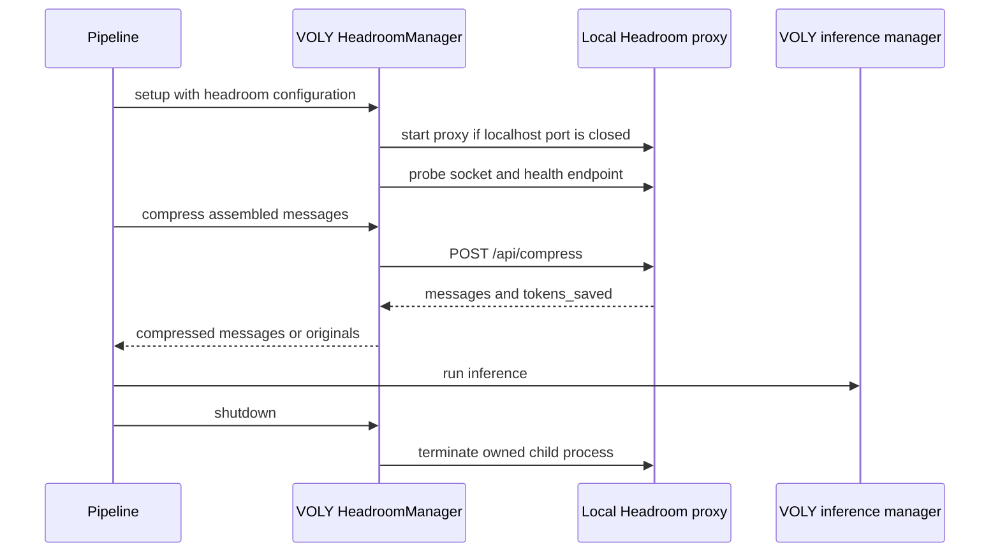
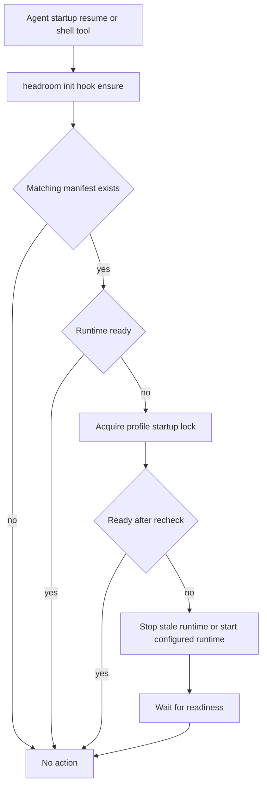

# Headroom integration, agent hooks, and PR governance

There are two separate Headroom concerns in this workspace. **VOLY** optionally manages a local context-compression proxy for its own pipeline. The bundled **Headroom project** supplies a broader compression product, including Claude Code and GitHub Copilot CLI plugins plus repository-maintainer PR governance. They share a product name and a local-proxy idea, but they do not share lifecycle ownership, configuration, credentials, or policy. Keep that boundary explicit when operating or changing either one.

For the surrounding VOLY execution model, see the [architecture overview](../architecture/overview.md); for general VOLY entrypoints and configuration safety, see [Entrypoints, configuration, and safe operation](entrypoints-and-safety.md).

## VOLY: a narrow local proxy adapter

VOLY's `HeadroomManager` owns only a loopback proxy child process and access to its compression and health endpoints. It defaults to port `8787` and builds its URL as `http://127.0.0.1:<port>`. On `start()`, it first treats an already-listening socket as usable; otherwise it launches `python -m headroom.cli proxy --port <port>`, falling back to `headroom proxy --port <port>` only when the Python-module executable cannot be found. It passes the configured savings profile and enabled memory, code-graph, and backend options as `HEADROOM_*` environment variables to the child.

The `headroom` block in `voly.yaml` controls whether this helper is enabled, its port, profile, and optional memory/code-graph settings. Defaults enable the helper with `port: 8787` and `savings_profile: agent-90`; `lean_ctx` is parsed and retained in configuration but is not passed into `HeadroomManager` by the current pipeline setup. `voly headroom start --port <port>` runs the proxy until Ctrl-C, while `voly headroom status` creates a manager at the configured port and reports the best health information it can obtain.

This is the VOLY-local proxy lifecycle: compression occurs before inference and failure falls back to the original messages.

### Pipeline behavior and failure semantics

`Pipeline.setup_environment()` constructs the manager from the Headroom configuration and requests a ready wait. It records setup errors and reports an unsuccessful setup result rather than making Headroom a provider or executor. In the ordinary inference path, the pipeline assembles messages, then calls `_stage_headroom_compress()` before the inference manager. When no manager is installed, the port is unreachable, the compression request errors, or the response omits fields, it continues with the original message list and records zero Headroom savings. A successful compression response supplies `messages` and an optional `tokens_saved` value, which is included in pipeline metrics and task-event construction. `Pipeline.shutdown()` stops only the manager's tracked child process and closes memory.

The manager's liveness probe is TCP-only; `status()` then attempts `GET /health` to populate version, uptime, saved-token, and connection data. A health-endpoint error after a successful socket probe is represented as running with just the port, not as a proxy failure. Similarly, `compress()` catches request and JSON errors and returns `{"messages": messages}`. This deliberately makes compression an availability optimization: it must not bypass or replace the inference/gateway path, become provider-cost accounting, or turn a local outage into a failed model call.

**Operational implication:** the manager does not install Headroom, configure Claude/Copilot plugins, create a durable deployment, or apply Headroom repository policy. Its `wrap_agent()` and `unwrap_agent()` helpers merely invoke the external `headroom` executable; no VOLY CLI command currently exposes them. The proxy binds its manager-facing URL to loopback, but binding and authentication behavior ultimately belong to the external Headroom proxy implementation.

## Bundled Headroom: marketplace plugin and durable startup recovery

The Headroom repository publishes one marketplace entry named `headroom`, sourced from `plugins/headroom-agent-hooks`, for Claude Code and GitHub Copilot CLI. Its plugin manifests intentionally share identifying metadata; the Copilot manifest additionally declares `./hooks`. Manifest tests require the Claude and Copilot marketplace descriptions to remain synchronized and verify that the marketplace source contains both manifest and hooks files.

The portable plugin hook configuration is deliberately small:

- On `SessionStart` matching `startup` or `resume`, it invokes `headroom init hook ensure` with a 15-second timeout.
- Before Bash or PowerShell tool use, it invokes the same command and timeout.

That command is a recovery/availability hook, not a compression transform. It looks for a matching durable `headroom init` manifest and, if its runtime is not ready, serializes startup with a profile lock, rechecks readiness, handles a stale reported-running process, and starts the configured runtime. Errors and output are suppressed so a best-effort recovery does not corrupt agent-hook output. With no explicit profile, it selects an existing directory-derived local profile before the global `init-user` profile; with an explicit profile, it checks only that deployment.

This is the Headroom project's best-effort hook recovery path; it is independent from VOLY's `HeadroomManager`.

### Installation-specific hooks versus the plugin

`headroom init` creates a durable manifest for a profile, merging targets when a manifest already exists and stopping an existing runtime if material runtime settings change. Its generated integration hooks are profile-specific and marker-managed, unlike the generic marketplace hook: they call the resolved `headroom` command with `init hook ensure --profile <profile> --marker <target-marker>`. Re-running setup removes the prior marked entry while retaining unrelated hooks.

For a local Claude setup it writes `.claude/settings.local.json`, points `ANTHROPIC_BASE_URL` at the loopback proxy, preserves a user-set tool-search setting, and adds SessionStart/PreToolUse entries. Copilot uses its config file and marked command entries; Codex also writes provider and feature configuration plus hooks. The end-to-end init suite checks the agent-specific configuration, selected profile, manifest targets, and generated commands. This durable, multi-agent deployment lifecycle belongs to the Headroom project, not VOLY configuration.

`AGENTS.md` is a separate agent instruction artifact: it asks shell users to prefix commands with `rtk`. It does not configure the Headroom startup plugin or VOLY's proxy. Treat it as repository guidance, not a runtime hook contract.

## PR-template governance in the Headroom repository

The Headroom PR template asks authors for a real description, selected change type, actual changes, verification checklist and output, four-item **Real Behavior Proof**, and review-readiness checkboxes. `CONTRIBUTING.md` adds process policy: external PRs need environment, exact steps, observed behavior, and what was not tested; bug fixes also need a reproduction and a failing-before/passing-after test. Copilot review instructions reinforce these requirements, especially for user-facing, dependency, workflow, and security-sensitive changes.

The machine-enforced portion is intentionally narrower and independently testable. `scripts/pr-governance.py` parses `##` sections and checks:

1. required section names;
2. a nontrivial description, a non-placeholder changes bullet, and at least one checked change type;
3. at least one checked test item and non-placeholder fenced test output;
4. values for Environment, Exact command / steps, Observed result, and Not tested; and
5. for a non-draft PR, both self-review and ready-for-human-review boxes.

A complete draft may omit the two readiness checks. A valid non-draft with both checks is ready for review. An invalid submission needs author action. Bot logins ending in `[bot]` are explicitly valid and exempt from template enforcement, labels, and governance-comment synchronization.

The validator creates a JSON report and GitHub output values (`valid`, `ready_for_review`, `needs_author_action`, and `is_bot_pr`). It does not fail its process for an invalid body. That is intentional: the workflow reports deficiencies, maintains labels, and keeps an updatable bot comment rather than turning a PR-description issue into a failing job.

### Event workflow, trust boundary, and labels

`PR Governance` uses `pull_request_target` for relevant PR changes, a weekday schedule, and manual dispatch. It has read access to contents and writes only issues/pull requests plus reads check/status state. This is a security boundary: both workflow jobs check out `github.event.pull_request.base.sha`, and the validator execution comes from that base checkout. Do not change this to check out PR head content or execute a PR-supplied workflow/script under `pull_request_target` credentials.

For a PR event, the template job validates the event payload using base-branch `scripts/pr-governance.py`, writes its report to the job summary, ensures its two governance labels exist, and—for non-bot PRs—finds an existing bot comment by `<!-- headroom-pr-governance -->` and updates it or creates exactly one. It adds/removes labels from the report:

| Condition | Label action |
| --- | --- |
| Missing required content or readiness | Add `status: needs author action`; remove `status: ready for review` |
| Complete draft | Remove both governance labels |
| Complete non-draft with both readiness checks | Add `status: ready for review`; remove `status: needs author action` |
| Bot-authored PR | Skip template enforcement and comment/label synchronization |

The independently running label-maintenance job creates the governance labels plus `status: needs rebase`, `status: has conflicts`, and `status: ci failing`. For the event PR, or every open PR during schedule/manual operation, it reads draft status, merge state, and status rollup through `gh pr view`. `BEHIND`, `DIRTY`, and failing checks respectively add the rebase, conflict, and CI labels; all other states remove the corresponding label. Any of those conditions—or draft status—also removes `status: ready for review`. Thus a template-complete PR is not represented as review-ready while it is behind, conflicted, failing CI, or draft.

The check-state helper deduplicates status-rollup attempts by workflow/name and examines only the latest timestamped attempt. `FAILURE`, `TIMED_OUT`, `ACTION_REQUIRED`, `CANCELLED`, and `ERROR` are failing states. This avoids a historic failed attempt leaving `status: ci failing` on a subsequently successful PR. It is label maintenance, not a replacement for required GitHub checks or human review.

## Focused verification and safe changes

Keep the contracts separate when changing this area; passing one does not prove another.

| Change surface | Focused check | What it protects |
| --- | --- | --- |
| VOLY proxy manager or context stage | targeted VOLY pipeline/Headroom tests, including unreachable compression | Original messages continue to inference and lifecycle remains local |
| Marketplace/plugin metadata | `pytest tests/test_plugin_manifests.py -q` | Marketplace source, manifest parity, and hook declaration |
| Generated initialization/hooks | `pytest tests/test_cli/test_init_cli.py -q` and, when appropriate, `python e2e/init/run.py` in its Docker harness | Profile-specific config, markers, manifests, and multi-agent startup behavior |
| PR-body validator | `pytest scripts/tests/test_pr_governance.py -q` | Valid ready PR, complete draft, incomplete body, and bot exemption |
| Representative validator invocation | `python3 scripts/pr-governance.py --event .github/act/pr-governance-valid.json --report /tmp/pr-governance-report.json` (and the `invalid` fixture) | Event-payload parsing and report shape without GitHub mutation |
| Stale CI labeling | `pytest scripts/tests/test_pr_health_labels.py -q` | Latest check attempt wins over historical failure |
| Workflow non-blocking policy | `pytest scripts/tests/test_pr_health_workflow.py -q` | Incomplete templates remain actionable rather than failing the job |

Before modifying PR governance, preserve all of these invariants: base-branch-only execution under `pull_request_target`; bot exemption; marker-based single-comment updates; separate author-readiness and stale operational-label logic; and fixture/test coverage for valid, invalid, draft, bot, and retried-check cases. Before modifying VOLY integration, preserve the much narrower invariant: a local compression helper may improve context but cannot own Headroom plugin installation, repository governance, provider routing, or task-execution authority.
