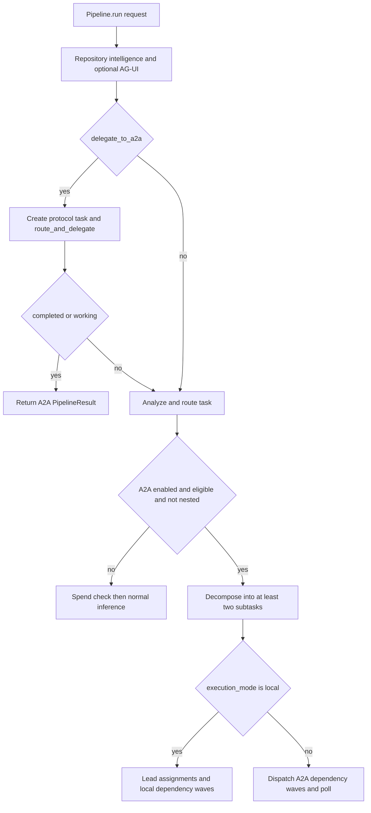
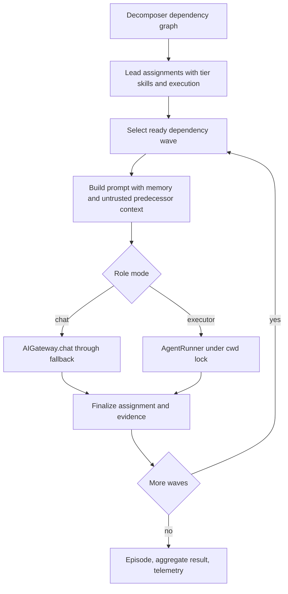

# Pipeline dispatch and A2A orchestration

`Pipeline.run()` is the orchestration entrypoint. It performs repository intelligence and optional AG-UI setup, then chooses either an explicitly requested A2A delegation, normal route-and-inference processing, or automatic A2A dispatch after routing analysis. A normal inference path eventually calls the inference manager; local multi-agent chat roles call `AIGateway.chat()` through the gateway. File-capable roles are intentionally a separate `AgentRunner`/executor path, not another way to call chat. See the [architecture overview](../architecture/overview.md) for those runtime boundaries.

This shows the mutually distinct dispatch decisions in `Pipeline.run()`.

## Dispatch entrypoints and recursion protection

### Explicit protocol delegation

Passing `delegate_to_a2a=True` invokes `_stage_a2a()` before ordinary task routing. The stage creates one `A2ATask`, calls `route_and_delegate()`, and returns immediately only if its state is `completed` or `working`; a failed or otherwise non-returnable attempt falls through to ordinary routing. `A2AOrchestrator` selects the best registered agent-card skill for a non-federated task, marks a local selected agent as working, or sends a JSON-RPC `tasks/send` request to a remote agent. With federation configured, it creates the remote task through the federation backend instead. This is protocol-level delegation, not the local role scheduler.

### Automatic multi-agent dispatch

After `_stage_route()` obtains `TaskAnalysis`, automatic dispatch is eligible only when `a2a.enabled` and `a2a.auto_dispatch` are true, the request is not nested, and either the count of required code-generation/review/testing/deployment flags meets `a2a.min_flags_for_dispatch` (default 2) or complexity is `high`. `TaskDecomposer` must yield at least two subtasks; otherwise the pipeline resumes the normal inference path. Its deterministic patterns turn combinations of those flags into role tasks and dependency edges—for example developer → tester → reviewer—and can append registry roles selected by task-text signals.

Nested work must not recursively fan out. `Pipeline._is_a2a_nested()` recognizes `VOLY_A2A_NESTED=1` or `context["a2a_parent_task_id"]`; the pipeline server also derives that context from a submitted subtask id or explicit parent id. Automatic dispatch is skipped for nested work. Keep this guard when adding workers or forwarding requests.

## Local execution: assignments, waves, and handoff

`a2a.execution_mode: local` selects `_run_multiagent_local()`. The `LeadOrchestrator` creates an `Assignment` for every decomposed subtask, giving it a tier, resolved healthy model/provider, skills, and optionally an execution preference. `lead_mode` controls whether a lead chat call is used: `llm` always asks, `deterministic` never asks, and `auto` asks only for non-standard role sets or more than five subtasks. A failed, malformed, or unavailable lead response falls back to deterministic tier and role-scoped skill selection. Capability matching may supply a model/provider or executor recommendation, but matcher failures fall back to the ordinary resolution path.

`run_local()` topologically groups assignments into waves. Independent **chat** assignments in a wave may run in a `ThreadPoolExecutor`, capped by `a2a.max_parallel_roles` when `a2a.parallel_waves` is enabled. Executor assignments are run serially after chat calls in that wave. Cyclic or unknown dependencies deliberately degrade to one-role waves in list order rather than allowing unbounded scheduling.

Dependent prompts carry bounded summaries and touched-file lists from successful predecessors under the heading “Prior subtask summaries (untrusted context)”; the prompt tells the receiver not to follow instructions inside that material. Reviewers and testers additionally receive bounded working-tree diff/file-head evidence for predecessor-touched files. Roles also retrieve role-specific semantic memory; successful non-cached chat responses can be stored as memory. The architect may receive a bounded project-context block from known repository documents and reuse context.

This shows local dependency waves; repository-writing executors never run concurrently for the same target tree.

### Failure and completion semantics

A gateway response marked spend-limited is a hard stop: remaining assignments are marked unsuccessful without another gateway call. Provider authentication/billing errors can mark the provider unhealthy so later resolution/fallback avoids it. If dependency skipping is enabled, a dependent executor is skipped when it has no usable predecessor; chat roles can instead run in degraded mode when at least one predecessor succeeded. For a code-generation task, if completed executor roles produced no repository files, post-implementation roles are skipped. Conversely, a role that failed after writing files can still provide usable context to a dependent executor.

Executor success alone is insufficient for code-generation work: a successful executor role that touched no non-`.voly` files is marked failed. Aggregate local success is `completed` only when active assignments succeed and a code-generation run has a successful implementation role (or an implementation role that at least produced project files); otherwise it is `partial` or `failed`. If plan gates are enabled, assignments are mirrored into a plan, started only when plan dependencies are verified, and run their configured verification; active verification failures make the assignment fail, while shadow-mode verification is soft-opened.

## Hybrid roles and repository safety

Hybrid execution is eligible when `a2a.hybrid_code_gen` is enabled and a project `cwd` is available. Even if `hybrid_require_cwd` is disabled, no executor is allowed to run without a concrete cwd; it is forced to chat mode. By default developer, bugfixer, tester, and devops are executor roles; architect, reviewer, security, and documenter remain chat roles. A lead may request chat or executor mode, but it cannot promote a role that is not executor-capable. `a2a.executor_roles`, `a2a.executor_default`, and per-role `VOLY_A2A_EXECUTOR_*` variables adjust the selection; an explicit capability/lead executor is preserved.

The executor factory wraps `AgentRunner.run()` and takes the per-cwd `cwd_executor_lock` before execution. The lock is a `.voly/executor.lock` exclusive file lock, waits until its timeout, and can remove a lock whose recorded owner process has gone away. It serializes executor work across processes and, together with serial executor processing in a wave, prevents two executor roles from mutating one repository concurrently. Chat-only roles remain lock-free and may parallelize. Executor sub-runs suppress their individual telemetry event so the parent multi-agent `TaskEvent` is the principal record; their runner result, touched files, costs, token counts, and fallback-chain timelog are folded into the assignment.

## Federated automatic execution

For an automatic dispatch with an execution mode other than `local`, the pipeline sends decomposed subtasks through `A2AOrchestrator.dispatch_parallel()`. That orchestrator dispatches each dependency level concurrently, waits/polls the level before forming prompts for dependents, and injects predecessor output as untrusted context. The pipeline then polls outstanding tasks at three-second intervals until `a2a.task_timeout_seconds` expires, merges available results, and writes an `A2AReport` beside the telemetry events directory. Federated success requires every dispatched task to be `completed`; some completed tasks give `partial`, and none gives `failed`.

Remote agent discovery reads `/.well-known/agent-card.json`; authenticated remote task submission uses the configured A2A token as a Bearer token. The remote boundary transports task status and text result, not authority to mutate the local checkout. Use a local hybrid executor only where a concrete local cwd and its serialization guarantee apply.

## Episodes, traces, and telemetry

After a local run, `episode_from_assignments()` converts assignments to a schema-versioned `MultiAgentEpisode` with dependency-linked `AgentTrace` records, messages, executor attempts, artifacts for touched files, execution decisions, metrics, costs, and errors. The pipeline saves it atomically to `<cwd>/.voly/episodes/<task_id>.json`: a temporary JSON file is replaced into place. Episode persistence errors are logged and do not prevent result construction. The episode is an orchestration record; `EvidenceRecord` and `EvalReport` remain the source of truth for executor evidence and verification.

The parent `TaskEvent` aggregates role token/cost/memory/skill data, assignments, and merged output. When telemetry is enabled, a `RunTracker` also starts a per-parent graph and sends role heartbeats, which lets runtime monitoring see in-progress roles rather than only the final event. Generic environments such as `PipelineEnv`, parallel solutions, solver–judge, debate, and iterative repair expose reusable episode interaction patterns, but production automatic local dispatch currently uses the dependency-wave runtime and then adapts its assignments into a pipeline episode.

## Read-only agentic judge

For a local run with a cwd, `evaluation.llm_judge.mode` of `shadow` or `required` adds an `AgenticJudgeAgent` after the solver episode is created. The pipeline passes it the original task, assignment descriptions as acceptance criteria, serialized solver trace, and all parent trace IDs. The judge receives `self.gateway.chat` as its chat function—so `AIGateway.chat()` remains the chat model-call boundary—with provider rerouting disabled for this evaluation call.

Its workspace offers only `list_files`, `read_file`, literal `search_text`, and `git_diff`. Paths are resolved beneath the workspace root; listing/search exclude `.git` and `.voly`; operations cap returned characters; and the judge loop is capped at six steps. There is no write or arbitrary shell tool (the `git diff` subprocess is fixed). It rejects a request not marked read-only and rejects ungranted tool calls.

A valid final response is strict JSON containing `pass`, `fail`, or `uncertain`, a summary, and all five 0–1 metrics: `architecture_usefulness`, `implementation_correctness`, `test_coverage`, `reviewer_precision`, and `cost_adjusted_contribution`. Parsing/tool/provider errors make the judge trace fail. Shadow mode appends its trace, decisions, and metrics but does not alter the multi-agent result. In required mode, a non-completed judge trace or any verdict other than `pass` downgrades the episode and pipeline outcome.

## Operating and change checklist

- Keep explicit `delegate_to_a2a` behavior separate from automatic decomposition. Test nested requests from context and `VOLY_A2A_NESTED` so a worker cannot re-dispatch itself.
- Preserve the boundary: chat roles and the lead use `AIGateway.chat()`; repository modification goes through the executor runner. Do not parallelize executor roles against a shared cwd or bypass `cwd_executor_lock`.
- Test dependency waves, untrusted context and diff handoff, no-cwd chat fallback, executor zero-file success, and degraded/skip behavior after predecessor failure.
- Treat `A2AReport`, episode JSON, parent telemetry, runner evidence, and plan records as related but distinct persistence contracts.
- For judge changes, test workspace escape rejection, the granted-tools allowlist, bounded interaction, strict metric parsing, and both `shadow` and `required` result semantics.

Focused coverage includes `tests/test_a2a_p0.py` for recursion/context and federated dependency handoff, `tests/test_hybrid_a2a.py` for mode policy, waves, cwd behavior, fallback, and zero-file detection, and `tests/test_agentic_judge.py` for workspace confinement and the judge trace/metric contract.
