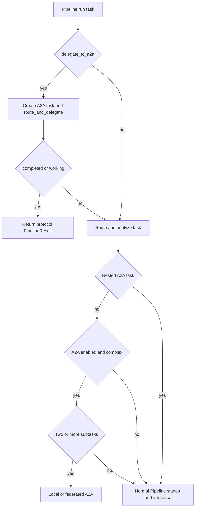
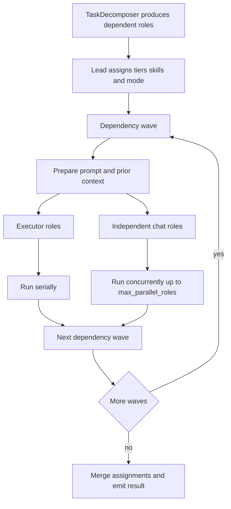
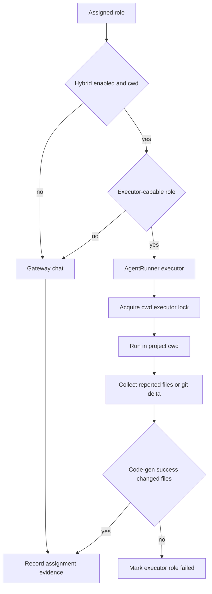
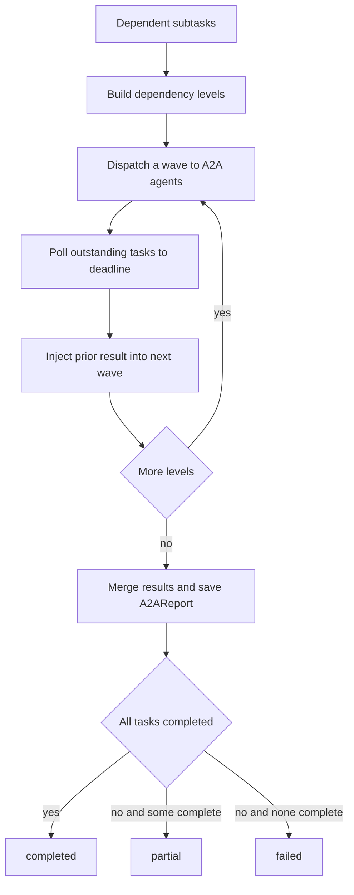

# Pipeline, A2A, and hybrid orchestration

`Pipeline.run()` is the orchestration entrypoint for a task. Its normal path routes a task and makes an `AIGateway` inference call; file-writing work belongs to `AgentRunner` and an executor. A2A adds two intentionally different choices: an **explicit protocol delegation** requested by the caller, and **automatic local multi-agent orchestration** for a sufficiently complex routed task. The distinction matters when changing routing, telemetry, or failure handling.

For the surrounding execution boundary, see [architecture overview](../architecture/overview.md); for executor evidence and safety, see [verified execution](../workflows/verified-execution.md).

## Pipeline dispatch and the two A2A entry modes

`run()` initializes context and task identity, can perform optional project/repository preparation, then routes the task. On the ordinary path it performs spend checking, context and skill work, inference, optional memory storage, and terminal telemetry. A2A selection occurs before the ordinary model call.

This shows the explicit protocol path versus automatic dispatch decision.

### Explicit delegation

Passing `delegate_to_a2a=True` creates one `A2ATask`, calls `route_and_delegate()`, and returns early only when that task is `completed` or `working`. A failed or otherwise non-ready delegation does **not** mean automatic decomposition: the pipeline continues through its normal route and inference path. This supports callers such as `voly run "…" --a2a-delegate` and the web `a2a_delegate` mapping without making every task multi-agent.

### Automatic dispatch

After routing, automatic dispatch requires `a2a.enabled`, `a2a.auto_dispatch`, and an analysis with at least `a2a.min_flags_for_dispatch` capability flags among code generation, review, testing, and deployment, or `complexity == "high"`. `TaskDecomposer` must actually return at least two subtasks; otherwise the normal path continues. It builds role tasks and dependency indices, such as developer then tester/reviewer, and may append signal-selected UI roles.

**Recursion guard — change-critical.** Automatic dispatch is skipped for a nested task. `Pipeline` treats `VOLY_A2A_NESTED=1` or a context `a2a_parent_task_id` as nested, while `pipeline_server` also passes `delegate_to_a2a=False` for subtask execution. Preserve all of these signals: a remote or protocol subtask that auto-decomposes again can recurse indefinitely.

## Local dependency waves

`a2a.execution_mode` defaults to `local`. The lead converts decomposed subtasks into assignments with a role, model/provider tier, skills, and potentially an execution-mode override. When enabled, capability matching can provide role-specific executor or provider recommendations; failure to obtain one retains the existing tier-based fallback.

This shows the local scheduler: chat parallelism is bounded, while executor work is serialized.

`run_local()` uses dependency waves when `parallel_waves` is enabled. Within a wave, only chat calls are submitted to a thread pool and are capped by `a2a.max_parallel_roles`; executor items run in the caller thread. The scheduler records per-role status, duration, cost, files, and fallback-chain time log in the parent run graph when a run tracker is available.

### Handoff and failure semantics

A dependent prompt receives compact prior summaries, file lists, and truncated output under the heading **“Prior subtask summaries (untrusted context)”**. It explicitly tells the next role not to follow instructions embedded in the handoff. Reviewers and testers additionally receive git-diff evidence for prior touched files when a project directory is available. Treat this label and the diff evidence as a prompt-injection and correctness boundary, not presentation text.

Failure does not always abort all downstream work:

- If code generation is required and no completed executor produced usable non-`.voly/` files, post-implementation roles are skipped as `skipped_no_code`.
- An executor-dependent role may continue after a soft failure if a predecessor did write usable files. A chat role can run in degraded mode when at least one prerequisite succeeded; it is hard-skipped when all prerequisites failed.
- A response marked `spend_limited` stops the whole chain. Remaining assignments are marked failed with the limit error and the scheduler makes no further gateway calls.
- A local multi-agent result is `completed` only when all active roles succeed; otherwise it is `partial` when some work succeeded, or `failed` when none did. `PipelineResult.success` follows the completed state.

## Hybrid chat and executor roles

Hybrid mode is eligible when `a2a.hybrid_code_gen` is on and a project `cwd` is available. In normal configuration, architect, reviewer, security, and documenter roles remain chat roles; developer, bugfixer, tester, and devops are executor-capable. A tester is chat-only for a task that does not require code generation. The lead can request `chat` or `executor`, but it cannot promote a non-executor-capable role to executor mode.

This shows the hybrid split and the file-change honesty check.

The pipeline resolves request `cwd` first, then configured `default_cwd`, then `VOLY_PROJECT_CWD`; it initializes a git repository before hybrid work. It constructs an `AgentRunner` adapter with `emit_event=False` and the parent task ID, so the parent A2A event remains primary while role cost, files, executor, and fallback time log stay on the assignment. If no runner is supplied, an executor-mode role falls back to chat rather than leaving the chain unusable.

**Shared-cwd serialization — change-critical.** The adapter holds `.voly/executor.lock` for the whole `AgentRunner` invocation. This is an inter-process lock, with stale-owner recovery and a timeout, that prevents two file-writing executions against the same tree from mixing git deltas and `files_touched`. Chat-only work remains lock-free and may run in parallel.

**Executor honesty — change-critical.** For a code-generation task, a successful executor with no reported files is checked against the git delta, including fingerprints for pre-existing untracked files. If no change is found, the role is marked failed: a plausible prose response is not an implementation. Preserve this test when changing executor result adaptation or file detection.

## Federation

When `a2a.execution_mode` is not `local`, automatic dispatch uses `A2AOrchestrator.dispatch_parallel()` rather than the in-process scheduler. The orchestrator groups dependent protocol tasks into waves, injects untrusted prior results into dependent descriptions, starts each wave in parallel, and polls task state until the common timeout. Pipeline then merges returned results and saves an `A2AReport` near telemetry data.

This shows the remote federation flow and its honest aggregate status.

The federated path reports success only if every dispatched task completed. If some completed it reports `partial`; if none did it reports `failed`. Federation is a protocol and remote-worker boundary, not permission to trust remote text as repository evidence; its continuation context remains untrusted.

## Episodes and programmable environments

After local work, assignments are adapted into a versioned `MultiAgentEpisode` with `environment="pipeline"` and stored atomically as `<cwd>/.voly/episodes/<task_id>.json` using a temporary file and `os.replace`. Traces link role messages, executor attempts, file artifacts, decisions, dependencies, token/cost totals, and role metrics. The episode is an orchestration record: `EvidenceRecord` and `EvalReport` remain the authorities for executor evidence and evaluation.

`MultiAgentEnvironment` offers reusable interaction patterns with an asynchronous `run(task, agents)` contract: `PipelineEnv`, `SolverJudgeEnv`, `ParallelSolutionsEnv`, `DebateEnv`, and `IterativeRepairEnv`. These are extension points; adding one does not replace the production dependency-wave scheduler unless the pipeline is explicitly wired to use it.

## Agentic judge: read-only, shadow, and required

For a local run with `cwd`, `evaluation.llm_judge.mode` of `shadow` or `required` appends an `AgenticJudgeAgent` trace after the solver episode. It receives the original task, decomposed acceptance criteria, complete solver trace, and parent trace IDs. Its workspace exposes only `list_files`, `read_file`, `search_text`, and `git_diff`; it confines paths below `cwd`, excludes `.git` and `.voly` from listing/search, has no write or shell tool, caps tool output, and limits its interaction loop.

The judge must return strict JSON with `pass`, `fail`, or `uncertain` and all five 0–1 metrics: `architecture_usefulness`, `implementation_correctness`, `test_coverage`, `reviewer_precision`, and `cost_adjusted_contribution`. Invalid JSON or missing/invalid metrics fails the judge trace.

**Judge mode is change-critical.** `shadow` records judge trace, verdict, metrics, and cost but does not alter the multi-agent outcome. `required` downgrades the run when the judge does not pass or raises an error, yielding `partial` if any role succeeded and `failed` otherwise. Consequently, tool allowlists, strict parsing, judge-provider availability, and mode defaults are production behavior—not merely observability.

## Configuration and safe-change checklist

Important `a2a` controls are `enabled`, `auto_dispatch`, `min_flags_for_dispatch`, `execution_mode`, `task_timeout_seconds`, `parallel_waves`, `max_parallel_roles`, `hybrid_code_gen`, `hybrid_require_cwd`, `executor_default`, and `executor_roles`. `VOLY_A2A_NESTED` suppresses automatic nesting; `VOLY_A2A_HYBRID` overrides hybrid activation; `VOLY_A2A_EXECUTOR_<ROLE>` overrides an executor for a role.

When changing this area, keep focused tests for:

1. explicit delegation’s fallback versus automatic dispatch eligibility and all recursion markers;
2. dependency ordering, untrusted-context labeling, bounded chat parallelism, and shared-cwd executor serialization;
3. hybrid mode with and without `cwd`, lead mode restrictions, file-change honesty, and cascade behavior after executor failures;
4. spend-limit early exit with no later provider calls, plus local and federated completed/partial/failed aggregation;
5. atomic episode persistence and extension environments separately from the production scheduler; and
6. judge workspace confinement, allowed-tool enforcement, strict verdict parsing, and both shadow and required outcome semantics.
