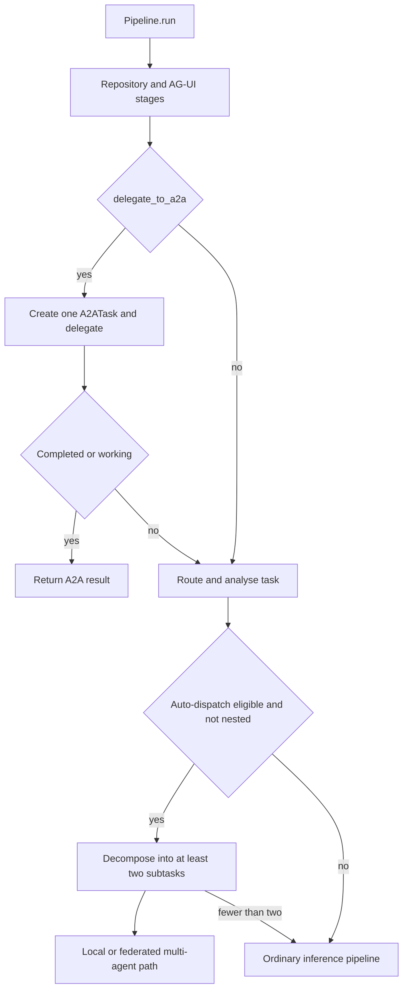
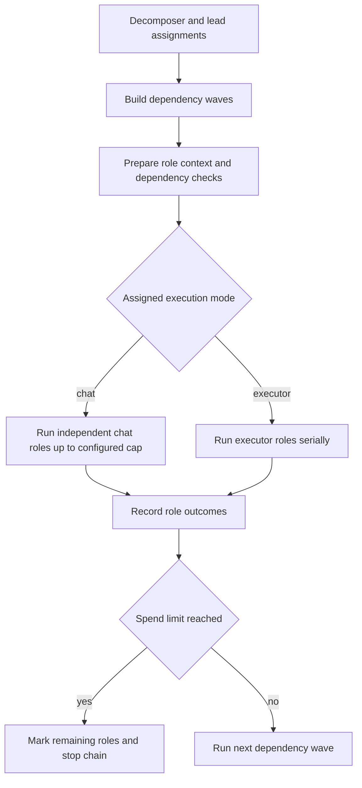

# Pipeline and A2A orchestration

`Pipeline.run()` is the orchestration entrypoint for an inference request. It initializes request context and telemetry, performs repository intelligence and optional AG-UI setup, then either follows an A2A path or continues through routing, spend control, memory/skill/context stages, inference, and terminal event emission. The [architecture overview](../architecture/overview.md) describes the executor and gateway boundaries that this page composes.

## Two deliberately different A2A entry modes

A2A does **not** mean one single dispatch behavior.

- **Explicit protocol delegation** is requested with `delegate_to_a2a=True`. Before ordinary task routing, the pipeline creates one `A2ATask` and calls `route_and_delegate()`. If that task is `completed` or `working`, it returns an A2A `PipelineResult` immediately; an unsuccessful terminal state falls through to ordinary pipeline handling. This is delegation to a registered local/remote A2A agent, not local decomposition.
- **Automatic multi-agent dispatch** is considered only after the ordinary route analysis, only when explicit delegation was not requested, and only if `a2a.enabled` and `a2a.auto_dispatch` are enabled. It requires either `complexity == "high"` or at least `a2a.min_flags_for_dispatch` (default 2) among code generation, review, testing, and deployment. `TaskDecomposer` must also yield two or more subtasks; otherwise the ordinary pipeline continues.

This shows the protocol-delegation branch and the distinct automatic multi-agent branch.

### Nesting guard

Automatic decomposition is suppressed for an A2A subtask: `Pipeline._is_a2a_nested()` recognizes `VOLY_A2A_NESTED=1` or `context["a2a_parent_task_id"]`. The server-side subtask convention also carries a parent id. Preserve this guard when adding an entrypoint or worker, because an A2A worker that invokes the pipeline must not recursively fan out another A2A graph. The explicit-delegation flag is separately excluded from the automatic branch.

## Automatic dispatch and dependency waves

The decomposer maps routing signals to role-specific `Subtask` objects with `depends_on` indices. For example, a full code/review/test/deploy task has architecture before implementation, implementation before testing and deployment, and review after the preceding work. Dependent roles receive compact predecessor summaries; that material is explicitly labelled **untrusted context**, warns recipients not to follow instructions contained in it, truncates long output, and can list touched files.

When `a2a.execution_mode` is `local` (the default), the pipeline builds a `LeadOrchestrator`, which assigns model tier/provider, skills, and optionally an execution preference for each role. `run_local()` then executes assignments in dependency waves. It can run independent **chat** roles concurrently when `parallel_waves` is enabled, bounded by `max_parallel_roles`; executor items are run serially. A chain-wide gateway spend-limit response marks unscheduled assignments failed and stops later waves rather than making further calls.

This shows local wave scheduling; executor serialization is intentional even when a wave has parallel chat work.

### Hybrid chat and executor roles

Hybrid execution is eligible when `a2a.hybrid_code_gen` is true and there is a project `cwd` when `a2a.hybrid_require_cwd` requires one. The pipeline resolves that directory from request context first, then `default_cwd`, then `VOLY_PROJECT_CWD`; with no usable directory, roles use chat rather than inventing a filesystem location.

By default, `developer`, `bugfixer`, `tester`, and `devops` are executor roles for code-generating work; `tester` remains chat for non-code-generation work. Architect, reviewer, security, and documenter roles are chat roles, and the lead cannot promote a role outside the executor-capable set. A lead may request `chat` or `executor` for an eligible role; configuration can replace the default executor-role list. Executor selection honors a per-role `VOLY_A2A_EXECUTOR_<ROLE>` environment override, then an explicit non-default `executor_default`, then the role mapping.

The executor adapter wraps `AgentRunner` and passes its parent task id while suppressing per-role `TaskEvent` emission, leaving the aggregate local A2A event as the primary telemetry record. Each `AgentRunner` invocation is guarded by `cwd_executor_lock`, so executor agents sharing a checkout cannot mutate it concurrently. If an executor runner is unavailable, the role falls back to chat. For code-generation runs, an executor role that reports success but has no reported or detected project-file changes is marked failed; the aggregate cannot be completed without a successful implementation role (or a soft-failed role that did write project files). See [entrypoints and safety](../operations/entrypoints-and-safety.md) for the executor-facing safety boundary.

## Federated automatic execution

For an automatic dispatch with an execution mode other than `local`, the pipeline calls `A2AOrchestrator.dispatch_parallel()`. The orchestrator dispatches each dependency level in parallel, waits/polls tasks within `a2a.task_timeout_seconds`, and injects prior results into dependent task descriptions. It merges returned results and writes an `A2AReport` under the parent of the configured telemetry events directory. Completion is deliberately strict: the pipeline reports `completed`/success only if every dispatched task completed; some completions yield `partial`, and none yield `failed`.

The underlying A2A client discovers agent cards at `/.well-known/agent-card.json` and sends remote tasks as JSON-RPC `tasks/send` requests to `/tasks`; it adds a Bearer `Authorization` header when configured with a token. Federation is optional: `create_a2a_orchestrator()` installs a federation backend only when `a2a.federation_url` produces a client, while `setup_environment()` registers configured `a2a.remote_agents`. Protocol delegation and federation are integration boundaries, not proof that a remote agent changed or verified the local repository.

## Episode: local orchestration record

After a local multi-agent run, the pipeline adapts assignments into a versioned `MultiAgentEpisode` with `environment="pipeline"` and attempts to save it atomically as `<cwd>/.voly/episodes/<task_id>.json`. The write uses a same-directory temporary JSON file followed by `os.replace`; save failure is logged and does not replace the run result.

An episode records task and lifecycle status, acceptance criteria, role traces, artifacts, decisions, metrics, and metadata. Traces link dependency ancestry through `parent_trace_ids`, capture model/provider/executor, messages, executor attempt history, file artifacts, usage/cost/duration, and errors. `RoleMetric` accepts only five named metrics and scores in the inclusive 0–1 range. The adapter adds a cost-adjusted contribution metric, while additional evaluation may append metrics and decisions.

This is an orchestration-level record. `EvidenceRecord` and `EvalReport` remain the authorities for executor evidence and verification rather than being duplicated by the episode. Generic environments such as solver/judge, parallel solutions, debate, and iterative repair are reusable primitives, but production automatic local dispatch is specifically adapted as the `pipeline` environment; adding another environment alone does not change that scheduler.

## Read-only agentic judge

After local assignments have been turned into an episode, an `AgenticJudgeAgent` is run only when a `cwd` exists and `evaluation.llm_judge.mode` is `shadow` or `required`. It receives the original task, derived acceptance criteria, serialized solver trace, and parent trace ids. Its request is marked read-only and grants the environment's `READ_ONLY_JUDGE_TOOLS`.

The judge is confined to `ReadOnlyJudgeWorkspace`, rooted at the resolved project directory. Its only callable operations are `list_files`, `read_file`, `search_text`, and `git_diff`; paths are resolved and rejected if they escape that root. Listing and searching omit `.git` and `.voly`, output is capped, and `git_diff` has a 15-second subprocess timeout. There is no write or general shell operation. The agent also bounds its model/tool loop to at most six steps and sets `allow_provider_reroute=False` for its gateway calls.

The judge asks the model for strict JSON containing a verdict, summary, and all five stable metrics: `architecture_usefulness`, `implementation_correctness`, `test_coverage`, `reviewer_precision`, and `cost_adjusted_contribution`. Parsing or metric validation failure marks the judge trace failed. The trace, metrics, decisions, and judge metadata are appended to the episode. In `shadow` mode that verdict is recorded only; in `required` mode, any judge failure or a verdict other than `pass` downgrades the local pipeline result and episode to failure/partial as appropriate. Thus this is a bounded independent evaluator, not an executor and not merely passive observability.

## Operating and change checklist

- Test explicit protocol delegation independently from automatic local/federated dispatch; do not route both through one abstraction that loses their different fall-through and lifecycle semantics.
- Keep the nested context/environment guard and dependency ordering. Treat predecessor text as untrusted context.
- Retain serial locking for executor work in a shared `cwd`; exercise both no-`cwd` chat fallback and hybrid executor behavior.
- When altering outcome policy, cover spend-limit early stop, failed/skipped dependencies, no-change code-generation success, and the all-remote-tasks completion rule.
- Evolve episode schema separately from telemetry, executor evidence, and evaluation-report contracts. Preserve atomic save behavior.
- For judge changes, test root confinement, excluded directories, tool allowlisting, output/step limits, strict result parsing, and both `shadow` and `required` effects.

Focused regression coverage lives in `tests/test_a2a_p0.py`, `tests/test_a2a_federation.py`, `tests/test_a2a_episode.py`, `tests/test_hybrid_a2a.py`, and `tests/test_agentic_judge.py`.
