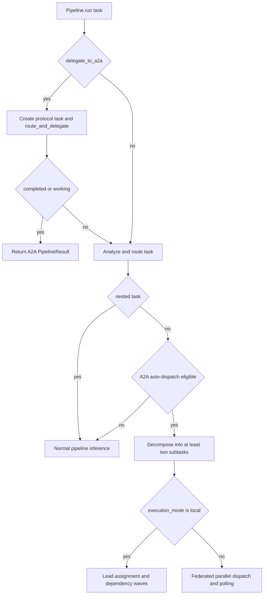

# Pipeline and A2A orchestration

`Pipeline.run()` is the orchestration entrypoint. It initializes per-run state and telemetry, enriches the request with repository intelligence, optionally starts AG-UI, then routes and analyzes the task. Normal requests proceed through spend checking, memory/skills/context processing, inference, and completion handling. A2A is an early-return branch, not a synonym for every pipeline run; see the [architecture overview](../architecture/overview.md) for the surrounding gateway and executor boundaries.

## Two deliberately different A2A paths

VOLY exposes **explicit delegation** and **automatic dispatch**. They must remain distinct when changing routing or client behavior.

This shows the decision boundary between protocol delegation, automatic local/federated orchestration, and ordinary inference.

### Explicit delegation

A caller sets `delegate_to_a2a=True` to create one A2A protocol task and invoke `route_and_delegate()`. The pipeline returns immediately only when the task is `completed` or `working`; a non-working, non-completed result falls through to normal task routing. This path does not decompose the task locally.

### Automatic dispatch and recursion guard

After routing, automatic dispatch is considered only when A2A and `a2a.auto_dispatch` are enabled and the request is not nested. Eligibility is either `complexity == "high"` or at least `a2a.min_flags_for_dispatch` (default 2) of code generation, review, testing, and deployment requirements. `TaskDecomposer` must still yield two or more subtasks; otherwise the request continues along the ordinary pipeline path.

Nested tasks are barred from automatic dispatch by three cooperating boundaries: `delegate_to_a2a` is false for the auto path, `Pipeline._is_a2a_nested()` recognizes `VOLY_A2A_NESTED=1` or `context["a2a_parent_task_id"]`, and the pipeline-server request adapter marks a request with a subtask `task_id` (or explicit parent) as nested. This prevents a federated worker's subtask from repeatedly decomposing itself.

## Local automatic orchestration

With `a2a.execution_mode: local`, decomposition produces role-specific subtasks and dependency indices. Standard combinations construct flows such as architect → developer → tester/reviewer/devops; task-text signals can add specialized roles. The lead then emits an `Assignment` per subtask: model tier/provider, applicable skills, dependencies, and an optional execution preference. `lead_mode` controls cost and determinism: `deterministic` never calls a lead model, `llm` always does, and `auto` calls it only for non-standard role sets or more than five subtasks. Invalid lead JSON or lead/gateway failure falls back to the deterministic role-to-tier mapping.

`run_local()` topologically groups assignments into dependency waves. It may run independent **chat** roles concurrently up to `a2a.max_parallel_roles` when `parallel_waves` is enabled, but runs executor items serially in the wave. Unknown or cyclic dependencies degrade to one-assignment waves rather than deadlocking. Before an assignment runs, its dependent predecessors provide compact output/file summaries marked **untrusted context**; this is a prompt-injection boundary, not verified evidence.

A hard gateway `spend_limited` result stops the entire local chain and marks unscheduled assignments failed without additional gateway calls. Dependency preparation can skip dependents when required predecessors failed; for code-generation work, a failed implementer with no changed files makes post-implementation roles pointless and they are skipped. A failure that still reported changed files does not trigger that no-code cascade, allowing later inspection/testing to proceed.

### Hybrid chat and executor roles

Hybrid mode turns selected assignments into calls to `AgentRunner`, while other roles remain gateway chat:

- It is eligible only when `a2a.hybrid_code_gen` is enabled and, by default, a project `cwd` exists (`a2a.hybrid_require_cwd`). Without the required working directory, roles use chat.
- Default executable roles are `developer`, `bugfixer`, `tester`, and `devops`; architect, reviewer, security, and documenter remain chat by default. A lead may request executor mode only for executor-capable roles. A tester stays chat for non-code-generation work.
- An executor choice honors a role/capability assignment when present; otherwise role-specific environment overrides, an explicit configured default, and the role map determine it. The sub-role runner suppresses its own TaskEvent, preserving the parent multi-agent TaskEvent as the primary telemetry event.
- Each `AgentRunner` invocation is surrounded by `cwd_executor_lock`. It creates `<cwd>/.voly/executor.lock` atomically, waits up to its timeout, removes stale locks whose owning PID is gone, and releases the lock on exit. Thus chat calls can be parallel, but file-writing work is serialized across processes sharing a checkout so git deltas and `files_touched` do not intermix.

The runner adapts executor output, cost, tokens, changed/created files, and fallback-chain log into the assignment. For code-generation work, the role finalization treats a successful executor with neither reported nor detected file changes as a failure; success text alone is insufficient.

## Federation and the Cloudflare A2A service

For automatic dispatch with a non-local execution mode, the pipeline sends decomposed subtasks through `A2AOrchestrator.dispatch_parallel()`, polls non-terminal tasks every three seconds until `a2a.task_timeout_seconds`, merges responses, and writes an `A2AReport` beside the configured telemetry area. The aggregate is successful only if every dispatched task is `completed`; it is `partial` when some completed and `failed` when none did. The resulting TaskEvent records the aggregate status, agent list, count, prompt, and merged result.

The Cloudflare A2A worker is a separate task-registry and delivery boundary. Its authenticated API lazily seeds/list/registers agent cards and persists tasks in D1. `POST /tasks` stores a `submitted` task and queues it only when an agent is named and asynchronous delivery is not explicitly disabled. The queue consumer changes only submitted tasks to `working`, invokes `/agents/:agent/run` through a bound worker or configured URL, marks an HTTP delivery failure as `failed`, and retries the queue message on thrown exceptions. An agent (or caller) completes or fails the task through the dedicated endpoints; completing an already completed task is an idempotent no-op.

Federation transports task state and output; it does not grant a remote service authority over local repository changes. Preserve the nested marker when building worker requests, and treat local executor evidence and test results—not an untrusted remote summary—as the authority for changed code.

## Episodes, telemetry, and evidence are separate records

After a local run, `episode_from_assignments()` adapts assignments into a versioned `MultiAgentEpisode` with one trace per assignment, dependency trace links, messages, executor-attempt tool calls, file artifacts, route decisions, cost/token/duration fields, and an initial cost-adjusted role metric. The episode status is completed only if all role traces completed, partial if some did, and failed otherwise. `EpisodeStore` writes JSON atomically by replacing a temporary file at `<cwd>/.voly/episodes/<task_id>.json`.

This is an orchestration history. It is not a replacement for executor `EvidenceRecord` or verification/evaluation reports, which remain their own sources of truth; episode traces reference evidence rather than duplicating that contract. Likewise, the final aggregate `TaskEvent` is telemetry for the run, while the episode retains role-level trace data. Avoid combining or silently changing these schemas when adding a role, metric, or executor.

## Agentic judge: bounded and read-only

For a local run with `cwd`, the pipeline appends an `AgenticJudgeAgent` when `evaluation.llm_judge.mode` is `shadow` or `required`. It receives the original task, assignment descriptions as acceptance criteria, the episode trace, and predecessor trace IDs. Its workspace exposes only `list_files`, `read_file`, literal `search_text`, and `git_diff`; all relative paths are resolved under the project root, traversal is rejected, file listing/search omit `.git` and `.voly`, and returned text is capped. There is no write or arbitrary shell tool (the fixed `git diff` subprocess is the sole command).

The judge runs a bounded tool loop (at least one and normally up to six calls), with provider rerouting disabled, and must return strict JSON: `pass`, `fail`, or `uncertain`, a summary, and all five 0–1 metrics: architecture usefulness, implementation correctness, test coverage, reviewer precision, and cost-adjusted contribution. Missing/invalid JSON or metrics produces a failed judge trace. The pipeline appends its trace, decisions, and metrics to the episode. In `shadow` mode that verdict is recorded only; in `required` mode anything other than a completed `pass`—including judge setup/provider errors—downgrades the aggregate local outcome and marks the episode failed.

## Operations and change checklist

- Configure automatic behavior under `a2a`: `enabled`, `auto_dispatch`, `min_flags_for_dispatch`, `execution_mode`, `task_timeout_seconds`, lead settings, wave parallelism, and hybrid/executor settings. A request `cwd` takes precedence over `default_cwd`, then `VOLY_PROJECT_CWD` for local hybrid work.
- Keep explicit delegation tests separate from auto-dispatch tests. Cover the environment and parent-context recursion guards, a decomposition that returns fewer than two subtasks, and federated timeout/partial status.
- For scheduler changes, retain dependency ordering, untrusted context labeling, whole-chain spend stopping, and cross-process shared-`cwd` serialization. Test cycles and failed predecessors as well as the happy path.
- For hybrid changes, test no-`cwd` chat fallback, restricted executor role promotion, executor result adaptation, no-change code-generation failure, and preservation of parent telemetry.
- For judge changes, test path confinement, excluded metadata directories, tool allowlisting, output/step bounds, strict parsing, and the difference between `shadow` observation and `required` enforcement.
