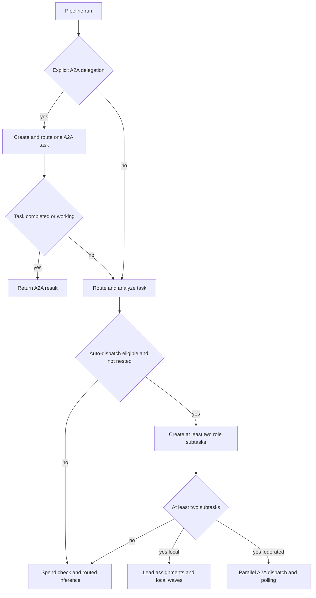

# Pipeline and A2A orchestration

`Pipeline.run()` is VOLY’s orchestration and inference entrypoint. It initializes run context and stage hooks, optionally performs repository intelligence and AG-UI setup, then decides between A2A work and the ordinary routed inference path. It is not intrinsically a file-writing executor: hybrid A2A roles enter `AgentRunner`, whose `cwd` safety boundary is described in [Entrypoints, configuration, and filesystem safety](../operations/entrypoints-and-safety.md).

## Two distinct A2A entry modes

A2A has two deliberately separate meanings. Do not make one an alias for the other.

- **Explicit protocol delegation** is selected by `Pipeline.run(..., delegate_to_a2a=True)`. The pipeline creates one A2A task, calls `route_and_delegate()`, and returns an A2A `PipelineResult` only when that task is `completed` or `working`. For another state it falls through to normal routing and inference.
- **Automatic multi-agent dispatch** happens only *after* routing, when A2A and `auto_dispatch` are enabled, the run is not nested, and analysis has at least `min_flags_for_dispatch` (default two) among code generation, review, testing, and deployment—or reports high complexity. `TaskDecomposer` must also yield at least two subtasks; otherwise ordinary processing continues.

Automatic dispatch starts from a role/dependency plan rather than automatically delegating one protocol task. It selects the local scheduler when `a2a.execution_mode` is `local`; any other mode uses the federated A2A orchestrator.


```mermaid
flowchart TD
    Begin["Pipeline run"] --> Explicit{"Explicit A2A delegation"}
    Explicit -->|"yes"| Delegate["Create and route one A2A task"]
    Delegate --> ProtocolState{"Task completed or working"}
    ProtocolState -->|"yes"| ProtocolResult["Return A2A result"]
    ProtocolState -->|"no"| Route["Route and analyze task"]
    Explicit -->|"no"| Route
    Route --> Eligible{"Auto-dispatch eligible and not nested"}
    Eligible -->|"no"| Inference["Spend check and routed inference"]
    Eligible -->|"yes"| Decompose["Create at least two role subtasks"]
    Decompose --> Enough{"At least two subtasks"}
    Enough -->|"no"| Inference
    Enough -->|"yes local"| Local["Lead assignments and local waves"]
    Enough -->|"yes federated"| Remote["Parallel A2A dispatch and polling"]
```

This shows the explicit protocol path and automatic role-based path converging only at the pipeline boundary, not at their dispatch mechanism.

### Recursion and nested-task guard

A subtask must not recursively fan itself out. `Pipeline._is_a2a_nested()` treats `VOLY_A2A_NESTED=1` or `context["a2a_parent_task_id"]` as nested; the pipeline server also marks a request containing a task ID or explicit parent ID with parent context. Nested calls bypass automatic dispatch, and `_stage_a2a_auto()` independently refuses a nested request. The `delegate_to_a2a` flag also excludes the automatic branch for that run. Preserve all of these guards when adding entrypoints or forwarding task context.

## From task analysis to local roles

`TaskDecomposer` translates capability flags and task complexity into role subtasks and explicit dependencies. Typical code-generation plans are architect → developer → tester/reviewer, with devops dependent on implementation where applicable. Signal-matched UI, browser, and UX roles can be appended; a signal-only result still has to satisfy the two-subtask gate before automatic dispatch runs.

`LeadOrchestrator.assign()` turns subtasks into assignments containing a role, dependency indices, model/provider tier, skills, and optional execution preference. In `deterministic` lead mode it uses role defaults; `llm` asks a lead model; `auto` asks only for non-standard role sets or more than five subtasks. Invalid lead output, an error, or a provider failure falls back to deterministic assignment. When capability matching is configured, it may recommend a healthy executor or model/provider based on role dimension and project features; matching failure is also non-fatal.

Dependent roles receive concise prior output via `TaskDecomposer.inject_prior_context()`. This material is explicitly headed **“untrusted context”**, warns recipients not to follow instructions contained in it, truncates long summaries, and lists non-`.voly` touched files. Reviewer and tester roles with a `cwd` additionally receive diff evidence for dependency files. That combination is context for inspection, not trusted instructions or proof of an implementation.

## Local dependency-wave execution

`run_local()` builds dependency waves and prepares every runnable assignment with role prompts, matched skills, optional memory, and plan gates. With `parallel_waves` enabled, independent chat assignments in a wave run concurrently up to `max_parallel_roles`; executor assignments are then executed serially. A gateway response marked `spend_limited` is a hard stop for the chain: unscheduled assignments are marked failed without more gateway calls.

File-writing work is additionally serialized across processes sharing a project: `make_agent_runner_executor()` wraps every `AgentRunner.run()` in `cwd_executor_lock`, stored as `<cwd>/.voly/executor.lock`. The lock uses exclusive creation, waits until its timeout, and removes a stale lock when its recorded owner no longer exists. Chat-only work remains lock-free. This protects Git delta attribution and avoids concurrent mutation of the same working tree.

Failure handling is dependency-aware rather than blindly continuing:

- If all usable prerequisites failed, a dependent is skipped. For code-generation work, later implementation/test/review roles are also skipped when completed executor roles produced no code.
- A failed executor that did touch files still counts as code produced, so dependent testing and review can proceed on actual work rather than being discarded solely for a soft safety failure.
- A chat dependent with at least one successful prerequisite can run in degraded mode and is told which earlier role failed.
- A code-generation executor that claims success but reports and yields no file delta is marked failed. This prevents a plausible textual report from turning a no-change implementation into a completed multi-agent outcome.

## Hybrid chat and executor roles

Hybrid execution is eligible only when `a2a.hybrid_code_gen` is enabled and a project `cwd` is present. Although `hybrid_require_cwd=false` relaxes eligibility calculation, the scheduler still forces roles to chat when no `cwd` exists; it never invents a write location. With defaults, developer, bugfixer, tester, and devops are executor roles, while architect, reviewer, security, and documenter stay chat roles. Tester remains chat-only for non-code-generation work.

A lead may request `chat` or `executor`, but only executor-capable roles may be promoted to executor. Capability matching can supply an executor directly. Otherwise executor selection gives precedence to a role-specific environment variable, then a non-default configured `executor_default`, then the role map. The executor adapter supplies the role prompt and subtask to `AgentRunner`, keeps per-role terminal events disabled so the parent A2A event is primary, and returns output, cost/tokens, changed files, executor identity, and fallback-chain timing to the assignment. If no executor runner is available, the role falls back to chat rather than failing the entire scheduler.

## Federation path

For a non-local execution mode, the automatic path calls `A2AOrchestrator.dispatch_parallel(subtasks, timeout_seconds=...)`, emits the delegation stage, and polls non-terminal tasks every three seconds until the deadline. It merges results regardless of timeout, records an `A2AReport` beneath the telemetry parent directory on a best-effort basis, and emits a terminal `TaskEvent`.

Federated success is intentionally strict: it is `completed` only when every dispatched task completed; it is `partial` when at least one completed and otherwise `failed`. `FederationClient` resolves a configured federation URL or `CF_WORKER_A2A_URL`/`A2A_FEDERATION_URL`, and can attach a bearer token from configuration or `VOLY_A2A_TOKEN`/`CF_WORKER_A2A_TOKEN`. Its HTTP boundary exposes health, agent cards/registration, and task lifecycle operations; HTTP and URL failures raise `FederationClientError` rather than silently reporting a remote success. See [Cloudflare and remote services](../integrations/cloudflare-and-remote-services.md) for deployment integration.

## Episodes, telemetry, and the agentic judge

After a local run, assignments are adapted into a versioned `MultiAgentEpisode` with role traces, dependency trace IDs, touched-file artifacts, execution decisions, metrics, costs, and status. `EpisodeStore` writes `<cwd>/.voly/episodes/<task_id>.json` atomically through a temporary file and replace. An episode is an orchestration record, not a substitute for executor `EvidenceRecord`, evaluation reports, or terminal telemetry; their different purposes are explained in [Run evidence, evaluation, and observability](../operations/evidence-evaluation-and-telemetry.md).

When `evaluation.llm_judge.mode` is `shadow` or `required` and a `cwd` exists, the local path appends an `AgenticJudgeAgent` trace to that episode. The judge receives the original task, assignment descriptions as acceptance criteria, solver trace, and parent trace IDs. It has a deliberately narrow repository surface:

- only `list_files`, `read_file`, `search_text`, and `git_diff` can be granted;
- relative paths are resolved beneath the workspace root, path escapes fail, and listing/search omit `.git` and `.voly`;
- output is capped, `git diff` has a 15-second subprocess timeout, and no write or arbitrary shell tool exists;
- it is told to treat repository text as untrusted, uses deterministic temperature, disables provider rerouting, and runs at most six tool/model steps.

The final answer must parse as strict JSON with `pass`, `fail`, or `uncertain`, a summary, and five 0–1 metrics: architecture usefulness, implementation correctness, test coverage, reviewer precision, and cost-adjusted contribution. Parsing failure creates a failed trace. Shadow mode records the trace without changing the multi-agent outcome. Required mode marks an otherwise successful outcome unsuccessful when the judge fails, errors, or does not return `pass`; the episode status is set to failed before persistence.

## Configuration and focused validation

The main operating controls are `a2a.enabled`, `a2a.auto_dispatch`, `a2a.min_flags_for_dispatch`, `a2a.execution_mode`, `a2a.task_timeout_seconds`, `a2a.parallel_waves`, and `a2a.max_parallel_roles`. Local assignment behavior is controlled by `lead_mode`, `lead_model`, `role_tiers`, hybrid settings, `executor_default`, and `executor_roles`. A request `cwd` takes precedence over configured/default environment project locations for the local path. Plan gates can further block an assignment until dependent plan steps are verified; see [Plans and SDK workflows](../workflows/plans-and-sdk.md).

Run focused tests after changing these boundaries:

```bash
pytest tests/test_a2a_p0.py -q
pytest tests/test_hybrid_a2a.py -q
pytest tests/test_agentic_judge.py -q
```

These tests cover nested markers and dependency handoff, role-mode policy and no-`cwd` fallback, executor serialization/result adaptation, dependency failure behavior including no-change executor success, concurrent chat waves, and judge path confinement/tool restrictions plus strict metric parsing. Changes to automatic dispatch should also test the explicit-delegation branch separately: explicit A2A task protocol behavior and automatic local/federated decomposition are distinct contracts.
