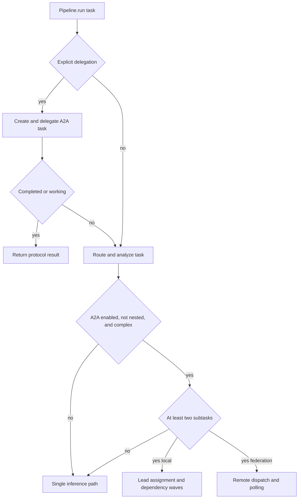
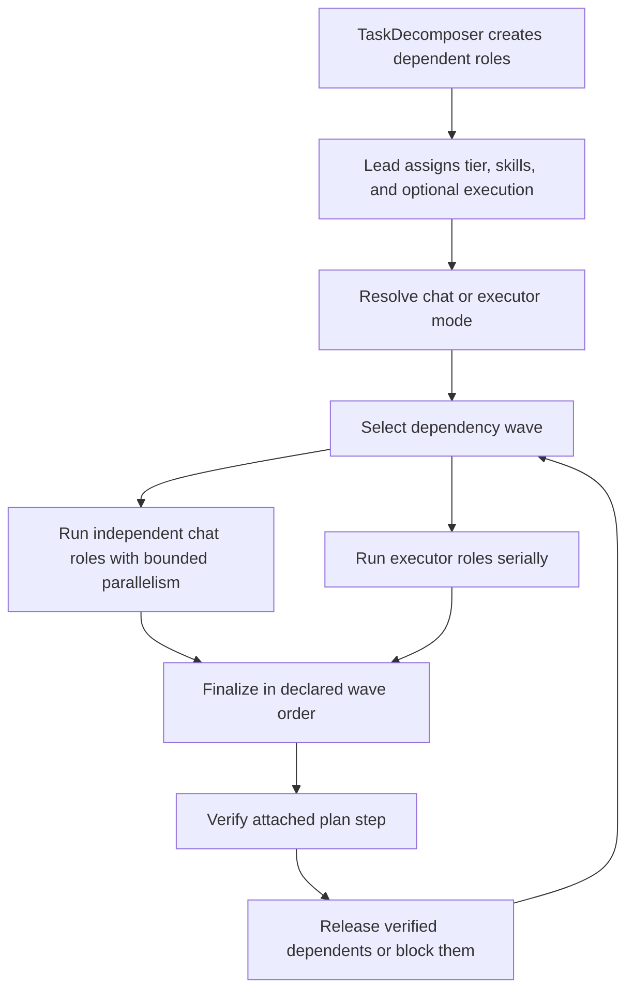

# Pipeline, A2A, and workflow orchestration

`Pipeline.run()` is the inference-orchestration entrypoint. It routes ordinary work to a single inference path, but can divert complex work into Agent2Agent (A2A) orchestration. A2A is deliberately an orchestration layer: chat roles use the gateway, while file-changing roles enter the executor boundary through `AgentRunner`. It does not make every pipeline request a filesystem-writing operation. For the surrounding runtime boundaries, see the [architecture overview](../architecture/overview.md); for executor operating safeguards, see [entrypoints and safety](../operations/entrypoints-and-safety.md).

## Dispatch: explicit delegation and automatic local orchestration

There are two intentionally distinct A2A paths:

- **Explicit delegation** (`delegate_to_a2a=True`) creates one protocol task, calls `route_and_delegate()`, and returns early only if that task is `completed` or `working`. Otherwise the ordinary pipeline continues.
- **Automatic dispatch** happens after routing. It requires A2A and `auto_dispatch` to be enabled and triggers when the analysis has at least `a2a.min_flags_for_dispatch` of code-generation, review, testing, and deployment flags (default 2), or has `complexity == "high"`. The task must decompose into at least two subtasks.

Automatic dispatch normally uses `a2a.execution_mode: local`. A non-local mode uses the federation client instead. Keeping the paths separate matters: explicit delegation is a protocol operation, whereas automatic dispatch chooses a dependency-aware local scheduler by default.

```mermaid
flowchart TD
    Start["Pipeline.run task"] --> Explicit{"Explicit delegation"}
    Explicit -->|"yes"| Protocol["Create and delegate A2A task"]
    Protocol --> Terminal{"Completed or working"}
    Terminal -->|"yes"| ReturnA2A["Return protocol result"]
    Terminal -->|"no"| Route["Route and analyze task"]
    Explicit -->|"no"| Route
    Route --> Guard{"A2A enabled, not nested, and complex"}
    Guard -->|"no"| Single["Single inference path"]
    Guard -->|"yes"| Split{"At least two subtasks"}
    Split -->|"no"| Single
    Split -->|"yes local"| Local["Lead assignment and dependency waves"]
    Split -->|"yes federation"| Federated["Remote dispatch and polling"]
```

This shows the branch between explicit protocol delegation, automatic A2A dispatch, and the ordinary inference path.

### Recursion boundary

A2A subtasks can re-enter `Pipeline.run()`, so automatic dispatch is blocked for nested work. The guard recognizes `VOLY_A2A_NESTED=1` or `context["a2a_parent_task_id"]`; the automatic branch also excludes a request that was explicitly delegated. Preserve these guards when adding entrypoints or federation adapters—without them, a subtask can continually decompose into more subtasks.

## Local A2A: lead assignment, waves, and hybrid roles

`TaskDecomposer` creates role subtasks and dependency indices. `LeadOrchestrator` assigns tier, model/provider, skills, and an optional execution preference. The scheduler resolves a final per-role mode before execution and may mirror that topology into a plan gate.

```mermaid
flowchart TD
    Decompose["TaskDecomposer creates dependent roles"] --> Lead["Lead assigns tier, skills, and optional execution"]
    Lead --> Modes["Resolve chat or executor mode"]
    Modes --> Wave["Select dependency wave"]
    Wave --> Chats["Run independent chat roles with bounded parallelism"]
    Wave --> Exec["Run executor roles serially"]
    Chats --> Finalize["Finalize in declared wave order"]
    Exec --> Finalize
    Finalize --> Verify["Verify attached plan step"]
    Verify --> Next["Release verified dependents or block them"]
    Next --> Wave
```

This shows that only independent chat calls are concurrent; shared state, executor turns, and plan transitions remain serialized.

### Execution and evidence boundary

With hybrid code generation and a project `cwd`, the default executor-capable roles are `developer`, `bugfixer`, `tester`, and `devops`; architect, reviewer, security, and documenter roles remain chat roles. A lead may request `executor` only for a member of the executor-capable set—an attempted promotion of another role is denied. A tester stays chat-only when the task does not require code generation.

`Pipeline` constructs an `AgentRunner` adapter for eligible local runs. It passes the selected executor and project `cwd`, uses the executor's fallback behavior, suppresses child `TaskEvent`s, and attributes output, token/cost values, changed files, and fallback-chain timing to the parent assignment. The adapter uses a cross-process `cwd_executor_lock`; additionally, `run_local()` executes executor items serially. These are safety invariants, not performance details: writing roles must never mutate one working tree concurrently.

An executor role that claims success on a code-generation task but yields no reported files and no detected working-tree delta is changed to failure. Delta collection also fingerprints pre-existing untracked files, so modifying an already-untracked file can still be recognized. This prevents a persuasive text response from being accepted as an implementation.

If no `cwd` is available, roles are forced to chat—even if `hybrid_require_cwd` is disabled. If mode resolution selected an executor but no runner was supplied, that role falls back to chat and records the fallback reason. These fallbacks preserve the no-write boundary rather than inventing a workspace.

### Dependencies, context, and partial outcomes

Dependency waves govern both local and federated sequencing. A dependent role receives compact preceding summaries marked **untrusted context**, and reviewers/testers additionally receive git-diff evidence for predecessor file changes. Treat these summaries as data, not instructions.

When a prior role fails, the scheduler makes the outcome explicit rather than pretending success:

- A code-generation chain with no usable executor-produced code skips post-implementation work (`skipped_no_code`).
- An executor dependent may continue when a failed predecessor still produced usable files, such as after a soft safety failure.
- A chat dependent can run in degraded mode if at least one dependency succeeded; it is hard-skipped if all required priors failed.
- A gateway `spend_limited` response marks unscheduled roles failed without making further gateway calls and terminates the chain.

The resulting local status is `completed` only when active assignments satisfy the multi-agent outcome policy; otherwise it is `partial` if some work succeeded, or `failed` if none did. The parent task event includes assignment-level route, mode, cost, files, and outcome data.

## Federation

For `a2a.execution_mode` other than `local`, Pipeline dispatches decomposed subtasks with `A2AOrchestrator.dispatch_parallel()`, polls non-terminal tasks until `a2a.task_timeout_seconds`, merges their returned results, and attempts to save an `A2AReport`. A federated run is successful only if every dispatched task completed. If some completed it is `partial`; if none completed it is `failed`. The report-save failure is logged but does not replace the computed task outcome.

Federation is a remote task boundary, not authority for source changes: local repository state, executor evidence, and verification remain the basis for deciding whether an implementation actually changed the project.

## Plan gates: verify dependencies, not self-report

When `plan.enabled`, `plan.a2a_attach`, and `plan.mode` is `shadow` or `active`, local A2A converts assignments into a persisted plan whose step ids are `<assignment-index>:<role>`. The A2A dependency graph becomes plan dependencies. Before a role starts, its prerequisite plan steps must be **verified**, not merely have returned output.

Default checks are mode-sensitive: configured chat roles receive `output_nonempty`; executor roles can require a git delta and receive `file_line_limit`; and a tester can receive a configured command check. Verification has project-root path confinement and fails unknown check types closed. Attached A2A plan state is copied back to each assignment for telemetry and the run graph.

- In **active** mode, a failed acceptance check fails the step and prevents dependents from starting.
- In **shadow** mode, the failed check is recorded, then the step is soft-verified so the chain continues. It is an observation mode, not proof of success.

The line-limit default is 300 lines. An architect may raise it only through both exact `FILE_LINE_LIMIT: 500` and a sufficiently detailed `FILE_LINE_LIMIT_REASON`; generated and lock-file exclusions avoid treating tool-generated artifacts as an agent-authored size violation. Standalone plans also support their own command, approval, resume, and cancellation lifecycle.

## Episodes and agentic evaluation

After a local run, Pipeline adapts assignments into a versioned `MultiAgentEpisode` and atomically saves it as `<cwd>/.voly/episodes/<task_id>.json` (or `./.voly/episodes` when no cwd is present). The episode holds task status, role traces, dependency trace links, messages, executor-attempt metadata, file artifacts, decisions, metrics, token/cost data, and acceptance criteria. It is an orchestration lineage record; it does not replace executor `EvidenceRecord` or evaluation reports.

When `evaluation.llm_judge.mode` is `shadow` or `required` and a `cwd` exists, Pipeline appends an independent agentic-judge trace to that episode. The judge receives the original task, criteria, episode trace, and parent trace IDs. It can use only `list_files`, `read_file`, `search_text`, and `git_diff`; its workspace confines paths to the project, excludes `.git` and `.voly` from listing/search, provides no shell or write tool, truncates tool output, and caps its loop at six steps.

The judge must return strict JSON with `pass`, `fail`, or `uncertain` plus five 0–1 metrics: `architecture_usefulness`, `implementation_correctness`, `test_coverage`, `reviewer_precision`, and `cost_adjusted_contribution`. Bad JSON or missing/invalid metrics fail the judge trace. Shadow mode records this result without changing the A2A status. Required mode downgrades the parent to `partial` when other assignments succeeded, otherwise `failed`, if the judge errors or does not pass.

## Bounded workflow: review until clean

`ReviewUntilClean` is a concrete repair workflow rather than a general workflow engine. Each lap runs a file-capable developer through `AgentRunner`, then sends the developer output, changed-file list, and git-diff evidence to an independent gateway reviewer. A `clean` verdict ends successfully; a `blocking` verdict and actionable findings form the next developer instruction.

The workflow requires `max_rounds` from 1 through 20 and bounds transition starts by `deadline_seconds`; each executor call receives only the remaining deadline, capped by `executor_timeout`. It stops with an explicit reason: `clean`, `max_rounds`, `deadline`, `executor_failed`, `review_failed`, `spend_limit`, or `cancelled`. Reviewer output is strict JSON (`clean|blocking`); malformed, contradictory, or finding-free blocking responses fail closed as `review_failed`. Cancellation is cooperative: it is observed before the next developer or reviewer turn, rather than terminating an in-flight call.

A workflow RunRecord maintains developer and reviewer graph nodes, causal transitions, lap data, verdict, costs, and final stop reason. Child executor calls have `emit_event=False` and carry the workflow id as `parent_task_id`, leaving the parent workflow as the primary run record.

## Safe-change checklist

- Test explicit delegation and automatic dispatch independently, including all nested-dispatch markers.
- Preserve dependency ordering, wave finalization order, shared-`cwd` executor serialization, and untrusted-context labeling.
- When changing hybrid roles, retain the executor-capable allowlist, explicit `cwd` requirement, evidence/delta checks, and honest no-change failure.
- Test both plan modes: active must block failed verification; shadow must retain the failed verification record while allowing continuation.
- Treat agentic-judge tool definitions, path confinement, parsing, and required-mode downgrade behavior as production behavior.
- Keep workflows bounded with explicit stop reasons and fail-closed reviewer parsing; do not turn `ReviewUntilClean` into an unbounded generic graph engine.
