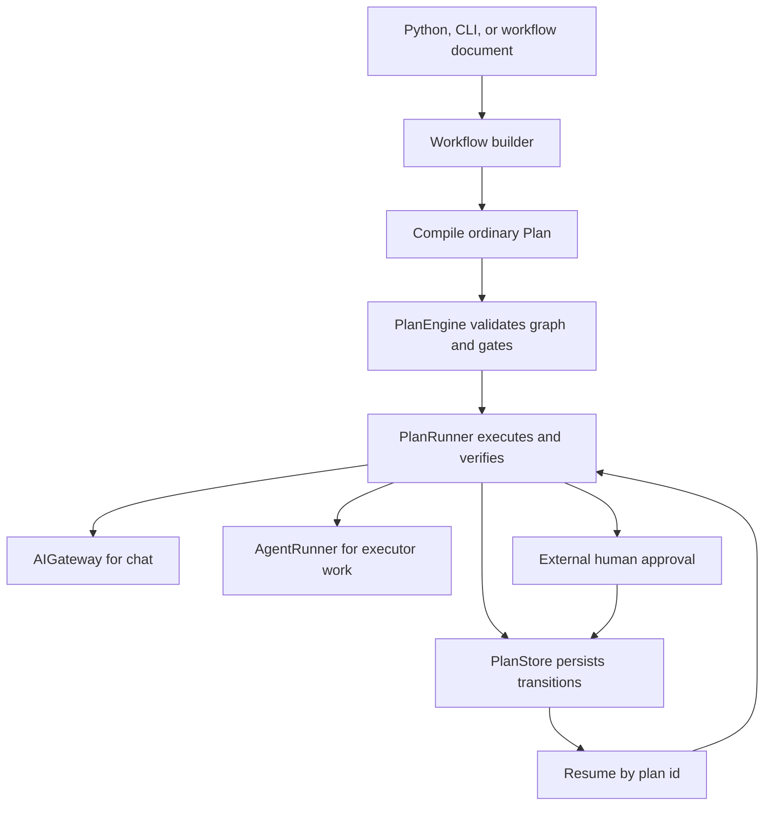
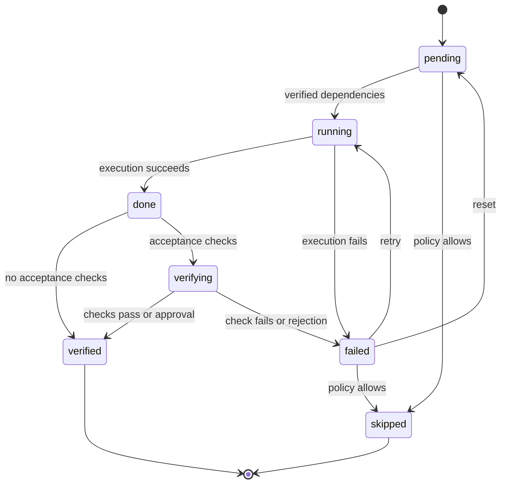

# Durable plans and Python workflow SDK

`Agent` and `Workflow` are public Python conveniences, exported from `voly`, not an alternate orchestration engine. A standalone `Agent` sends chat work through the governed `AIGateway` or file-capable work through `AgentRunner`. A `Workflow` declares nodes, compiles them to an ordinary persisted `Plan`, and delegates execution to the same `PlanRunner` and `PlanStore` used by the plan runtime. This preserves the existing state machine, verification semantics, and recovery behavior rather than creating a second scheduler or persistence format. For pipeline and A2A orchestration, see [Pipeline and A2A orchestration](a2a-and-pipeline.md); for the broader component map, see the [architecture overview](../architecture/overview.md).



This shows that `Workflow` is a builder over the Plan runtime and that persisted Plan state is the resume boundary.

## Public API and compilation

Create an `Agent` with a name, optional instructions and routing fields, and either `mode="chat"` (the default) or `mode="executor"`. `Agent.run()` returns an `AgentResult` with outcome, attribution, token/cost/duration, files, task id, and raw response data; `Agent.arun()` runs the same synchronous implementation in a worker thread. Executor-mode standalone agents require an explicit `cwd`, preventing file work from choosing an implicit working directory. Chat mode uses `gateway_from_config()` and executor mode uses `AgentRunner`, so configured gateway controls and executor reporting remain in effect.

```python
from voly import Agent, Workflow

researcher = Agent("researcher", instructions="Find verifiable facts")
reviewer = Agent("reviewer", instructions="Check claims and sources")

workflow = Workflow("research-review")
workflow.add("research", agent=researcher)
workflow.add("review", agent=reviewer, depends_on=["research"])

result = workflow.run("Compare two markets")
```

`Workflow.add()` accepts a node id, `Agent`, optional node task, dependencies, `approval`, acceptance checks, and `timeout_seconds`. `compile(task, cwd=...)` folds agent instructions into each node task and maps agent role, mode, executor, model/provider/tier, dependencies, and acceptance checks to `PlanStep` fields. It labels the resulting Plan with `metadata["kind"] == "sdk_workflow"` and its workflow name. Compilation has a fresh runtime `plan_id` each time, while the declared topology remains deterministic.

Graph validation is deliberately performed by `PlanEngine`: duplicate ids, unknown dependencies, self-dependencies, invalid modes/statuses, and dependency cycles raise `WorkflowError` during compilation. A node is eligible to start only when every dependency is `verified`, not merely executed. Before a dependent node runs, `PlanRunner` prepends the stored outputs of its declared dependencies to its instruction; unrelated sibling output is not included.

`WorkflowResult` exposes the executed `Plan`, whole-run status/success/error/duration, aggregate cost, and declaration-ordered `NodeResult` records. A `NodeResult` is reconstructed from the PlanStep rather than retaining a live `AgentResult`, which makes results compatible with persisted recovery. Workflow success means the underlying plan is `completed`; a failed, pending, or paused required node cannot be reported as success.

### What does not compile through a workflow node

Standalone chat agents support allowlisted named tools and prompt-based structured output validation. Those features are not currently carried into a `Workflow`: `PlanStep` has no `tools` or `output_schema` fields, and compilation does not serialize the live agent or a schema class. Likewise, `WorkflowNode.timeout_seconds` is accepted and retained on the builder node but is not enforced as a per-node timeout. Use the workflow-level `timeout_seconds` on `run()` or `resume()` instead.

## Plan lifecycle, verification, and persistence

A PlanStep follows the runtime state machine `pending → running → done → verified`, with `verifying` inserted when it has acceptance checks. Failures can be retried or reset according to plan policy; skipping is policy-controlled. At the plan level, terminal outcomes are `completed`, `failed`, or `aborted`. Dependency gating requires `verified`, so completing execution or reaching `verifying` never opens downstream work.



This shows the step states enforced by `PlanEngine`; only verified dependencies can unlock another step.

`PlanStore` is the authority for durable Plan state. It writes `<plan_id>.json` below its plans directory atomically using a temporary file and `os.replace`, raises rather than silently discarding I/O failures, and timestamps saves. `PlanRunner` saves before and after step activity and after transitions, so a process interruption leaves prior verified work recorded. On resume, it reloads the Plan, recomputes runnable work from persisted statuses, and does not execute already verified nodes again.

A workflow-level timeout bounds one `run()` call. Expiry leaves the Plan running and resumable rather than falsely failing or aborting completed work. A step still marked `running` beyond `workflow_sdk.stale_running_seconds` is treated as a likely crashed execution: it is recovered to `failed` when the next run/resume starts, then normal retry policy determines its next action. Set this threshold to zero or less to disable stale recovery.

Use an explicit plan id to continue prior work; `Workflow.run(resume=True)` intentionally raises `NotImplementedError` because task text cannot identify one of several fresh compiled Plans.

```python
first = workflow.run("Long-running task", timeout_seconds=30)
# retain first.plan.plan_id across process boundaries
resumed = workflow.resume(first.plan.plan_id)
```

## Approval gates and acceptance failures

`approval=True` appends a `human_review` acceptance check to the compiled step. The node still performs its normal work, then parks in `verifying`; its downstream nodes remain pending until an external reviewer decides. The generic `voly.plan.approval.decide()` function resolves only a PlanStep that declares that check and is awaiting review. Repeating the same decision is idempotent; a conflicting decision or an early decision raises an error, so approval is fail-closed.

```python
from voly.plan.approval import decide
from voly.plan.store import PlanStore

result = workflow.run("Should we proceed?")
decide(PlanStore(config.plan.store_dir), result.plan.plan_id, "decide", "approve")
resumed = workflow.resume(result.plan.plan_id)
```

`PlanRunner` also treats `action_succeeded` as externally resolved. Neither it nor `mode="shadow"` can soft-open either external gate: they stay `verifying` until their external resolver transitions them. By contrast, in `shadow` mode an ordinary failed verification can be force-verified after logging the failure; `Workflow.run()` defaults to `mode="active"`, where verification failure blocks the plan.

## Scheduling, cancellation, and safety

The runner obtains all currently runnable steps in dependency order. Independent `mode="chat"` nodes may run in bounded thread-pool waves when `workflow_sdk.enabled` is true; the maximum is `workflow_sdk.max_parallel_nodes` (default 3). Worker threads perform only the chat phase and mutate only their own step fields. The calling thread finalizes state transitions and verification in declared order, yielding deterministic Plan/`NodeResult` ordering even if chat responses finish in another order.

Executor-mode nodes are never placed in concurrent waves. They share the Plan's single `cwd` and always run serially, which is the safety invariant preventing concurrent executor writers in one working tree. This applies even when the configured chat cap is high. For executor boundary details, see [Entrypoints and safety](../operations/entrypoints-and-safety.md).

`Workflow.cancel(plan_id, error=...)` persists `aborted`. Cancellation is cooperative: an already-started network or executor call is not interrupted, but the runner reloads persisted abort status between steps/waves and before saving progress, so a cross-thread or cross-process cancellation is adopted rather than overwritten by stale in-memory state.

Relevant configuration is held in `workflow_sdk`:

```yaml
workflow_sdk:
  enabled: true
  max_parallel_nodes: 3
  checkpoint: true
  stale_running_seconds: 900
```

`checkpoint` is currently a schema-level setting rather than an opt-out: persistence after transitions and node results is unconditional because resumability depends on it. Set `max_parallel_nodes: 1`, or `enabled: false`, for strict sequential scheduling; disabling the SDK concurrency switch does not remove cancellation or stale-running recovery.

## Presets are graph factories

The public `sequential`, `concurrent`, `supervisor_workers`, `reviewer_loop`, `council`, and `planner_generator_evaluator` functions return uncompiled `Workflow` builders. They do not subclass the runner, import provider clients, or create custom execution loops; consequently the validation, gating, persistence, scheduling, cost aggregation, cancellation, and resume rules above apply unchanged.

| Preset | Graph | Bound and behavior |
|---|---|---|
| `sequential(agents)` | A → B → C | 2–20 agents; predecessor output is handed to the next node. |
| `concurrent(agents)` | A, B, C | 2–20 independent nodes; actual chat parallelism remains config-bounded. |
| `supervisor_workers(supervisor, workers)` | S → workers → S2 | 1–10 workers; synthesis depends on every worker. |
| `council(members, judge)` | members → judge | 2–10 members; a judge produces explicit aggregation. |
| `planner_generator_evaluator(planner, generator, evaluator)` | P → G → E | Fixed three-node dependency chain. |
| `reviewer_loop(generator, reviewer)` | alternating generate/review chain | 1–10 rounds, statically unrolled. |

The `reviewer_loop` name does not imply dynamic early exit. Plans are static DAGs and `PlanEngine` has no conditional-skip primitive, so every configured round runs. Optional `exit_acceptance` is applied only to the final review node; workflow success therefore means that final review passed, not that an earlier round passed. Council/judge and supervisor/synthesis output are evidence for callers, not permission to bypass a human approval gate.

## File and CLI entrypoints

For declarative use, `load_workflow_file()` and `load_workflow_dict()` read an Agent-shaped YAML or JSON workflow document, build it via `Workflow.add()`, then use normal compilation. This differs from `voly plan` input, which is already a low-level Plan/PlanStep document.

```bash
voly workflow validate wf.yaml
voly workflow run wf.yaml --mode active --timeout-seconds 60
voly workflow resume <plan_id>
voly workflow show <plan_id> --json-out
```

Validation compiles without running. `run` accepts document task/cwd defaults with command-line overrides, while `resume` and `show` operate on the persisted Plan by id. Keep the returned plan id whenever approval, timeout recovery, or later operational inspection is possible.

## Focused verification

The most important regression tests are intentionally contract-oriented:

- `tests/test_sdk_workflow.py` checks deterministic topology, compile-time graph rejection, dependency-output handoff, mixed chat/executor `cwd` handling, result cost aggregation, approval pause/approve/resume, timeout resume, and cancellation through the facade.
- `tests/test_plan_approval.py` proves external human review remains parked in `verifying` in both active and shadow modes, and checks idempotent versus conflicting decisions.
- `tests/test_plan_concurrency.py` measures real concurrent chat waves, cap enforcement, deterministic declared ordering, serial executor writers, stale recovery, verified-node non-reexecution, cooperative cancellation, and resumable timeout.
- `tests/test_sdk_presets.py` asserts preset graph shape and bounds, output handoff to aggregation nodes, failure propagation, and the final-only reviewer-loop gate.

Run the focused suite with:

```bash
python -m pytest tests/test_sdk_workflow.py tests/test_plan_approval.py \
  tests/test_plan_concurrency.py tests/test_sdk_presets.py -q
```
