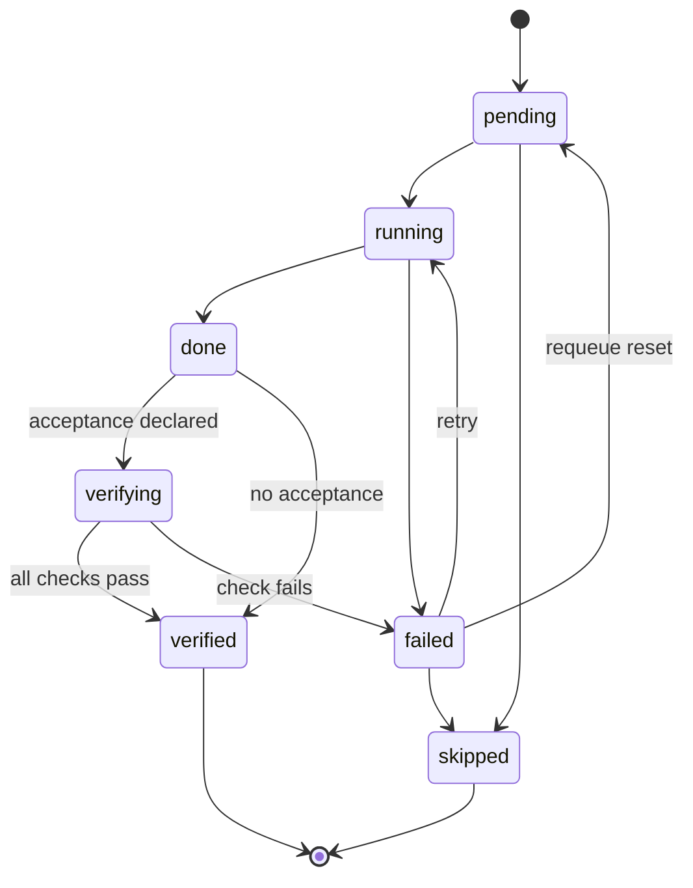
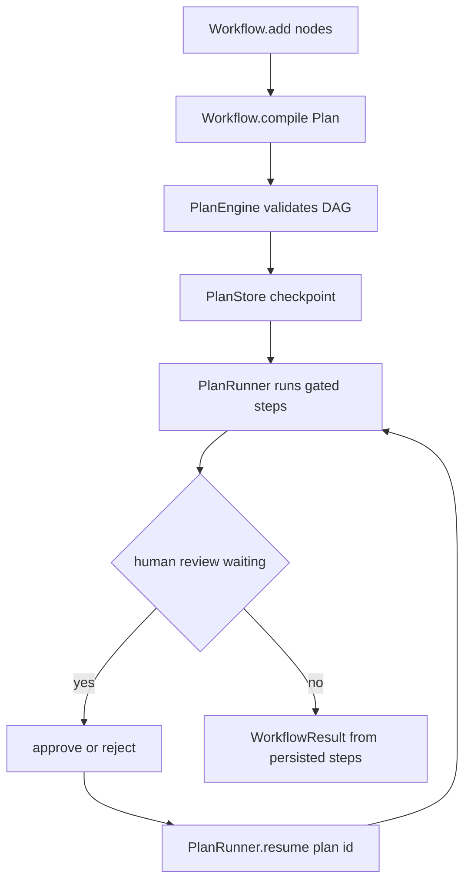
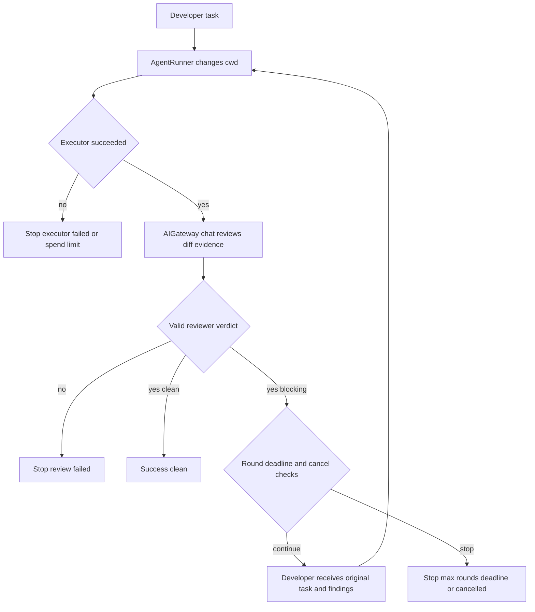

# Plans, approvals, and bounded workflows

A `Plan` is VOLY's persisted execution contract: a validated directed acyclic graph (DAG) of role steps, their dependencies, execution modes, declared acceptance checks, and recorded outputs/evidence. `PlanEngine` owns structure validation and state transitions; `PlanStore` durably owns the JSON document. `PlanRunner` is the generic execution loop. The SDK `Workflow` builder and the A2A-plan bridge both map higher-level topology into this contract instead of introducing another state machine or scheduler.

This is distinct from the pipeline's A2A orchestration described in [Pipeline dispatch and A2A orchestration](a2a-and-pipeline.md): the bridge can attach verification gates to local A2A assignments, but it does not replace A2A's dependency-wave runtime. Likewise, `ReviewUntilClean` is one purpose-built, bounded developer/reviewer repair loop—not a general workflow language.

## Durable plan model and lifecycle

A plan carries a `plan_id`, optional pipeline `task_id` and `cwd`, task text, timestamps, metadata, error, plan status, and `PlanStep` records. A step has an id, role, `chat`, `executor`, or `business` mode; dependency ids; task text; acceptance checks; output/error; verification log; touched files; and model/executor/cost/duration fields. `PlanStore` writes `<plans_dir>/<plan_id>.json` atomically with a temporary file and `os.replace`; unlike best-effort telemetry, persistence errors are raised because saved state is the gate source of truth. It rejects path separators and `.`/`..` in IDs.

Before a run, `PlanEngine.validate()` requires a nonempty plan, known plan/step statuses and modes, unique nonempty step ids, known non-self dependencies, and an acyclic graph. It uses topological order for `runnable_steps()`. A dependent step may start only after **every** dependency is `verified`; merely reaching `done` does not open a gate.

This is the enforced step-state lifecycle; entering `running` additionally requires verified dependencies, and skip is policy-controlled.

`skipped` and `verified` are terminal step states. A plan is `completed` only when all steps are terminal and at least one is verified; an all-skipped plan is `failed`. Active or pending work normally yields `running`; `abort()` makes `aborted` sticky so later recomputation cannot revive the plan. The legal retry edge is `failed → running`; arbitrary agent-written statuses are not accepted. Only recovery tooling may force otherwise-illegal transitions, and a normal skip requires `allow_skip`.

## Execution, checkpoints, and cancellation

`PlanRunner.run(plan, mode, cwd, timeout_seconds)` validates, assigns a task id if necessary, persists before and during work, and repeatedly selects runnable steps. It derives each instruction from the step task or plan task and prepends output from its verified dependencies (up to 4,000 characters per dependency). It records successful output up to 50,000 characters and captures git porcelain snapshots/touched paths for verification.

- **Chat steps** use `AIGateway.chat()` through `gateway_from_config`; model/provider resolution can use explicit step values, capability routing, or the configured default. This remains the governed model-call boundary for chat work.
- **Executor steps** use `AgentRunner.run()` with the plan's `cwd`, configured step timeout and turn limit. They are deliberately selected sequentially: executor-mode steps sharing a plan cwd never run concurrently. File-capable execution remains separate from chat calls.
- **Business steps** fail closed in `PlanRunner`; they must be driven by `DecisionService`, rather than treating a business action as a chat or generic executor task.

When `workflow_sdk.enabled` is true, only independent chat steps may execute in a bounded `ThreadPoolExecutor` wave, capped by `workflow_sdk.max_parallel_nodes` (default 3). Workers mutate only their own step result fields; the caller deterministically performs transitions and verification after the wave. Executor steps remain serialized, preserving the single-cwd safety invariant.

The runner saves after transitions/outcomes, emits a parent `TaskEvent` by default, and produces a summary with step statuses. A call-level `timeout_seconds` stops scheduling and leaves a nonterminal plan resumable rather than marking it failed. On a subsequent `run()` or `resume(plan_id)`, a persisted `running` step older than `workflow_sdk.stale_running_seconds` is recovered to `failed`, allowing the ordinary retry policy to decide its next attempt.

`cancel(plan_id)` persists the plan as `aborted`. A running process reloads only the persisted abort signal between steps and chat waves, so cancellation is cooperative: it prevents subsequent scheduling but does **not** interrupt an already-started network or executor call. This avoids overwriting an external cancellation with an in-memory progress save.

## Acceptance is evidence, not self-report

After successful execution, a step becomes `done`. With no declared acceptance it auto-advances to `verified`; otherwise it enters `verifying`, runs checks, writes `verify_log`, and becomes `verified` only if every check passes. Unknown check types fail closed. Built-in checks include:

- `files_exist` and `files_missing`, with checked paths confined under `cwd` by `safe_join`;
- `command`, executed as tokenized argv with `shell=False`, a configured timeout and captured output tails;
- `git_diff_nonempty` and `git_diff_contains`, based on before/after porcelain snapshots and, when needed, touched-file evidence;
- `output_nonempty` and `output_regex`;
- `file_line_limit`, which examines changed text files. It excludes known generated/vendor paths and configured exclusions, and an architect dependency can raise the default limit only with both strict `FILE_LINE_LIMIT` and rationale markers, up to the acceptance cap.

The runner's mode (normally `PlanConfig.mode`, or the explicit `run()` mode) controls verification-gate behavior. In **active** mode a verification failure remains failed and downstream dependencies stay closed; `default_on_verify_fail` can stop, retry within `max_step_retries`, or continue by force-verifying the failed step. In **shadow** mode, ordinary verification failures are retained in the log/error but soft-opened to `verified`, allowing dependents to run. Shadow does not soften external governance gates.

## Human approval and externally resolved actions

A `human_review` acceptance check is intentionally not answered by generic verification. When a runner reaches it, it parks the step at `verifying`, logs that an explicit decision is required, and leaves downstream steps pending in a still-`running` plan—even in shadow mode.

Call `voly.plan.approval.decide(store, plan_id, step_id, "approve" | "reject", comment=...)` to resolve a general plan's human-review step. The function accepts only a step that declares `human_review` and is currently `verifying`; approval transitions it to `verified`, rejection to `failed`, writes a decision log, and saves the plan. The same repeated decision is idempotent (`changed=False`); a conflicting decision, an early decision, or a step without the check fails closed. A later `PlanRunner.resume()` can then schedule dependents after approval. `action_succeeded` is similarly externally resolved by `DecisionService` for business plans.

## A2A assignment bridge

For local multi-agent runs with plan gates enabled (`plan.enabled`, `plan.a2a_attach`, and `plan.mode` of `shadow` or `active`), `assignments_to_plan()` mirrors lead assignments into a persisted plan. Assignment index and role form stable step ids; assignment dependency indices become plan dependency ids; hybrid-resolved role modes, task description, executor, model, provider, and tier are preserved. The local A2A runtime continues to execute its own role waves, then synchronizes plan status and verification results back to assignments for telemetry/UI.

The bridge generates conservative default acceptance: configured chat roles require nonempty output; executor diff checking is opt-in; executor line limits are enabled from the configured positive limit; and a tester gets a configured command check. It supplies a durable gate/evidence layer for A2A work, not a second general A2A scheduler.

## SDK workflow compilation

`voly.sdk.Agent` is a typed facade, not a workflow runtime: chat mode delegates exclusively to `AIGateway.chat()`, while executor mode requires an explicit `cwd` and delegates to `AgentRunner`. `Workflow` collects `WorkflowNode` declarations (`Agent`, task, dependencies, optional acceptance/approval) and `compile()` turns them into an ordinary validated plan tagged with `metadata.kind: sdk_workflow`. Agent instructions are combined with node task text; agent tier or explicit model/provider and executor mode are carried into the corresponding step. `approval=True` appends a `human_review` check.

This shows the SDK builder compiling to the existing durable plan path rather than supplying a separate workflow executor.

`Workflow.run()` compiles a fresh plan and runs it in active mode by default; `arun()` offloads that synchronous path to a thread. `Workflow.resume(plan_id)` is the durable continuation API. `run(resume=True)` is deliberately unsupported because task text cannot identify which previously minted plan to resume. `Workflow.cancel()` delegates to the cooperative plan cancellation behavior. `WorkflowResult` and per-node results are rebuilt from persisted plan steps, including status, output, error, cost, duration, and touched files.

The presets are graph factories over this builder: `sequential`, `concurrent`, `supervisor_workers`, `council`, and `planner_generator_evaluator` construct fixed DAGs with explicit bounds. `reviewer_loop` is also only an unrolled fixed chain: it executes every configured round because the plan FSM has no conditional early-skip primitive; optional acceptance gates only the final review node.

## Concrete review-until-clean loop

`ReviewUntilClean` addresses the different case where repair really must respond to reviewer findings. It is an explicit bounded loop requiring a task and a `cwd`, with 1–20 rounds and a positive overall deadline. Each lap invokes a developer through `AgentRunner`, then sends developer output, touched-file list, and bounded git-diff evidence to `AIGateway.chat()` as the independent reviewer. The reviewer must return strict JSON with a `clean` or `blocking` verdict and findings: `clean` cannot carry findings and `blocking` requires at least one. Invalid JSON, invalid schema, or a reviewer error fails closed.

This shows the concrete repair loop and its explicit exit conditions.

On blocking findings, the next developer task includes the original task and those findings and warns against reverting unrelated user changes. The loop stops with explicit reasons: `clean`, `max_rounds`, `deadline`, `executor_failed`, `review_failed`, `spend_limit`, or `cancelled`. Cancellation is checked before laps and between developer/reviewer phases, so it is cooperative rather than an interruption of an in-flight call. With a `RunTracker` and workflow id, it records lap transitions, role graph state, per-lap costs/durations/files, stop reason, and aggregate workflow metrics; executor subcalls suppress their own event/evidence collection so the workflow record remains the parent view.

## Change and test checklist

- Preserve `PlanEngine` as the only normal transition/gate authority. Test cycles, unknown dependencies, `done` versus `verified`, skip policy, terminal status, and sticky aborts.
- Treat persisted plan JSON as critical state: test atomic round trips, safe IDs, resume/recovery, and cancellation races. Do not make executor steps concurrent over the plan cwd.
- For acceptance changes, test negative evidence paths: cwd escape, malformed/unknown checks, command timeout/nonzero exit, absent diff evidence, and shadow versus active behavior.
- Test approval twice and in conflict; confirm shadow cannot bypass `human_review`, then resume only after an accepted decision.
- For SDK changes, test compilation topology and validation, dependency-output handoff, fresh plan identifiers, persisted results, and explicit plan-id resume/cancellation.
- Keep the boundary in both the SDK and review loop: `AIGateway.chat()` for chat/review calls, `AgentRunner` for file-capable work.

Focused coverage is in `tests/test_plan_engine.py`, `tests/test_plan_verify.py`, and `tests/test_plan_approval.py` for the core contract; `tests/test_sdk_workflow.py` for compilation, handoff, persistence, resume, and cancellation; and `tests/test_review_until_clean.py` for verdict validation, repair laps, terminal reasons, tracker records, and cooperative cancellation.
