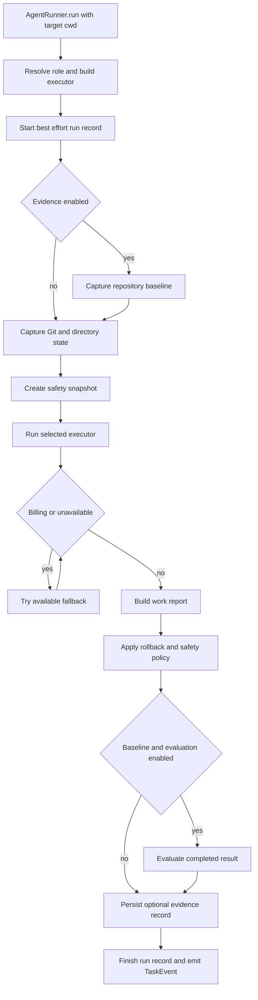

# File-capable executor run lifecycle

`AgentRunner.run()` is VOLY's direct runtime for work that can modify a target project. It is distinct from the chat-oriented `Pipeline` path: it resolves a role or executor name to a concrete backend, passes the selected `cwd` to that backend, then accounts for and governs the resulting worktree changes. The runner returns a `RunnerResult` around the backend's `ExecutorResult`, retaining output, errors, cost/tokens, duration, metadata, and a `WorkReport`.

Use this path through `voly run ... --executor ... --cwd <target>` (or the `runner` command), hybrid A2A executor roles, SDK/web callers, or plan execution. A2A's local hybrid adapter serializes executor roles under a per-cwd lock; do not bypass that adapter to run concurrent writers against the same checkout. Pipeline/A2A routing and role scheduling are covered in [pipeline dispatch and A2A orchestration](../orchestration/a2a-and-pipeline.md); operational command selection is covered in [entrypoints, configuration, and operational safety](../operations/entrypoints-and-safety.md).

## Contract and executor selection

The common `Executor` contract is `run(task, cwd, allowed_tools, max_turns, timeout) -> ExecutorResult`. An executor result has an explicit success bit plus output/error, cost and token measures, duration, turn/session data, arbitrary metadata, and two distinct retry signals:

- `billing_error` means the provider has a terminal quota/account condition. A transient rate limit is deliberately not classified as billing.
- `not_available` means a required executor service is unreachable. It is eligible for the same runner fallback mechanism, but is not spend.
- A timeout is represented in metadata (`timeout` or `deadline_exhausted`) and classified separately for UI and telemetry. Failure formatting turns common authentication, missing dependency, model, and local-service errors into a human-readable message plus an executor-specific next-step hint.

`resolve_executor()` first accepts a known executor (with aliases such as `claude`), then a configured agent executor, registry metadata, role defaults, and finally the configured default/fallback. `_build_executor()` is the extension boundary: it maps the resolved name to the implementation and passes an explicitly selected model where that implementation supports one. Unknown names fail early with the set of valid factory names.

The built-in billing/availability chain is `claude-code`, `cursor`, `deepseek`, `wrangler`, `opencode`, then `zen`. The runner only enters it when the initial executor belongs to the chain and reports terminal billing or unavailability. It can use capability profiles to reorder/select a compatible chain; otherwise it uses the static order. Before invoking a fallback that implements `is_available()`, it skips a known-down service and records a zero-duration `skipped` attempt.

### Cwd is an execution boundary, not just reporting context

The caller supplies `cwd` to every executor attempt. CLI implementations run their subprocess there, and OpenCode additionally receives an absolute `--dir` argument because subprocess `cwd` alone does not reliably constrain OpenCode's independently resolved project root. Claude Code receives `--add-dir <cwd>` so noninteractive file operations are granted for that target. A Wrangler run obtains model output from its configured local service and applies returned file blocks using a `LocalPatchApplier` rooted at its resolved working directory.

This is a project-locality convention enforced by the runner and individual adapters, not a claim that every third-party agent is OS-sandboxed. Supply a concrete target directory; a missing/non-Git directory weakens later rollback guarantees. Never put live secrets in task text, configuration, metadata, diffs, or logs.

## Lifecycle

This sequence separates pre-edit repository health, worktree accounting, policy enforcement, and completed-run observability.

1. **Identity and visibility.** The runner ensures a correlation ID, derives a task type, creates/reuses a task ID, and collects repository intelligence. When telemetry is enabled, it best-effort starts a `RunTracker` record with `running` status and starts a daemon heartbeat every ten seconds while the blocking executor runs. Tracker errors never stop the task.
2. **Pre-run evidence.** If evidence is enabled, a repository baseline is captured before task planning, Git state, the safety snapshot, and executor invocation. If both evidence and evaluation are enabled, the runner also selects an evaluation policy from task type/configuration. Optional DSPy planning may replace the executor-facing task, while the original task remains the attribution input.
3. **Pre-run worktree state.** The runner records `git status --porcelain -u`, fingerprints untracked files, and takes a shallow directory listing as a non-Git reporting fallback. With enabled executor safety, `git stash create` captures tracked pre-run content without changing the worktree; on a clean tree it falls back to `HEAD`.
4. **Execution and fallback.** The selected backend receives the effective task, same `cwd`, turn limit, and timeout. The runner fills an absent duration and attaches PxPipe artifacts/repository metadata. It then walks eligible fallback entries for billing/unavailability; all attempts use the same effective task and cwd.
5. **Post-run reporting and policy.** It captures status/fingerprints/directory state, builds the `WorkReport`, and only then applies safety policy. Thus the report describes attempted changes (including dry-run changes) rather than being recomputed after rollback.
6. **Assessment and publication.** Evaluation, when gated on a baseline and selected policy, runs after safety. The runner persists optional evidence, stops/finalizes live tracking, emits a completion `TaskEvent` when requested, fires capability evidence best-effort, and returns. A cost-policy excess makes `RunnerResult.success` false even if the executor succeeded; the emitted event receives `budget_exceeded` status.

## Worktree accounting and safety invariants

`WorkReport` identifies changed, created, and deleted files from before/after Git porcelain and extracts a bounded list of action-like lines from executor output. A clean tracked file first reported as modified is a **change**, not a creation. An already-untracked file can retain `??` in both snapshots even if the executor edits it, so the runner fingerprints untracked content and reports a digest delta as changed. When Git sees no state at all, a shallow immediate-file listing can still report non-recursive creations, deletions, and changes for an ordinary directory.

Safety enforcement is Git-based and enabled by default:

- It computes files touched **during this run** from content differences against the pre-run snapshot plus porcelain deltas. Consequently, a protected file that was already dirty and overwritten by an executor is detected and can be restored to its exact pre-run dirty content; unrelated local work is not reverted.
- The default protected patterns cover live `.env` files, private key/certificate and SSH identity patterns, and `.git/**`. Committed `.env.example`, `.env.sample`, and `.env.template` are explicit exceptions. A nonempty `executor_safety.protected_paths` replaces the default list and is matched against repository-relative paths and basenames.
- `dry_run=True` at the call site or in `executor_safety.dry_run` executes the executor, captures a bounded tracked diff plus created-file markers in `dry_run_diff`, and rolls back every touched file. It is therefore a mutation-and-revert operation, not a no-call preview, and can consume time and provider budget.
- A positive `max_files_touched` is a hard limit: exceeding it rolls back all files touched by the invocation. A protected-path violation rolls back protected files while retaining unrelated files when possible. The runner hard-fails when the file limit is breached or no reported useful files remain; otherwise it records a soft safety result and the remaining files.
- Without a usable Git snapshot, safety emits a warning/no-op rather than guessing a restore point. In particular, dry-run cannot promise rollback in a non-Git `cwd`.

Inspect `result.metadata` rather than success alone: relevant fields include `dry_run`, `dry_run_diff`, `safety_violation`, `safety_rolled_back`, `safety_soft`, and `safety_remaining_files`.

## Timeout, retry, and FinOps behavior

The runner forwards its timeout to each executor call. For OpenCode and Zen model loops, that value is a **total wall-clock deadline** shared across internal model attempts: each gets only remaining time, and no new subprocess is launched below the ten-second attempt floor. Their abandoned billing attempts are folded into the returned executor result's cost/token totals and tagged with `retry_count` and `retry_cost_usd`.

Runner-level fallback separately accumulates abandoned executor attempts into its chain retry totals. It records a `chain_timelog` when more than one entry exists, containing executor/model, status, duration, spend/tokens, and classified error details. Skipped availability checks add no cost. This separation prevents double counting internal model retries while ensuring task cost includes all chain attempts.

For final accounting, the runner adds final executor cost, abandoned chain cost, and LLM-judge evaluation cost. It includes corresponding retry/evaluation token totals in `TaskEvent`; `budget_status()` is checked against this total only after a successful executor result. The returned `RunnerResult` keeps the executor's raw success and adds `budget_exceeded` so callers can distinguish execution from policy acceptance.

## Evidence, evaluation, live state, and telemetry

These records share a task ID but have separate authority:

- **Repository baseline and `EvidenceRecord`.** Baseline capture scans the cwd and runs configured and optionally discovered deterministic build/test/lint argv commands with `shell=False`, bounded output, and timeouts. It classifies healthy, preexisting, environment, or metadata-only state before editing. The runner builds/saves an evidence record only when a baseline exists; it records execution identity, attributed outcome, baseline, evaluation lineage/report when present, total cost and retries, then stores the evidence path and attribution metadata on the result.
- **`EvalReport`.** Evaluation is attempted only when both evidence and evaluation are enabled and a policy/baseline was obtained. It gets the post-policy result, both Git snapshots, the report's changed/created files, and an optional configured judge callback. Evaluation state/policy and judge cost/tokens are result metadata; evaluation does not overwrite the executor result.
- **`RunRecord`.** The live JSON record is mutable best-effort state under the configured runs directory. At completion the runner stops its heartbeat and sets it `completed` when `result.success` is true, otherwise `failed`. `Watchdog` independently marks still-running records `stale` when their heartbeat age exceeds `task_timeout * stale_factor`.
- **`TaskEvent`.** When `emit_event` is requested, completion telemetry includes correlation/task identity, final executor/role, task type, total cost/tokens/retry data, failure class/message, work report, fallback log, and artifacts. Local event writing happens before optional remote delivery; remote analytics uses a sanitized projection only when explicit cloud-analytics consent is enabled.
- **Capability evidence.** `fire_executor_evidence()` runs after event emission as best effort and is a distinct capability-feedback mechanism, not a replacement for the durable `EvidenceRecord`.

For schema, privacy, baseline attribution, and evaluation semantics, see [evidence, evaluation, and durable run records](../governance/evidence-and-evaluation.md).

## Configuration and safe extension checklist

`ExecutorSafetyConfig` defaults to `enabled: true`, `dry_run: false`, no custom protected patterns, and an unlimited (`0`) file count. Configure it under `executor_safety`; make custom patterns intentionally comprehensive because they replace defaults. Evidence/evaluation, telemetry, costs, capability profiles, and PxPipe have separate configuration gates—do not make a failed optional observer turn into an executor failure.

When changing this lifecycle:

1. Preserve the concrete target `cwd` through every executor and fallback; for an adapter that resolves a project root itself, provide an explicit workspace argument as OpenCode does.
2. Capture baseline before any task refinement/executor activity, and Git/fingerprint state before writes. Do not move policy enforcement before post-state/report construction without redefining report semantics.
3. Retain the safety distinction between full rollback hard failures and protected-only soft failures, and retain the non-Git no-op limitation rather than fabricating restoration.
4. Keep provider billing, local unavailability, timeout, and unknown failure classes distinct; fallback must not trigger for arbitrary failures or ordinary rate limits.
5. Count every paid attempt exactly once, including executor-internal model retries, runner fallback attempts, and optional evaluation cost. Keep local persistence/telemetry/capability evidence best effort.
6. Do not read, log, document, or commit live secrets. Treat task text, outputs, Git diffs, `.voly/` records, and target-project `.env` material as potentially sensitive.

## Focused tests

- `tests/test_executor_cwd_and_a2a_call.py` verifies OpenCode/Zen's explicit `--dir` plus subprocess cwd behavior and the A2A CLI cwd handoff.
- `tests/test_executor_safety.py` covers protected patterns and template exceptions, dirty-file restoration, dry-run/full rollback, hard versus soft runner outcome, non-Git behavior, and configuration parsing.
- `tests/test_untracked_files_touched.py` locks the fingerprint-based reporting of edits to already-untracked files.
- `tests/test_executor_timeouts.py` verifies shared total deadlines, timeout markers, model propagation, and actionable failure formatting.
- `tests/test_failure_paths.py` verifies full fallback traversal, unavailable skips, retry cost/token accounting without double counts, and related orchestration failure boundaries.
