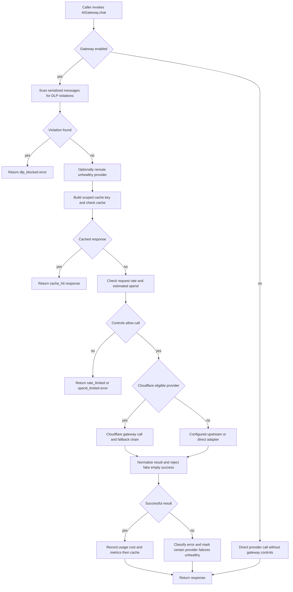

# Model gateway, provider routing, and FinOps

`AIGateway.chat()` is VOLY's synchronous, normalized boundary for chat-model calls. Pipeline, A2A chat roles, SDK agents, plan execution, DSPy, inference, and review flows pass requests through that boundary rather than coupling their orchestration logic to a provider protocol. It is a middleware and routing layer: Cloudflare AI Gateway can proxy supported providers, while direct adapters support Cloudflare-specific services and other configured providers. The separate file-capable executor route is intentionally not a provider bypass for this interface; it has its own subprocess lifecycle and billing-fallback accounting described in [executor runs](executor-runs.md).

`Pipeline.gateway` is lazy and configures a single instance for the pipeline. `gateway_from_config()` supplies the same governed wiring for SDK and plan callers. A bare `AIGateway` is useful for direct construction/testing but has default controls rather than the project's configured instance. Do not instantiate an unconfigured gateway in a new runtime path when the configured factory is available.

## Request lifecycle and control order

This is the governed `chat()` flow; disabling the gateway intentionally skips DLP, cache, rate, spend, and health middleware before making the direct call.

The enabled-path ordering is significant:

1. DLP scans JSON-serialized **messages** before a cache lookup or outbound call. A match returns `dlp_blocked` with no provider request and increments the DLP metric.
2. Unless the caller disables it, the process-wide health checker may replace an already unhealthy requested provider with its best healthy provider and corresponding router model. The A2A tier fallback deliberately passes `allow_provider_reroute=False`, because it owns a narrower tier/role candidate set and must retain attribution to the provider it actually tries.
3. The cache key hashes messages, model, provider, system prompt, stringified extra keyword arguments, and a scope. A hit is returned before rate/spend checks and has `cache_hit: true`; only successful responses are written.
4. A cache miss is counted, then the gateway enforces its request-per-minute limit and checks an estimated pre-call cost against daily and optional per-agent budgets. Denials are structured errors, not provider calls.
5. The selected transport is executed. Provider errors are classified for health exclusion; only successes are charged, measured, and eligible for caching.

The normalized response carries `content`, model/usage where available, `stop_reason`, and tool-call information. Provider adapters translate canonical function tools to Anthropic and Google request formats and normalize their response shapes, so orchestration callers do not need to parse each provider protocol.

### Silent empty responses are failures, except real terminal turns

A provider can return an HTTP-success response with no usable text. The gateway converts that fake success into `empty_content: provider returned no usable content`, allowing its model fallback machinery to run (or returning the error when no fallback is enabled). It does **not** do so for an empty response ending in `max_tokens` or `tool_use` (Anthropic), or `length` or `tool_calls` (OpenAI-compatible): these represent a truncated/tool-call turn, not a blank answer. Empty-content is a model-call signal and is not terminal billing state for executor fallback.

## Routing choices and fallback scopes

Cloudflare routing applies when the gateway is enabled, has an account ID, and the provider is one of `anthropic`, `openai`, `google-ai-studio`, or `deepseek`. The gateway invokes the provider-specific Cloudflare endpoint and tries the primary `{provider, model}` followed by configured fallback-chain entries, up to `fallback_retries`. It skips health-excluded entries, labels a successful fallback with `fallback_used`, provider, and model, and records the fallback metric.

For non-Cloudflare routes, direct adapters support the ordinary provider APIs as well as Workers AI, Cloudflare dynamic routing, OmniRoute, MiMo, and OpenCode endpoints. Adapters use the larger configured total-response timeout when set, otherwise the stall timeout; URL and timeout failures become errors that the appropriate fallback path can handle. Configuration may set `upstream` to a single external gateway such as `omniroute`. In that mode, a non-upstream request goes upstream first, using `upstream_model` when set or the requested model otherwise. An upstream error or fake empty response falls back to the originally requested direct adapter by default; `upstream_fallback_direct: false` returns the upstream error instead. A call explicitly addressed to the upstream does not wrap itself in a second hop.

This produces three deliberately different fallback scopes:

- **Gateway model fallback** retries configured provider/model entries for this chat request, and treats fake-empty output as a retryable model failure.
- **Health-aware routing** avoids providers previously excluded in this process. Credential presence is cached for 60 seconds; runtime exclusions normally expire after 900 seconds, configurable with `VOLY_PROVIDER_EXCLUDE_TTL` (`0` means never expire). Billing/auth-related errors mark a provider unhealthy, reducing repeated requests to known-bad credentials.
- **A2A provider fallback** iterates healthy providers assigned to the role/tier, updates the assignment on success, and stops immediately for a gateway `spend_limited` response. It opts out of the gateway's global-priority reroute to avoid cross-tier substitutions.

When changing provider behavior, preserve those scopes and response flags: a general gateway reroute is not a substitute for tier-aware A2A fallback, and neither is executor billing fallback.

## Cache scope and persistence

`CacheConfig` is an expiring in-memory cache with bounded entries. When `cache_persist_dir` is configured, entries are also stored as `<hash>.json`, can warm a new instance after a restart, and are removed when expired. Filesystem failures are best effort rather than request failures. The cache stores the serialized successful normalized response, not failed or control-blocked results.

Persistent caching is repository-sensitive. Configured pipeline/factory gateways derive `cache_scope` from `default_cwd` via `project_fingerprint()`, then include that scope in every key. For a Git project the scope contains the current `HEAD` plus a digest of dirty tracked changes and untracked names; non-Git projects use a path identity. The fingerprint helper can additionally hash explicitly named files. Thus the same task text misses after a repository change and does not collide across projects. If no valid project directory is supplied, scope may be empty and retains the historical unscoped behavior.

## FinOps controls and observability

Gateway spend is an in-process guardrail, not an invoice reconciliation system. Before a call, `SpendLimit.check()` rolls its counters after 24 hours and rejects a request whose estimated input cost would exceed the daily budget or the named agent's configured allocation. On success, the gateway prefers cost calculated from returned input/output token usage; when usage tokens are absent, it records the estimate. Failed calls are never charged into `spent_today` or agent spend. This means a provider may have charged externally while a failed/ambiguous response is excluded from gateway accounting; operate external provider/Cloudflare records as the source for reconciliation.

`GatewayMetrics` records successful request count, tokens, estimated/usage cost, provider/model counts, cache hits/misses, local rate blocks, fallbacks, DLP blocks, errors, and a rolling in-process request timestamp list. `fetch_cf_logs()` and `fetch_cf_metrics()` can summarize Cloudflare logs into request outcome, cache rate, tokens, cost, latency percentiles, and provider/model breakdowns only when Cloudflare is configured. The web `GET /api/gateway/status` returns configured policy plus a telemetry-derived overlay for aggregate request, token, cost, cache, provider/model, and spend figures; its freshly created gateway object is not itself the traffic counter.

Model selection precedes gateway execution. `ModelRouter` scores registered `ModelInfo` by inferred/selected task category, required capability, and optional cost or speed preferences. The pipeline route stage can then apply `cost_policy`: configured task-text patterns (such as documentation, tests, security, or summarization) replace the selected model/provider with a cheaper mapping. That selection policy is distinct from `SpendLimit`, which is the last pre-call gateway budget check. The pipeline also has a separate telemetry-backed agent spend check before dispatch.

### Gateway FinOps versus executor billing fallback

Do not conflate gateway accounting with the file-capable executor chain. The error classifier distinguishes a transient HTTP 429 rate limit from explicit quota exhaustion: bare 429 is `rate_limited`, while quota/billing signals become `quota_exhausted`; terminal executor billing states are only quota exhaustion and account deactivation. Cloudflare gateway authentication/BYOK setup errors are treated as unauthorized operator problems, not billing states (unless a relayed provider billing signal is present).

`AgentRunner` changes executor after terminal billing or availability failure and folds abandoned executor-attempt cost/tokens into task totals, annotating retry count and retry cost. That is separate from `AIGateway.chat()` fallback and its `SpendLimit` counters. Keep `chat()` as the model-call boundary; the file-capable executor path is the distinct execution boundary described in [executor runs](executor-runs.md).

## BYOK and credential boundary

BYOK is opt-in (`byok_enabled`) and applies only to the Cloudflare-proxyable provider map: Anthropic, OpenAI, Google AI Studio, and DeepSeek. Provider keys are stored in Cloudflare Secrets Store under the gateway/provider/alias naming convention and Cloudflare resolves them per request. With an addressable Cloudflare account and gateway/account token, the direct-call adapter sends an OpenAI-compatible Cloudflare request using a `provider-slug/model` identifier; it must not read or send that provider's local environment key. An optional provider allowlist narrows BYOK; an empty list means all supported providers.

Providers outside that map—including MiMo, OpenCode variants, OmniRoute, and Workers AI—continue to use their local-environment/direct route even when BYOK is enabled. The normal Cloudflare REST endpoint uses the account API token and gateway ID header; `VOLY_CF_GATEWAY_API=compat` is a legacy compatibility escape hatch. Configure health checking with the same BYOK state: a BYOK-covered provider with Cloudflare credentials is healthy without a local provider key, while uncovered providers still require their normal credential signal.

Never put live provider, Cloudflare, gateway, or upstream credentials in task text, YAML committed to the repository, cache contents, logs, or this documentation. The secrets-store client treats values as write-only and logs method/path rather than request bodies.

## Configuration and extension checklist

Configure policy under `ai_gateway`: enablement and Cloudflare identity, cache and optional persistence location, rate request limit, daily/per-agent spend, fallback chain/retries, request and total-response timeouts, DLP toggles, upstream routing, and BYOK state/provider restriction. Defaults include enabled middleware, a 60 RPM local request cap, a USD 20 daily gateway budget, a one-hour cache TTL, and disabled DLP/BYOK. Treat DLP patterns as a configurable heuristic, not a guarantee that prompts, caches, or downstream providers contain no sensitive data.

For a safe change:

1. Route new chat callers through `Pipeline.gateway` or `gateway_from_config()` and invoke `chat()`; preserve the file-capable executor exception rather than introducing ad hoc provider calls.
2. Include every input that changes a response in cache-key treatment, and retain project-state scope for persistent/repo-aware uses.
3. Return structured control outcomes (`dlp_blocked`, `rate_limited`, `spend_limited`) without forwarding the call; only record and cache successful normalized responses.
4. Preserve tool/stop-reason normalization and the legitimate-empty exceptions before changing fallback logic.
5. Keep BYOK eligibility explicit. Do not silently send an unsupported provider through Cloudflare or leak a local provider key on the BYOK route.
6. Keep rate limits, provider health, gateway fallback, A2A tier fallback, and executor billing fallback semantically separate so metrics, attribution, and cost totals remain meaningful.

## Focused tests

- `tests/test_ai_gateway.py` covers control ordering outcomes, cache scope/hits, DLP, spend charging, empty-content fallback, upstream delegation, normalized tool adapters, and timeout behavior.
- `tests/test_byok_credentials.py` verifies the supported BYOK map/restriction, Cloudflare REST versus compatibility transport, no provider-key header on the BYOK path, environment fallback for unsupported providers, and BYOK-aware health.
- `tests/test_gateway_provider_health.py` locks health-based pre-call rerouting and exclusion after a billing error.
- `tests/test_retry_cost.py` verifies executor-internal and runner-chain retry-cost folding, the deliberately separate accounting path summarized above.
