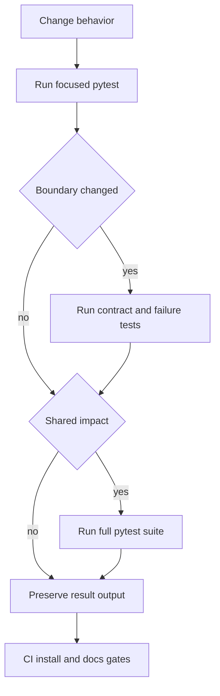

VOLY's verification strategy is layered: use a small, hermetic test that exercises the changed contract first; add a cross-boundary test when a change can affect fallback, persistence, budgets, safety, or a public interface; then rely on CI to exercise installation and documentation gates. The test suite is deliberately mock-heavy around providers and agent CLIs, so ordinary repository checks do not make network calls or modify a real target repository.

Source and tests are the authority. Generated wiki content is optional context, not a prerequisite for changing code. Preserve complete failure output when a check fails: it is the evidence needed to distinguish a regression from an environment or dependency problem.

## Select the narrowest proving check

Pytest collects `tests/test_*.py`, runs asynchronous tests automatically, and adds verbose, short-traceback output. The development extra supplies pytest, coverage, async support, Ruff, and mypy; optional features should be tested in an environment that actually installs their extra.

Start with a changed subsystem's test module, normally in quiet mode:

```bash
pytest tests/test_<subsystem>.py -q
```

Examples of useful scopes:

| Change surface | First focused suite | What the suite protects |
|---|---|---|
| Gateway request behavior, cache, DLP, rate/spend limits, provider fallback | `pytest tests/test_ai_gateway.py -q` | Local middleware behavior without provider traffic |
| Executor parsing, billing classification, retries, or telemetry | `pytest tests/test_cli_contracts.py -q` | Captured Claude JSON and OpenCode NDJSON compatibility plus recognized and unrecognized failures |
| Executor timeout or safe filesystem behavior | `pytest tests/test_executor_timeouts.py -q` and `pytest tests/test_executor_safety.py -q` | A caller timeout is a total fallback deadline; rollback and protected-path handling preserve the target checkout |
| Pipeline dispatch, task dependencies, or hybrid roles | `pytest tests/test_a2a_p0.py -q` and `pytest tests/test_hybrid_a2a.py -q` | Nested-dispatch prevention, dependency context, role-mode selection, and skip/degrade behavior |
| Plan acceptance checks | `pytest tests/test_plan_verify.py -q` | Path jail, command/output/diff checks, fail-closed unknown checks, and step gating |
| Public telemetry or spend HTTP interface | `pytest tests/test_protocol_contracts.py -q` | Frozen versioned schemas and exact request paths/body shape |
| Capability admission, evidence, activation, or remote publication | `pytest tests/test_capability_production_validation.py -q` and `pytest tests/test_capability_remote_sync.py -q` | Measured/held-out evidence requirements, instruction provenance, and verified remote read-back |
| CLI, quickstart, installed artifact, or web endpoint | `pytest tests/test_smoke.py -q`, `pytest tests/test_quickstart.py -q`, `pytest tests/test_web_api.py -q`, or `pytest tests/test_runs_api.py -q` | No-network command/API behavior and observable run state |

Run `pytest tests/ -q` when a shared interface, configuration model, package manifest, or broad refactor makes a focused result insufficient. `pytest` alone is also CI's suite command, using the project defaults. The DSPy runtime smoke is a stated required check after any change; use an environment with `[dspy,dev]` installed for it.

## Contract tests are compatibility gates

Several tests intentionally freeze interfaces rather than merely assert implementation details. Treat an unexpected failure in these modules as a compatibility review, not as a reason to update an expected value blindly.

- `test_protocol_contracts.py` locks the complete `TaskEvent` v4 field set and the Cloud Analytics v1 projection. A telemetry schema change must bump the relevant schema version and update the external documentation before the snapshot changes. It also freezes the spend client methods' HTTP verbs, URL paths/query strings, JSON body, and Bearer header behavior.
- `test_cli_contracts.py` feeds captured real-world Claude result JSON and OpenCode NDJSON into parsers. It verifies text, usage, cost, session, and billing extraction, including legacy/current field spellings. A malformed or unfamiliar failure must remain observable as `unrecognized`, rather than being silently sent down the billing fallback path.
- `test_web_api.py` creates the FastAPI app against a temporary event directory; it checks status, task filtering and summary, gateway status, documentation availability, and artifact serving. The artifact test includes a traversal attempt. `test_runs_api.py` separately covers persisted run visibility, parent/child grouping, and cooperative cancellation semantics.
- `test_packaging.py` compares discovered Python packages with the explicit setuptools manifest. Import smoke tests cover core modules and CLI commands without requiring external services.



This flow shows the escalation from a behavior-specific check to boundary, suite, and CI validation.

## Failure and safety cases need end-to-end assertions

The highest-value tests follow a failure through the owning layers rather than testing a helper in isolation.

**Fallback, accounting, and deadlines.** `test_failure_paths.py` drives mocked executor results across the billing fallback chain and asserts the final executor, per-attempt chain log, retry count, aggregate tokens, and cost. It covers unavailable executors and the combination of runner-level fallback with Zen's internal model fallback so spend is counted once. The same suite proves that the gateway spend limit prevents later assignments from calling a provider or accruing cost. Timeout tests enforce that Zen and OpenCode divide one caller-provided deadline among attempts, and mark deadline exhaustion for downstream telemetry and handling.

**A2A and hybrid work.** Nested tasks are identified from request context, task identity, or `VOLY_A2A_NESTED`; a nested pipeline must not re-enter automatic A2A dispatch. Dependency tests require earlier output to be injected into later work. In local hybrid execution, file-capable roles use an executor only when hybrid mode and the required working directory permit it. Tests distinguish a failed developer that wrote no code, which skips dependent implementation/review work, from a soft/safety failure with touched files, which still allows follow-up roles to inspect the work.

**Filesystem and plan guardrails.** Safety tests make a disposable Git repository, snapshot it, simulate executor writes, and verify that protected files are restored while legitimate changes remain. Dry-run restores all changes but returns a preview and a work report. If every write was protected, the runner reports failure; a mixed result can remain successful with a safety-soft marker. Plan verifier tests prevent path escape, capture command output and timeouts, reject unknown checks fail-closed, and ensure that a failed acceptance result leaves dependent plan steps blocked. They also test that an architect's file-size exception is accepted only with the required explicit rationale.

**Capability evidence and remote state.** Production-validation tests prevent synthetic routing probes from authorizing activation, require measured evidence and held-out pairs for activation, reject unmeasured cost/token values as zero-value evidence, and retire capabilities for no added value or excessive overhead. Instruction variants must use verified staged content; compact instincts require manual approval and no contradictions. Remote-sync tests require an exact authenticated POST/read-back match before persisting a receipt, and invalidate a receipt when evidence changes.

## Packaging and documentation gates

CI runs on pushes to `main` and pull requests. Its checks are complementary to pytest:

1. **Wheel install:** on Ubuntu, Windows, and macOS with Python 3.13, CI builds a wheel and runs `scripts/verify_wheel_install.py`. The script creates a fresh virtual environment and sample Git repository, installs the wheel by path, confirms `voly` imports from that environment, and runs `voly quickstart --check --json`. The check must be ready without creating `voly.yaml` and must hand off a dry-run command.
2. **Documentation sync:** on Ubuntu, scripts fail for broken relative Markdown links and for code-referenced user-facing `VOLY_*` variables missing from either `.env.example` or `docs/`. Variables intentionally used only for internal plumbing are explicitly allowlisted; stale documentation is reported as a warning rather than a hard failure.
3. **Base and optional imports:** the base job installs `.[dev]`, confirms core imports with DSPy disabled, then runs the suite. The optional DSPy job installs `.[dspy,dev]`, import-smokes DSPy modules, and runs the suite again. This protects the base distribution from accidental eager DSPy imports while exercising the extra where present.

For a local artifact check after a packaging change, build the wheel before invoking the same verifier:

```bash
python -m build --wheel
python scripts/verify_wheel_install.py
```

## Local checks versus external integration and E2E

Repository tests should remain hermetic: use `tmp_path`, `CliRunner`, `TestClient`, fake executors, mocked subprocesses, and mocked HTTP calls. They are suitable for this checkout because they verify decisions, payloads, state transitions, and guards without credentials, live providers, or a real user project.

Do **not** run integration, multi-agent, or end-to-end jobs in this repository. Run those only in `/home/lanies/git/codeops/TEST_VOLY_JOB_MA/`, where an external target checkout and any intentional real execution belong. This separation is a safety boundary: local verification establishes the code contract; external execution establishes that configured credentials, CLIs, providers, and a real target environment interoperate.

Before an external run, use the local checks above to establish the intended behavior, pass an explicit target with `--cwd`, and favor a dry-run first. A failed external run is not a substitute for a focused regression test: retain its complete output, turn a reproducible failure into a hermetic regression where possible, then rerun the smallest relevant local suite.

## Related architecture

- [Architecture overview](../architecture/overview.md) describes the major runtime boundaries that this page maps to tests.
- [Evidence and evaluation](../governance/evidence-and-evaluation.md) provides the decision/evidence context for capability validation.
- [Entrypoints and safety](../operations/entrypoints-and-safety.md) explains operational commands and filesystem safeguards.
- [A2A and pipeline](../orchestration/a2a-and-pipeline.md), [executor runs](../runtime/executor-runs.md), and [gateway and FinOps](../runtime/gateway-and-finops.md) describe the cross-boundary flows targeted by the failure suites.
