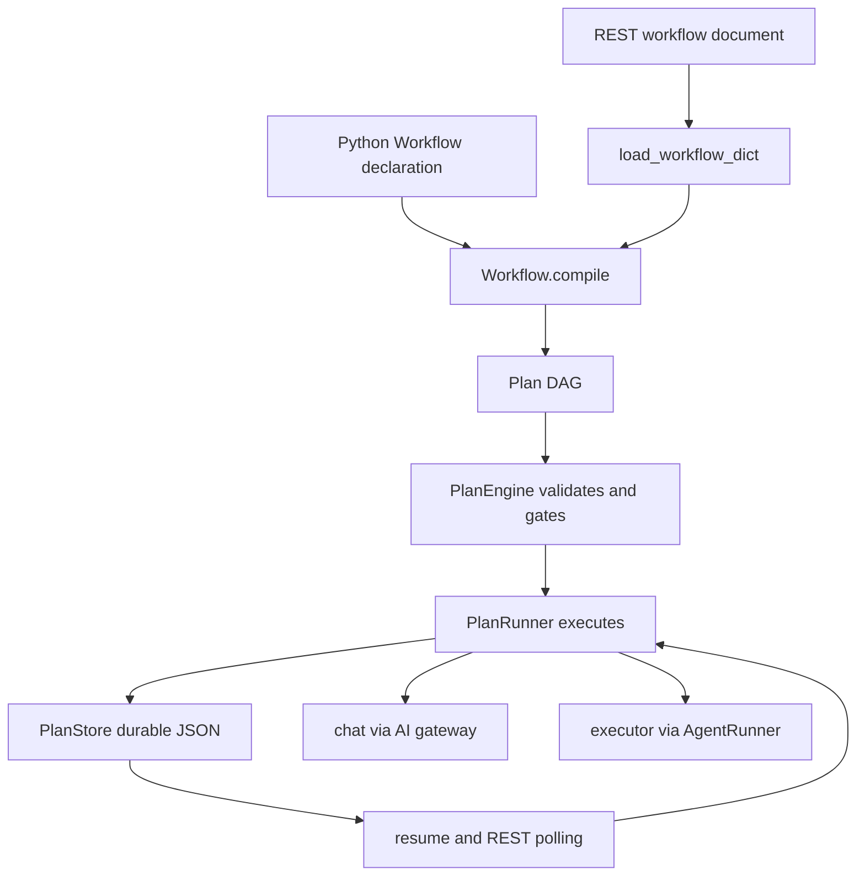
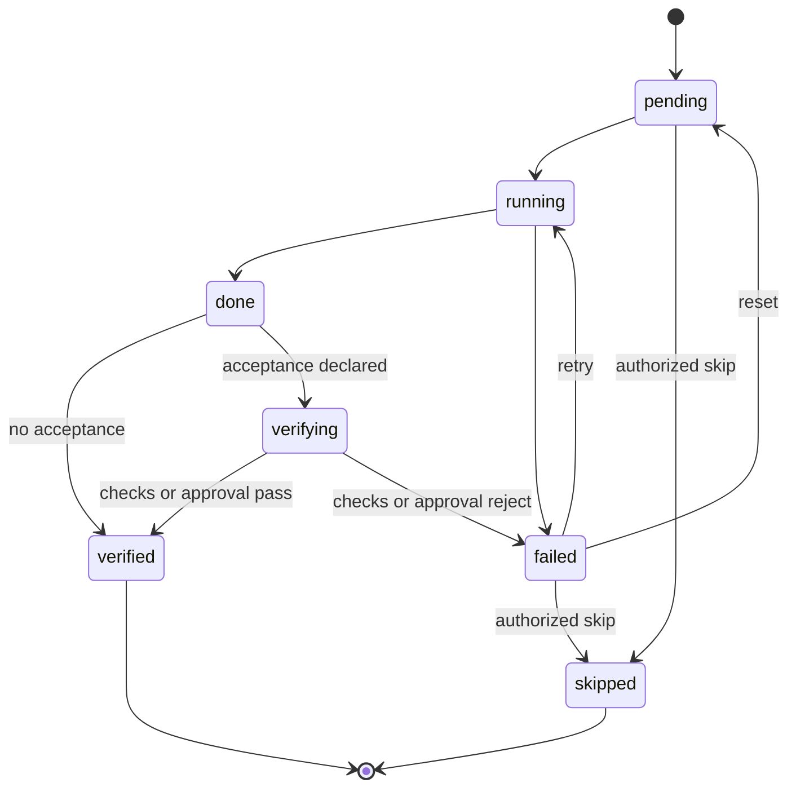

# Durable plans, workflows, and the public Agent SDK

VOLY has one durable workflow runtime: a **Plan**. A Plan is a persisted DAG of steps whose state transitions, dependency gates, verification, and cancellation are owned by `PlanEngine`, `PlanRunner`, and `PlanStore`. The public SDK deliberately adds a convenient declaration layer, not another scheduler:

- `Agent` is a thin execution facade. A chat agent delegates to the governed AI gateway; an executor agent delegates to `AgentRunner`.
- `Workflow` is a graph builder. It compiles its nodes to an ordinary `Plan` and runs or resumes that plan through `PlanRunner`.
- The REST workflow API parses the same high-level document, compiles it the same way, and streams observations from the same persisted plan.

This boundary matters operationally: changes to gating, verification, resumption, or persistence belong in the Plan runtime, rather than being reimplemented in Python SDK, HTTP, UI, or preset code. For the broader runtime layout, see the [architecture overview](../architecture/overview.md) and [A2A and pipeline orchestration](../orchestration/a2a-and-pipeline.md).

*Workflow declarations converge on the Plan runtime; execution and visibility share its persisted state.*

## The Plan contract: graph plus gated state machine

A `Plan` carries an ID, working directory, task metadata, plan status, and ordered `PlanStep` records. Each step has an ID, role, mode, dependencies, instruction, acceptance checks, execution output, evidence-related fields such as touched files and verification log, and persisted timing/cost fields. Supported step modes are `chat`, `executor`, and `business`; plan statuses are `pending`, `running`, `completed`, `failed`, and `aborted`.

Before a run, `PlanEngine.validate()` requires a nonempty plan, unique nonempty step IDs, recognized modes and statuses, known non-self dependencies, and an acyclic graph. Topological ordering is Kahn-style. A workflow compiler therefore relies on this central validation: a missing dependency or cycle is a `WorkflowError` wrapping the engine validation error, not a differently interpreted SDK graph rule.

A dependent step may enter `running` only from `pending` or `failed` and only after **every** dependency is `verified`. `done` is not enough. Skipping requires an explicit `allow_skip` or recovery `force` path, so an agent cannot simply declare a blocked step skipped. The ordinary successful lifecycle is:

*The engine permits only these step transitions; dependencies open only after `verified`.*

A plan completes only when all steps are terminal (`verified` or `skipped`) and at least one is verified; an all-skipped plan is failed. A failed dependency leaves downstream pending work blocked. The runner applies its configured verify-failure policy: `retry` retries up to `plan.max_step_retries`, `continue` force-verifies a failed quality step to open downstream work, and the default stops the plan. In `shadow` mode, ordinary failed acceptance checks are logged and soft-opened; in `active` mode, they remain a hard failure. Do not use shadow mode as an authorization mechanism: human and action gates are deliberately excluded from that soft-open behavior.

## Executing work and handing off dependency output

`PlanRunner.run()` validates the plan, assigns a task ID if needed, recovers stale running work, persists the starting state, and repeatedly selects engine-runnable steps. It persists progress around execution and returns a `PlanRunResult` with the plan, status-derived success, task ID, duration, error, and summary. Plan persistence is not best-effort telemetry: `PlanStore` atomically writes `<plan_id>.json` under `.voly/plans` by writing a temporary file and replacing the target, and propagates I/O errors.

For a runnable step, the runner builds the instruction from `step.task`, falling back to `plan.task`. It prepends output from **only its declared dependencies**, each capped at 4,000 characters, under a completed-step context heading. This is the data handoff for a research-to-review chain or a fan-in synthesis node; unrelated sibling output is not included. Since dependencies must already be verified, that data is stable when the child starts.

Mode determines the execution boundary:

- A `chat` step calls `AIGateway.chat()` through configured gateway construction. The step role becomes the agent label and model/provider are taken from explicit step values or capability routing/configuration.
- An `executor` step calls `AgentRunner.run()` in the plan working directory with plan limits. The runner records returned output, cost, duration, and reported created/changed files, and also derives changed paths from git snapshots when necessary.
- A `business` step is rejected by generic `PlanRunner`; it must run through `DecisionService`, preventing the generic loop from bypassing the business action checkpoint.

After successful execution, a step reaches `done`. With no acceptance checks it automatically advances to `verified`; otherwise it enters `verifying`. Verification operates on output, declared paths, git state, and commands rather than accepting an agent's free-text assertion. The verifier records results in `verify_log` and makes the `verifying → verified|failed` transition for ordinary checks.

### Safe concurrency

Independent runnable **chat** steps can execute in bounded waves when `workflow_sdk.enabled` is true and `workflow_sdk.max_parallel_nodes` exceeds one. A wave contains at most that configured number of chat steps. Worker threads mutate only their own step's output/cost/duration; the main thread then finalizes transitions, verification, persistence, and failure policy in declared step order. This preserves a deterministic plan/result order even if calls complete in a different order.

Executor steps always use the sequential path, including when parallel chat waves are enabled. They share one plan `cwd`, so concurrent file writers are intentionally avoided. If the SDK workflow feature is disabled, the parallel limit is effectively one.

## Durable interruptions: timeout, resume, and cancellation

`resume(plan_id)` reloads the stored plan and derives runnable work from persisted statuses; verified nodes are not rerun. A workflow-level `timeout_seconds` ends the current call without marking otherwise unfinished work failed or aborted, leaving the plan resumable and noting the timeout error. A step found `running` beyond `workflow_sdk.stale_running_seconds` is recovered to `failed` on a later run/resume, allowing the normal retry policy to decide its next attempt rather than blocking descendants forever.

`cancel(plan_id)` atomically persists plan status `aborted`. A concurrently executing runner checks persisted status between waves or steps and adopts the abort signal, so cancellation is cross-thread/process cooperative. It does **not** interrupt a gateway request or executor call already in progress; it prevents subsequent scheduling.

## Human and action acceptance gates

An acceptance check of type `human_review` is an explicit governance gate. When such a step reaches `verifying`, the runner writes verification visibility but leaves it there: it neither fails it as a normal synchronous check nor force-verifies it in shadow mode. Its dependents remain pending because the dependency is not verified.

Call `voly.plan.approval.decide(store, plan_id, step_id, "approve" | "reject", comment=...)` to resolve it. The function only accepts a step declaring `human_review` that is currently `verifying`; it transitions to `verified` or `failed`, persists a decision record in `verify_log`, and is idempotent for the same repeated decision. A conflicting decision, premature decision, or non-review step fails closed. After approval, resume the plan to run its dependents; rejection leaves them blocked.

`action_succeeded` is similarly externally resolved: the generic synchronous verifier parks it in `verifying`, and a business executor result owns the final decision. These exceptional checks are intentionally different from quality checks because they represent authorization or an external effect, not merely a regression signal.

## Public Python SDK

### `Agent`: facade, not a runtime

Construct `Agent(name, instructions="", model=None, provider=None, tier=None, mode="chat" | "executor", executor=None, ...)` and call `run()` or thread-offloaded `arun()`.

The facade invariant is strict:

- Chat mode constructs the configured gateway and calls `AIGateway.chat()`—not a provider client. Consequently gateway governance such as configured routing/fallback, DLP, cache, spend controls, and rate limiting remains in force.
- Executor mode requires an explicit `cwd` and calls `AgentRunner.run()`—not a bespoke executor implementation. Its typed result retains executor work-report file changes, cost, duration, task ID, and configured evidence ID.

`AgentResult` exposes raw content, success/error, provider/model or executor details, token and cost data, duration, touched files, task/evidence IDs, raw response metadata, tool-call log, and optional parsed structured data. Errors returned by the gateway or executor produce an unsuccessful result rather than inventing a separate state machine.

Optional tools must be registered names; unknown names are rejected at construction. The chat facade passes only those allowlisted tool schemas to the gateway, executes only a returned name from that per-agent allowlist, feeds results back into the conversation, and fails if the bounded `max_tool_steps` loop is exhausted. `output_schema` accepts a raw schema dictionary or a Pydantic model: the agent asks for JSON, parses the returned text, and validates it. Dictionary schemas receive a lightweight object/required-key check; Pydantic schemas use `model_validate`.

Explicit model, tier, provider, and executor choices take precedence. When a choice is left unset, capability routing may select a configured chat model or executor; this is best-effort and controlled by the capability configuration.

### `Workflow`: compile, then delegate

Create a `Workflow`, add unique nodes with an `Agent`, task, `depends_on`, optional acceptance checks, and `approval=True` where human review is needed. `compile(task, cwd=...)` copies node fields into `PlanStep`s, appends a `human_review` acceptance check for `approval=True`, validates through `create_plan()`, and tags metadata with `kind: sdk_workflow` and the workflow name. Compilation topology is deterministic, but each compile creates a fresh plan ID to prevent persistence collisions.

`Workflow.run()` compiles then delegates to `PlanRunner`; it defaults to `active` mode. `Workflow.arun()` runs that same synchronous path in a thread. `WorkflowResult` is reconstructed from the persisted/executed plan steps, offering node status, output, error, cost, duration, and file fields plus aggregate cost. It is not a cache of live agent objects.

To continue a known run, use `Workflow.resume(plan_id)`. `Workflow.run(resume=True)` is intentionally unsupported because task text cannot identify which fresh compiled plan should be resumed. `Workflow.cancel(plan_id)` delegates to `PlanRunner.cancel()`.

The included graph factories in `voly.sdk.presets`—such as `sequential`, `concurrent`, `supervisor_workers`, and `council`—only create `Workflow` topology. They do not add their own run loops. A reviewer loop is a bounded, unrolled chain, not conditional early-exit control flow; all configured rounds run and only the final review can carry supplied exit acceptance.

## Workflow documents and REST operations

`load_workflow_dict()` and `load_workflow_file()` load JSON or YAML workflow declarations into the same `Workflow` builder. A document has `name`, optional `task` and `cwd`, and nonempty `nodes`; each node supplies an ID, an agent mapping with a name, and optional task/dependencies/approval/acceptance fields. This is distinct from the lower-level Plan loader, which accepts an already compiled plan.

The REST surface is rooted at `/api/workflows`:

| Operation | Runtime behavior |
| --- | --- |
| `POST /validate` | Loads and compiles only; graph errors return HTTP 400. |
| `POST /run` | Loads and compiles, then runs the Plan in a bounded server thread pool and returns SSE. |
| `POST /{plan_id}/resume` | Resumes a persisted `sdk_workflow` Plan and returns SSE. |
| `GET /` and `GET /{plan_id}` | List or retrieve persisted plans tagged `sdk_workflow`; unknown/non-workflow plans return 404. |
| `POST /{plan_id}/nodes/{node_id}/decide` | Resolves a parked approval node through the generic approval primitive; invalid use is 400, conflict is 409, and missing plan/node is 404. |

SSE sends `start`, observed `node`, and final `done` events. Node events are not a parallel event model: the route polls the same `PlanStore` document used by resume and CLI/Python consumers. The route maps `pending` to `queued`, `running`/`done` to `running`, `verifying` to `verifying`, `verified`/`skipped` to `completed`, and `failed` to `failed`.

## Focused verification and change guidance

The most important regression tests cover the architectural boundaries rather than just builder syntax:

- `tests/test_sdk_agent.py` confirms chat calls go through the gateway, executor calls go through `AgentRunner`, an executor requires `cwd`, tool use is allowlisted/bounded, and schema failures are unsuccessful results.
- `tests/test_sdk_workflow.py` exercises compile-time cycle and missing-dependency errors, dependency-output handoff, approval pause/resume, mixed chat/executor working-directory propagation, persistence, and cancellation.
- `tests/test_plan_concurrency.py` verifies bounded chat waves, serial executor writers, deterministic ordering, stale-running recovery, resumable timeouts, and cooperative cancellation.
- `tests/test_plan_approval.py` verifies that a human review remains parked even in shadow mode, approval unblocks downstream work, and duplicate/conflicting decisions follow the idempotent fail-closed contract.
- `tests/test_workflows_api.py` verifies compilation-only validation, SSE lifecycle shape, persisted-plan list/get behavior, and the approval/decision/resume HTTP contract.

When changing this area, preserve two non-negotiable invariants: **Agent delegates only to the gateway or `AgentRunner`; Workflow compiles to Plan and executes through `PlanRunner`.** Add Plan state or runner behavior once at the shared runtime boundary, then let SDK, presets, and REST inherit it.
