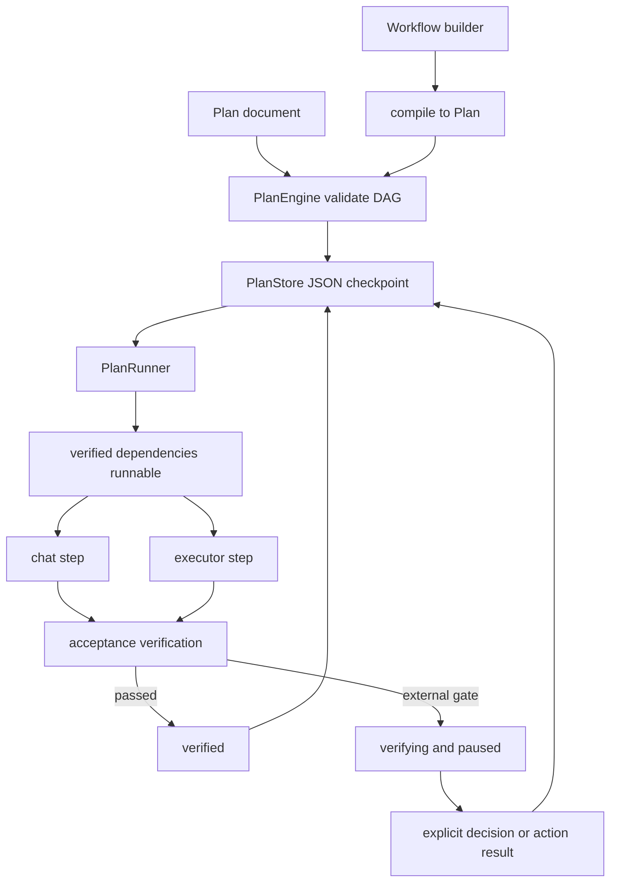
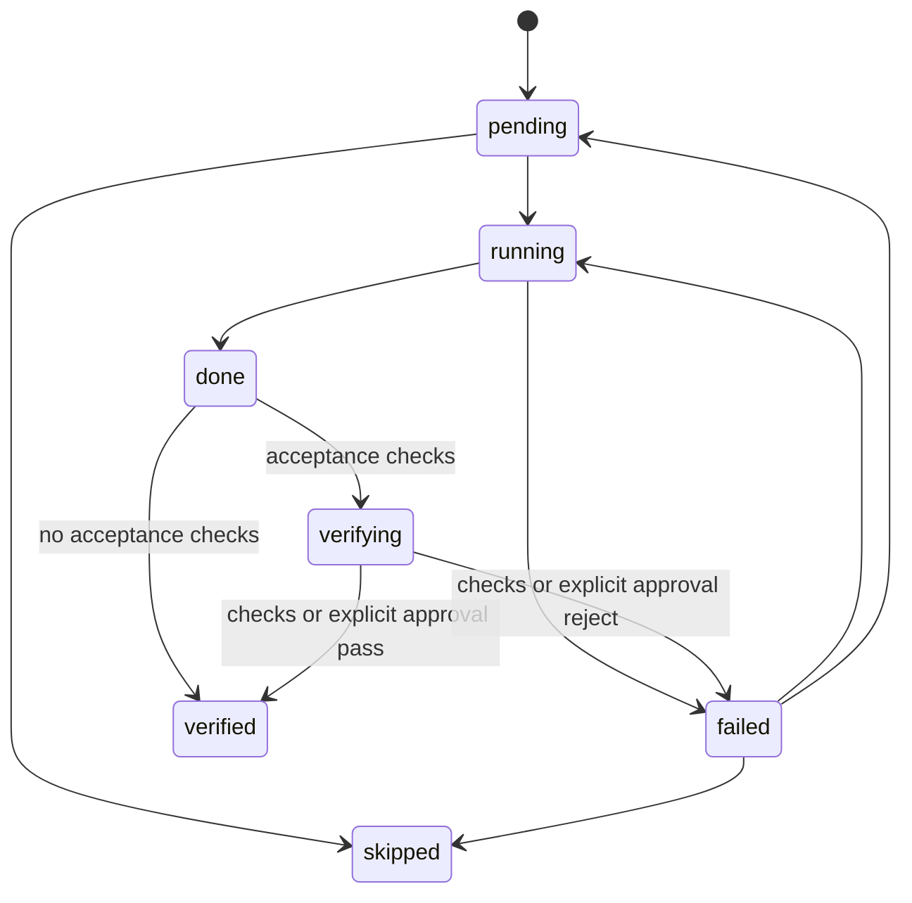

# Plan engine and workflow SDK

VOLY has one durable workflow runtime: a `Plan` is a dependency DAG plus step evidence and state, `PlanEngine` owns its validation and state-transition rules, `PlanStore` is its persistent source of truth, and `PlanRunner` executes it. The public Python `Workflow` API is a **builder**, never an independent runtime: it compiles `WorkflowNode` declarations to a normal `Plan` and delegates `run()`, `arun()`, `resume()`, and `cancel()` to `PlanRunner`.

That boundary is important for safe changes. A graph produced by the SDK and a hand-authored plan use the same dependency gate, persistence, verification, recovery, and cancellation behavior. `Agent` is similarly a facade over governed `AIGateway` chat or `AgentRunner` executor work; it does not introduce a second provider client or plan state machine. For the broader inference/executor boundary, see [VOLY control-plane architecture](../architecture/overview.md); for automatic A2A orchestration, see [Pipeline and A2A orchestration](../orchestration/a2a-and-pipeline.md).



This shows compilation into the persistent runtime and the fact that an external gate pauses a plan rather than being treated as a successful verification.

## The plan contract and dependency gate

A `Plan` carries a unique `plan_id`, optional task and `cwd`, plan status, metadata, and ordered `PlanStep` values. A step declares its ID, role, mode (`chat`, `executor`, or `business`), dependencies, task, acceptance checks, execution selection fields, output/error/evidence fields, and timing/cost fields. `PlanEngine.validate()` rejects an empty plan, invalid status or mode, blank/duplicate step IDs, unknown/self dependencies, and cycles. Its topological ordering is also the scheduling order for simultaneously eligible work.

The step lifecycle is deliberately stricter than “the model returned text”:



This is the legal step-state model; `skipped` requires privileged `allow_skip`/force handling rather than being freely available to an agent.

A dependent step can enter `running` only after **every** listed predecessor is `verified`; `done` is not enough. Empty acceptance auto-advances from `done` to `verified`; nonempty acceptance must pass through `verifying`. The engine also permits failed-step retries and keeps `aborted` sticky at plan level. A plan completes only when its terminal steps include at least one `verified` step; an all-skipped plan is failed.

Before dispatching a dependent step, `PlanRunner` prepends output from its verified direct dependencies to its instruction (up to 4,000 characters per dependency). It does not inject unrelated sibling output. This is a convenience context handoff, not a relaxation of the verified-dependency requirement.

## Execution paths, verification, and failure policy

`PlanRunner.run(plan, mode=..., cwd=..., timeout_seconds=...)` validates and checkpoints the plan before scheduling. A supplied `cwd` wins; otherwise the plan's `cwd`, then `config.default_cwd`, supplies the target directory. It dispatches:

- **Chat steps** through the configured `AIGateway` path (or an injected `chat_fn` in tests). The runner uses normal gateway construction, so configured governance such as DLP, spend controls, caching, limits, and fallback behavior stays in force.
- **Executor steps** through `AgentRunner` (or an injected `executor_fn`). The plan-wide `cwd` is passed to the executor; output, cost, duration, and reported changed files are recorded, with a Git porcelain comparison supplying changed paths if needed.
- **Business steps** are rejected by generic `PlanRunner`; they must be handled through `DecisionService`, so a business action cannot be silently reinterpreted as a chat/executor task and bypass its decision process.

After a successful attempt, the runner records output and file evidence, enters `done`, and advances to `verified` or `verifying`. Built-in acceptance checks evaluate evidence rather than self-report: files present/absent, Git changes, output presence/regex, command exit status, and file line limits are supported. Commands are tokenized with `shlex`, run with `shell=False` in `cwd`, and use `plan.command_timeout_seconds`; unknown check types fail closed. Results are retained in `step.verify_log`.

Normal verification behavior depends on the selected plan mode:

| Mode | Failed ordinary acceptance check |
|---|---|
| `active` | Marks the step failed; the configured `default_on_verify_fail` policy stops, retries up to `max_step_retries`, or explicitly continues by force-verifying so dependents can proceed. |
| `shadow` | Retains failing verification evidence/error but soft-opens the ordinary quality gate by marking the step verified. |

Do not apply the shadow-mode rule to governance. `human_review` and `action_succeeded` checks are externally resolved. The runner writes visible check evidence but leaves the step in `verifying`; it neither fails it merely because synchronous verification cannot see a decision nor force-verifies it in shadow mode. Thus external approval/action gates **pause rather than silently pass**, and dependents remain pending until the real resolver moves the gate to `verified` or `failed`.

For a general plan's human gate, call `voly.plan.approval.decide(store, plan_id, step_id, "approve" | "reject", comment=...)`. The step must declare `human_review` and already be `verifying`; repeating the same decision is idempotent, while a conflicting or premature decision raises `ApprovalConflictError`. Approval persists `verified` and unblocks downstream work on a later resume; rejection persists `failed` and leaves dependents blocked. Business action resolution belongs to `DecisionService`, not the generic runner.

## Concurrency: bounded chat waves, serialized filesystem work

The runner recomputes runnable nodes after every scheduling decision. With `workflow_sdk.enabled` and `workflow_sdk.max_parallel_nodes > 1`, independent runnable **chat** nodes run in bounded thread-pool waves. Each worker changes only its own step fields; the caller thread finalizes status transitions and verification in deterministic step order after the wave completes.

Executor nodes do not join those waves. Executor steps sharing a plan's single `cwd` remain serial—even if they have no DAG dependency—so their target-project mutations, Git snapshots, and touched-file attribution do not interleave. Setting `max_parallel_nodes: 1` also disables chat concurrency; disabling `workflow_sdk` restores strict one-step-at-a-time behavior.

## Persistence, timeout, recovery, and cancellation

`PlanStore` saves `<plan_id>.json` under `plan.store_dir` (default `.voly/plans`) using a temporary file and `os.replace`; it updates creation/update timestamps and raises I/O errors rather than losing gate state silently. It rejects path-separator and traversal-like plan IDs. The runner checkpoints before work and after steps/waves, so persistence is not optional for normal execution.

A workflow-level `timeout_seconds` bounds a particular `run()` call. On expiry, already verified progress remains persisted, the plan is left resumable rather than marked failed, and the returned plan may still be `running` with a timeout message. On a future `run()` or `resume()`, a `running` step whose persisted `started_at` is older than `workflow_sdk.stale_running_seconds` is recovered to `failed`; ordinary retry policy then decides whether it runs again. Set that threshold to `<= 0` to disable stale-running recovery.

`cancel(plan_id)` loads the persisted plan, sets its plan status to `aborted`, and saves it. An active runner reloads persisted status between steps or chat waves and cooperatively stops when it sees that abort. Cancellation does **not** interrupt a gateway call or executor subprocess already in progress; callers should expect the current call to finish before the run loop stops. Because `aborted` is sticky, later status recomputation cannot accidentally reopen it.

## Python SDK: build graphs, then retain the plan ID

The SDK is exported from both `voly.sdk` and top-level `voly`, including `Agent`, `Workflow`, result types, and graph presets. Construct an `Agent` with `mode="chat"` or `mode="executor"`; executor agents need a target `cwd` when run directly. `Workflow.add()` accepts an agent, task, dependencies, optional acceptance checks, optional `approval=True`, and a reserved node timeout field. A workflow name may not contain path separators, node IDs must be unique, and graph errors from plan compilation are reported as `WorkflowError`.

```python
from voly import Agent, Workflow

workflow = Workflow("research-and-review")
workflow.add("research", agent=Agent("researcher"), task="Research the alternatives")
workflow.add(
    "review",
    agent=Agent("reviewer"),
    task="Review the research and recommend one option",
    depends_on=["research"],
    approval=True,
)

first = workflow.run("Choose a rollout approach", cwd="/workspace/project")
plan_id = first.plan.plan_id
# Resolve the review gate using PlanStore and voly.plan.approval.decide(), then:
resumed = workflow.resume(plan_id)
```

`compile()` creates a fresh runtime plan ID on every call, but a graph compiled from the same declarations has the same step topology. It prefixes agent instructions to the node task, maps agent mode/model/provider/tier/executor to `PlanStep`, converts `approval=True` to a `human_review` acceptance check, validates through `create_plan()`/`PlanEngine`, and adds `metadata["kind"] == "sdk_workflow"` and the workflow name. `Workflow.run()` compiles and invokes `PlanRunner` in `active` mode unless the caller supplies `mode`; `arun()` offloads that same synchronous path to a thread. `WorkflowResult` derives node outputs, status, cost, duration, errors, and changed-file lists from the persisted plan steps.

Use `Workflow.resume(plan_id)`, not `Workflow.run(resume=True)`: the latter is intentionally unimplemented because task text cannot identify one of the fresh plans created by prior compilation. Keep the plan ID from `WorkflowResult.plan.plan_id` if a caller may need to resume or cancel. `Workflow.cancel(plan_id)` is only an SDK delegate to `PlanRunner.cancel()`.

The preset functions are graph factories, not alternate schedulers: `sequential`, `concurrent`, `supervisor_workers`, `reviewer_loop`, `council`, and `planner_generator_evaluator` return an uncompiled `Workflow`. Their cardinality bounds raise `WorkflowError` rather than truncate nodes. In particular, `concurrent()` creates independent nodes but actual parallelism remains governed by `workflow_sdk.max_parallel_nodes`; `reviewer_loop()` is a bounded, unrolled chain rather than a conditional early-exit loop.

## Operating and changing this subsystem

Configure plan behavior under `plan` (`mode`, `store_dir`, retries, failure policy, acceptance-command timeout, executor default/timeout/turns) and execution durability/concurrency under `workflow_sdk` (`enabled`, `max_parallel_nodes`, `stale_running_seconds`). Keep these semantics distinct from A2A wave configuration: both may parallelize chat work, but they own separate runtime records and controls.

Focused regression coverage is in:

```bash
pytest tests/test_plan_engine.py -q
pytest tests/test_plan_runner.py -q
pytest tests/test_plan_approval.py -q
pytest tests/test_sdk_workflow.py -q
```

When modifying this code, test invalid DAGs and illegal transitions; the `verified` (not merely `done`) dependency barrier; active versus shadow verification; explicit approval/rejection and downstream blocking; chat-wave bounds versus executor serialization; persistence and stale recovery; timeout/resume; and cooperative cross-process cancellation. Do not implement new SDK presets or workflow features with a private run loop—compile to `Plan` and extend `PlanRunner`/`PlanEngine` contracts instead.
