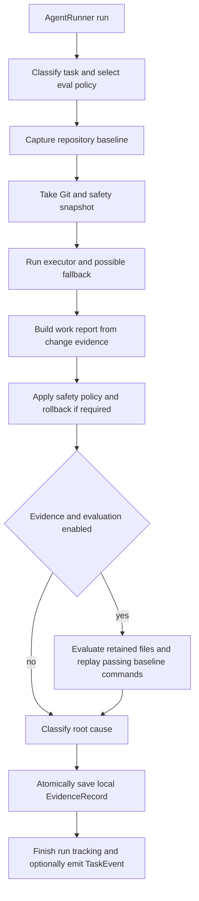
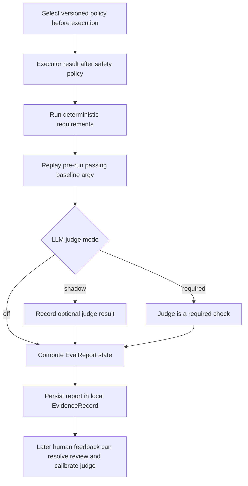
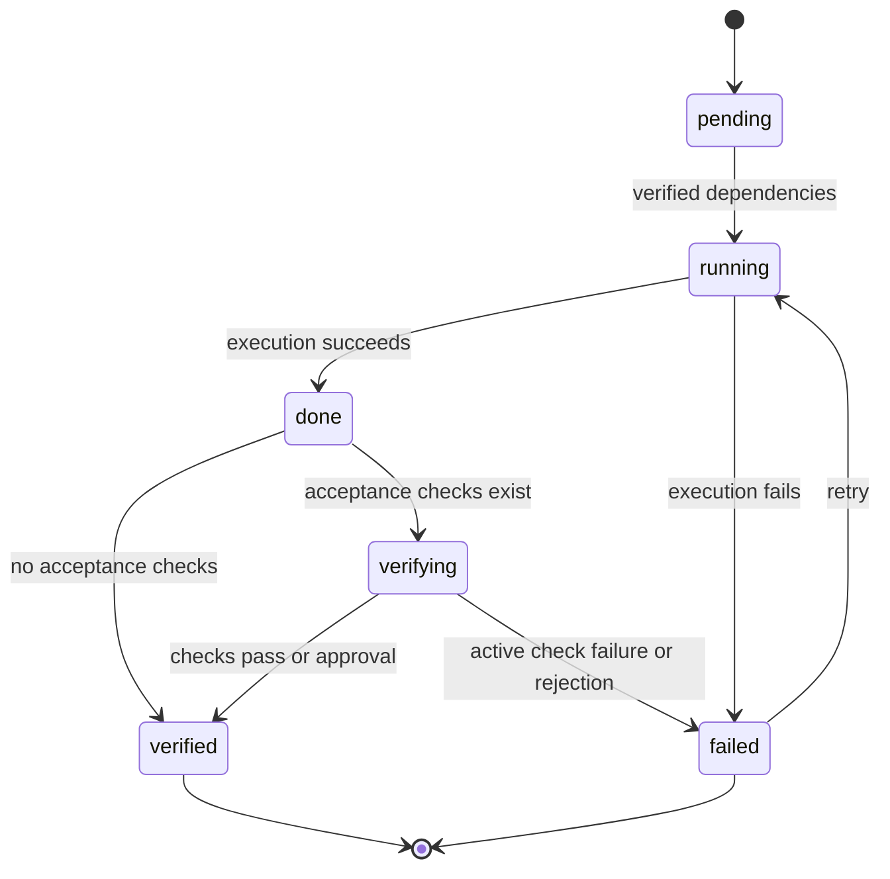

# Verified execution, plans, evidence, and evaluation

VOLY has several related but distinct control planes:

- **Agent execution** is an `AgentRunner` attempt: it invokes an executor, applies executor safety policy, produces a work report, and can persist an `EvidenceRecord`.
- **Evaluation** assesses the retained result of that attempt against a selected policy. During the current record-only rollout it strengthens evidence, but does not itself block the visible executor result or routing.
- **A Plan** is a durable, dependency-ordered graph of steps. Its state machine gates dependents on *verified* predecessors; it is not an A2A episode or a telemetry timeline.
- **Review until clean** is a concrete, bounded developer/reviewer loop with its own stop reasons and a parent run record. It is not a general workflow engine and does not provide plan-style checkpoint/resume.

See also [architecture overview](../architecture/overview.md), [capabilities](../governance/capabilities.md), [SDK and MCP integrations](../integrations/sdk-and-mcp.md), [entrypoints and safety](../operations/entrypoints-and-safety.md), and [A2A and pipeline orchestration](../orchestration/a2a-and-pipeline.md).

## Executor to evidence lifecycle

`AgentRunner.run()` assigns a task ID, starts best-effort run tracking, and classifies the task before running a file-capable executor. When evidence is enabled, it captures repository baseline health **before** executor edits; it takes the later Git/safety snapshot after that baseline because baseline checks can legitimately create ignored caches. Billing or availability failures can move through the configured fallback chain, with abandoned-attempt cost retained in the total.



*The executor lifecycle separates retained-change evidence from telemetry; evaluation occurs after safety enforcement.*

Safety is applied after the work report is built. A hard violation—such as max-files policy or a rollback leaving no remaining change—makes the executor result fail. A protected-path rollback that leaves other changes can remain a successful executor run, but its safety metadata is still evidence and makes the trajectory evaluator fail. Evaluation therefore observes the files that remain, not an unsafe pre-rollback diff.

### Baseline: useful comparator, not a precondition

The baseline scanner identifies project metadata and may run conservative build, test, or lint commands. Checks use exact argv lists with `shell=False`, target `cwd`, captured bounded output, and timeouts. Health is `healthy`, `metadata_only`, `preexisting_failure`, or `environment_failure`; baseline exceptions are logged rather than preventing the requested executor from running.

A later evaluation replays only commands that passed in that baseline. It reuses the stored `argv`, never reparses display text; legacy records without argv cannot establish replay success and fail closed to partial verification. Thus a baseline is neither a promise that all project checks exist nor proof that pre-existing failures were repaired—it establishes what was known to pass before the attempt.

### Evidence records, outcomes, and privacy

An enabled run writes `.voly/evidence/<task_id>.json` by default. `EvidenceRecord` schema v3 includes a hashed task fingerprint rather than the raw task, repository/baseline observations, executor and runtime identity, work/cost/retry data, root-cause attribution, append-only human feedback, and an optional evaluation report. Writes use a temporary file, flush and fsync, then `os.replace`, so readers do not observe partial JSON.

Root-cause attribution distinguishes agent failure from billing/provider, unavailable tool, timeout, safety policy, unhealthy environment, and already-failing repository conditions. Only an otherwise failed executor is initially penalized as agent failure; this prevents infrastructure or pre-existing repository health from being treated as an agent-quality signal.

Local records can contain command arguments, output excerpts, paths, and comments and must not be uploaded directly. The cloud projection is a newly built allowlist, disabled by default, that substitutes a pseudonymous evidence ID and omits task fingerprints, paths, free text, commands, outputs, comments, and evaluator detail. The local HTTP evidence interface is consequently intended for localhost use.

Human feedback (`accepted`, `edited`, `major_rewrite`, `reverted`, `pr_rejected`, or `manual_fix`) is appended atomically. For policies requiring `human_review`, `accepted` resolves that requirement as passed; the other signals resolve it as failed without deleting earlier feedback or overwriting judge results.

## Deterministic and LLM evaluation

Policies are selected before execution by task type: documentation and testing use version 3 policies, security version 2, and other work `executor-basic@2`. Common required evidence includes executor success, no hard safety violation, a policy-clean trajectory, retained file change, and successful replay of baseline checks that initially passed. Documentation additionally validates local Markdown destinations and waits for human review; testing requires a recognized test artifact; security adds a diff-scoped static scan and human review.



*Evaluation produces versioned evidence about a run; it does not change the Plan FSM or turn telemetry into verification.*

`verified_success` means every required evaluation passed. `partial_success` means execution succeeded but required evidence was unavailable, skipped, or pending; `soft_failure` means it succeeded but a required post-run check failed. Executor failure retains root-cause state such as `hard_failure`, `environment_failure`, or `policy_violation`. During record-only rollout, `EvidenceOutcome.success` still expresses executor success, while `EvidenceOutcome.state` and `evaluation.state` carry the stronger result.

### Optional rubric judge: shadow versus required

The LLM judge is off by default. It receives bounded task text and bounded executor output—not repository source or paths—and its system prompt treats both inputs as untrusted quoted data. It must return strict JSON containing exactly a verdict, each required rubric dimension once with `0..4` scores and bounded reasons, and a bounded summary. VOLY computes the weighted outcome itself; a low critical dimension cannot be offset by other scores. Invalid JSON/schema, uncertainty, or gateway failure becomes `skipped`, rather than a false pass.

- In **`shadow`** mode, a judge call records optional evidence and cannot alter the final evaluation state.
- In **`required`** mode, a valid failing score creates `soft_failure`; unavailable or invalid judge evidence creates `partial_success`.

Judge modes have distinct policy-version suffixes, keeping deterministic, shadow, and required evidence lineages separate. Feedback adds a calibration event that records human/judge agreement but does not rewrite the original score. The judge is a report-level assessment of executor output, not a substitute for deterministic retained-file checks or a sole high-risk security approval.

Useful configuration begins disabled:

```yaml
evidence:
  enabled: false
  store_dir: ".voly/evidence"
  baseline_enabled: true
  baseline_auto_commands: true
  baseline_timeout_seconds: 120

evaluation:
  enabled: false
  policy_id: auto
  command_timeout_seconds: 120
  llm_judge:
    mode: off
    max_input_chars: 6000
    max_tokens: 1200
    threshold: 0.75
```

`VOLY_EVIDENCE_ENABLED` controls evidence and `VOLY_EVALUATION_ENABLED` / `VOLY_LLM_JUDGE_MODE` control evaluation rollout. Review discovered commands before enabling the baseline in a new repository.

## Durable plans and verification gates

A Plan persists under `.voly/plans` by default and is validated for unique IDs, valid step modes/statuses, existing dependencies, and an acyclic topological order. Its engine has no agent I/O or verifier behavior: it owns structural validity, legal transitions, and the central invariant that a step can enter `running` only from `pending` or `failed` after **all** declared dependencies are `verified`.



*Plan-step progression: `verified`, not merely executor success or telemetry completion, opens a dependent step.*

At plan level, terminal steps are `verified` and `skipped`; a plan completes only when all steps are terminal and at least one is verified. An explicit abort is preserved by status recomputation. A durable Plan may be represented in telemetry, and A2A can attach roles as plan steps, but the persisted Plan state remains the authority for dependency gates; it must not be conflated with TaskEvents, run heartbeats, or an A2A episode.

### Acceptance evidence and cwd confinement

Checks verify command exits, file existence/absence, Git delta, line counts, or output—not an agent's free-form claim. Unknown check types fail closed. File checks route relative paths through `safe_join`; command checks run tokenized argv with `shell=False`, a timeout, and the plan `cwd`. This confines check paths to the project root rather than allowing declared acceptance paths to escape it. Command text is parsed only for plan-authored command checks; evidence baseline replay uses previously stored argv directly.

`file_line_limit` evaluates changed text files, ignores binaries and built-in generated/lock paths, and can accept project exclusions. An architect in a transitive dependency may raise a limit only by supplying both strict `FILE_LINE_LIMIT` and sufficiently explained `FILE_LINE_LIMIT_REASON` markers; the effective value remains capped by the check's approved maximum.

### Active and shadow verification

Plan `mode: active` makes an ordinary failed acceptance check transition the step to `failed`, blocking dependents. In `shadow`, VOLY retains failed check results in `verify_log` but force-verifies the ordinary quality gate so the chain can continue. Use shadow mode to find flaky or incomplete checks before enforcing them.

This soft-open has a deliberate exception: `human_review` and `action_succeeded` are **externally resolved gates**, not quality signals. The runner leaves such a step in `verifying` and never opens it in shadow mode. A general `human_review` is resolved through `voly.plan.approval.decide()`; approve moves it to `verified`, reject moves it to `failed`. Identical repeated decisions are idempotent, while a contradictory decision or a decision before `verifying` raises a conflict. Business action gates are instead owned by `DecisionService`; generic `PlanRunner` refuses `mode: business` execution to avoid bypassing that boundary.

### Scheduling, retries, cancellation, and resume

Independent chat steps may run in bounded parallel waves when Workflow SDK support is enabled. Worker threads only produce their own output/cost/duration; plan transitions and verification run in declared wave order on the caller thread. Executor steps are serialized because they share one plan `cwd` and can write files.

The runner can retry failed steps according to `max_step_retries` and `default_on_verify_fail`; a `continue` policy can force a failed step to verified so dependencies proceed. This policy is separate from verification mode: active/shadow governs ordinary acceptance failure at verification time, while retry/continue handles a failed attempt.

`resume(plan_id)` reloads the persisted Plan and recomputes runnable steps—there is no separate paused state. It first marks a `running` step older than `workflow_sdk.stale_running_seconds` as failed, letting normal retry policy decide the next attempt. A workflow-level timeout leaves the plan resumable rather than forcing failed/aborted state; completed steps remain verified and an in-flight step is recovered as stale on a later run.

`cancel(plan_id)` persists `aborted`. Cancellation is cooperative: the runner reloads persisted status between steps/waves and after retry attempts so it does not overwrite an external abort, but cannot interrupt an executor or network call already in progress.

## Review until clean

`ReviewUntilClean` is opt-in through `voly workflow review-until-clean` or an API request with `workflow: "review-until-clean"`. Each lap runs a file-capable developer through `AgentRunner`, then asks an independent reviewer through `AIGateway.chat()` to inspect a bounded diff evidence package. On a `blocking` verdict, the next developer prompt includes the original task and findings; on `clean`, the workflow succeeds.

The loop requires `1..20` rounds (default 3), enforces a deadline before each transition, passes only remaining time—capped by executor timeout—to the developer, and inherits runner safety/billing/cost controls plus gateway DLP/cache/rate/spend/provider controls. Reviewer output must be strict JSON: `clean` cannot include findings, and `blocking` requires actionable findings. Invalid/contradictory output fails closed as `review_failed`.

Its explicit outcomes are `clean`, `max_rounds`, `deadline`, `executor_failed`, `review_failed`, `spend_limit`, and `cancelled`. Cancellation is also cooperative and is observed between developer/reviewer turns, not by terminating a currently running subprocess.

The parent RunRecord owns the workflow timeline, stable developer/reviewer graph nodes, lap data, stop reason, and aggregate metrics. Developer sub-runs receive `parent_task_id` and use `emit_event=False`, so diagnostic child records do not become misleading duplicate root events. This telemetry is observability for the workflow; it does not constitute a Plan graph or grant plan resumability.

## Operational entrypoints and focused tests

Common plan commands are:

```bash
voly plan validate plan.yaml
voly plan run plan.yaml --mode active --cwd /path/to/project
voly plan status <plan_id>
voly plan show <plan_id>
```

Start plans in `shadow`, review `verify_log` and cwd-scoped command behavior, then promote stable checks to `active`. Use explicit review decisions for human gates rather than treating a successful executor response as approval.

The focused regression surfaces are `tests/test_evidence_foundation.py` and `tests/test_evidence_interfaces.py` for baseline, persistence, privacy, and feedback; `tests/test_evaluation.py` for policies, replay, safety/trajectory, scanner, and judge semantics; `tests/test_plan_engine.py`, `tests/test_plan_verify.py`, `tests/test_plan_runner.py`, `tests/test_plan_approval.py`, and `tests/test_plan_concurrency.py` for graph invariants, gates, approval, recovery, cancellation, and parallel scheduling; and `tests/test_review_until_clean.py` for lap transitions, strict verdicts, stop reasons, and parent-run telemetry.
